# 高性能计算｜硬件架构与基准测试

> Yurk（realyurk@gmail.com）整理
>
> 参考内容：《高性能计算》（张广勇）
>
> ​					《超算竞赛导引》（科学出版社）
>
> ​					《Introduction to High Performance Scientific Computing》(Victor Eijkhout)
>
> 部分资料来源网络，仅供个人学习使用

「**高性能计算**」（High performance computing，HPC）指通常使用很多处理器（作为单个机器的一部分）或者某一集群中组织的几台计算机（作为单个计算资源操作）的计算系统和环境。有许多类型的 HPC 系统，其范围从标准计算机的大型集群，到高度专用的硬件。 大多数基于集群的 HPC 系统使用高性能网络互连，比如一些来自 InfiniBand 或 Myrinet 的网络互连。基本的网络拓扑和组织可以使用一个简单的总线拓扑，在性能很高的环境中，网状网络系统在主机之间提供较短的潜伏期，所以可改善总体网络性能和传输速率。

## 高性能计算架构史

当代计算机的原型最早可追溯到1943年的 Colossus，第二次世界大战期间，英国曾用该机器来破解截获纳粹德国的无线电报信息。两年后，美国研制了人类历史上第一台计算机 ENIAC ，用来快速计算炮兵射击表。

回顾计算机的历史，人们最早设计了「**固定程序计算机**」（Fixed Program Computer），如：算盘、计算器等，这种计算机的特点是无法编程，只能解决固定的问题，通用性较差。这显然不符合我们设计计算机的初衷，如何设计出可编程的计算机？

我们常说的「程序」，无非就是指一系列指令的集合。如果能将这些指令存储在计算机中，人们可以随意编程，计算机就会更加通用。可是程序应该怎么存储？历史上出现了两种不同的声音：

- **Harvard 架构**：将程序和数据存储在不同的内存中。
- **Princeton 架构**：将程序与数据共同存储在内存。

如果生活在当时，我一定会选择第一种，但天才的冯·诺依曼却并不认同。

我们先不急着介绍冯·诺依曼架构，而是看一下现代计算机体系架构。学过《深入理解计算机系统》的同学可能对现代计算机体系架构并不陌生，下图的PC指的是「**程序计数器**」（Program Counter），控制着整个 CPU 内部指令执行；「**ALU**」为算数/逻辑运行单元，负责高速计算。

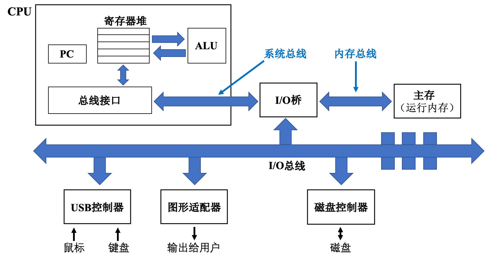

在计算机中，将数据从处理器移动到  CPU 、磁盘控制器或屏幕的线路被称为「**总线」**（busses）。对我们来说最重要的是连接 CPU 和内存的「**前端总线」**（Front-Side Bus，FSB）。在当前较为流行的架构中，这被称为“「**北桥」**（north bridge）”，与连接外部设备（除了图形控制器）的“「**南桥」**（south bridge）”相对。总线通常比处理器的速度慢，这也是造成冯·诺依曼架构瓶颈的原因之一。

在本图中，连接主存和 CPU 的线路在整幅图的上方，而连接外部设备的总线位于整幅图的下方。我们可以诙谐地通过：“上北下南”的方式来记忆北桥和南桥。

若将相应位置的元件用其负责的功能表示。暂时去掉**寄存器堆**、**总线接口**与其他不必要的部分，上图就可以简化为：

这正是冯·诺依曼架构的原型。唯一不同的是，传统的冯·诺依曼计算机是以运算器为中心，而当代计算机则是以存储器（内存和寄存器堆组成的存储器结构）为中心。**冯·诺依曼架构**（即 Princeton 架构）指出：程序和数据应当共同存储在内存中；而 **Harvard 架构** 指出：程序和数据应当分开存储。

冯·诺依曼架构（即 Princeton 架构）图：

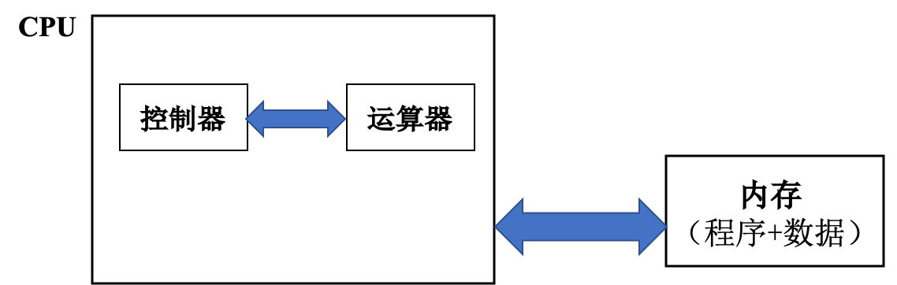

Harvard 架构图：

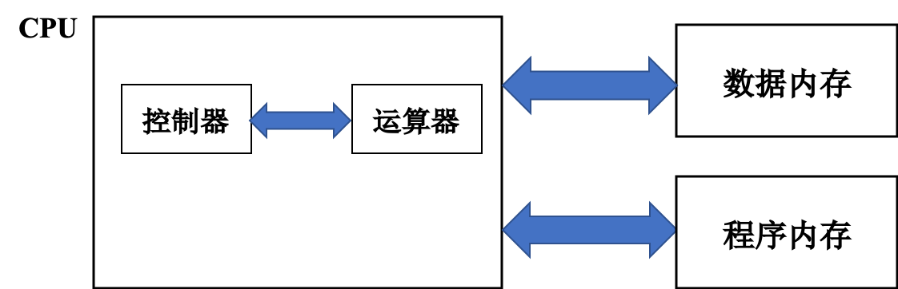

尽管当代计算机是以冯·诺依曼架构为主，但这并不意味着 Harvard 架构是错的，事实上两者各有利弊。冯诺依曼架构的瓶颈为：运算器的速度太快， CPU 与内存之间的路径太窄，以至于内存无法及时给运算器提供“材料”，这正是影响性能的致命因素。

通常情况下，我们将冯·诺依曼架构的缺陷归结为「**访存墙**」（Memory Wall），即：

- 计算机具有单一的线性内存，指令和数据只有在使用时才进行隐式区分；
- 总性能受到内存的读写总线所能提供的延迟和带宽限制。

Harvard 架构设计的初衷正是为了减轻程序运行时  CPU  和存储器信息交换的瓶颈，其 CPU 通常具有较高的执行效率。目前，使用Harvard 架构的 CPU 和处理器有很多，除了所有的DSP处理器，还有摩托罗拉公司的MC68系列、Zilog公司的Z8系列、ATMEL公司的AVR系列和ARM公司的ARM9、ARM10和ARM11等。目前使用冯·诺依曼架构的 CPU 和微控制器也有很多，其中包括英特尔公司的8086及其他 CPU ，ARM公司的ARM7、MIPS公司的MIPS处理器也采用了冯·诺依曼架构。

让我们把目光拉回到现代计算机上。在 ENIAC 之后，大部分处理器都是将数据一个一个传入运算器中，这在某种程度上限制了运算器的发挥。为了追求更高性能，人们希望设计出一款运算器用一条指令就能运算多条数据的机器，即数据以向量的形式被处理。于是「**向量机**」（Vector Machine）应运而生。

与一次只能处理一个数据的**标量处理器**正相反，**向量处理器**可以在特定工作环境中极大地提升性能，尤其是在数值模拟或者相似领域。向量处理器最早出现于20世纪70年代早期，并在70年代到90年代期间成为超级计算机设计的主导方向。以Cray-1为例，基本信息如下：

| 处理器个数 | 处理器频率 | 内存大小 | 存储大小 | 性能       |
| ---------- | ---------- | -------- | -------- | ---------- |
| 1          | 80MHz      | 8.39MB   | 303MB    | 160 MFLOPS |

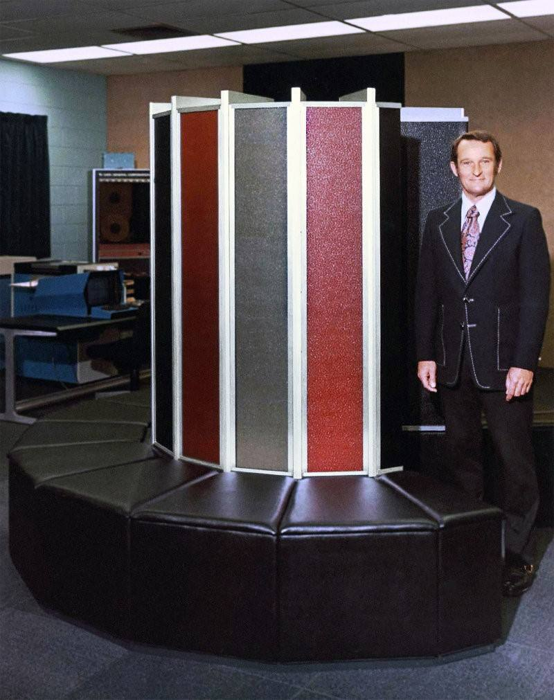

这使得它远远超过同时代的其他机器。

随后的70年代到90年代之间，人们又基于向量机设计出了「**并行向量处理器**」（Parallel Vector Processors，PVP），即同时布置多个向量机并通过共享内存实现交互。并行向量处理器最大的特点是系统中拥有多个 CPU （即处理器），同时每个处理器都是由专门定制的「**向量处理器**」（VP）组成。

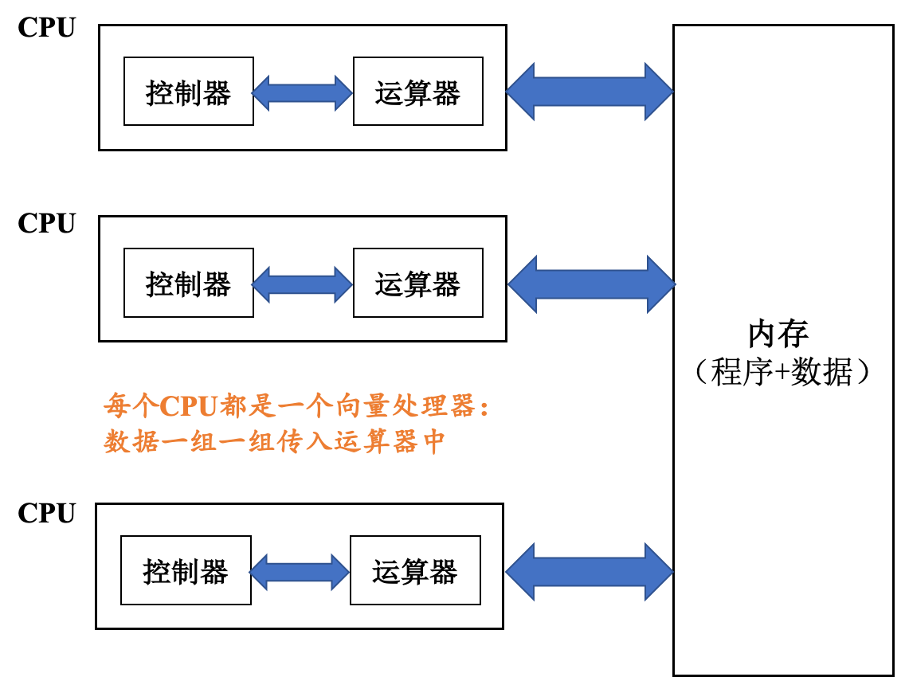

具有代表性的例子就是Cray-2代多处理器计算机：

然而，由于90年代末常规处理器设计性能提升，而价格快速下降，基于向量处理器的超级计算机逐渐让出了主导地位，但这并不意味着向量处理器已经过时。

现在，绝大多数商业化的 CPU 实现都能够提供某种形式的向量处理的指令，用来处理多个（向量化的）数据集，也就是所谓的 `SIMD`（单一指令、多重数据）。常见的例子有VIS、MMX、SSE、AltiVec和AVX。向量处理技术也能在游戏主机硬件和图形加速硬件上看到。在2000年，IBM，东芝和索尼合作开发了Cell处理器，集成了一个标量处理器和八个向量处理器，应用在索尼的PlayStation 3游戏机和其他一些产品中。

随后，一些厂商又提出了「**分布式并行机**」（Parallel Processors，PP）：通过高性能网络连接多个分布式存储节点，每个节点由商用微处理芯片组成。

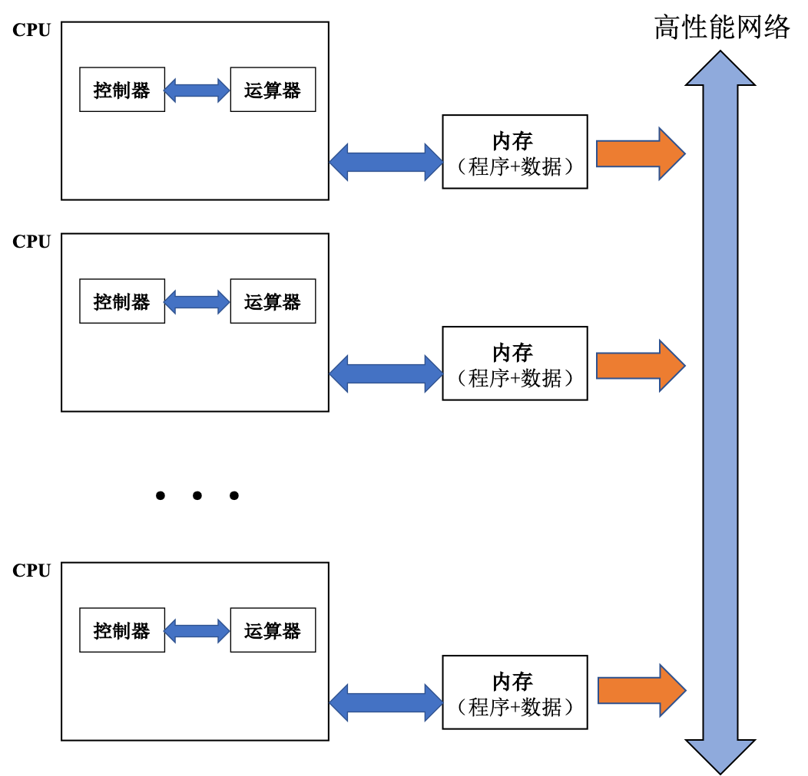

以Intel Paragon XP/S 140 并行机为例：

| 处理器个数 | 处理器频率 | 内存大小 | 访存带宽 | 网络带宽 | 总性能     |
| ---------- | ---------- | -------- | -------- | -------- | ---------- |
| 3680       | 50 MHz     | 128 MB   | 400 MB/s | 175 MB/s | 143 GFLOPS |

与分布式并行机几乎同时代又出现了另一种并行计算机架构：「**对称多处理机**」（Symmetric Multiprocessors，SMP），它通过高性能网络连接 多个高性能微处理芯片，芯片之间通过共享内存交互。

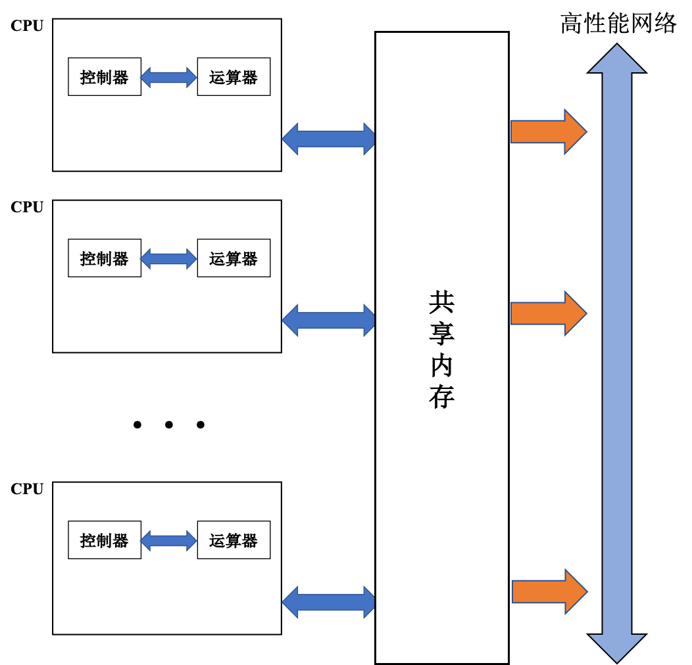

以SUN Ultra E10000 多处理机为例：

| 处理器个数 | 处理器性能 | 处理器频率 | 内存大小 | 网络带宽  | 总性能    |
| ---------- | ---------- | ---------- | -------- | --------- | --------- |
| 64         | 1 GFLOPS   | 250 MHz    | 64GB     | 12.8 GB/s | 25 GFLOPS |

所谓对称多处理器结构，是指服务器中多个  CPU  对称工作，无主次或从属关系。各  CPU  共享相同的物理内存，每个  CPU  访问内存中的任何地址所需时间是相同的，因此 SMP 也被称为「**一致存储器访问结构**」 （UMA ： Uniform Memory Access）。对 SMP 服务器进行扩展的方式包括`增加内存`、`使用更快的  CPU`  、`增加CPU`  、`扩充 I/O`（槽口数与总线数）以及`添加更多的外部设备`（通常是磁盘存储）。

上图中仅罗列出了一个节点包含一个 CPU 的情况，事实上，UMA架构中的节点通常为一个「**插槽**」（socket），一个插槽上可能有一个 CPU ，也可能有多个 CPU 。“**几路几核**”通常表示：表示有多少个插槽，每个插槽有多少核。

双路单核的UMA架构：

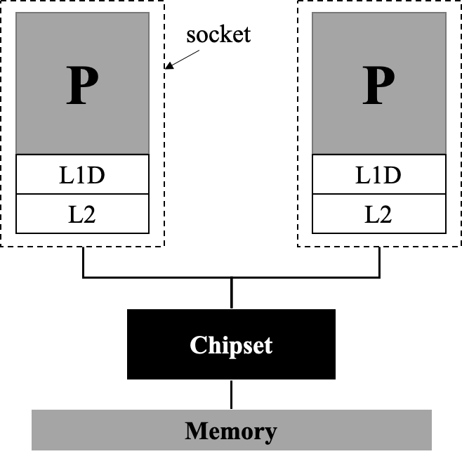

双路双核的UMA架构：

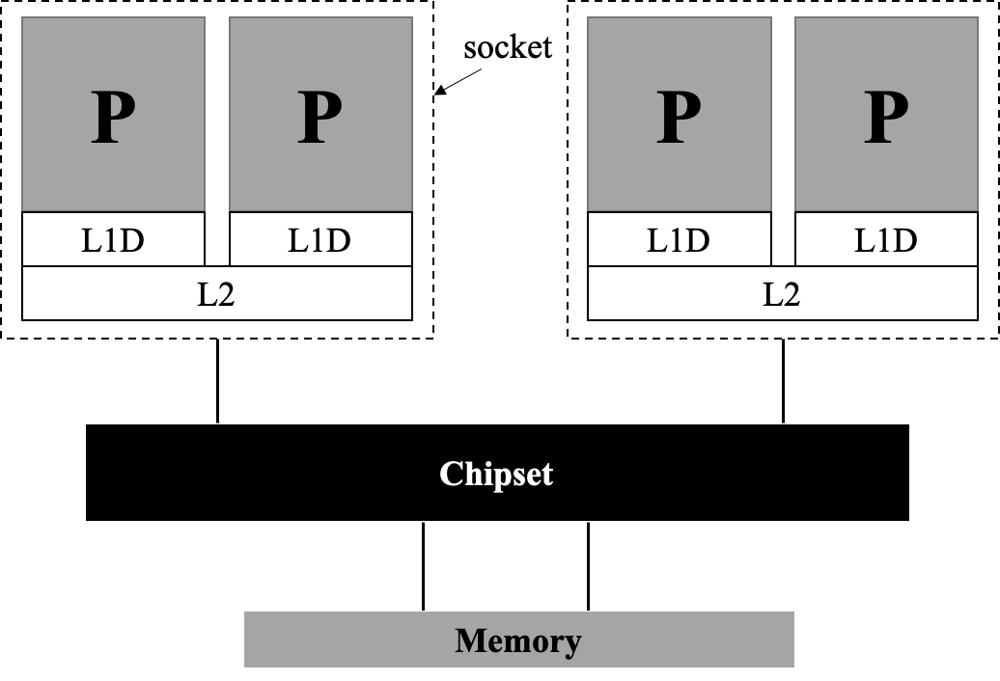

上述UMA架构的问题在于：每个插槽内各处理器只共享 L2 级缓存，但并不共享内存，这会导致处理器和内存之间速度不匹配等问题。如何改进这种弊端？我们在每个插槽内部共享一个内存，并令各个插槽内共享的缓存数据同步，即著名的「**缓存一致性的非一致内存访问架构**」（cache-coherent Nonuniform Memory Access，ccNUMA）架构。

双路四核的ccNUMA架构：

另有「**分布式共享并行机**」（Distributed Share Memory，DSM）通过高性能网络连接多个高性能微处理芯片，每个芯片拥有局部内存，但所有局部内存都能实现全局共享。

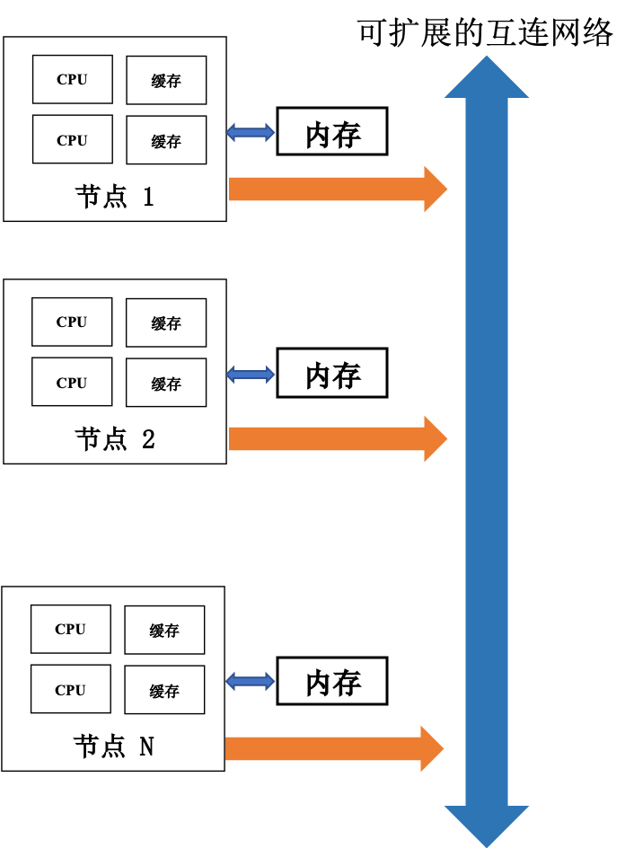

上图中仅指出了一个节点包含两个处理器的情况，然而在真实计算机架构中这要复杂得多。

## 高性能节点架构

高性能计算拓扑结构如图所示，从硬件结构上，高性能计算系统包含「**计算节点**」、「**IO节点**」、「**登录节点**」、「**管理节点**」、「**高速网络**」、「**存储系统**」等组成。

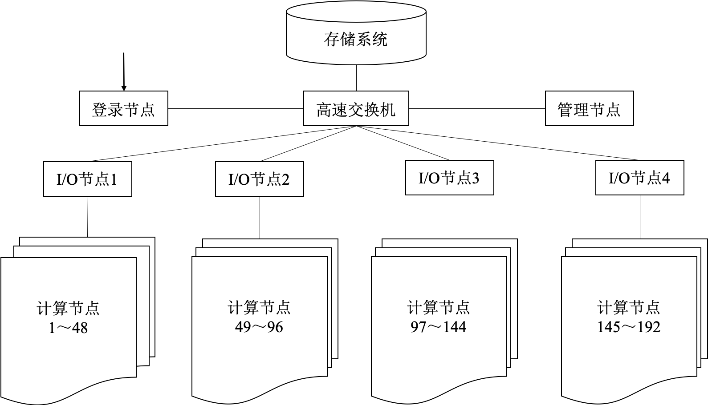

从体系结构看，除了以出色的性价比占据主流的集群系统外，传统的MPP系统仍然以其不可替代的架构和性能优势占据一席之地，且Cray、IBM、Fujitsu等主流MPP厂商的不同产品又可以细分为SMP、CC-NUMA、向量机等不同种类。不同体系结构的计算机在性能表现方面有着先天的区别。

计算节点是高性能集群中的最主要的计算能力的体现，目前，主流的计算节点有「**同构节点」**和「**异构节点」**两种类型。

1. 同构计算节点是指集群中每个计算节点完全由  CPU  计算资源组成，目前，在一个计算节点上可以支持单路、双路、四路、八路等  CPU  计算节点。

Intel 和 AMD  CPU  型号、参数详见：http://www.techpowerup.com/CPUdb

2. 异构计算技术从 80 年代中期产生，由于它能经济有效地获取高性能计算能力、可扩展性好、计算资源利用率高、发展潜力巨大，目前已成为并行/分布计算领域中的研究热点之一。异构计算的目的一般是加速和节能。

目前，主流的异构计算有： CPU +GPU， CPU +MIC， CPU +FPGA

-  **CPU +GPU 异构计算**：

在  CPU +GPU 异构计算中，用  CPU  进行复杂逻辑和事务处理等串行计算，用 GPU 完成大规模并行计算，即可以各尽其能，充分发挥计算系统的处理能力。由于  CPU +GPU 异构系统上，每个节点  CPU  的核数也比较多，也具有一定的计算能力，因此， CPU  除了做一些复杂逻辑和事务处理等串行计算，也可以与 GPU 一起做一部分并行计算，做到真正的  CPU +GPU 异构协同计算。 目前，主流的 GPU 厂商有 NVIDIA 和 AMD。

各 GPU 详细参数请查阅：http://www.techpowerup.com/gpudb/

-  **CPU +MIC 异构计算**：

2012 年底，Intel 公司正式推出了基于集成众核（Many Integrated Core, MIC）架构的至强融核（Intel Xeon Phi）系列产品，用于解决高度并行计算问题。第一代 MIC 正式产品为 KNC（Knights Corner），该产品双精度性能达到每秒一万亿次以上。

各型号 MIC 卡详细参数请查阅：http://www.techpowerup.com/gpudb

### 不同架构模式的应用环境

随着超算应用的增多和对计算量需求的增大，CPU逐渐在某些领域中显露疲态。为解决这个问题，「**异构运算**」应运而生。异构是指与传统 CPU 不同架构的计算设备，如 GPU、MIC 等新型计算设备。这些新的计算设备通常拥有远高于 CPU 的并行计算能力。GPU 原本并非用于高性能计算，而是用于图形显示。但 GPU所特有的硬件架构，天然适合高并发度的计算。但利用 GPU 编程，需要将通用问题转化为图形显示问题，因此编程门槛较高，很少有人利用 GPU 进行高性能计算并行应用开发。

异构开发环境有「**先进精简指令机**」（advanced RISC machine，ARM）、「**现场可编程门阵列**」（field programmable gate array， FPGA）等非 x86 架构环境。

异构环境并非抛弃 CPU，而是 CPU 与心的计算原件相结合，并行进行计算。无论是 GPU 还是 MIC，都是以 PCI-E 接口与现有 x86 节点进行连接，以协处理器的方式与现有节点进行集成。因此在不破坏原有集群的情况下，增加一部分算力。当前，采用异构集群的高性能计算集群在 Top500 中越来越多，表明异构集群方案越来越多地被业界采用。

虽然在硬件方面，异构集群与传统集群相比并没有革命性的变化，通常可以在现有集群的基础上在节点内增加异构计算卡的方式，将传统同构集群转换为异构集群。但在软件方面，可能会有较大的改变。由于使用异构硬件的方法并不相同，因此需要针对 CPU 和 GPU/MIC 使用不同的软件环境和编写相应的代码。更重要的是，因为异构集群中计算设备的结构不同，所以需要针对新的情况，使用新的方法。针对新的 GPU/MIC 设备，将不能使用传统的 CPU 编程思想，而是转而使用高并行的 GPU/MIC 编程思想。这一思想的转变，有时比方式的转变更难以接受。

#### CPU 并行架构

一般来说，集群中每个节点都使用相同的配置，以方便管理和性能优化。节点一般为标准机架式服务器，配有双路或四路的多核服务器版 CPU（如Intel Xeon系列），每个核心搭配 4GB 内存或更多。节点之间采用**以太网线**（千兆网线或万兆网线）或**InfiniBand网线**，通过相应的**交换机**互相连接。节点与节点属于同一个内网，并各自拥有不重复的内网 IP 地址，通常集群与外网物理隔离，以保证集群的安全性。

由于上述高性能并行架构采用的是分布式内存结构，因此并行软件环境需要采用消息传递的网络通信方式，如：MPI。

MPI 环境配置步骤主要如下：

1. **解压、安装**：解压安装包后使用`./configure`；`make` 命令安装。
2. **放权**：为了能使多个机器上同时运行 MPI 程序，首先要允许启动 MPI 程序的机器能够顺利访问到其他机器。简单起见，最好在整个集群的每一个节点机傻姑娘都建立相同的账户名，使得 MPI 程序在相同的账户下运行。放权设置完成后，可以在任何一个节点，使用相同的账户名，不需要输入密码。
3. **运行**：程序在不同节点可以放置在不同目录下，但为了方便管理，建议放在同样的目录下，放置在共享存储时最佳。使用哪些节点、每个节点内开启几个 MPI 进程，是由配置文件决定的，每个应用可以采用不同的节点配置文件，以便根据不同饿的应用选择不同的方案，避免闲置计算资源或达不到最好的利用效果。

其他情况见下表：

| 软件部分        | 种类                                                  |
| --------------- | ----------------------------------------------------- |
| 编译器/调试工具 | GNU、GDB                                              |
| 高性能函数库    | Intel MKL（商业软件）                                 |
| 性能调试工具    | gprof（编译时添加`-pg`） Intel VTune（商业软件） |

#### CPU+MIC 异构

异构环境中 GPU 和MIC 是以附加板卡的形式附着于现有系统的，因此在硬件环境上，不需要对集群的整体结构进行任何改变，只需要在节点内部增加协处理器或将节点内部增加协处理器或将节点更换为可以使用协处理器的节点。

由于 GPU 和 MIC 在硬件环境构建中，对集群结构没有区别，因此以 MIC 为例说明异构系统的硬件环境，异构并行环境架构如图：

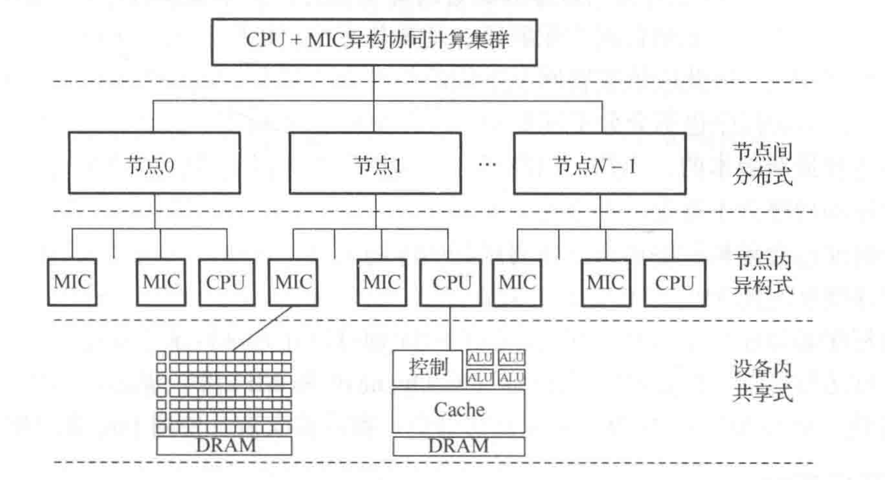

使用异构协处理器除了搭建传统高效能并行应用环境需要注意的几个问题以外，还有三点特别之处需要注意：

1. 传统并行应用环境中节点，不一定有多余或合适的 PCI-E 插槽，也就不一定能够附加 GPU 或 MIC 卡。但是异构并行开发环境中，其中的节点必须是传统并行环境节点中拥有 PCI-E 接口，可以增加 GPU 或 MIC 卡的类型。
2. 由于增加了协处理器，所以节点的功耗需求大大增加，通常每增加一块协处理器，需要增加300W左右的电源供应。
3. 由于增加了协处理器，所以对节点的散热提出了更高的要求。在搭建异构集群时，不仅需要看节点是否能够支持协处理器，还要注意节点的散热能力。

通用软件环境与传统并行应用软件环境极为类似，不仅同样可以分为操作系统、并行环境等方面，而且异构模式下的通用软件环境，也基本与传统软件环境相同。

在并行环境方面，一般需要选择 OpenMP、MPI 等通用并行库，如果支持 InfiniBand硬件，则尽量使用InfiniBand驱动。

在并行运行环境方面，MIC 支持标准的 OpenMP 和 MPI 库，但是如果想充分利用 MIC 的特性，则需要安装使用 Intel 的MPI 库。

| 软件部分           | 种类                                           |
| ------------------ | ---------------------------------------------- |
| 编程语言           | C、C++、Fortran、OpenCL（最广泛）              |
| 编译器/调试工具    | Intel 的 MIC 编译器/IDB                        |
| 性数学库能调试工具 | MIC 高性能数学库、Intel MKL                    |
| 性能调优工具       | Intel VTune（其他大部分Intel工具也都可以应用） |

相关资源：

1. IDF：英特尔信息技术峰会是由 Intel 公司主办的技术讲座，在美国、中国等7个地区举办，每年分春秋两次。 IDF 主要是由主题演讲、技术专题讲座和技术展示组成，主题演讲的演讲者军事 Intel 的高层人士，演讲的题目都是具有相当前瞻性。可以浏览相关网址搜索相关信息：[IDF官网](http:www.intel.com/content/www/us/en/library/viewmore.results.html?prTag=raughorship:inteldeveloperforum)。

2. MIC 计算论坛：[论坛官网](https://software.intel.com/en-us/forums/intel-many-inte-grated-core)。

更多资源可以访问：[英特尔开发者](https://software.intel.com/en-us/mic-developer)。

#### CPU + GPU 异构

GPU 专用软件环境根据生产厂商不同，其环境也有所不同。但一般都需要硬件驱动、运行时库等几个基本部分。本部分以 CUDA 为例，讨论相关问题。

运行时库包含异构程序运行时需要用到的库的集合，这些库调用了驱动程序的一些接口，使程序能够运用 GPU 硬件进行计算。

需要特别注意的是，驱动程序必须在每个节点上安装，因为每个节点都有 GPU 卡，所以需要在每个节点的操作系统上配置驱动程序。而对于运行时库来说，仅在应用程序需要时才会用到，因此可以在共享目录中安装一份，以供全部节点使用。这种方式的好处是：减少安装和维护的工作量，可以统一管理，一次配置多次使用。但要注意的是对该目录下文件写权限的控制，以避免用户无意识地破坏文件，造成全局软件故障。

为适应广泛的市场需要，针对不同的市场进行划分，NVIDIA 及其合作伙伴共同开发了多种多样的编程方式，有 CUDA C/C++、CUDA Fortran、OpenACC、HMPP、CUDA-x86、OpenCL、JCuda、PyCUDA、Direct Compute、MATLAB、Microsoft C++ AMP等。

多线程编程语言可以分为两类，一种为**编译指导**，即在串行程序之前添加编译指令，指导编译器将串行指令自动编译为并行程序；另一种为**显式线程模型**，用户可以直接编写并行程序，显式地调用 GPU 线程。相对地，编译指导比较简单，有易于初学者的学习、方便串行程序并行化、开发周期短等优点。但是，因为编译器自动完成串行程序的并行化，所以对 GPU 的操作相对不够灵活。

Nsight 是 NVIDIA 开发的一套集成了编译、调试与性能分析功能的开发环境。可以从官网下载：[Nsight官网](http://www.nvidia.com/object/nsight.html)。

相关资源：

1. CUDA Zone：适合所有开发者使用：[CUDA Zone](https://developer.nvidia.com/cuda-zone) 。
2. GTC：GPU全球会议，[GTC 官网](http://on-demand-gtc.gputechconf.com/gtcnew/on-demand-gtc.php) 。
3. GPU 计算论坛：求助专家平台，[GPU 计算论坛](https://devtalk.nvidia.com/default/board/53/gpu-computing) 。

## 主要测试

### 理论峰值性能

FLOPS 是指每秒浮点运算次数，Flops 用作计算机计算能力的评价系数。根据硬件配置和参数可以计算出高性能计算集群的理论性能。
$$
\text { FLOPS }=\text { sockets } \times \frac{\text { cores }}{\text { socket }} \times \text { clock } \times \frac{\text { Flops }}{\text { cycle }}
$$

-   CPU  理论性能计算方法（以 Intel  CPU  为例）：
  $$
  单精度:主频*(向量位宽/32)*2
  $$

  $$
  双精度:主频*(向量位宽/64)*2
  $$

- GPU 理论性能计算方法（以 NVIDIA GPU 为例）： 
  $$
  单精度:指令吞吐率*运算单元数量*频率
  $$

- MIC 理论性能计算方法（以 Intel MIC 为例）：
  $$
  单精度:主频*(向量位宽/32)*2
  $$

  $$
  双精度:主频*(向量位宽/64)*2
  $$

### 实测峰值性能

利用测试程序对系统进行整体计算能力进行评价。 

- **Linapck 测试**：采用主元高斯消去法求解双精度稠密线性代数方程组，结果按每秒浮点运算次数 (flops) 表示。
- **HPL**：针对大规模并行计算系统的测试，其名称为 High Performance Linpack（HPL），是第一 个标准的公开版本并行 Linpack 测试软件包。用于 TOP500 与国内 TOP100 排名依据。

### 评价参数

1. 系统效率 = 实测峰值/理论峰值

2. 加速比：
   $$
   S(n)=\frac{T(1)}{T(n)}=\frac{1}{\alpha +\frac{1-\alpha}{n}}
   $$

Amdahl 定律指出：
$$
T(1)=\frac{W}{R},\quad T(n)=\frac{\alpha W}{R}+\frac{(1-\alpha)W}{nR}
$$
Gustafson 定律指出：
$$
W'=\alpha W+(1-\alpha)nW
$$

在测试集群性能时，最重要的是保证测试过程中的稳定和可靠。通常需要关闭不必要的程序，且保证整个系统只进行基准测试，并对最终结果进行多次试验。如果修改程序运行参数，每次只修改一处。测评结果结束后，首先需要确认结果可信度，即同一测试每次运行结果差别是否在容许误差范围之内（一般< 5%）。确认结果可信后，需要对数据的结果进行处理，通常以图表方式进行可视化呈现。

高性能计算测评主要分为：**单项测评**、**整体计算性能测评**、**领域应用性能测评**和**典型应用性能测评**四大类，这四大类均是当前常用的测评方法，并且因测试目的的不同在实际应用中各有侧重。

下面我们将介绍主要的测评方法和相应的基准程序，其中单项测评部分介绍内存性能测试程序**Stream**和网络通信测试程序**OMB**（OSU micro-benchmarks）；整体计算性能测评部分介绍**HPL**和**HPCC**；领域应用测评**NPB**、**IAPCM Benchmarks**和**Graph 500 Benchmarks**。典型应用测试因用户不同而千差万别，在此不做阐述。

### 内存性能测试程序Stream

Stream有C、Fortran语言两个版本，同时还提供MPI版本，其测试结果统一以MB/s来衡量，反应系统持续内存带宽大小。其运行十分简单，单线程串行版本在目标系统上正确编译后直接运行即可。若是运行并行版本（多线程、OpenMP或MPI），只需要参照同类并行程序进行编译和运行（例如MPI版本需要预先在系统上配好MPI库，使用`mpif77`编译`stream_mpi.f`文件，使用`mpirun`运行程序）。

尽管HPCC采用了MPI版的Stream测试，但多节点系统的访存性通常取决于网络，因此内存带宽测试对单机更为重要，我们常用的是：**单机版Stream**和**多线程版**（包括Pthreads和OpenMP）

最新版的 Stream 可以从 [Stream官网](http://www.cs.virginia.edu/stream) 下载获得，当前排名第一的是SGI公司的大型共享内存计算机Altix UV2000。

### 通信性能测试程序 OMB

测试节点之内通信的OMB支持 MPI、UPC 和 OpenSHMEM 三种通信模型，同时最新版本还提供了对 CUDA 和 OpenACC 的支持。其中最典型的和最常用的就是 MPI 通信性能测试。

OMB提供包括**点对点通信**、**集合通信**和**单边通信**在内的丰富测试，并且每个通信类型又提供延迟、带宽、多线程延迟、多线程带宽等多个输出。测试这可以对通信数据大小进行设置（如测试延迟使用 1B、4B、16B、256B 等不同消息大小，测试带宽时使用 4KB、64KB、256KB、1MB、4MB等不同消息的大小）。

OMB 采用常见的 GNU（configure & make）编译，运行时通常形如 `osu_latency`、`osu_bw`的运行参数来执行相应测试。

OMB可以通过其 [OMB官网](http://mvapich.cse.ohio-state.edu/benchmarks) 进行下载。

### 浮点计算性能测试程序 HPL

HPL 测试通常求解一个稠密线性方程组 $Ax=b$ 所花费的时间来评价计算机的浮点计算性能。为了保证测评结果的公平性，HPL 不允许修改基本算法（采用 LU 分解的高斯消元法），即必须保证总浮点计算次数不变。对 $N\times N$ 的矩阵 $A$，求解 $Ax=b$ 的总浮点计算次数为 $(2/3 \times N^3 - 2\times N^2)$。因此，只要给出问题规模 $N$，测的系统计算时间 $T$，则 HPL 将测试该系统的浮点性能值为： 
$$
\frac{计算量：(2/3 \times N^3 - 2\times N^2)}{计算时间：T}
$$
单位是 flops。

目前，**HPL**（Linpack）有  CPU  版、GPU 版和 MIC 版本，对应的测试  CPU  集群、GPU 集群和 MIC 集群的实际运行性能。Linpack 简单、直观、能反应系统的整个计算能力，能够较为简单的、有效的评价一个高性能计算机系统的整体计算能力。所以 Linpack 仍然是高性能计算系统评价的最为广泛的使用指标。但是高性能计算系统的计算类型丰富多样，仅仅通过衡量一个系统的求解稠密线性方程组的能力来衡量一个高性能系统的能力，显然是不客观的。

HPL 允许用户选择任意 $N$ 规模，并且在不改变总浮点计算次数和计算精度的前提下对算法或程序进行修改。这在一定程度上促使用户为了取得更优的 HPL 值而八仙过海。

常用的 **HPL 优化策略**如下：

1. 选择尽可能大的 $N$，在系统内存耗尽之前， $N$ 越大，HPL 性能越高。
2. HPL 的核心计算是矩阵乘（耗时通常在 90%以上），矩阵乘法采用分块算法实现，其中分块的大小对计算性能影响巨大，需综合系统  CPU  缓存大小等因素，通过小规模问题的实测，选择最佳的分块矩阵值。
3. HPL 采用 MPI 进行并行计算，其中计算的进程以二维网格方式分布，需要设定处理器阵列排列方式和网格尺寸，这同样需要小规模数据测定获得最佳方案。
4. LU 分解参数、MPI、BLAS数学库、编译选项、操作系统等众多其他因素同样对最终测试结果有影响，具体情况需要参考相关文献。

HPL 的安装需要**编译器**、**并行环境 MPI** 和**基本线性代数函数库**（BLAS）支持，其中需要注意 BLAS 库的选择。当前常用的 BLAS 库有： `GOTO`、`OpenBLAS`、`Atlas`、`MKL`、`ACML` 等多个版本，不同系统上不同实现的性能可能会有较大差异，需要参照相关文献和实际测试版本。

最新版的 HPL 可以从 [HPL官网](http://www.netlib.org/benchmark/hpl) 获得。

### 综合性能测试程序 HPCC

HPCC 基准是由若干知名的测试程序（包括单项测试和浮点性能测试）组成的，并可以选择了有鲜明时空局部性的典型测试程序，以期望对高性能计算机系统性能给出全面的评价。

HPCC 与 NPB 测试类似，目的仍然为了寻找一个更为全面的评价整个系统性能的测试工具。HPCC benchmark 包含如下 7 个测试：

1. HPL：Linpack TPP基准，衡量解决线性方程组的浮点执行率。
2. DGEMM ：衡量双精度实数矩阵-矩阵乘法的浮点执行率。
3. STREAM：一个简单的合成基准程序，测量可持续内存带宽（GB/s）和简单向量内核的相应计算率。
4. PTRANS（并行矩阵转置）：练习成对处理器同时相互通信的情况下的通信，是对网络总通信能力的测试。
5. 随机访问：衡量内存的整数随机更新率 (GUPS)。
6. 快速Fourier变换：衡量双精度复杂一维离散傅里叶变换的浮点执行率 (DFT)。
7. 通信带宽和延迟：一组测试，用于测量一些同时进行的通信模式的延迟和带宽；基于b_eff（有效带宽基准）。

HPCC 尽管提供了远超过单个性能测评的程序（如 HPL）的丰富测试结果，但并未在高性能计算界获得广泛的支持和认可。其原因是多方面的，测试过程和结果过于复杂、无法给出易于比较的单一指标。不过，HPCC 仍就是一个出色的总能评定高性能计算机系统性能的基准测试软件。

HPCC 可以从 [HPCC官网](http://icl.cs.utk.edu/hpcc) 处获得。

### 领域测试程序集 NPB

NPB 是一个科学计算领域的并行计算机性能测评基准程序，它含有8个不同的基准测试，都来自计算流体动力学的应用软件，每一个基准测试模拟并行应用的一种不同行为。因此，NPB 可以测试出集群系统上计算流体动力学（Computational Fluid Dynamics，CFD）并行应用程序的性能和可扩展性。

对于并行版本的 NPB ，需要根据系统的体系结构，在**并行粒度**、**数据结构**、**通信机制**、**处理器映射**、**内存分配**等方面进行有针对性的优化。 NPB 2以上的标准统一提供了用 MPI实现的并行程序。

NPB 套件由八个程序组成、以每秒百万次运算为单位输出结果。其中包括：`整数排序` (IS)、`快速 Fourier 变换` (FT)、`多栅格基准测试` (MG)、`共轭梯度` (CG) 基准测试、`系数矩阵分解` (LU)、`五对角方程` (SP)、`块状三角` (BT) 求解、`密集并行` (EP)

每个基准测试有6种规模：A、B、C、D、W（工作站）和 S（sample）。其中A 最小，D 最大。

测试所用的处理器数目也需要指定，NPB 的 8 个程序对处理器的数目有着不同的要求，BT 和 SP 要求处理器的数目是 $n^2$，LU、MG、CG、FT 和 IS 要求处理器的数目为 $2^n$ （$n$ 均为正整数），EP程序对处理器数目没有特殊要求。如果指定的处理器数目不符合要求，在编译时会有相应的错误提示。

更准确表现性能的测试方法，需要根据机器系统配置和研究的需要来选择合适的问题规模和处理器数目进行测试。

NPB 可以从 [NPB官网](http://www.nas.nasa.gov/publications/npb.html) 获取。

### 领域测试程序集 IAPCM Benchmarks

与美国的 NPB 类似，北京应用物理与计算数学研究所（IAPCM）作为中国主要的高性能计算应用研发和应用的机构之一，同样发布了自己的测试性能标准。测试结果为 IAPCM 开发、选用计算机提供了必要的评估资料，也为许多中国科研单位选购计算机提供了有关计算机性能的测试数据。

### 领域测试程序集 Graph500 Benchmark

Graph500 是对数据密集型应用的高性能计算系统排行榜，其依据的测试程序集即Graph500 基准测试包。和上述大部分浮点计算峰值不同，Graph500 主要利用图论区分析超级计算机在模拟生物、安全、社会以及类似复杂问题时的吞吐量，并进行排名。

Graph500 Benchmark 所计算的问题是在一个庞大的无向图中采用宽度优先算法进行搜索。测试包括两个计算核心：首先是生成带检索的图并以系数矩阵的 CSR（Compressed Sparse Row）或 CSC（Compressed sparse column）方式压缩存储；其次是采用并行BFS方法进行检索。目前有 6 种不同的数据规模可选。

1. Toy 级，$2^{64}$ 个顶点，需要约 17GB 内存。
2. Mini 级，$2^{29}$ 个顶点，需要约 137GB 内存。
3. Small 级，$2^{36}$个顶点，需要约 1.1TB 内存。
4. Medium 级，$2^{39}$个顶点，需要约 17.6TB 内存。
5. Large 级，$2^{39}$个顶点，需要约 140TB 内存。
6. Huge 级，$2^{42}$个顶点，需要约 1.1PB 内存。

Graph500 依据 GTEPS对系统进行排名，但前排名第一的是日本的超级计算机“京”，其性能为 17977.1 GTEPS。

### 浮点计算性能测试程序 HPCG

**HPCG 高度共轭梯度基准测试**，是现在主要测试超算性能测试程序之一，也是 TOP500 的一项重要指标。一般来讲 HPCG 的测试结果会比 HPL 低很多，常常只有百分几。

HPCG采用共轭梯度法求解大型系数矩阵方程组 $Ax=b$。实际上，这类方程源自非定常数非线性偏微分方程组，迭代求解过程中需要频繁地存取不规则数据，因此 HPCG 对计算机系统要求高带宽、低延时、高  CPU （核）主频。而具备这些特点的计算机通常腌制时间长、研制难度大且价格昂贵，即使在美国，也只有极少量的“领导级计算机”属于此类系统。

整体而言，HPCG 所代表的问题涉及面较窄，基于此的性能及准程序想要如同 HPL 那样去的广泛的应用和认可，仍有较长的路要走。

### 其他测试汇总

除了上述对集群整体能力的测试外，测试程序还包括一些对具体函数与节点间通信的测试，例如：

- **IMB**（Intel MPI Benchmark）：用来测试各种 MPI 函数的执行性能。
- **MPIGraph**：IMB 能够全面的获取整个系统各个 MPI 函数的性能，但是节点数目众多时，如何能够快速的获得任意 2 点的互联通信性能，从而能够快速排除整个系统的网络故障，需要通过 MPIgraph 来实现。
- **IOZONE**：IOZONE 为 Linux 操作系统下使用最为广泛的 IO 测试工具。

1. 内存带宽理论值：

   Intel：
   $$
   1333MHz*64(总线带宽)*3(通道数)*2(物理 CPU 数)=63.98GB
   $$
   

   amd：
   $$
   1333MHz*64(总线带宽)*4(通道数)*2(物理 CPU 数)=85.3GB
   $$
   
2. 内存带宽测试值：

intel 5650（12 线程）： 
$$
29.3GB =45.7\% \quad 1 \quad 线程 \quad 9.13GB
$$

AMD 6136（16 线程）：
$$
49.0GB =57.4\%\quad 1\quad 线程\quad 5.18GB
$$