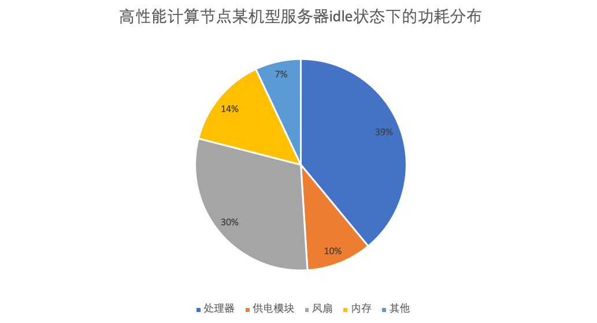
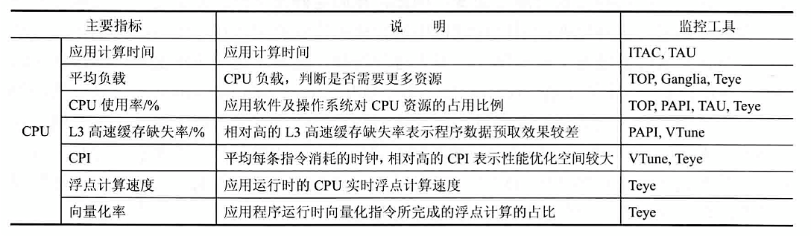
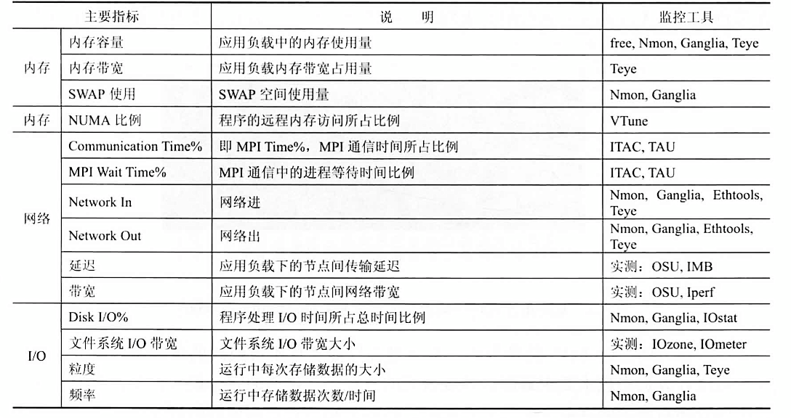

# 高性能计算｜集群功率与系统监控

> Yurk（realyurk@gmail.com）整理
>
> 参考内容：《高性能计算》（张广勇）
>
> ​					《超算竞赛导引》（科学出版社）
>
> ​					《Introduction to High Performance Scientific Computing》(Victor Eijkhout)
>
> 部分资料来源网络，仅供个人学习使用

超级计算机的运算能力十分强大，能耗也十分惊人。在能源日益紧张和强调环保的今天，超级计算机的设计越来越强调效能比。对超级计算机进行功耗管理并不是简单地降低功耗或能耗，这需要从两个方面下手：一方面在满足性能前提下，优化功耗、能耗与性能的折中，提高系统的能效；一方面是设计发热更低、能源利用率更高的超级计算机部件和设计能耗更低的散热方式。

## 功耗监控

在服务器的主要部件中，处理器功耗占系统功耗的主体地位，管理处理器功耗的方法主要有：**动态调频**（dynamic voltage frequency scaling，DVFS）和**处理器动态休眠技术**。

1. **动态资源休眠**（dynamic resource sleeping，DRS），即为了节能而休眠或关闭空闲的资源，如组件、设备或节点，需要时再将资源动态唤醒。目前的主流处理器都支持动态休眠技术，有的处理器还支持多种休眠状态。**高级配置与电源接口**（advanced configuration and power interface，ACPI）对处理器休眠状态（C状态）进行了明确的规范。此外，有的内存也支持动态关闭，**外围设备互联**（peripheral component interconnect，PCI）功耗管理规范也对设备的动态关闭进行了相关描述。超算集群还可以以节点为单位动态休眠相应节点。
2. **动态速率调节**（dynamic speed scaling，DSS），即动态调节设备的运行速率。并行计算存在大量的通信与同步，快速设备完成其承担的负载后必须等待慢速设备，此时快速设备的高速率是没有必要的，降低快速设备的速率，可以降低系统功耗而不损失系统性能，从而实现系统的能耗优化。处理器 DVFS 是典型的 DSS 机制，有的内存、磁盘也支持频率或转速的动态调节。

目前的商用处理器都支持 DRS 和 DSS 两种低功耗机制。真实系统中，处理器不可能总是处于繁忙状态。如果不采取任何功耗管理措施，处理器空闲时在操作系统控制下运行相关内核代码，循环等待，直到内核为其分配相应的用户负载。空闲处理器等待期间的指令运行造成了无谓的功耗浪费。

为此，处理器引入**动态休眠技术**，即空闲时停止执行指令，进入低功耗状态，直至需要时再被唤醒。

真实系统中，处理器不可能总是处于繁忙状态。如果不采取任何功耗管理措施，处理器空闲时将在操作系统控制下运行相关内核代码，循环等待，直到内核为其分配相应的用户负载。空闲处理器等待期间的指令运行造成了无谓的功耗浪费。

为此，处理器引入动态休眠技术，即空闲时停止执行指令，进入低功耗状态，直到需要时再被唤醒，超级计算机节点通常采用多核多处理器结构，并行计算中存在大量的通信与同步，这就为处理器休眠提供了潜在的机会。处理器可能支持多个休配状态，不同休眠状态的逻辑行为相同，但功耗不同，从功耗更低的休眠状态唤醒所需的时间和能耗的开销都更大。举例来说，Intel Xeon 处理器支持增强型空闲电源管理状态转换（enhanced haltstate）技术，除了正常运行状态 C0 外，还支持休眠状态 C1 和增强型深度休眠状态 CIE 等。Linux 内核引入 CPUldle 模块来管理空闲处理器，根据处理2空闲历史记录判断处理器是否休眠，并选择合适的休眠状态。

从些测试结果看，CIE完成大部分测试用例的时间比C1更长，能耗更少，这与两种体眠状态的特点一致。但是，对于计算非常密集的应用，唤醒时间的影响尤为显著，CIE尽管功耗更低，但执行时间增如得更多，能耗反而上升。

处理器调频对 系统能数的优化效果与应用的特征密切相关。对于通信密集的体现系统通信能力的应用，降频可能会带来10%以上能效优化，但对于计算密集的体现处理器浮点计算能力的应用，降频反而降低了能效。

没有任何频率对所 有应用都是能效最优的，应该根据月行应用中计算和通信的相对特征动态选择处理器性能。超级计算中，基于处理器性能调节机制来优化系统使耗还有很大的潜力可挖。 超算集群的能耗监控一般有两个层次， 第一个层次是**整集群的监控**。般以机柜为单位。每个机柜配备支持网络监控功耗功使的**电源分配单元**（power dstiution unit，PDU）。由监控软件汇总每个机柜 PDU 的功耗数据。这种能耗监控的数据是根据 PDU 整体的电压电流数据经过计算得出的，连接到该 PDU 的所有设备如交换机、存储等都可以监控到，也是预估电费的直接数据。

第二个层次是以**节点为单位的监控**， 既可以通过专业监控软件监控，也可以通过些简单的工具或操作系统（Operating System，OS）自带命令实现。这里不再赞述。

有的时候，选用一些低功耗的部件降低系统系统功耗，例如用固态硬盘（SSD）代替机械硬盘也是十分有效的策略。

### 应用特征与监测分析工具

常用特征如下：

|     组成      |           选配方案           |                      考虑角度                      |
| :-----------: | :--------------------------: | :------------------------------------------------: |
|     算例      |           运行时间           |                 算例规模、算例设置                 |
|     软件      |             版本             |                      软件版本                      |
|     机型      |   计算节点：NX5440（刀片）   |                根据项目需求选择机型                |
|      CPU      | Intel E5-2600v3， E5-2600v2  | CPU频率、高速缓存、QPI 频率、Turbo 配置、NUMA 配置 |
|     内存      | DDR3/DDR4 1600/1866/2133 MHz |          内存容量、内存频率、DIMM/Socket           |
| 存储/文件系统 |         I/O节点，NFS         |                      AS500G3                       |
|     网络      |          InfiniBand          |              InfiniBand、10GB 以太网               |
|      OS       |         RHEL6.4、7.0         |                      OS 版本                       |

为了能够精确地反应应用软件的特征，应用特征提取的时间间隔往往非常短，通常以秒计，从而导致反应应用特征的数据量巨大。因此，高效的特征数据收集和数据的分析往往需要借助数据库，如 MySQL 等来完成。

[浪潮 T-Eye监测系统官网](https://www.inspur.com/lcjtww/2526894/2526897/2526901/2527109/index.html)

**天眼**（Teye）工具的全称是**天眼高性能应用特征监控分析系统**。它是由浪潮专业的高性能计算团队开发的一款卓越软件， 主要用于提取高性能应用程序在大规模集群上运行时对系统资源占用的情况，并实时反映应用程序的运行特征，从而帮助用户最大限度的在现有平台挖掘应用的计算潜力，进而为系统的优化、应用程序的优化以及应用算法的调整改进提供科学的指引方向。

天眼是一款可视化的工具软件， 它由集群的**性能监控和指标提取端**以及**客户机的性能分析端**两个工具软件组成。其中，天眼的性能监控和指标提取端工具主要用于实时监控和提取指定的性能指标，它基于BS架构，无需用户安装任何客户端，仅通过网页浏览器即可正常使用天眼软件来监控和提取关键性能指标。此外，天眼还具有体积小、易操作、数值监控精确、实时、资源占用率低等众多优点，即使在系统重负载情况下，天眼对系统资源的需求量也远远不足千分之一， 极大程度上保证了所反映的高性能应用程序运行特征的真实性。

## 超算系统的性能均衡

Amdahl 定律告诉人们，当CPU的性能提高10倍而忽略I/O的性能时，系统的性能只能提高5倍；当CPU的性能提高100倍而不改进I/O的性能时，系统的性能只能提高10倍。所以整个系统各部件间的性能平衡显得非常重要，否则如果某些部件的性能较差而成为系统瓶颈，不仅降低了整个系统的性能，同时也不能充分利用其他的部件。

从大的方面来看，超级计算机的系统平衡应该有两个层次。一个层次是体系结构层次上的，这主要是各个部件的硬件性能应达到一个平衡的状态：另一个层次是软件层次上的，主要是指操作系统对各种资源进行有效的管理，达到负载平衡（如不能让一些节点始终处于忙碌状态，而一些节点始终空闲），提高利用率。

超级计算机主要由**计算部件**、**存储部件**、**互连部件**构成，构建一个平衡的系统实质上就是协调这三大部件的主要性能，使系统在某种工作负载下各部件既无冗余又不产生瓶颈。

下面将从几个方向讨论构建负载均衡的集群系统

### 节点内配置均衡

#### CPU同构类型

对于节点内的配置，应尽可能保持一致，以提高数据交换能力和资源利用率。例如，节点内是双路的，则对于每一路处理器配置的内存应尽可能保持一致，以避免两个处理器对应内存差别太大，造成两个处理器的处理能力差距悬殊，导致整个节点处理能力下降。例如，对于双路处理器的节点，两个处理器均配置24GB的内存，比一个配置24GB，另外一个配置12GB的内存处理效果要好。

#### 异构类型

使用 CPU 与 GPU 异构模式的计算系统，主机内存应大于等于 GPU 内存；创建统一的内存地址空间，让 CPU 和 GPU 完全共享内存以实现无缝的运作；CPU 核数与 GPU 个数保持数量的均衡；GPU内存带宽与主机内存带宽均衡，以减少数据交换带来的延迟。

### 节点间配置均衡

同类计算节点保持配置均衡，如**内存大小相同**，**CPU 数量及核数相同**，**节点结构相同**，要么都是同构，要么都是异构，避免同类节点结构不一样（如一个是同构架构，另-个是异构架构）导致数据处理能力降低的情况。

### 网络均衡

同类节点与节点间的网络连接采用统一的方式，包括同样的网络介质，如**千兆以太网**、**万兆以太网**、**IB网络**等。

交换机：要么都使用全交换方式，要么都使用半交换方式，否则会由于带宽的不一致，导致信息阻塞。

### 执行同一应用的节点配置均衡

执行同一应用的节点配置应保持一致， 这样在进行数据处理和交换时速度会更快。若由于客观原因实在不能保持一致，则通过集群管理软件来进行**作业调度**，作业提交后，可以均衡地提交到集群中配置相当的节点上进行运算，避免因某些节点存在瓶颈降低整个应用的运行效率。

### 不同设备间的均衡

计算节点与 I/O 节点和存储设备间应均衡匹配，高性能计算系统的存储系统，不仅起着备份数据的作用，在计算过程中，还起着提高读/写带宽的作用。

对某些应用主要是进行计算，存储数据和读/写数据不多，那么I/O节点机存储配置要求就不用太高。

但对于有些应用，节点上运行的应用比较复杂，涉及大量数据读/写及数据存储，如基因研究、石油勘察等数据之间关联性强（下一步计算要依赖上一步的运算结果）的应用，就需要对应的I/O和存储系统配置高。

### 功耗均衡

在系统构建时需要考虑到机房的实际情况，均衡分布设备，避免出现局部功耗太高或者局部功耗太低的情况。

在满足系统功能的前提下，尽可能将能耗高的设备和能耗低的设备、密度高的设备和密度低的设备组合搭配，如将刀片服务器和机架服务器放到同一个机柜中，避免不同部位间能耗相差太大，造成**局部过热**或者**局部有资源浪费**的情况。

另外，在机房中靠近制冷设备的地方可以考虑放置功耗大、密度大的设备等以合理地利用资源。

## 集群管理软件

### 集群管理系统

集群系统有五种特性：（1）高性价比；（2）资源共享；（3）灵活性和可扩展性；（4）实用性和 容错性；（5）可伸缩性。

目前，几大主流服务器厂商都提供了自己的集群管理系统，如浪潮的 **Cluster Engine**，曙光的 **Gridview**，HP 的 **Serviceguard**，**IBM Platform Cluster Manager** 等等。集群管理系统主要提供以下的功能：

1. **监控模块**：监控集群中的节点、网络、文件、电源等资源的运行状态。动态信息、实况信息、历史信息、节点监控。可以监控整个集群的运行状态及各个参数。
2. **用户管理模块**：管理系统的用户组以及用户，可以对用户组以及用户进行查看，添加，删除和 编辑等操作。
3. **网络管理模块**：系统中的网络的管理。
4. **文件管理**：管理节点的文件，可以对文件进行上传、新建、打开、复制、粘贴、重命名、打包、删除和下载等操作。
5. **电源管理模块**：系统的自动和关闭等。
6. **友好的图形交互界面**：现在的集群管理系统都提供了图形交互界面，可以更方便的使用和管理集群。

### 集群作业调度系统

集群管理系统中最主要的模块为作业调度系统，目前，主流的作业调度系统都是基于PBS的实现。

**PBS**（Portable Batch System） 最初由 NASA 的 Ames 研究中心开发，主要为了提供一个能满足异构计算网络需要的软件包，用于灵活的批处理，特别是满足高性能计算的需要，如集群系统、 超级计算机和大规模并行系统。PBS 的主要特点有：代码开放，免费获取；支持批处理、交互式作业和串行、多种并行作业，如 MPI、PVM、HPF、MPL；PBS 是功能最为齐全，历史最悠久, 支持最广泛的本地集群调度器之一。PBS 的目前包括 openPBS，PBS Pro 和 Torque 三个主要分支。其中 OpenPBS 是最早的 PBS 系统，目前已经没有太多后续开发，PBS pro 是 PBS 的商业版本，功能最为丰富。Torque 是 Clustering 公司接过了 OpenPBS，并给与后续支持的一个开源版本。

PBS 主要有如下特征：

- **易用性**：为所有的资源提供统一的接口，易于配置以满足不同系统的需求，灵活的作业调度器允许不同系统采用自己的调度策略。
- **移植性**：符合 POSIX 1003.2 标准，可以用于 shell 和批处理等各种环境。
- **适配性**：可以适配与各种管理策略，并提供可扩展的认证和安全模型。支持广域网上的负载的动态分发和建立在多个物理位置不同的实体上的虚拟组织。
- **灵活性**：支持交互和批处理作业。torque PBS 提供对批处理作业和分散的**计算节点** （Compute nodes） 的控制。

