# 高性能计算｜网络系统与存储系统

> Yurk（realyurk@gmail.com）整理
>
> 参考内容：《高性能计算》（张广勇）
>
> ​					《超算竞赛导引》（科学出版社）
>
> ​					《Introduction to High Performance Scientific Computing》（Victor Eijkhout）
>
> 部分资料来源网络，仅供个人学习使用

高性能计算集群中一般采用专用高速网络，如 **InfiniBand 网络**，也有采用**以太网**（千兆网、万兆网）的系统。以太网性能较差，只适合于对网络要求比较低的应用中，如果每个节点配置两个以太网，可以采用**双网卡绑定**的方法提高性能，性能可以提高 50%∼80%。

## InfiniBand 网络

**InfiniBand**（简称 IB）是一个统一的互联结构，既可以处理存储 I/O、网络 I/O，也能够处理进程间通信 （IPC）。它可以将磁盘阵列、SANs、LANs、服务器和集群服务器进行互联，也可以连接外部网络（比如 WAN、VPN、互联网）。设计 InfiniBand 的目的主要是用于企业数据中心，大型的或小型的。目标主要是实现高的可靠性、可用性、可扩展性和高的性能。InfiniBand 可以在相对短的距离内提供高带宽、低延迟的传输，而且在单个或多个互联网络中支持冗余的 I/O 通道，因此能保持数据中心在局部故障时仍能运转。

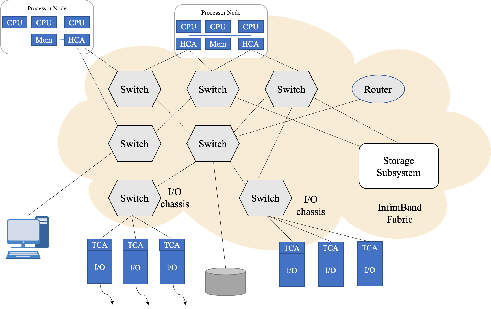

InfiniBand 的网络拓扑结构如上所示，其组成单元主要分为四类：

1. **HCA**（Host Channel Adapter）：连接内存控制器和 TCA 的桥梁
2. **TCA**（Target Channel Adapter）：将 I/O 设备 （例如网卡、SCSI 控制器） 的数字信号打包发送给HCA
3. **InfiniBand link**：连接 HCA 和 TCA 的光纤，InfiniBand 架构允许硬件厂家以 1 条、4 条、12 条光纤 3 种方式连结 TCA 和 HCA
4. **交换机和路由器**：无论是 HCA 还是 TCA，其实质都是一个主机适配器，它是一个具备一定保护功能的可编程 **DMA**（Direct Memory Access，直接内存存取）引擎。

在高并发和高性能计算应用场景中，当客户对带宽和时延都有较高的要求时，可以采用 IB 组网：前端和后端网络均采用 IB 组网，或前端网络采用 10Gb 以太网，后端网络采用 IB。由于 IB 具有**高带宽**、**低延时**、**高可靠**以及**满足集群无限扩展能力**的特点，并采用 RDMA 技术和专用协议卸载引擎，所以能为存储客户提供足够的带宽和更低的响应时延。

IB 工作模式共有 7 种，分别为：（1）**SRD**（Single Data Rate）：单倍数据率，即 8Gb/s；（2） **DDR** （Double Data Rate）：双倍数据率，即 16Gb/s；（3）**QDR** （Quad Data Rate）：四倍数据率， 即 32Gb/s；（4）**FDR** （Fourteen Data Rate）：十四倍数据率，56Gb/s；（5）**EDR** （Enhanced Data Rate）：100 Gb/s；（6）**HDR** （High Data Rate）：200 Gb/s；（7）**NDR** （Next Data Rate）：1000 Gb/s+。

### IB 通信协议

#### InfiniBand 与 RDMA

InfiniBand 发展的初衷是把服务器中的总线给网络化。所以 InfiniBand 除了具有很强的网络性能以外还直接继承了总线的高带宽和低时延。大家熟知的在总线技术中采用的 **DMA**（Direct Memory Access） 技术在InfiniBand 中以 **RDMA**（Remote Direct Memory Access） 的形式得到了继承。这也使 InfiniBand 在与 CPU、内存及存储设备的交流方面天然地优于万兆以太网以及 Fibre Channel。可以想象在用 InfiniBand 构筑的服务器和存储器网络中任意一个服务器上的 CPU 可以轻松地通过 RDMA 去高速搬动其他服务器中的内存或存储器中的数据块，而这是 Fibre Channel 和万兆以太网所不可能做到的。

#### InfiniBand 与其他协议的关系

作为总线的网络化，InfiniBand 有责任将其他进入服务器的协议在 InfiniBand 的层面上整合并送入服务器。基于这个目的， 今天 Volatire 已经开发了 IP 到 InfiniBand 的路由器以及 Fibre Channel 到 InfiniBand 的路由器。这样一来客观上就使得几乎所有的网络协议都可以通过 InfiniBand 网络整合到服务器中去。这包括 Fibre Channel， IP/GbE， NAS， iSCSI 等等。另外 2007 年下半年 Voltaire 将推出万兆以太网到 InfiniBand 的路由器。这里有一个插曲： 万兆以太网在其开发过程中考虑过多种线缆形式。最后发现只有Infiniband 的线缆和光纤可以满足其要求。最后万兆以太网开发阵营直接采用了 InfiniBand 线缆作为其物理连接层。

InfiniBand 网络性能可以使用 **IMB 测试程序**进行测试，IB 通信协议使用方法见 MPI 介绍的章节。

### 基于 InfiniBand 的HPC 应用优化

MPI 规范的标准化工作是由 MPI 论坛完成的，其已经成为并行程序设计事实上的工业标准。最新的规范是 MPI3.0，基于 MPI 规范的实现软件包括 MPICH 和 OpenMPI。MPICH由美国阿贡国家实验室和密西西比州立大学联合开发，具有很好的可移植性。MVAPICH2、Intel MPI、Platform MPI 都是基于 MPICH 开发的。OpenMPI 由多家高校、研究机构、公司共同维护的开源 MPI 实现。

在 HPC 领域，并行应用程序通常基于 MPI 开发。因此要优化 HPC 应用程序，了解 MPI 实现的特性是非常关键的。

#### MPI 通信协议

MPI 通信协议大体可以分为两类：**Eager 协议**与 **Rendezvous 协议**。

1. **Eager 协议**：该模式下发送进程将主动发送信息到接收进程，而不会考虑接受进程是否有能力接受信息。这就要求接受进程预先准备足够的缓存空间来接受发送过来的信息。Eager 协议只有非常小的启动负荷，非常适合对延迟要求高的小消息发送。Eager 协议下，可以采用 `InfiniBand Send/Recv` 或 RDMA 方式发送消息来实现最佳性能。
2. **Rendezvous 协议**：与 Eager 模式相反，该模式下 Rendezvous 协议会在接收端协调缓存来接受信息。通常适用于发送比较大的消息。该情况下，发送进程自己不能确认接收进程能够有足够的缓存来接受要发送的信息，必须要借助协议和接收端协调缓存之后才会发送信息。

Rendezvous 协议与 Eager 协议本身并不局限于 RDMA 操作，可以运行 Socket、RDMA Write 与 RDMA Read。然而 Socket 操作中需要多个消息拷贝过程从而大幅降低通信性能，并且无法实现计算与通信的重叠。RDMA Write 和 Read 通过零拷贝与内核旁路，实现更高性能的同时可以将计算通信操作同步叠加运行。

发送端首先发送 `Rndz_start` 控制指令到接收端，接收端随后返回另外一个控制指令 `Rndz_reply`，该指令包含接收端应用程序的缓存信息和访问其内存地址的 key 信息。发送端收到指令后调用 `RMDA_Write` 将数据直接写入接收端应用程序的缓存，消息发送完成之后，发送端会发出 `Fin` 指令到接收端告知自己已经将整个信息放入到接收端的应用缓存中。Rendezvous 模式的好处是在没有确切得知发送消息的信息之前，没有预先的 Pre-pin 缓存，因此它是相对于 Eager 模式更节约内存的一种方式。相对负面的是其多重操作会增加通信延迟。因此**更适合传输相对占用内存的大消息**。

Eager 协议在消息大小小于 16KB（在 MVAPICH2 中的默认 Eager 阈值）时都可以提供更低的通信延迟，但在消息大小大于 Eager 阈值后，Rendezvous 模式的优势开始显现。

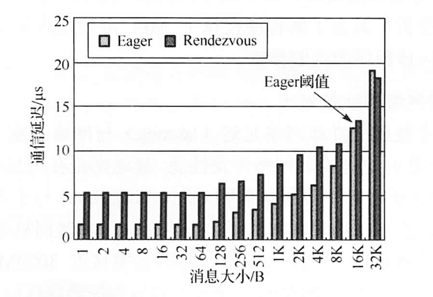

#### MPI 函数

前面介绍的 MPI 底层协议会对所有 MPI 通信产生影响。具体到上层的 MPI 函数还会设计另一层的优化。 MPI 函数分为**集群**（collective）通信与**点对点**（point to point）通信。不同的 MPI 实现对集群通信与点对点通信略有差异。因此针对不同的 MPI 实现所采取的优化方式也存在差异。

1. **点对点通信**：MPI 定义了超过 35 个点对点通信函数。最主要的包括 `MPI_Send`、`MPI_Recv`、`MPI_Sendrecv`、`MPI_Isend`、`MPI_Irecv`、`MPI_Probe`、`MPI_Iprobe`、`MPI_Test`、`MPI_Testall`、`MPI_Wait`、`MPI_Waitall` 等。
2. **集群通信**：`MPI_Allgather`、`MPI_Allgatherv`、`MPI_Allreduce`、`MPI_Alltoall`、 `MPI_Alltoallv`、`MPI_Barrier`、`MPI_Bcast`、`MPI_Gather`、`MPI_Gatherv`、`MPI_Reduce`、`MPI_Scatter`、`MPI_Scatterv` 等 。

#### MPI 基于不同网络的性能对比

性能结果显示，从两台服务器开始，InfiniBand 就可以提供比以太网更高的性能。当在 8 个服务器节点时，InfiniBand 能够提供双倍于以太网的性能，随着节点数的增加，InfiniBand 相对于以太网的优势进一步扩大，在 16 个节点时，基于 InfiniBand 的 NAMD 性能是以太网性能的 1.5 倍。从 4 个节点开始，基于以太网的 NAMD 性能增长就非常缓慢。万兆以太网与 4万兆以太网提供相同的 NAMD 性能，其性能高于千兆以太网，但相对 InfiniBand 性能远远落后。要充分发挥 HPC 系统的性能与效率，InfiniBand 网络是不可替代的核心技术。

## 存储系统

### 存储网格

#### DAS

**直接连接存储** （Direct Attached Storage，DAS），是指将外置存储设备通过连接电缆，直接连接到一台计算机上。

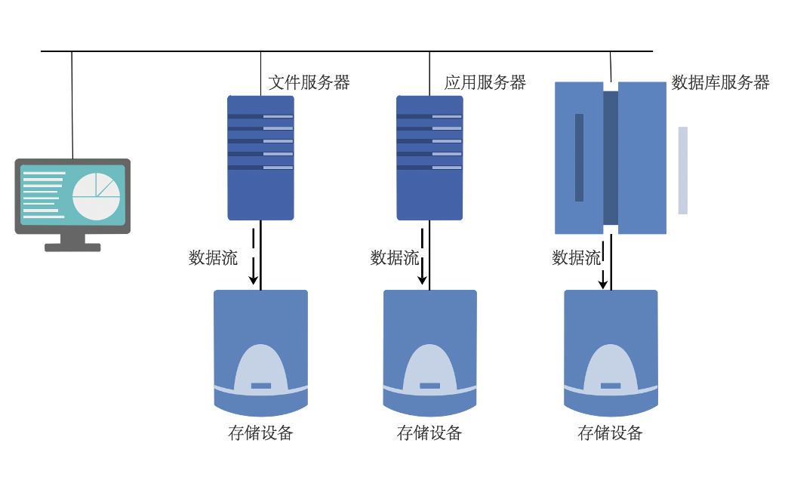

采用直接外挂存储方案的服务器结构如同 PC 架构，外部数据存储设备采用 **SCSI** 技术或者 **FC**（Fibre Channel） 技术，直接挂接在内部总线上，数据存储是整个服务器结构的一部分。DAS 这种直连方式，能够解决单台服务器的存储空间扩展和高性能传输的需求，并且单台外置存储系统的容量，已经从不到 1TB 发展到了 2TB。

**开放系统的直连式存储** （Direct-Attached Storage，简称 DAS） 已经有近四十年的使用历史，随着用户数据的不断增长，尤其是数百 GB 以上时，其在备份、恢复、扩展、灾备等方面的问题变得日益困扰系统管理员。

**DAS 的优缺点**：

直连式存储依赖服务器主机操作系统进行数据的 IO 读写和存储维护管理，数据备份和恢复要求占用服务器主机资源 （包括 CPU、系统 IO 等），数据流需要回流主机再到服务器连接着的磁带机 （库），数据备份通常占用服务器主机资源 20-30%，因此许多企业用户的日常数据备份常常在深夜或业务系统不繁忙时进行，以免影响正常业务系统的运行。直连式存储的数据量越大，备份和恢复的时间就越长，对服务器硬件的依赖性和影响就越大。

直连式存储与服务器主机之间的连接通道通常采用 SCSI 连接，带宽为 10MB/s、20MB/s、 40MB/s、80MB/s 等，随着服务器 CPU 的处理能力越来越强，存储硬盘空间越来越大，阵列的硬盘数量越来越多，SCSI 通道将会成为 IO 瓶颈； 服务器主机 SCSI ID 资源有限，能够建立的 SCSI 通道连接有限。 无论直连式存储还是服务器主机的扩展，从一台服务器扩展为多台服务器组成的群集 （Cluster），或存储阵列容量的扩展，都会造成业务系统的停机，从而给企业带来经济损失，对于银行、电信、传媒等行业 7×24 小时服务的关键业务系统，这是不可接受的。并且直连式存储或服务器主机的升级扩展，只能由原设备厂商提供，往往受原设备厂商限制。

#### NAS

**网络附加存储** （Network Attached Storage，NAS），NAS 是一种专业的网络文件存储及文件备 份设备，它是基于**局域网** （LAN） 的，采用 TCP/IP 协议，通过网络交换机连接存储系统和服务器主机，建立专用于数据存储的存储私网。以文件的输入/输出 （I/O） 方式进行数据传输。在 LAN 环境下，NAS 已经完全可以实现不同平台之间的数据共享，如 NT、UNIX、Mac、Linux 等平台的共享。一个 NAS 系统包括处理器，文件服务管理模块和多个磁盘驱动器 （用于数据的存储）。采用网页浏览器就可以对 NAS 设备进行直观方便的管理。

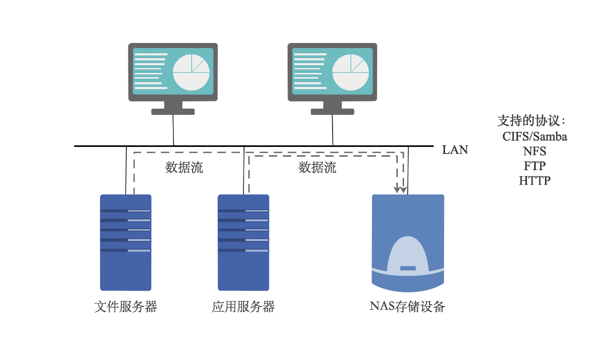

实际上 NAS 是一个带有瘦服务器 （Thin Server） 的存储设备，其作用类似于一个专用的文件服务器。这种专用存储服务器不同于传统的通用服务器，它去掉了通用的服务器原有的不适用大多数计算功能，而仅仅提供文件系统功能，用于存储服务，大大降低了存储设备的成本。与传统的服务器相比，NAS 不仅响应速度快，而且数据传输速率也较高。

NAS 具有较好的协议独立性，支持 UNIX、NetWare、Windows、OS/2 或 Internet Web 的数据访问，客户端也不需要任何专用的软件，安装简易，甚至可以充当其他主机的网络驱动器，可以方便地利用现有的管理工具进行管理。

NAS 可以通过交换机方便地接入到用户网络上，是一种即插即用的网络设备。

#### SAN

**存储区域网络** （Storage Area Network，SAN），是指采用**光纤信道** （Fibre Channel） 技术，通过光纤信道交换机连接服务器主机和存储阵列，建立专用于数据存储的区域网络。

SAN 是专门连接存储外围设备和服务器的网络。它通常包括**服务器**、**外部存储设备**、**服务器适配器**、**集线器**、**交换机**以及**网络**、**存储管理工具**等。SAN 在综合了网络的灵活性、可管理性及可扩展性的同时，提高了网络的带宽和存储 I/O 的可靠性。它降低了存储管理费用，并平衡了开放式 系统服务器的存储能力和性能，为企业级存储应用提出了解决方案。SAN 独立于应用服务器网络系统之外，拥有几乎无限的存储能力，它采用高速的光纤信道作为传输媒介，FC（光纤信道，Fibre Channel）+SCSI 的应用协议作为存储访问协议，将存储系统网络化，实现了真正高速的共享存储。

|          |                             DAS                              |                             NAS                              |                     SAN                      |
| :------: | :----------------------------------------------------------: | :----------------------------------------------------------: | :------------------------------------------: |
| 传输类型 |                           SCSI、FC                           |                              IP                              |               IP、FC、SAS、IB                |
| 数据类型 |                            数据块                            |                             文件                             |                    数据块                    |
| 典型应用 |                             任何                             |                          文件服务器                          |                  数据库应用                  |
|   优点   |              磁盘与服务器分离 便于统一管理              | 不占用应用服务器资源 广泛支持操作系统，扩展容易 即插即用，安装简单方便 |  高扩展性、高可用性 数据集中，易于管理  |
|   缺点   | 连接距离短，数据分散，共享困难 存储空间利用率不高，扩展性有限 |   不适合存储量大的块级应用 数据备份及恢复占用网络带宽   | 相比 NAS 成本较高 安装和升级比 NAS 复杂 |

### 磁盘阵列 RAID

**磁盘阵列**（Redundant Arrays of Independent Disks，RAID），有“独立磁盘构成的具有冗余能力的阵列”之意。

磁盘阵列是由很多价格较便宜的磁盘，组合成一个容量巨大的磁盘组，利用个别磁盘提供数据所产生加成效果提升整个磁盘系统效能。利用这项技术，将数据切割成许多区段，分别存放在各个硬盘上。

磁盘阵列还能利用**同位检查**（Parity Check）的观念，在数组中任意一个硬盘故障时，仍可读出数据，在数据重构时，将数据经计算后重新置入新硬盘中。

1. **优点**：提高传输速率。RAID 通过在多个磁盘上同时存储和读取数据来大幅提高存储系统的**数据吞吐量** （Throughput）。在 RAID 中，可以让很多磁盘驱动器同时传输数据，而这些磁盘驱动器在逻辑上又是一个磁盘驱动器，所以使用 RAID 可以达到单个磁盘驱动器几倍、几十倍甚至上百倍的速率。这也是 RAID 最初想要解决的问题。因为当时 CPU 的速度增长很快，而磁盘驱动器的数据传输速率无法大幅提高，所以需要有一种方案解决二者之间的矛盾。RAID 最后成功了。

   通过数据校验提供容错功能。普通磁盘驱动器无法提供容错功能，如果不包括写在磁盘上的 CRC（循环冗余校验）码的话。RAID 容错是建立在每个磁盘驱动器的硬件容错功能之上的，所以它提供更高的安全性。在很多 RAID 模式中都有较为完备的相互校验/恢复的措施，甚至是直接相互的镜像备份，从而大大提高了 RAID 系统的容错度，提高了系统的稳定冗余性。

2. **缺点**：RAID0 没有冗余功能，如果一个磁盘（物理）损坏，则所有的数据都无法使用。RAID1 磁盘的利用率最高只能达到 50%（使用两块盘的情况下），是所有 RAID 级别中最低的。 RAID0+1 以理解为是 RAID 0 和 RAID 1 的折中方案。RAID 0+1 可以为系统提供数据安全保障，但保障程度要比 Mirror 低而磁盘空间利用率要比 Mirror 高。

#### RAID 数据存取方式

- **并行存取模式**（Paralleled Access）：把所有磁盘驱动器的主轴马达作为精密的控制，使每个磁盘的位置都彼此同步，然后对每一个磁盘驱动器做一个很短的 I/O 数据传送，使从主机来的每一个 I/O 指令，都平均分不到每一个磁盘驱动器，将阵列中每一个磁盘驱动器的性能发挥到最大。

  适合大型的、数据连续的以长时间顺序访问数据为特征的应用。

- **独立存取模式**（Independent Access）：对每个磁盘驱动器的存取都是独立且没有顺序和时间间隔的限制，可同时接收多个 I/O Requests，每笔传输的数据量都比较小。适合数据存取频繁，每笔存取数据量较小的应用。

  RAID0，1，5，6 都采用独立存取模式。

#### RAID 0

1. **无差错控制的条带化阵列**（RAID 0）工作原理：

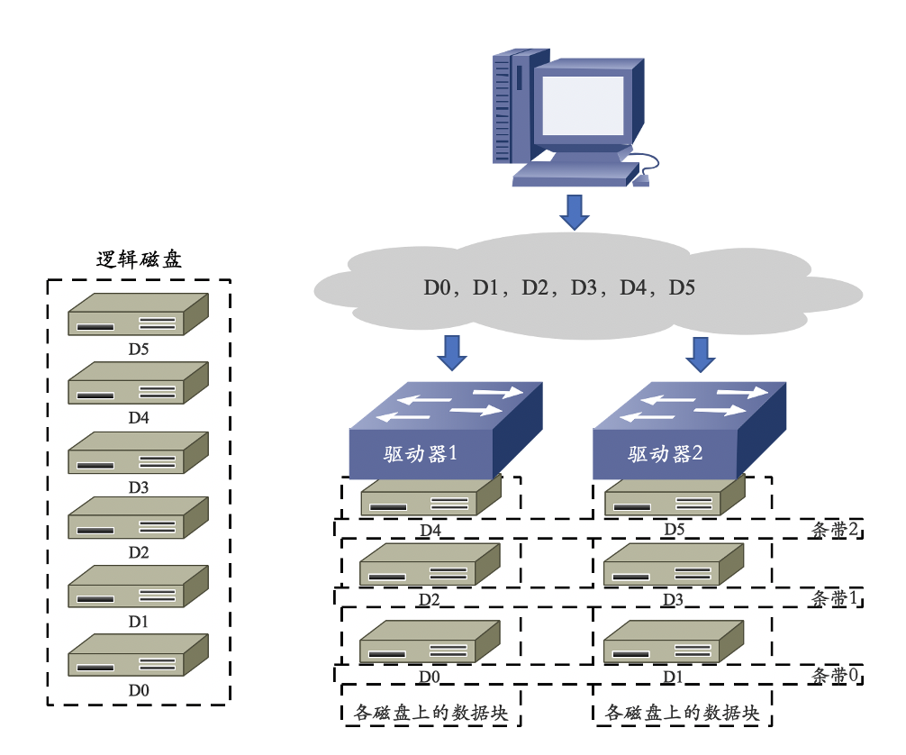

2. **优点**：
   - I/O 负载平均分配到所有的驱动器；
   - 由于驱动器可以同时读写，性能在所有 RAID 级别中最高；
   - 磁盘利用率最高，设计、使用和配置简单。

3. **缺点**：
   - 数据无冗余，一旦阵列中有一个驱动器故障，其中的数据将丢失。
4. **应用范围**：
   - 视频生成和编辑、图像编辑等对传输带宽需求较大的应用领域。

#### RAID 1

1. **镜像结构的阵列**（RAID 1）工作原理：

2. **优点**：
   - RAID 1 对存储的数据进行百分之百的备份，提供最高的数据安全保障；
   - 设计、使用和配置简单。
3. **缺点**：
   - 磁盘空间利用率低，存储成本高；
   - 磁盘写性能提升不大。
4. **应用范围**：
   - 可应用于金融、保险、证券、财务等对数据的可用性和安全性要求较高的应用领域。

#### RAID 5

1. **分布式奇偶校验码的独立磁盘结构**（RAID 5）工作原理：

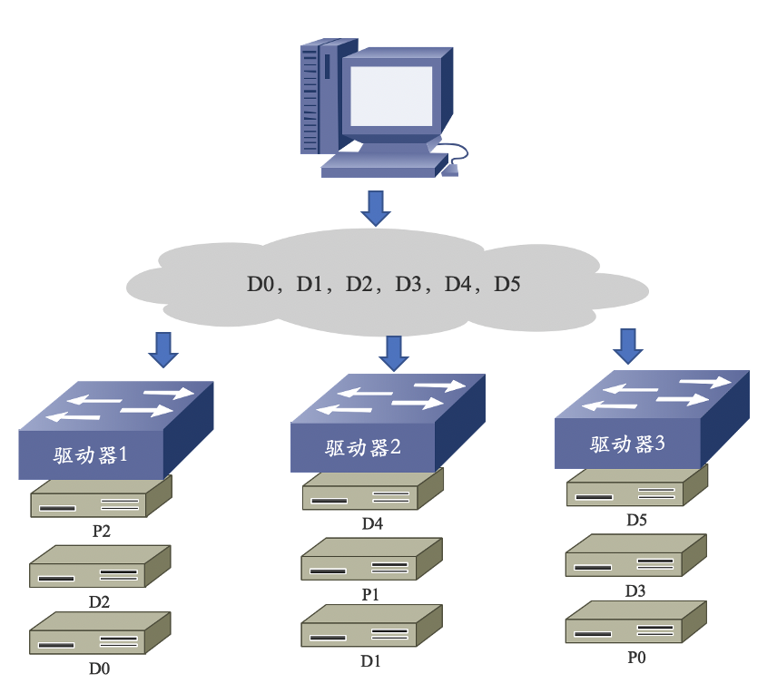

2. **优点**：
   - 高可用性；
   - 磁盘利用率较高；
   - 随机读写性能高，校验信息分布存储于各个磁盘，避免单个校验盘的写操作瓶颈。

3. **缺点**：
   - 异或校验影响存储性能；
   - 硬盘重建的过程较为复杂；
   - 控制器设计复杂。

4. **应用范围**：
   - 适合用在文件服务器、Email 服务器、WEB 服务器等输入/输出密集、读/写比率较高的应用环境。

#### RAID 6 P+Q

1. **工作原理**：RAID 6 P+Q 需要计算出两个校验数据 P 和 Q，当有两个数据丢失时，根据 P 和 Q 恢复出丢失的数据。校验数据 P 和 Q 是由以下公式计算得来的：

$$
\begin{array}{l}
P=D 0 \oplus D 1 \oplus D 2 \cdots \cdots \\
Q=(\alpha \otimes D 0) \oplus(\beta \otimes D 1) \oplus(\gamma \otimes D 2) \ldots \ldots
\end{array}
$$

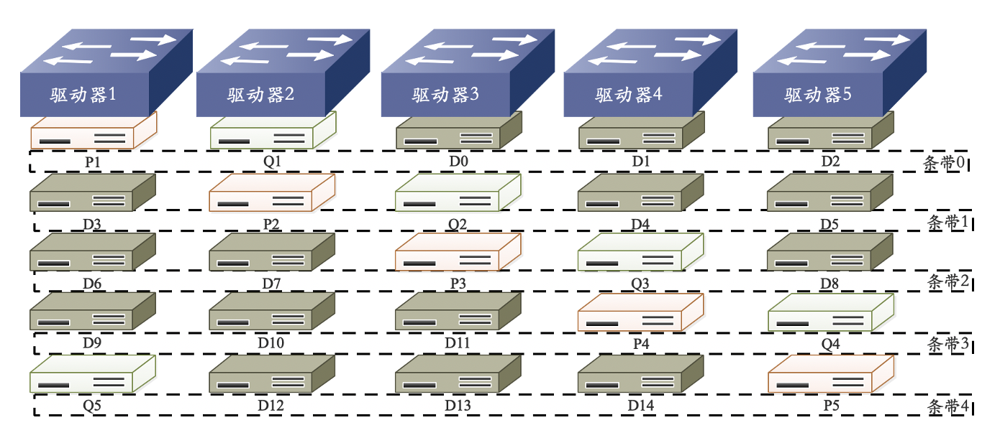

2. **优点**：
   - 具有高可靠性；
   - 可同时允许两块磁盘失效；
   - 至少需要四块磁盘。
3. **缺点**：
   - 采用两种奇偶校验消耗系统资源，系统负载较重；
   - 磁盘利用率比 RAID 5 更低；
   - 配置过于复杂。

4. **应用范围**：
   - 适合用在对数据准确性和完整性要求极高的环境。

#### RAID 10

1. **工作原理**：RAID 10 是将镜像和条带进行组合的 RAID 级别，先进行 RAID 1 镜像然后再做 RAID 0。RAID 10 也是一种应用比较广泛的 RAID 级别。

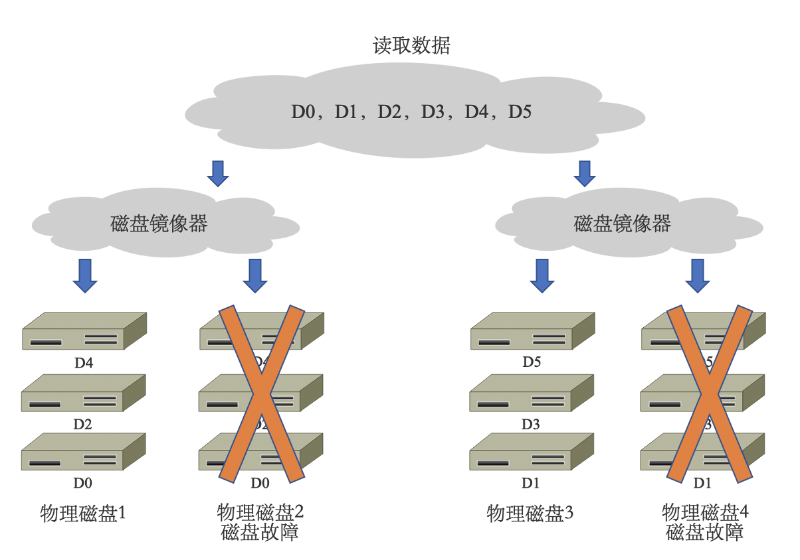

2. **优点**：
   - 高读取速度；
   - 高写入速度，写开销较小；
   - 特定情况下，可以允许 N/2 个硬盘同时损坏。

3. **缺点**：
   - 磁盘利用率低，只有 1/2 的硬盘利用率，至少需要 4 块磁盘。
4. **应用范围**：
   - 数据量大，安全性要求高的环境，如银行、金融等领域。

| RAID 级别  |        RAID 0        |        RAID 1        |        RAID 5         |      RAID 10       |       RAID 6       |
| :--------: | :------------------: | :------------------: | :-------------------: | :----------------: | :----------------: |
|   容错性   |          无          |          有          |          有           |         有         |         有         |
|  冗余类型  |          无          |       镜像冗余       |       校验冗余        |      镜像冗余      |    双重校验冗余    |
|  可用空间  |         100%         |         50%*         |       （N-1）/N       |        50%*        |     （N-2）/N      |
|   读性能   |          高          |          低          |          高           |        普通        |         低         |
| 随机写性能 |          高          |          低          |          低           |        普通        |         低         |
| 连续写性能 |          高          |          低          |          低           |        普通        |         低         |
| 最少磁盘数 |         2个          |         2个          |          3个          |        4个         |        4个         |
| 应用场景:  | 传输带宽需求大的应用 | 安全性要求较高的应用 | 读/写比较率较高的应用 | 安全性要求高的应用 | 安全性要求高的应用 |

#### 热备技术（HotSpare）

所谓热备份是在建立 RAID 磁盘阵列系统的时候，将其中一磁盘指定为热备磁盘，此热备磁盘在平常开不操作，当阵列中某一磁盘发生故障时，热备磁盘便取代故障磁盘，并自行将故障磁盘的数据重构在热备磁盘上。

热备盘分为：全局热备盘和局部热备盘。

- 全局热备盘：针对整个磁盘阵列，对阵列中所有 RAID 组起作用。
- 局部热备盘：只针对某一 RAID 组起作用。

因为反应快速，加上快取内存减少了磁盘的存取，所以数据重构很快即可完成，对系统的性能影响不大。对于要求不停机的大型数据处理中心或控制中心而言，热备份更是一项重要的功能，因为可避免晚间或无人守护时发生磁盘故障所引起的种种不便。

### 分布式文件系统

#### 文件系统

1. **本地文件系统**：一种存储和组织计算机数据的方法，它使得对其存取和查找变得容易文件系统管理的存储资源直接连在本地节点上，如：ext2，ext3，ext4，NTFS
2. **分布式文件系统**：指文件系统管理的存储资源通过网络不节点相连分布式文件系统的设计是基于客户机/服务器模式，如：nfs
3. **集群文件系统**：由多个服务器节点组成的分布式文件系统，如：ISILON，LoongStore，Lustre
4. **并行文件系统**：所有客户端可以同时并发读写同一个文件，支持并行应用（如 MPI）如：Lustre，GPFS

#### 基于集群的分布式架构

1. **特点**：
   - 分布式文件系统的服务器直连各自存储；
   - MDS 管理元数据 RAID、卷管理、文件系统三者合一性能和容量同时扩展，规模可以很大。

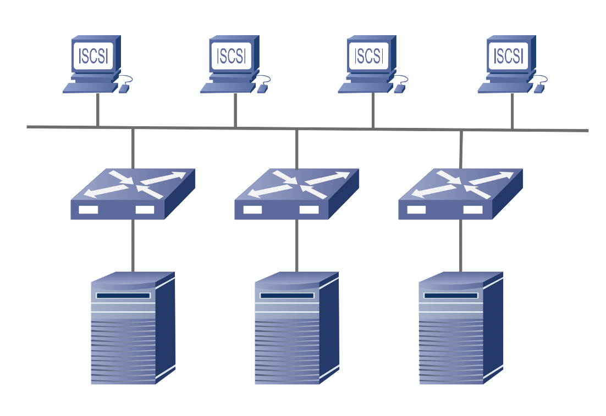

2. **典型案例**：

- 国外商业产品：IBM GPFS，EMC ISILON，Panasas PanFS
- 国外开源系统：Intel Lustre，Redhat GFS，Gluster Glusterfs Clemon PVFS，Sage Weil/Inktank Ceph，Apache HDFS
- 国内产品：中科蓝鲸 BWFS，龙存 Loongstore，余庆 FastDFS，淘宝 TFS

#### 性能评价方法 

评价文件系统的方法（指标）有：**带宽**、**IOPS**

用到的测试工具有：Linux dd，Iozone，Iometer，Mdtest，IOR

### 并行文件系统

|   名称   |         所属企业          |         版权状态         |
| :------: | :-----------------------: | :----------------------: |
|   PVFS   |       Clemson 大学        |           开源           |
|  Lustre  | Cluster File Systems Inc. |           开源           |
|   GPFS   |            IBM            |           开源           |
| ParaStor |           曙光            |         商业软件         |
|   GFS    |          Red Hat          |         商业软件         |
|   PFS    |           Intel           |         商业软件         |
| GoogleFS |          Google           |         商业软件         |
|   HDFS   |          Apache           | 开源（基于 java 的支持） |
| FastDFS  |         开源社区          |    主要用于互联网应用    |

#### PVFS

PVFS：Clemson 大学的并行虚拟文件系统（PVFS）项目用来为运行 Linux 操作系统的 PC 群集创建一个开放源码的并行文件系统。PVFS 已被广泛地用作临时存储的高性能的大型文件系统和并行 I/O 研究的基础架构。作为一个并行文件系统，PVFS 将数据存储到多个群集节点的已有的文件系统中，多个客户端可以同时访问这些数据。

PVFS 使用了三种类型的节点：

- **管理节点**（mgr）：运行元数据服务器，处理所有的文件元数据（元数据是描述文件信息的文件）；
- **I/O 节点**（iod）：运行 I/O 服务器，存储文件系统的文件数据，负责数据的存储和检索；
- **计算节点**：处理应用访问，利用 libpvfs 这一客户端的 I/O 库，从底层访问 PVFS 服务器。I/O 节点、计算节点是一个集群的节点可以提供其中一种功能，也可以同时提供其中的两种或全部三种功能。

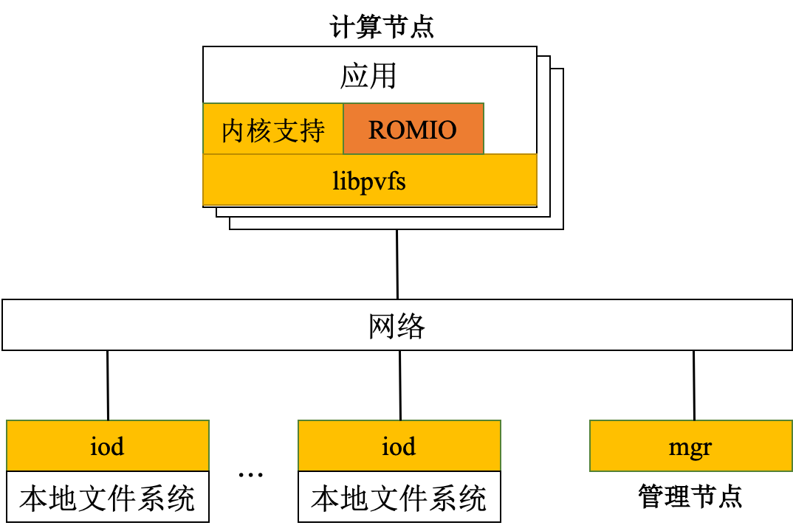

**PVFS 的运行机理**：当打开、关闭、创建或删除一个文件时，计算节点上的一个应用通过 libpvfs 直接与元数据服务器通信。在管理节点定位到一个文件之后，它向这个应用返回文件的位置，然后使用 libpvfs 直接联系相应的 I/O 节点进行读写操作，不必与元数据服务器通信，从而大大提高了访问效率。

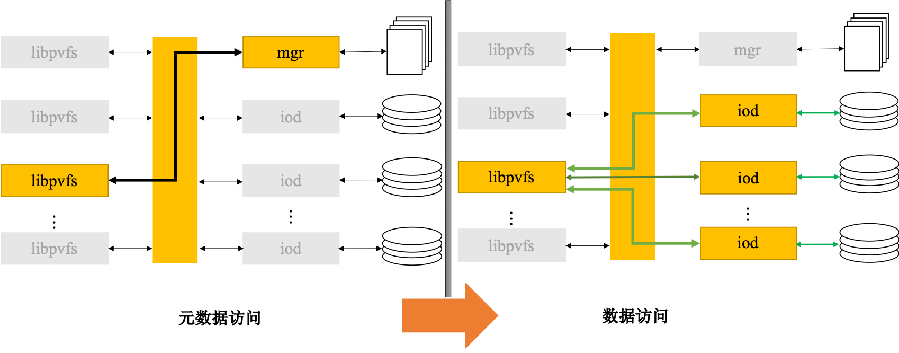

PVFS 存在的问题也十分显著：

1. 集中的元数据管理成为整个系统的瓶颈，可扩展性受到一定限制。
2. 系统容错率有待提高：数据没有采取相应的容错机制，并且没有文件锁，其可扩展性较差，应用规模很大时容易导致服务器崩溃。
3. 系统可扩展性有待加强:PVFS 使用静态配置，不具备动态扩展性，如果要扩展一个 I/O 节点，系统必须停止服务，并且不能做到空间的合理利用。
4. PVFS 目前还不是由商业公司最终产品话的商品，而是基于 GPL 开放授权的一种开放技术。虽然免费获取该技术使整体系统成本进一步降低，但由于没有商业公司作为发布方，该技术的后续升级维护等一系列服务，都难以得到保证。

#### Lustre

**Lustre**，一种并行分布式文件系统，通常用于**大型计算机集群**和**超级电脑**。Lustre 是源自 Linux 和 Cluster 的混成词。最早在 1999 年，由皮特·布拉姆（Peter Braam）创建的集群文件系统公司（Cluster File Systems Inc.）开始研发，于 2003 年发布 Lustre 1.0。采用 GNU GPLv2 开源码授权。

Lustre 特点有：（1）运行在 linux 环境下，linux 应用广泛；（2）硬件平台无关性；（3）支持任何块设备存储设备；（4）成本低，不一定要运行在 SAN 上，没有 licence；（5）开源，社区支持良好，intel 企业服务；（6）统一的命名空间；（7）在线容量扩展；（8）灵活的数据分布管理；（9）支持在线的滚动升级；（10）支持 ACL；（11）分布式的配额。

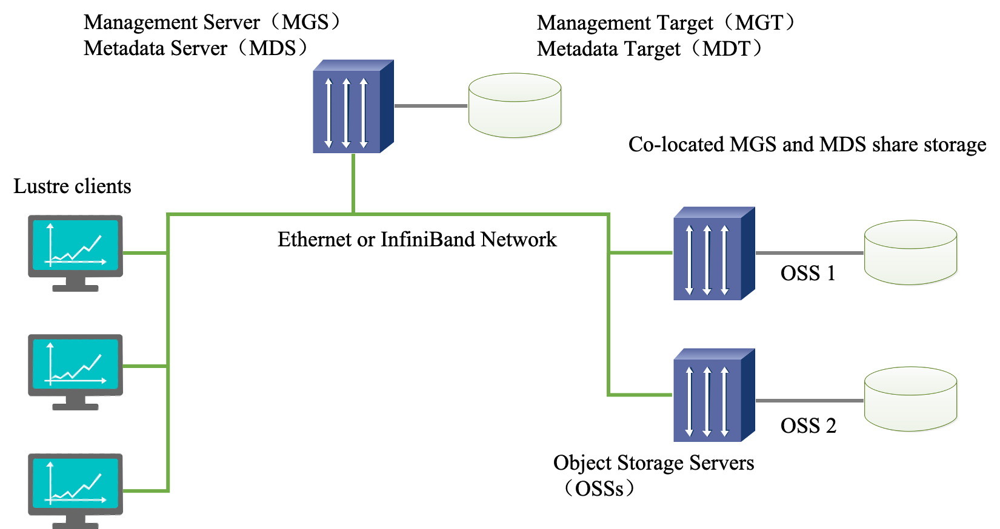

Lustre 组成包含八个部分：（1）数据和元数据；（2）对象文件系统；（3）MDS（Metadata Server）；（4）OSS（Object Storage Servers）；（5）Clients；（6）MGS（Management Server）；（7） Lustre 支持的本地文件系统；（8）Lustre支持的网络。

其中，**元数据**指的是关于数据的数据，例如数据的大小，数据的权限，属性等等。对象存储文件系统的核心是将数据和元数据分离，并且基于**对象存储设备** （Object-based Storage Device，OSD） 构建存储系统，每个对象存储设备具有一定的智能，能够自动管理其上的数据分布。MDS 提供元数据服务，连接 **MDT** （Metadata Targets）；OSS 提供数据服务连接 **OST**（Object Storage Targets）。Clients 挂在并使用文件系统，计算节点。MGS 提供配置信息服务连接到 **MGT**（Management Targets）。 Lustre 支持的本地文件系统，例如：ldiskfs，Zfs。Lustre 支持的网络为：IB，IP（千兆、万兆）。

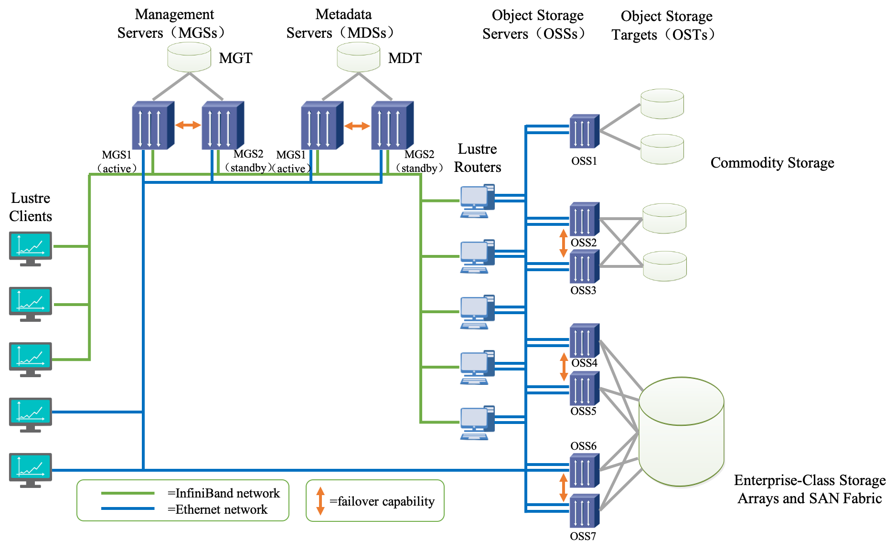

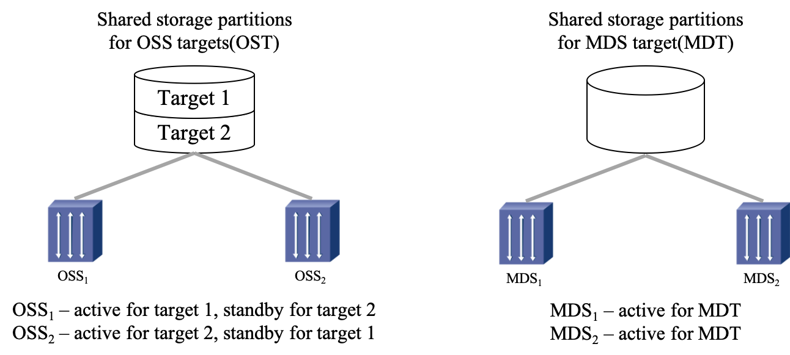

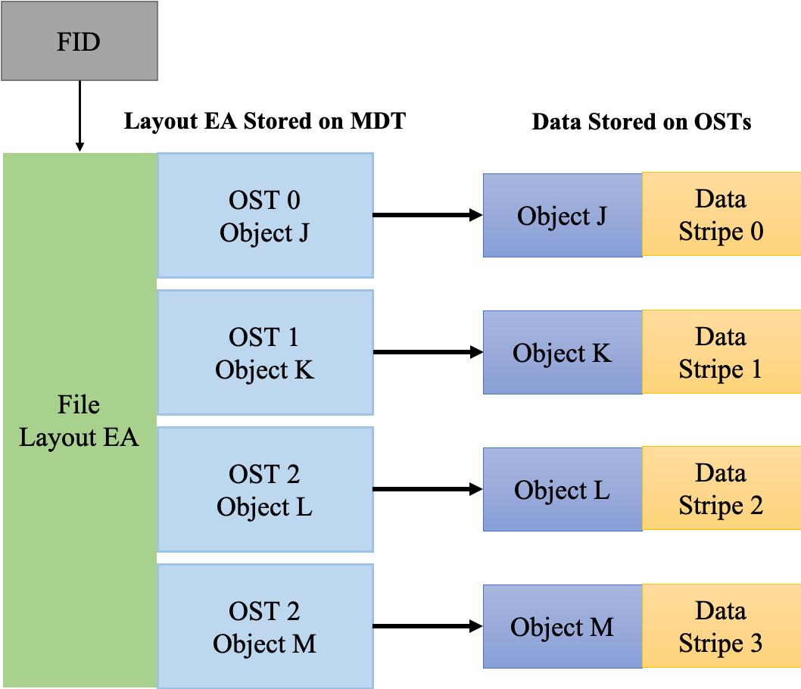

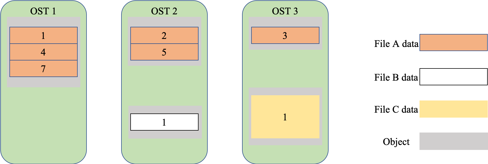

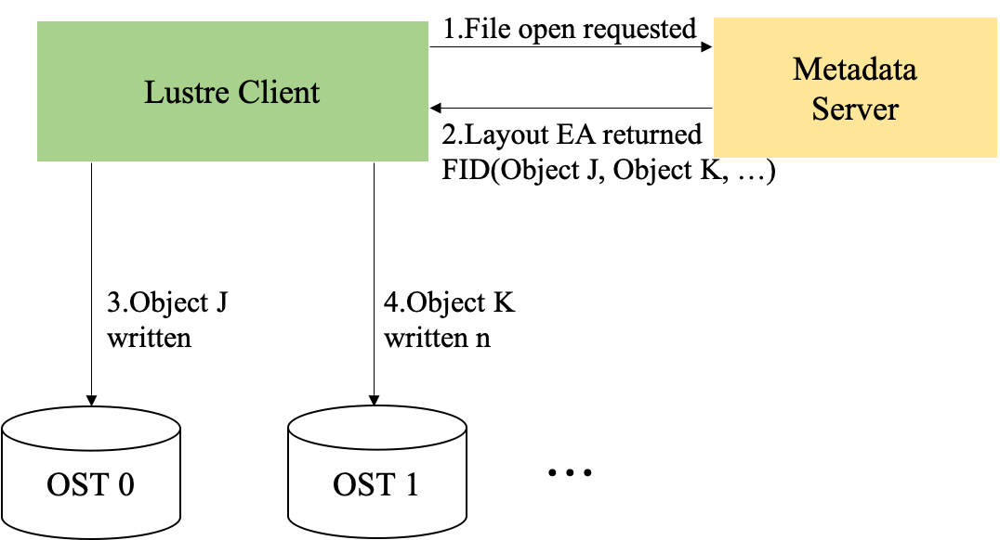