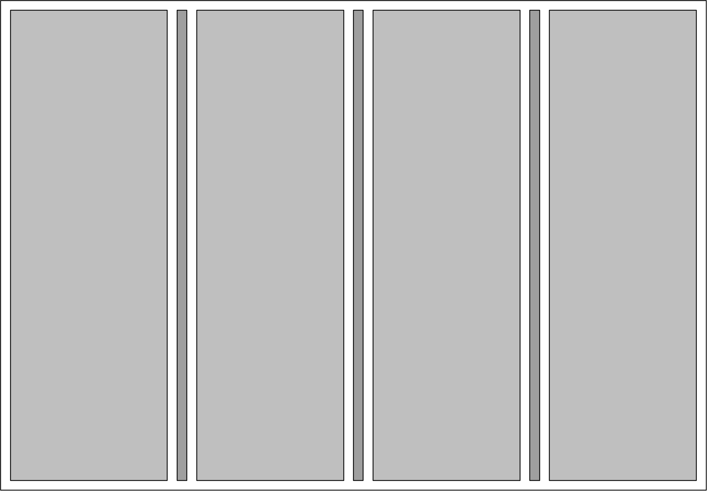
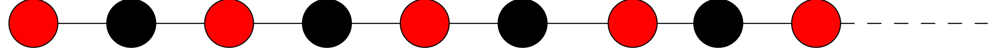
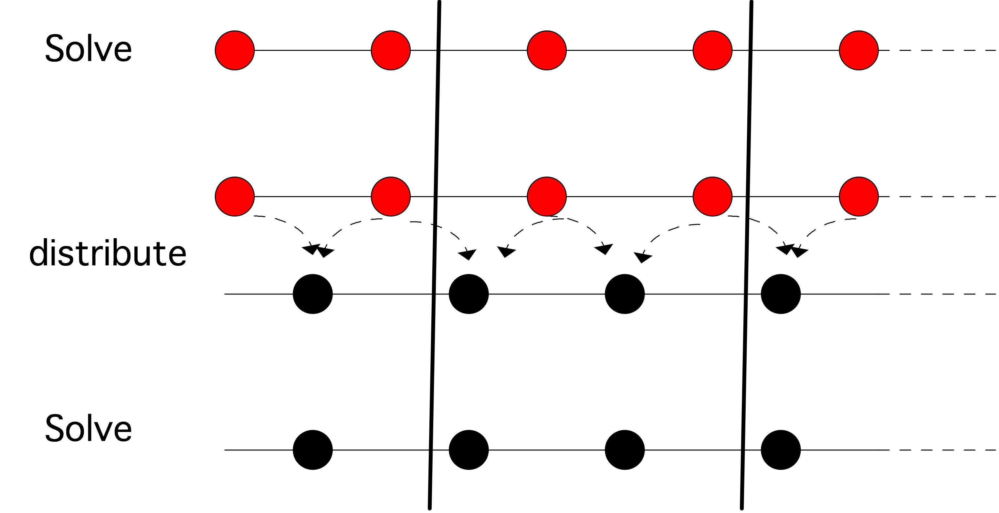
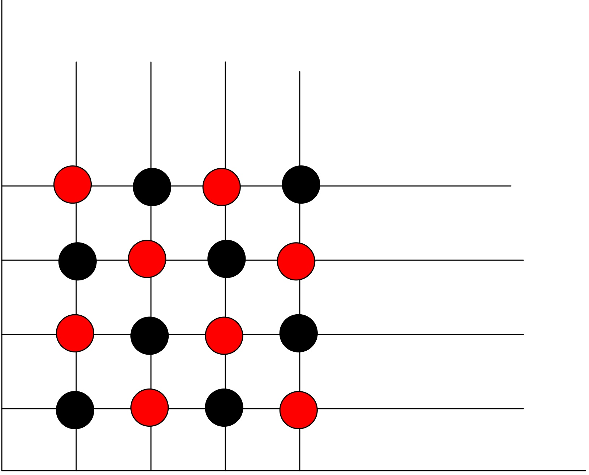
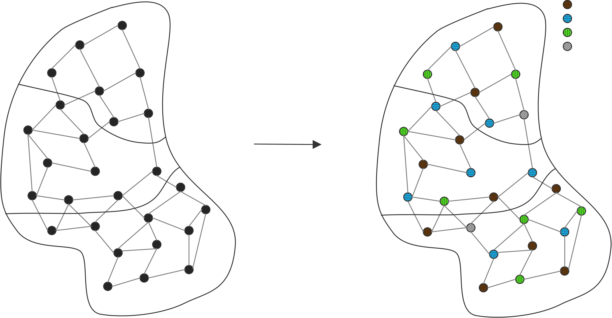

#  高性能线性代数(二)

## 并行预处理程序

上面（第5.5.6节，特别是5.5.6.1节）我们看到了$K$的几种不同选择。在本节中，我们将开始讨论并行化策略。讨论将在接下来的章节中继续详细进行。

### 雅克比预处理

雅可比方法（5.5.3节）使用𝐴的对角线作为预处理。应用这个方法是尽可能的平行：声明$y\leftarrow K^{-1}x$独立地缩放输入向量的每个元素。不幸的是，使用雅可比预处理器对迭代次数的改进是相当有限的。因此，我们需要考虑更复杂的方法，如ILU。与雅可比预处理程序不同的是，并行化并不简单。

### 与ILU并行的麻烦

上面我们看到，从计算的角度来看，应用ILU预处理（第5.5.6.1节）与做矩阵-向量乘积一样昂贵。如果我们在并行计算机上运行我们的迭代方法，这就不再是真的了。

乍一看，这些操作很相似。矩阵-向量乘积$y=Ax$看起来像

```c
for i=1..n
     y[i] = sum over j=1..n a[i,j]*x[j]
```

并行时，这看起来像

```c
for i=myfirstrow..mylastrow
     y[i] = sum over j=1..n a[i,j]*x[j]
```

假设一个处理器拥有它所需要的𝐴和𝑥的所有元素的本地副本，那么这个操作就是完全并行的：每个处理器都可以立即开始工作，如果工作负荷大致相等，它们都会在同一时间完成。然后，矩阵-向量乘积的总时间除以处理器的数量，使速度或多或少得到了提高。

现在考虑正向解$Lx=y$，例如在ILU预处理程序的背景下。

```c
for i=1..n
     x[i] = (y[i] - sum over j=1..i-1 ell[i,j]*x[j]) / a[i,i]
```

我们可以简单地编写并行代码。

```c
for i=myfirstrow..mylastrow
     x[i] = (y[i] - sum over j=1..i-1 ell[i,j]*x[j]) / a[i,i]
```

但现在出现了一个问题。我们不能再说 "假设一个处理器拥有右手边所有东西的本地拷贝"，因为向量𝑥同时出现在左手边和右手边。虽然矩阵-向量乘积原则上在矩阵行上是完全并行的，但这个三角解代码是递归的，因此是顺序的。

在并行计算的背景下，这意味着，第二个处理器要启动，需要等待第一个处理器计算的𝑥的某些组件。显然，在第一个处理器完成之前，第二个处理器不能启动，第三个处理器必须等待第二个处理器，以此类推。令人失望的结论是，在并行中，任何时候都只有一个处理器处于活动状态，总时间与顺序算法相同。在密集矩阵的情况下，这实际上不是一个大问题，因为在处理单行的操作中可以找到并行性（见第6.12节），但是在稀疏的情况下，这意味着我们不能使用不完整的因式分解，而需要重新设计。

在接下来的几个小节中，我们将看到不同的策略来寻找能有效地并行执行的前置条件器。

### 块状雅可比方法

人们提出了各种方法来弥补三角形解法的顺序性。例如，我们可以简单地让处理器忽略那些应该来自其他处理器的𝑥的成分。

```c
for i=myfirstrow..mylastrow
     x[i] = (y[i] - sum over j=myfirstrow..i-1 ell[i,j]*x[j])
              / a[i,i]
```

这在数学上并不等同于顺序算法（从技术上讲，它被称为以ILU为局部解的块状雅可比方法），但由于我们只是在寻找一个近似值$K\approx A$，这只是一个稍微粗糙的近似。

**练习 6.24** 以你上面写的高斯-赛德尔代码为例，模拟一次并行运行。增加（模拟的）处理器数量的效果如何？


块方法背后的想法可以通过图片来理解，见图6.15。实际上，我们通过忽略处理器之间的所有连接，得到了一个ILU的矩阵。由于在BVP中，所有的点都是相互影响的（见第4.2.1节），如果在顺序计算机上执行，使用连接较少的预调节器将增加迭代的次数。然而，块状方法是并行的，正如我们上面所观察到的，顺序预处理器在并行情况下效率很低，所以我们容忍了这种迭代次数的增加。

### 并行ILU

块状雅可比预处理通过解耦领域部分进行操作。虽然这可能会产生一种高度并行的方法，但它可能会比真正的ILU预处理程序产生更多的迭代次数。(可以从理论上论证这种解耦降低了迭代方法的效率；见第4.2.1节）。幸运的是，有可能出现一个并行的ILU方法。由于我们需要即将到来的关于变量重新排序的材料，我们把这个讨论推迟到6.8.2.3节。

## 排序策略和并行性

在前文中，我们已经提到了一个事实，即解决线性方程组本身就是一个递归活动。对于密集系统来说，与递归长度相比，操作的数量足够多，因此寻找并行性是相当直接的。另一方面，稀疏系统则需要更多的复杂性。在这一节中，我们将研究一些重新排列方程的策略（或者说，等同于排列矩阵），这将增加可用的并行性。

这些策略都可以被认为是高斯消除法的变种。通过对它们进行不完全变体（见第5.5.6.1节），所有这些策略也适用于构建迭代求解方法的前置条件。

### 嵌套剖析

上面，你已经看到了几个在域中对变量进行排序的例子，而不是用列举式排序。在本节中，你将看到嵌套剖析排序，它最初被设计为一种减少填充的方法。然而，它在并行计算的背景下也是有利的。


嵌套剖析是一个递归的过程，用于确定在一个工作中的未知数的非线性排序。在第一步中，计算域被分割成两部分，在它们之间有一个分隔带；见图6.16。准确地说，这个分隔带足够宽，以至于左右子域之间没有任何联系。由此产生的矩阵𝐴DD具有3×3的结构，对应于域的三个分界。由于子域Ω和Ω不相连，子矩阵𝐴DD和𝐴DD为零。
$$
A^{\mathrm{DD}}=\left(\begin{array}{ccc}
A_{11} & \varnothing & A_{13} \\
\varnothing & A_{22} & A_{23} \\
A_{31} & A_{32} & A_{33}
\end{array}\right) = \left(\begin{array}{ccccc|ccccc|c}
\star & \star & & & & & & & & &0 \\
\star & \star & \star & & & & & & & & \vdots \\
& \ddots & \ddots & \ddots & & & & \varnothing & & & \vdots \\
& & \star & \star & \star & & & & & & 0 \\
& & & \star & \star & & & & & & \star \\
\hline & & & & & \star & \star & & & & 0 \\
& & & & & \star & \star & \star & & & \vdots \\
& & \varnothing & & & & \ddots & \ddots & \ddots & & \vdots \\
& & & & & & & \star & \star & \star & 0 \\
& & & & & & & & \star & \star & \star \\
\hline 0 & \cdots & \cdots & 0 & \star & 0 & \cdots & \cdots & 0 & \star & \star
\end{array}\right)\left(n^{2}-n\right) / 2
$$
这种用分离器划分域的过程也被称为域分解或子结构，尽管这个名字也与所产生的矩阵的数学分析有关[14]。在这个矩形域的例子中，找到一个分隔符当然是微不足道的。然而，对于我们从BVP中得到的方程类型，通常可以有效地找到任何域的分离器[146]；另见18.6.2节。

现在让我们考虑这个矩阵的𝐿𝑈因式分解。如果我们用3×3块状结构来分解它，我们可以得到
$$
A^{\mathrm{DD}}=L U=\left(\begin{array}{ccc}
I & & \\
\varnothing & I & \\
A_{31} A_{11}^{-1} & A_{32} A_{22}^{-1} & I
\end{array}\right)\left(\begin{array}{ccc}
A_{11} & \varnothing & A_{13} \\
& A_{22} & A_{23} \\
& & S_{33}
\end{array}\right)
$$
其中
$$
S_{33}=A_{33}-A_{31} A_{11}^{-1} A_{13}-A_{32} A_{22}^{-1} A_{23}
$$
这里的重要事实是

- 贡献$A_{31}A^{-1}_{11}A_{13}$和$A_{32}A_{22}^{-1}A_{23}$可以同时计算，所以因式分解在很大程度上是并行的；并且
- 在前向和后向求解中，解的第1和第2部分都可以同时计算，所以求解过程也基本上是并行的。第三块不能以并行方式处理，所以这在算法中引入了一个顺序的部分。算法。我们还需要仔细研究一下$S_{33}$的结构。

**练习 6.25** 在第5.4.3.1节中，你看到了LU因子化和图论之间的联系：消除一个节点会导致图中的该节点被删除，但会增加某些新的连接。证明在消除前两组变量后，分离器上剩余矩阵的图将是完全连接的。结果是，在消除了第1和第2块中的所有变量后，我们剩下的矩阵$S_{33}$是完全密集的，大小为$n\times n$。

引入分离器后，我们得到了一个双向平行的因式分解。现在我们重复这个过程：我们在第 1 和第 2 块内放置一个分隔符（见图 6.17），这样就得到了以下矩阵结构。
$$
A^{\mathrm{DD}}=\left(\begin{array}{llll|ll|l}
A_{11} & & & &  A_{15} & & A_{17} \\
& A_{22} & & & A_{25} & & A_{27} \\
& & A_{33} & & & A_{36} & A_{37} \\
& & & A_{44} & & A_{46} & A_{47} \\
\hline A_{51} & A_{52} & & & A_{55} & & A_{57} \\
& & A_{63} & A_{64} & & A_{66} & A_{67} \\
\hline A_{71} & A_{72} & A_{73} & A_{74} & A_{75} & A_{76} & A_{77}
\end{array}\right)
$$
(注意与第5.4.3.4节中的 "箭头 "矩阵的相似性，并回顾一下这导致较低填充的论点）。这个的LU因子化是。


$$
\left(\begin{array}{cccc|cc|cc}
I & & & & & & & \\
& I & & & & & \\
& & I & & & & \\
& & & I & & & \\
\hline A_{51} A_{11}^{-1} & A_{52} A_{22}^{-1} & & & I & & \\
 & & A_{63}A_{33}^{-1} & A_{64}A_{44}^{-1} &  & I\\
\hline A_{71} A_{11}^{-1} & A_{72} A_{22}^{-1} & A_{73} A_{33}^{-1} & A_{74} A_{44}^{-1} & A_{75} S_{5}^{-1} & A_{76} S_{6}^{-1} & I
\end{array}\right) .
$$

$$
\left(\begin{array}{cccc|cc|c}
A_{11} & & & & A_{15} & & A_{17} \\
& A_{22} & & & A_{25} & & A_{27} \\
&  &A_{33} & & & A_{36} & A_{37} \\
& &  &A_{44} & & A_{46} & A_{47} \\
\hline & & & & S_{5}& & A_{57} \\
& & & & & S_{6} & A_{67} \\
\hline & & & & &  & S_{7}
\end{array}\right)
$$

其中
$$
\begin{array}{l}
S_{5}=A_{55}-A_{51} A_{11}^{-1} A_{15}-A_{52} A_{22}^{-1} A_{25}, \quad S_{6}=A_{66}-A_{63} A_{33}^{-1} A_{36}-A_{64} A_{44}^{-1} A_{46} \\
S_{7}=A_{77}-\sum_{i=1,2,3,4} A_{7 i} A_{i i}^{-1} A_{i 7}-\sum_{i=5,6} A_{7 i} S_{i}^{-1} A_{17}
\end{array}
$$
现在构建因式分解的过程如下。

- 对于$i=1,2,3,4$，块$A_{ii}$被并行因式化；同样，对于$i=1,2,3,4$，$A_{5i}A_{ii}^{-1}A_{i5}$，对于$𝑖=3,4$，$A_{6i}A_{ii}^{-1}A_{i6}$，$i=1,2,3,4$，$A_{7i}A_{ii}^{-1}A_{i7}$可以被并行构建。
- 形成舒尔补码$S_5, S_6$，并随后进行并行派生，对$i = 5, 6$的贡献 $A_{7i}S_i^{-1}A_{17}$ 也是并行构建。
- 舒尔补码$S_7$被形成并被分解。

与上述推理类似，我们得出结论：在消除了第1,2,3,4块后，更新的矩阵$S_5$, $S_6$是大小为$n/2$的密集，在消除了第5,6块后，舒尔补码$S_7$是大小为$n$的密集。

**练习 6.26** 证明用𝐴DD求解一个系统与构建上述因式分解有类似的并行性。

为了便于以后参考，我们将把集合1和2称为彼此的兄弟姐妹，同样，3和4也称为兄弟姐妹。集合5是1和2的父，6是3和4的父；5和6是兄弟姐妹，7是5和6的父。

 #### 域的分解

在图6.17中，我们通过一个递归过程将领域分成四种方式。这就引出了我们对嵌套剖分的讨论。也可以立即将一个域分割成任意数量的条状，或者分割成子域的网格。只要分离器足够宽，这将给出一个具有许多独立子域的矩阵结构。在上面的讨论中，LU因子化的特点是

- 在因式分解和𝐿, 𝑈求解中，对子域进行并行处理，并且 
- 要在分离器结构上求解的系统。



**练习 6.27** 二维BVP的矩阵有一个块状三对角结构。将该域分为四条，即使用三个分离器（见图6.18）。注意这些分离器在原始矩阵中是不耦合的。现在勾勒出所得到的系统的稀疏性结构，即分离器是消除子域的。说明该系统是块状三对角的。

在我们到目前为止讨论的所有领域分割方案中，我们使用的领域都是矩形的，或者说是 "砖 "形的，在两个维度以上。所有这些论点都适用于二维或三维的更一般的域，但是像寻找分离器这样的事情变得更加困难[145]，而这对于平行情况来说更是如此。参见第18.6.2节对这个话题的一些介绍。

#### 复杂度

嵌套剖析法重复上述过程，直到子域变得非常小。对于理论分析来说，我们一直在分割，直到我们有大小为1×1的子域，但在实践中，我们可以停止在32这样的大小，并使用一个有效的密集求解器来分解和反转块。

为了推导出算法的复杂度，我们再看一下图6.17，可以看到复杂度论证，一个完整的递归嵌套分解所需要的总空间是以下的总和

- 在一个大小为$n$的分离器上的一个密集矩阵，加上
- 大小为$n/2$的分离器上的两个密集矩阵之和。
- 需要$3/2n^2$的空间和$5/12n^3$的时间。
- 上述两项在四个大小为$(n/2)\times (n/2)$的子域上重复。

观察到$n=\sqrt{N}$，这就意味着
$$
\begin{aligned}
\text { space } &=3 / 2 n^{2}+4 \cdot 3 / 2(n / 2)^{2}+\cdots \\
&=N(3 / 2+3 / 2+\cdots) \quad \log n \text { terms } \\
&=O(N \log N)
\end{aligned}
$$

$$
\begin{aligned}
\text { space } &=3 / 2 n^{2}+4 \cdot 3 / 2(n / 2)^{2}+\cdots \\
&=N(3 / 2+3 / 2+\cdots) \quad \log n \text { terms } \\
&=O(N \log N)
\end{aligned}
$$

显然，我们现在的因式分解在很大程度上是平行的，而且是在$O(N \log N)$空间中完成的，而不是在$O(N^{3/2})$(见5.4.3.3节)。因式分解时间也从$O(N^2)$下降到$O(N^{3/2})$。

不幸的是，这种空间节省只发生在二维空间：在三维空间中，我们需要

- 一个$n$大小的分离器，占用$(n\times n)^2 =N^{4/3}$空间和$1/3\cdot(n\times n)^3=1/3\cdot N^2$时间。
- 两个大小为$n\times n/2$的分离器，占用$N^{3/2}/2$空间和$1/3\cdot N^2/4$时间。
- 四个大小为$n/2 \times n/2$ 的分离器，需要$N^{ 3/2}/4$ 的空间和 $1/3\cdot N^{2}/16$的时间。
- 加起来就是$7/4N^{3/2}$空间和$21/16N^2/3$时间。
- 在下一级，有8个子域贡献这些条款，$n\rightarrow n/2$，因此$N\rightarrow N/8$。

这使得总空间
$$
\frac{7}{4}N^{3/2}(1+(1/8)^{4/3}+...)=O(N^{3/2})
$$
以及总的时间
$$
\frac{21}{16}N^2(1+1/16+...)/3=O(N^2)
$$
我们不再有二维情况下的巨大节省。一个更复杂的分析表明，对于二维的一般问题，阶次的改进是成立的，而三维一般有更高的复杂度[145]。

#### 并行性

嵌套剖析法显然引入了大量的并行性，我们可以将其描述为任务并行性（第2.5.3节）：与每个分离器相关的是对其矩阵进行因式分解的任务，随后是对其变量进行线性系统求解的任务。然而，这些任务并不是独立的：在图6.17中，域7上的因式分解必须等待5和6，而且它们必须等待1,2,3,4。因此，我们的任务以树的形式存在依赖关系：每个分离器矩阵只有在其子矩阵被因子化后才能被因子化。

将这些任务映射到处理器上并非易事。首先，如果我们处理的是共享内存，我们可以使用一个简单的任务队列。

```c
Queue ← {}
for all bottom level subdomains 𝑑 do
  add 𝑑 to the Queue 
while Queue is not empty do 
  if a processor is idle then
     assign a queued task to it
  if a task is finished AND its sibling is finished then 
      add its parent to the queue
```

这里的主要问题是，在某些时候，我们的处理器会多于任务，从而导致负载不平衡。这个问题由于最后的任务也是最重要的，而变得更加严重，因为分离器的大小从一层到另一层是双倍的。(回顾一下，密集矩阵的因式分解工作随着大小的三次方而增加！) 因此，对于较大的分离器，我们必须从任务并行转为中粒度并行，即处理器合作对一个块进行因子化。

有了分布式内存，我们现在可以用一个简单的任务队列来解决并行问题，因为这将涉及移动大量的数据。(但请记住，工作是矩阵大小的高次方，这一次对我们有利，使通信相对便宜)。那么解决方案就是使用某种形式的域分解。在图6.17中，我们可以有四个处理器，与块1、2、3、4相关联。然后，处理器1和2将协商哪一个因素是第5块（类似地，处理器3和4和第6块），或者它们都可以冗余地做这个。

#### 预处理

与所有的因式分解一样，通过使因式分解不完整，可以将嵌套剖分法变成一个预处理程序。(关于不完全因式分解的基本思想，见5.5.6.1节）。然而，这里的因式分解完全是用块矩阵来表述的，除以枢轴元素就变成了一个反转或与枢轴块矩阵的系统解。我们将不进一步讨论这个问题，详情见文献[6, 57, 157]。



### 变量的重新排序和着色：独立集

在稀疏矩阵中可以通过使用图形着色（第18.3节）实现并行化。由于 "颜色 "被定义为只与其他颜色相连的点，根据定义它们是相互独立的，因此可以被并行处理。这导致我们采取了以下策略。

1. 将问题的邻接图分解成少量独立的集合，称为 "颜色"。
2. 用与颜色数量相等的顺序步骤来解决这个问题；在每个步骤中，都会有大量的可独立处理的点。

#### 红黑相间的颜色

我们从一个简单的例子开始，我们考虑一个三对角矩阵$A$。方程$Ax=b$看起来像
$$
\left(\begin{array}{cccccc}
a_{11} & a_{12} & & & & \varnothing \\
a_{21} & a_{22} & a_{23} & & & \\
& a_{32} & a_{33} & a_{34} & & \\
\varnothing & & \ddots & \ddots & \ddots &
\end{array}\right)\left(\begin{array}{c}
x_{1} \\
x_{2} \\
x_{3} \\
\vdots
\end{array}\right)=\left(\begin{array}{c}
y_{1} \\
y_{2} \\
y_{3} \\
\vdots
\end{array}\right)
$$
我们观察到，$x_i$直接取决于$x_{i-1}$和$x_{i+1}$，但不取决于$x_{i-2}$或$x_{i+1}$。因此，让我们看看，如果我们把指数排列起来，把每一个其他的组成部分放在一起会发生什么。

图形上，我们把$1, ... n$，并将它们涂成红色和黑色（图 6.19），然后我们将它们进行置换，先取所有红色的点，然后取所有黑色的点。相应地，经过置换的矩阵看起来如下。
$$
\left(\begin{array}{ccccccc}
a_{11} & & & & a_{12} & & \\
& a_{33} & & & a_{32} & a_{34} & \\
& & a_{55} & & & \ddots & \ddots \\
a_{21} & a_{23} & & & a_{22} & & \\
& a_{43} & a_{45} & & & a_{44} & \\
& & \ddots & \ddots & & & \ddots
\end{array}\right)\left(\begin{array}{c}
x_{1} \\
x_{3} \\
x_{5} \\
\vdots \\
x_{2} \\
x_{4} \\
\vdots
\end{array}\right)=\left(\begin{array}{c}
y_{1} \\
y_{3} \\
y_{5} \\
\vdots \\
y_{2} \\
y_{4} \\
\vdots
\end{array}\right)
$$
有了这个经过处理的$A$，高斯-塞德尔矩阵$D_A + L_A$看起来像是
$$
\left(\begin{array}{ccccccc}
a_{11} & & & & \varnothing & & \\
& a_{33} & & & & & \\
& & a_{55} & & & & \\
& & & \ddots & & & \\
a_{21} & a_{23} & & & a_{22} & & \\
& a_{43} & a_{45} & & & a_{44} & \\
& & \ddots & \ddots & & & \ddots
\end{array}\right)
$$
这能给我们带来什么？好吧，让我们拼出一个系统的解决方案$Lx=y$。
$$
\text{for } i=1,3,5, \ldots,  do\\
\quad \text{solve } x_{i} \leftarrow y_{i} / a_{i i}\\
\quad \quad \quad \quad \text{for } i=2,4,6, \ldots do\\
\quad \quad \quad \quad  \quad \quad \quad \quad  \quad \quad \quad \quad \text{compute } t=a_{i i-1} x_{i-1}+a_{i i+1} x_{i+1}\\
\quad \quad \quad \quad  \quad \quad \quad \ \text{solve} x_{i} \leftarrow\left(y_{i}-t\right) / a_{i i}
$$
显然，该算法有三个阶段，每个阶段在一半的域点上是平行的。这在图6.20中得到了说明。理论上，我们可以容纳的处理器数量是域点数量的一半，但实际上每个处理器都会有一个子域。现在你可以在图6.21中看到这如何导致一个非常适度的通信量：每个处理器最多发送两个红点的数据给它的邻居。




**练习 6.28** 论证这里的邻接图是一个二边形图。我们看到，这样的图（以及一般的彩色图）与并行性有关。你还能指出非并行处理器的性能优势吗？

红黑排序也可以应用于二维问题。让我们对点$（i, j）$应用红黑排序，其中$1\leqslant i, j\leqslant n$。在这里，我们首先对第一行的奇数点（1，1），（3，1），（5，1），......，然后对第二行的偶数点（2，2），（4，2），（6，2），......，第三行的奇数点进行连续编号，依此类推。这样对域中一半的点进行编号后，我们继续对第一行的偶数点、第二行的奇数点进行编号，依此类推。正如你在图6.22中看到的，现在红色的点只与黑色的点相连，反之亦然。用图论的术语来说，你已经找到了一个有两种颜色的矩阵图的着色（这个概念的定义见附录18）。



**练习 6.29** 对二维BVP（4.12）应用红黑排序。画出所产生的矩阵结构。

红黑排序是图形着色（有时称为多重着色）的一个简单例子。在简单的情况下，如我们在第4.2.3节中考虑的单位正方形域或其扩展到三维，邻接图的色数很容易确定；在不太规则的情况下，则比较困难。

练习6.30。你看到了未知数的红黑排序加上有规律的五点星形模版给出了两个变量子集，它们之间没有联系，也就是说，它们形成了矩阵图的双着色。如果节点由图4.3中的第二个模版连接，你能找到一个着色吗？

#### 一般性着色

对于稀疏矩阵的图形所需的颜色数量有一个简单的约束：颜色的数量最多为$d+1$，其中$d$是图形的度数。为了说明我们可以用$d+1$种颜色来给学位为$d$的图形着色，考虑一个学位为$d$的节点。无论它的邻居是如何着色的，在$d+1$种可用的颜色中总有一种未使用的颜色。

**练习 6.31** 考虑一个稀疏矩阵，该图可以用$d$种颜色来着色。首先列举第一种颜色的未知数，然后列举第二种颜色的未知数，依此类推，对矩阵进行排列。你能说说所产生的排列矩阵的稀疏性模式是什么？



如果你在寻找线性系统的直接解，你可以在消除一种颜色后剩下的矩阵上重复着色和置换的过程。在三对角矩阵的情况下，你看到这个剩余的矩阵又是三对角的，所以很清楚如何继续这个过程。这就是所谓的递归翻倍法。如果矩阵不是三对角的，而是块状三对角的，这个操作可以在块上进行。

#### 多色并行ILU

在第6.8.2节中，你看到了图形着色和包络的结合。让$P$是将相似颜色的变量组合在一起的置换，那么$\tilde{A}=P^tAP$是一个具有如下结构的矩阵。

- $\tilde{A}$具有块状结构，其块数与$A$的头顶相接图中的颜色数相等；并且
- 每个对角线块是一个对角线矩阵。

现在，如果你正在进行迭代系统求解，并且你正在寻找一个并行的预处理程序，你可以使用这个对角的矩阵。考虑到用包络系统来解决$Ly=x$。我们将通常的算法（第5.3.5节）写为
$$
\text{for } c \text{ in the set of colors:}\\
\quad \quad \quad \quad \quad \text{for } i \text{ in the variables of color } c: \\
y_{i} \leftarrow x_{i}-\sum_{j<i} \ell_{i j} y_{j}
$$
**练习 6.32** 证明当从自然排序的ILU因式分解到颜色稀释排序的ILU因式分解时，解决系统$LUx=y$的翻转数保持不变（最高阶项）。

这些着色对我们有什么好处？求解仍然是顺序的......嗯，的确，颜色的外循环是顺序的，但是一种颜色的所有点都是相互独立的，所以它们可以在同一时间被求解。因此，如果我们使用普通的域划分，并结合多色彩（见图6.23），处理器在所有的色彩阶段都是活跃的；见图6.24。好吧，如果你仔细看一下这个图，你会发现在最后一个颜色中，有一个处理器没有活动。在每个处理器有大量节点的情况下，这不太可能发生，但可能有一些负载不平衡。


剩下的一个问题是如何并行地生成多色。寻找最佳颜色数是NP-hard。拯救我们的是，我们不一定需要最佳数量，因为我们反正是在做不完全因式分解。(甚至有一种观点认为，使用稍大的颜色数量可以减少迭代的次数）。

[116, 149]发现了一种优雅的并行寻找多色的算法。

1. 给每个变量分配一个随机值。
2. 找到比所有相邻变量的随机值更高的变量；也就是颜色1。
3. 然后找到比所有非1色的邻居有更高随机值的变量。这就是颜色2。
4. 反复进行，直到所有的点都被染上颜色。

### 不规则迭代空间

在显式时间步进的背景下或作为稀疏矩阵-向量乘积，应用计算模版是并行的。然而，在实践中，分割迭代空间可能并非易事。如果迭代空间是直角坐标砖，这很容易，即使是嵌套式的并行。然而，在对称的情况下，要做到均匀的负载分布就比较困难。一个典型的迭代空间看起来像。

```c
for (i=0; i<N; i++)
  for (j=i; j<N; j++)
    for (k=j; k<N; k++)
```

在某些情况下（见[22]），界限可能更加复杂，如`j=i+i%2`或`k<max(i+j,N)`。在这种情况下，可以做以下工作。

1. 循环被遍历，以计算内迭代的总数；这将被分成许多部分，因为有进程。
2. 循环被遍历以找到每个过程的开始和结束的$i$、$j$、$k$值。
3. 然后重写循环代码，使其能够在这样一个$i,jk$子范围内运行。

### 缓存效率的排序

模板操作的性能通常相当低。这些操作没有明显的缓存重用；通常它们类似于流操作，从内存中获取长的数据流并只使用一次。如果只做一次模版评估，那就完了。然而，通常我们会做很多这样的更新，我们可以应用类似于1.7.8节中描述的循环叠加的技术。


如果我们考虑到模版的形状，我们可以做得比普通平铺更好。图6.25显示了（左）我们如何首先计算一个包含缓存的时空梯形。然后（右）我们计算另一个建立在第一个梯形上的包含缓存的梯形[71]。

## 解除PDE线性系统的并行性

PDEs的数值求解是一项重要的活动，所要求的精度往往使其成为并行处理的主要候选者。如果我们想知道我们能做到多大程度的并行，特别是可以达到什么样的速度，我们需要区分问题的各个方面。

首先，我们可以问问题中是否存在任何内在的并行性。在全局层面上，通常不会有这种情况（如果问题的一部分完全不耦合，那么它们将是独立的问题，对吗？）但在较小的层面上，可能存在并行性。

例如，看一下时间相关的问题，参考第4.2.1节，我们可以说每一个下一个时间步骤当然都依赖于上一个时间步骤，但不是下一个时间步骤的每一个单独的点都依赖于上一个步骤的每一个点：有一个影响区域。因此，有可能对问题域进行分区并获得并行性。

### 操作员拆分

在某些情况下，有必要通过一个二维或三维阵列的所有方向进行隐式计算。例如，在第4.3节中，你看到了热方程的隐式解是如何产生重复系统的
$$
\left(\alpha I+\frac{d^{2}}{d x^{2}}+\frac{d^{2}}{d y^{2}}\right) u^{(t+1)}=u^{(t)}
$$
在没有证明的情况下，我们指出，与时间有关的问题也可以通过以下方式解决
$$
\left(\beta I+\frac{d^{2}}{d x^{2}}\right)\left(\beta I+\frac{d^{2}}{d y^{2}}\right) u^{(t+1)}=u^{(t)}
$$
为合适的𝛽。这个方案不会在每个单独的时间步长上计算出相同的值，但它会收敛到相同的稳定状态。该方案也可以作为BVP情况下的一个预处理程序。

这种方法有相当大的优势，主要体现在运算次数上：原始系统的求解要么是对矩阵进行因式分解，产生填充，要么是通过迭代求解。

**练习 6.33** 分析这些方法的相对优点，给出大致的运算次数。考虑$\alpha$对$t$有依赖性和没有依赖性的情况。同时讨论各种操作的预期速度.

当我们考虑(6.3)的并行解时，会出现进一步的优势。注意我们有一个二维的变量集$u$，但是算子$I+d^2u/dx^2$只连接$u_{ij},u_{ij-1},u_{ij+1}$。也就是说，每一行对应的𝑖值都可以被独立处理。因此，这两个算子都可以用一个一维分割域来完全并行地解决。另一方面，(6.2)中系统的求解具有有限的并行性。

不幸的是，有一个严重的问题：$x$方向的算子需要在一个方向上对域进行分割，而𝑦方向的算子则需要在另一个方向上进行分割。通常采取的解决方案是在两个解之间对$u_{ij}$值矩阵进行转置，以便同一处理器的分解可以处理这两个问题。这种转置可能会占用每个时间步骤的大量处理时间。

**练习 6.34.** 讨论使用$P=p\times p$处理器的网格对域进行二维分解的优点和问题。你能提出一个方法来改善这些问题吗？加快这些计算的一个方法是用显式操作代替隐式求解；见6.10.3节。

## 并行性和隐式操作

在关于IBVP的讨论中（第4.1.2.2节），你看到从数值稳定性的角度来看，隐式运算有很大的优势。然而，你也看到，它们使基于简单操作（如矩阵-向量乘积）的方法与基于更复杂的线性系统求解的方法之间的区别。当你开始并行计算时，隐式方法会有更多的问题。

**练习 6.35** 设𝐴为矩阵
$$
A=\left(\begin{array}{cccc}
a_{11} & & \varnothing & \\
a_{21} & a_{22} & & \\
& \ddots & \ddots & \\
\varnothing & & a_{n, n-1} & a_{n n}
\end{array}\right)
$$


证明矩阵向量乘积$y\leftarrow Ax$ 和系统解决方案$x\leftarrow A^{-1}y$ ，通过解决三角系统$Ax=y$，而不是通过反转 $A$ 得到，具有相同的操作数。 现在考虑将乘积$y\leftarrow Ax$ 并行化。假设我们有$n$处理器，每个处理器$i$存储$x$和$A$的第$i$行。证明除了第一个处理器外，任何一个处理器都可以在没有闲置时间的情况下计算出𝐴𝑥的结果。

三角形系统$Ax=y$的解也可以这样做吗？显示出直接的实现方式是每个处理器在计算过程中都有$(n-1)/n$的空闲时间。现在我们将看到一些处理这个固有的顺序部分的方法。

### 波峰

上面，你看到解决一个大小为$N$的下三角系统，其顺序时间复杂度为$N$步。在实践中，事情往往没有那么糟糕。像解三角系统这样的隐式算法本身就是顺序的，但步骤数可能比一开始看到的少。

**练习 6.36** 再看一下单位面积上的二维BVP的矩阵，用中心差分法进行离散。如果我们按对角线排列未知数，请推导出矩阵结构。对于区块的大小和区块本身的结构，你能说什么？

让我们再看一下图4.1，它描述了二维BVP的有限差分模版。图6.26是下三角因子的模版的相应图片。这描述了下三角解过程的顺序性$x\leftarrow L^{-1}y$ 。
$$
x_{k}=y_{k}-\ell_{k, k-1} x_{k-1}-\ell_{k, k-n} x_{k-n}
$$
换句话说，如果点$k$的左边（即变量$k-1$）和下面（变量$k-n$）的邻居是已知的，就可以找到它的值。

下方（变量$k-n$）是已知的。

反过来，我们可以看到，如果我们知道$x_1$，我们不仅可以找到$x_2$，还可以找到$x_{n+1}$。在下一步，我们可以确定$x_3$、$x_{n+2}$和$x_{2n+1}$。继续这样下去，我们可以通过波阵来解决$x$：每个波阵上的$x$的值都是独立的，所以它们可以在同一个顺序步骤中被平行解决。

**练习 6.37** 完成这个论证。我们可以使用的最大处理器数量是多少，顺序步骤的数量是多少？最终的效率是多少？

当然，你不需要使用实际的并行处理来利用这种并行性。相反，你可以使用一个矢量处理器、矢量指令或GPU[148]。

在第5.4.3.5节中，你看到了用于减少矩阵填充的Cuthill-McKee排序。我们可以对这个算法进行如下修改，以得到波阵。

1. 取一个任意的节点，并称其为 "零级"。
2. 对于第$n+1$级，找到与第$n$相连的点，这些点本身并不相连。
3. 对于所谓的 "反向Cuthill-McKee排序"，将层次的编号倒过来。

**练习 6.38** 这个算法并不完全正确。问题出在哪里，你如何纠正？证明所产生的变换矩阵不再是三对角的，但可能仍有一个带状结构。

### 递推式翻倍

递归$y_{i+1}=a_iy_i+b_i$, 例如在解双线性方程组时出现的情况(见练习4.4), 似乎是内在的顺序性。然而，你已经在练习1.4中看到，以一些初步操作为代价，计算是可以并行化的。

首先，从(6.4)中获取一般的双线性矩阵，并将其扩展为规范化的形式。
$$
\left(\begin{array}{cccc}
1 & & \varnothing & \\
b_{21} & 1 & & \\
& \ddots & \ddots & \\
\varnothing & & b_{n, n-1} & 1
\end{array}\right)
$$
我们把它写成$A=I+B$。

**练习 6.39** 说明可以通过与对角线矩阵相乘来实现对归一化形式的缩放。解决系统$(I+B)x=y$对解决$Ax=y$有什么帮助？以两种不同的方式求解该系统的运算量是多少？

现在我们做一些看起来像高斯消除的事情，只是我们不从第一行开始，而是从第二行开始。(如果你对矩阵$I+B$进行高斯消除或LU分解，会发生什么？） 我们用第二行来消除$b_{32}$。
$$
\left(\begin{array}{ccccc}
1 & & & \varnothing & \\
& 1& & \\
 &-b_{32} & 1 & & \\
 & & & \ddots & \\
\varnothing  & & & &1
\end{array}\right) \times\left(\begin{array}{cccc}
1 & & & \varnothing \\
b_{21} & 1 & & \\
& b_{32} & 1 & \\
& & \ddots & \ddots & \\
\varnothing & & & b_{n, n-1} & 1
\end{array}\right)=\left(\begin{array}{cccc}
1 & & & \varnothing\\
b_{21} & 1 & & \\
-b_{32} b_{21} & 0 & 1 & \\
\varnothing & & b_{n, n-1} & 1
\end{array}\right)
$$
我们把它写成$L^{(2)}A=A^{(2)}$。我们还计算了$L^{(2)}y=y^{(2)}$，因此$A^{(2)}x=y^{(2)}$与$Ax=y$有相同的解。解决转换后的系统让我们得到了一点好处：在我们计算了$x_1$之后，$x_2$和$x_3$可以被并行计算。

现在我们重复这个消除过程，用第四行来消除$b_{54}$，第六行来消除$b_{76}$，等等。最后的结果是，总结所有$L(i))$矩阵。
$$
\left(\begin{array}{rrrrrrr}
1 & & & & & &  \\
0 & 1 & & & & &  \\
& -b_{32} & 1 & & & &  \\
& & 0 & 1 & & & & \\
& & & -b_{54} & 1 & &  \\
& & & & 0 &1 & \\
& & & & &  -b_{76} & 1  \\
& & & & & \ddots & \ddots
\end{array}\right) \times(I+B)=\left(\begin{array}{cccccccc}
1 & & & & & & & \varnothing \\
b_{21} & 1 & & & & & & \\
-b_{32} b_{21} & 0 & 1 & & & & & \\
& & b_{43} & 1 & & & & \\
& & -b_{54} b_{43} & 0 & 1 & & & \\
& & & & b_{65} & 1 & & \\
& & & & -b_{76} b_{65} & 0 & 1 & \\
& & & & & \ddots & \ddots & \ddots
\end{array}\right)
$$
我们把它写成$L(I+B)=C$，而解决$(I+B)x=y$现在变成了$C=L^{-1}y$。

这个最终结果需要仔细研究。

- 首先，计算$y=L^{-1}y$很简单。(弄清楚细节，有多少并行性可用？)
- 解决$Cx=y'$仍然是顺序的，但它不再需要$n$步骤：从$x_1$我们可以得到$x_3$，从那里我们得到$x_5$，等等。换句话说，$x$的奇数部分之间只存在顺序关系。
- $x$的偶数部分并不相互依赖，而只依赖奇数部分。$x_2$来自$x_1$，$x_4$来自$x_3$，依此类推。一旦奇数部分被计算出来，这一步就是完全并行的。

我们可以自行描述奇数部分的顺序解法。
$$
\left(\begin{array}{cccc}
1 & & \varnothing & \\
c_{21} & 1 & & \\
& \ddots & \ddots & \\
\varnothing & & c_{n, n-1} & 1
\end{array}\right)\left(\begin{array}{c}
x_{1} \\
x_{3} \\
\vdots \\
x_{n}
\end{array}\right)=\left(\begin{array}{c}
y_{1}^{\prime} \\
y_{3}^{\prime} \\
\vdots \\
y_{n}^{\prime}
\end{array}\right)
$$
其中$c_{i+1i}=-b_{2n+1,2n}b_{2n.2n-1}$。换句话说，我们已经将一个大小为$n$的顺序问题简化为一个大小为同类的顺序问题和一个大小为$n/2$的并行问题。现在我们可以递归地重复这个过程，将原来的问题还原为一连串的并行操作，每一个都是前者的一半大小。

通过递归加倍计算所有部分和的过程也被称为并行前缀操作。这里我们使用前缀和，但在抽象的情况下，它可以应用于任何关联运算符。

### 通过显性操作逼近隐性操作，系列扩展

如上所述，隐式运算在实践中是有问题的，有各种原因允许用另一种实际上更有利的方法来代替隐式运算。

- 只要我们遵守显式方法的步长限制，用显式方法代替隐式方法（第4.3节）同样是合法的。
- 在迭代方法中修补预处理程序（第5.5.8节）是允许的，因为它只会影响收敛速度，而不会影响方法收敛到的解。你已经在块状雅可比方法中看到了这个一般想法的一个例子；6.7.3节。在本节的其余部分，你将看到预处理程序中的递归，即隐式操作，如何被显式操作所取代，从而带来各种计算优势。

求解线性系统是隐式运算的一个很好的例子，由于这归结为求解两个三角形系统，让我们来看看如何找到替代求解下三角系统的计算方法。如果𝑈是上三角且非 Singular，我们让𝐷是𝑈的对角线，我们写成𝑈 = 𝐷(𝐼 - 𝐵) 其中𝐵是一个对角线为零的上三角矩阵，也称为严格上三角矩阵；我们说𝐼 - 𝐵是一个单位上三角矩阵。

**练习 6.40** 设$A=LU$是一个LU分解，其中$L$的对角线上有1。说明如何解决$Ax=b$的问题，只涉及单位上下三角系统的解决。证明在系统求解过程中不需要除法。

我们现在感兴趣的操作是解决系统$(I-B)x=y$。我们观察到
$$
(I-B)^{-1}=I+B+B^{2}+\cdots
$$
和$B^n=0$，其中$n$是矩阵的大小（检查这个！），所以我们可以通过以下方法精确求解$(I-B)x=y$。
$$
x=\sum_{k=0}^{n-1}B^ky
$$
当然，我们希望避免明确计算幂$B^𝑘$，所以我们观察到
$$
\sum_{k=0}^{1} B^{k} y=(I+B) y, \quad \sum_{k=0}^{2} B^{k} y=(I+B(I+B)) y, \quad \sum_{k=0}^{3} B^{k} y=(I+B(I+B((I+B)))) y
$$
诸如此类。由此产生的评估$\sum_{k=0}^{n-1}B^ky$的算法被称为霍纳规则，你看它避免了计算矩阵幂$B^k$。

**练习 6.41** 假设$I - B$是二对角线。证明上述计算需要$n(n+1)$操作。通过三角解法计算$(I-B)x=y$的操作数是多少？

我们现在已经把隐式运算变成了显式运算，但不幸的是，这种运算的次数很高。然而，在实际情况下，我们可以截断矩阵的功率之和。

**练习 6.42** 设$A$为三对角矩阵
$$
A=\left(\begin{array}{ccccc}
2 & -1 & & & \varnothing \\
-1 & 2 & -1 & & \\
& \ddots & \ddots & \ddots & \\
& & & & -1 \\
\varnothing & & & -1 & 2
\end{array}\right)
$$
4.2.2节中的一维BVP。

1. 回顾5.3.4节中对角线支配的定义。这个矩阵是对角线主导的吗？

2. 证明该矩阵的LU因子化中的枢轴（无枢轴）满足递归。提示：说明经过$n$消除步骤（$n\geqslant 0$）后，剩余的矩阵看起来像
   $$
   A^{(n)}=\left(\begin{array}{cccc}
   d_{n} & -1 & & & \varnothing \\
   -1 & 2 & -1 & & \\
   & \ddots & \ddots & \ddots & \\
   \varnothing & & & -1
   \end{array}\right)
   $$
   并说明$d_{n+1}$与$d_n$之间的关系。

3. 证明序列$n\mapsto d_n$是递减的，并推导出其极限值。
4. 写出以$L$和$U$为单位的$d_n$枢轴的系数。
5. $L$和$U$因子是对角线主导的吗？

上述练习意味着（注意，我们实际上并没有证明！），对于来自BVP的矩阵，我们发现$B^k \downarrow 0$，在元素大小和规范方面都是如此。这意味着我们可以用诸如$(I-B)x=y$的方法来近似地计算$(I+B)y$或者$x=(I+B+B^2)y$。这样做仍然比直接三角解法有更多的操作数，但至少在两个方面有计算上的优势。

- 显式算法有更好的流水线行为。
- 正如你所看到的，隐式算法在并行时有问题；显式算法更容易并行化。

当然，这种近似可能对整个数值算法的稳定性有进一步的影响。

**练习 6.43** 描述霍纳法则的并行性方面；方程(6.6)。

## 网格更新

第四章的结论之一是，时间相关问题的显式方法在计算上比隐式方法容易。例如，它们通常涉及矩阵-向量乘积而不是系统解，而且显式操作的并行化相当简单：矩阵-向量乘积的每个结果值都可以独立计算。这并不意味着还有其他值得一提的计算方面。

由于我们处理的是稀疏矩阵，源于一些计算模版，我们从操作者的角度出发。在图6.11和6.12中，你看到了在域的每一点上应用模版是如何引起处理器之间的某些关系的：为了在一个处理器上评估矩阵-向量乘积$y\leftarrow A$，该处理器需要获得其幽灵区域的$x$的值。在合理的假设下，在处理器上划分领域，涉及的信息数量将相当少。

**练习 6.44** 推理一下，在有限元或有限元分析的背景下，当$h\downarrow 0$时，信息的数量是$O(1)$。

在第1.6.1节中，你看到矩阵-向量乘积几乎没有数据重用，尽管计算有一定的位置性；在第5.4.1.4节中指出，稀疏矩阵-向量乘积的位置性更差，因为稀疏性必须有索引方案。这意味着稀疏乘积在很大程度上是一种受带宽限制的算法。

只看一个单一的乘积，我们对此没有什么办法。然而，我们经常连续做一些这样的乘积，例如作为一个随时间变化的过程的步骤。在这种情况下，可能会对操作进行重新安排，以减少对带宽的需求。作为一个简单的例子，可以考虑
$$
\forall_{i}: x_{i}^{(n+1)}=f\left(x_{i}^{(n)}, x_{i-1}^{(n)}, x_{i+1}^{(n)}\right)
$$
并假设集合$\{x(n)\}$太大，无法装入缓存。这是一个模型，例如，在一个空间维度上热方程的显式$i$方案；4.3.1.1节。从原理上讲。
$$
\begin{array}{lcl}
x_{0}^{(n)} & x_{1}^{(n)} & x_{2}^{(n)} \\
\downarrow \swarrow & \searrow \downarrow \swarrow & \searrow \downarrow \swarrow \\
x_{0}^{(n+1)} & x_{1}^{(n+1)} & x_{2}^{(n+1)} \\
\downarrow \swarrow & \searrow \downarrow \swarrow & \searrow \downarrow \swarrow \\
x_{0}^{(n+2)} & x_{1}^{(n+2)} & x_{2}^{(n+2)}
\end{array}
$$
在普通计算中，我们先计算所有$x(n+1)$，然后再计算所有$x(n+2)$，在$n+1$级别的中间值产生后会从缓存中刷掉，然后再作为$n+2$级别数量的输入带回缓存中。

然而，如果我们计算的不是一个，而是两个迭代，中间值可能会留在缓存中。考虑到$x(n+2)$：它需要$x(n+1)$、$x(n+1)$，而后者又需要$x(n)$、..., $x(n)$。


现在假设我们对中间结果不感兴趣，而只对最后的迭代感兴趣。图 6.27 是一个简单的例子。第一个处理器计算了$n+2$层的4个点。为此，它需要从$n+1$层计算5个点，而这些点也需要从$n$层的6个点中计算出来。我们看到，一个进程显然需要收集一个宽度为2的重影区域，而常规的单步更新只需要一个。第一个处理器计算的一个点是$x(n+2)$，它需要$x(n+1)$。这个点也需要用于计算$x(n+2)$，属于第二个处理器。

最简单的解决方法是让中间层的这种点冗余计算，在需要它的两个区块的计算中，在两个不同的处理器上进行。

**练习 6.45** 你能想到一个点会被两个以上的处理器冗余计算的情况吗？

我们可以对这种按块计算多个更新步骤的方案给出几种解释。

- 首先，如上所述，用一个处理器进行计算可以增加locality：如果一个彩色块中的所有点（见图）都适合于缓存，我们就可以重复使用中间的点。
- 其次，如果我们把它看作是分布式内存计算的化学反应，它减少了信息流量。通常，对于每一个更新步骤，处理器都需要交换他们的边界数据。如果我们接受一些多余的重复工作，我们现在可以消除中间层的数据交换。通信的减少通常会超过工作的增加。

**练习 6.46** 讨论一下在多核计算中使用这种策略的情况。有哪些节省？有哪些潜在的隐患？

### 分析

让我们分析一下我们刚刚勾画的算法。如同方程（6.7），我们把自己限制在一个一维的点集和一个三点的函数。描述这个问题的参数是这样的。

- $N$是要更新的点的数量，$M$表示更新步骤的数量。因此，我们进行$MN$函数评估。

- $\alpha, \beta, \gamma$是描述延迟、单点传输时间和操作时间（这里认为是$f$评价）的通常参数。

- $b$是我们挡在一起的步骤数。

每个光环通信由$b$点组成，我们这样做$\sqrt{N}/b$多次。所做的工作包括$MN /p$局部更新，再加上由于晕轮而产生的冗余工作。后者包括$b^2/2$个操作，在处理器域的左边和右边都进行。

将所有这些条款加在一起，我们发现成本为
$$
\frac{M}{b} \alpha+M \beta+\left(\frac{M N}{p}+M b\right) \gamma
$$
我们观察到，$\alpha M/b+\gamma Mb$的开销是与$p$无关的。

**练习 6.47** 计算$b$的最优值，并指出它只取决于结构参数$\alphaa, \beta,\gamma$而不取决于问题参数。

### 沟通和工作最小化战略

我们可以通过将计算与通信重叠来使这个算法更有效率。如图6.28所示，每个处理器从通信其光环开始，并将此通信与可在本地完成的通信部分重叠。然后，依赖于光环的值将被最后计算。


**练习 6.48** 这样组织你的代码（重点是'代码'！）有什么大的实际问题？

如果每个处理器的点数足够大，那么相对于计算来说，通信量就很低，你可以把$b$拿得相当大。然而，这些网格更新大多用于迭代方法，如CG方法（第5.5.11节），在这种情况下，对舍入的考虑使你不能把$b$拿得太大[32]。

**练习 6.49** 在点被组织成二维网格的情况下，通过对非重叠算法的复杂性分析。假设每个点的更新涉及四个邻居，每个坐标方向上有两个邻居。

上述算法的进一步细化是可能的。图6.29说明有可能使用一个使用不同时间步骤的不同点的晕区。这种算法（见[42]）减少了冗余的计算量。然而，现在需要先计算交流的光环值，所以这需要将本地交流分成两个阶段。


## 多核架构上的块状算法

在第5.3.7节中，你看到某些线性代数算法可以用子矩阵来表述。这个观点对于在共享内存架构（如目前的多核处理器）上高效执行线性代数操作是有益的。

作为一个例子，让我们考虑Cholesky因式分解，它计算$A=LL^t$为一个对称的正定矩阵。

正定矩阵$A$；另见5.3.2节。递归地，我们可以将该算法描述如下。
$$
\operatorname{Chol}\left(\begin{array}{cc}
A_{11} & A_{21}^{t} \\
A_{21} & A_{22}
\end{array}\right)=L L^{t} \quad \text { where } \quad L=\left(\begin{array}{cc}
L_{11} & 0 \\
\tilde{A}_{21} & \operatorname{Chol}\left(A_{22}-\tilde{A}_{21} \tilde{A}_{21}^{t}\right)
\end{array}\right)
$$
其中 $\tilde{A}_{21}=A_{21} L_{11}^{-t}, A_{11}=L_{11} L_{11}^{t}$

在实践中，区块实现被应用于一个分区
$$
\left(\begin{array}{c|c|c} 
& \multicolumn{2}{|c}{\text { finished }} \\
\hline & A_{k k} & A_{k,>k} \\
\hline & A_{>k, k} & A_{>k,>k}
\end{array}\right)
$$
其中𝑘是当前块行的索引，对于所有索引$<k$，因式分解已经完成。因式分解的写法如下，用Blas的名字表示操作。
$$
\text{for } k=1,\text{ nblocks}:\\
\text{Chol: factor } L_{k} L_{k}^{t} \leftarrow A_{k k}\\
\text{Trsm: solve } \tilde{A}_{>k, k} \leftarrow A_{>k, k} L_{k}^{-t}\\
\text{Gemm: form the product } \tilde{A}_{>k, k} \tilde{A}_{>k, k}^{t}\\
\text{Syrk: symmmetric rank-k update } A_{>k,>k} \leftarrow A_{>k,>k}-\tilde{A}_{>k, k} \tilde{A}_{>k, k}^{t}
$$
并行性能的关键是对指数$>k$进行分区，并以这些块为单位编写算法。
$$
\left(\begin{array}{c|cc}
\multicolumn{3}{|c}{\text { finished }} \\
\hline A_{k k} & A_{k, k+1} & A_{k, k+2} \cdots \\
\hline A_{k+1, k} & A_{k+1, k+1} & A_{k+1, k+2} \cdots \\
A_{k+2, k} & A_{k+2, k+2} & \\
\vdots & \vdots &
\end{array}\right)
$$
该算法现在得到了一个额外的内循环级别。
$$
\text{for } k=1, \text{ nblocks}:\\
\text{Chol: factor } L_{k} L_{k}^{t} \leftarrow A_{k k}\\
\text{for } \ell>k:\\
\text{Trsm: solve }\tilde{A}_{\ell, k} \leftarrow A_{\ell, k} L_{k}^{-t} \\
\text{ for } \ell_{1}, \ell_{2}>k:\\
\text{Gemm: form the product } \tilde{A}_{\ell_{1}, k} \tilde{A}_{\ell_{2}, k}^{t} \\
\text{ for } \ell_{1}, \ell_{2}>k, \ell_{1} \leq \ell_{2}\\
\text{Syrk: symmmetric rank- }k  \text{ update } A_{\ell_{1}, \ell_{2}} \leftarrow A_{\ell_{1}, \ell_{2}}-\tilde{A}_{\ell_{1}, k} \tilde{A}_{\ell_{2}, k}^{t}
$$
现在很明显，该算法具有很好的并行性：每个l环的迭代都可以独立处理。然而，这些循环在外层$k$-循环的每一次迭代中都会变短，所以我们能容纳多少个处理器并不直接。此外，没有必要保留上述算法的操作顺序。例如，在
$$
L_{1} L_{1}^{t}=A_{11}, \quad A_{21} \leftarrow A_{21} L_{1}^{-t}, \quad A_{22} \leftarrow A_{22}-A_{21} A_{21}^{t}
$$
因式分解$L_2L_2^t=A_{22}$可以开始，即使剩下的$k = 1$迭代仍未完成。因此，比起我们仅仅对内循环进行并行化，可能存在着更多的并行性。

在这种情况下，处理并行性的最好方法是将算法的控制流观点（其中操作顺序是规定的）转变为数据流观点。在后者中，只有数据的依赖性被指出，而且任何服从这些依赖性的操作顺序都是允许的。(从技术上讲，我们放弃了任务的程序顺序，代之以部分排序5) 。表示算法的数据流的最好方法是构建一个任务的有向无环图（DAG）（见第18节关于图的简要教程）。如果任务𝑗使用了任务$i$的输出，我们就在图中添加一条边$（i, j）$。

**练习 6.50** 在2.6.1.6节中，你学到了顺序一致性的概念：一个线程化的并行代码程序在并行执行时应该给出与顺序执行时相同的结果。我们刚刚说过，基于DAG的算法可以自由地以任何服从图节点的部分顺序来执行任务。讨论一下在这种情况下，顺序一致性是否是一个问题。

在我们的例子中，我们通过为每个内部迭代制定一个顶点任务来构造一个DAG。图6.30显示了4×4块的矩阵的所有任务的DAG。这个图是通过模拟上面的Cholesky算法构建的。

**练习 6.51** 这个图的直径是多少？识别出位于决定直径的路径上的任务。这些任务在该算法中的意义是什么？这条路径被称为关键路径。它的长度决定了并行计算的执行时间，即使有无限多的处理器可用。

**练习 6.52** 假设有$T$个任务，都需要一个单位时间来执行，并假设我们有$p$个处理器。理论上执行该算法的最小时间是多少？现在修改这个公式以考虑到关键路径；称其长度为$C$。

在执行任务的过程中，一个DAG可以有几个观察点。

- 如果有一个以上的更新被加载到锁上，那么让这些更新由同一个进程来计算，可能会更有优势。这样可以简化维护缓存一致性的工作。
- 如果数据被使用并随后被修改，那么在修改开始之前必须完成使用。如果这两个动作是在不同的处理器上进行的，这甚至可能是真的，因为内存子系统通常会保持缓存一致性，所以修改会影响正在读取数据的进程。这种情况可以通过在主内存中有一个数据的拷贝来补救，给读取数据的进程保留一个数据（见1.4.1节）。


