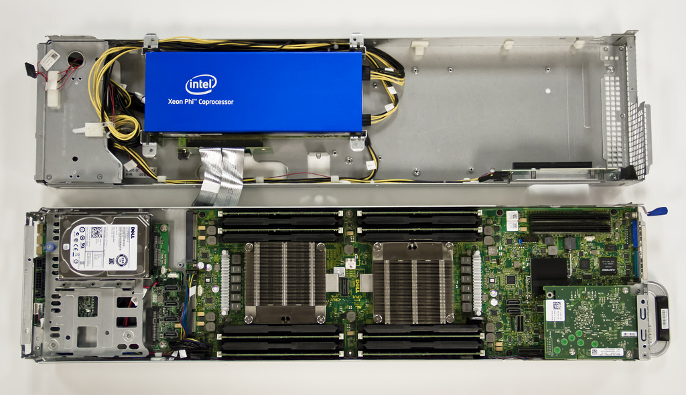
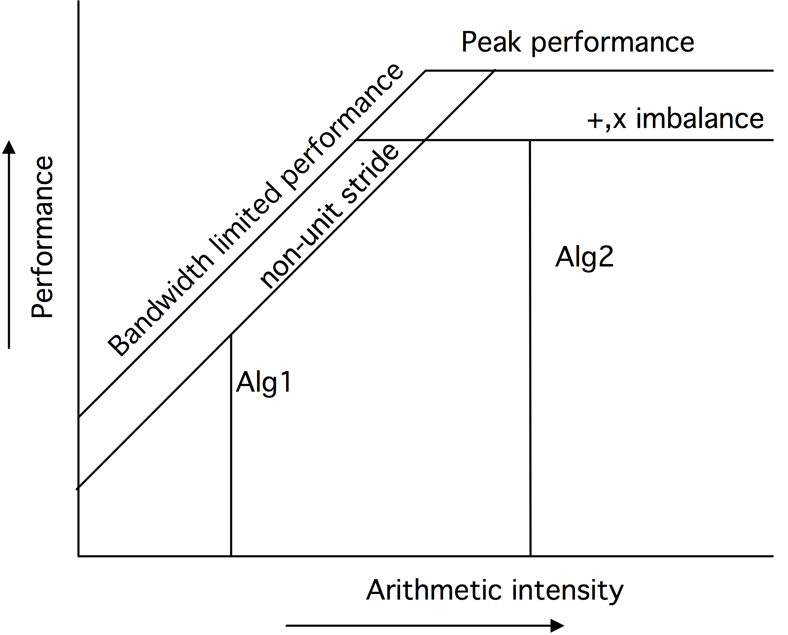

# 单处理器计算（二）

## 多核架构

近年来，传统的处理器芯片设计已经达到了性能的极限。主要由于
- 主频已经不能再增加，因为这会增大功耗，使芯片发热过大；见1.8.1节。
- 从代码中提取更多的指令级并行（ILP）变得困难，要么是由于编译器的限制，要么是由于内在可用的并行量有限，要么是由于分支预测使之无法实现（见1.2.5节）。

从单个处理器芯片中获得更高的利用率的方法之一是，从进一步完善单个处理器的策略，转向将芯片划分为多个处理 "核心"。这些独立的内核可以在不相关的任务上工作，或者通过引入数据的并行性（第2.3.1节），以更高的整体效率协作完成一个共同的任务[163]。

**注释6** 另一个解决方案是英特尔的超线程，它可以让一个处理器混合几个指令流的指令。这方面的好处在很大程度上取决于具体情况。然而，这种机制在GPU中也得到了很好的利用，见2.9.3节。讨论见2.6.1.9节。

这就解决了上述两个问题：

- 两个主频较低的内核可以拥有与主频较高的单个处理器相同的吞吐量；因此，多个内核的能效更高。
- 指令级并行现在被明确的任务并行化所取代，由程序员管理。

虽然第一代多核CPU只是在同一个芯片上的两个处理器，但后来的几代CPU都加入了L3或L2缓存，在两个处理器核心之间共享；见图1.13。


*L3或L2缓存，在两个处理器内核之间共享；见图1.13，这种设计使内核能够有效地联合处理同一问题。内核仍然会有自己的L1高速缓存。*

而这些独立的高速缓存造成了高速缓存的一致性问题；见下面1.4.1节。

我们注意到，"处理器 "这个词现在是模糊的：它可以指芯片，也可以指芯片上的处理器核心。由于这个原因，我们大多谈论的是整个芯片的「**插槽**」（socket）和包含一个算术和逻辑单元并有自己的寄存器的部分的**核心**（core）。目前，具有4或6个内核的CPU很常见，甚至在笔记本电脑中也是如此，英特尔和AMD正在销售12个内核的芯片。核心数量在未来可能会上升。英特尔已经展示了一个80核的原型，它被开发成48核的 "单芯片云计算机"，如图1.14所示。这个芯片的结构有24个双核 "瓦片"，通过一个二维网状网络连接。只有某些瓦片与内存控制器相连，其他的瓦片除了通过片上网络外，无法到达内存。


通过这种共享和私有缓存的混合，多核处理器的编程模型正在成为共享和分布式内存的混合体。

- 核心（Core）：各个内核都有自己的私有L1缓存，这是一种分布式内存。上面提到的英特尔80核原型，其核心以分布式内存的方式进行通信。

- 插槽（Socket）：在一个插座上，通常有一个共享的二级缓存，这是内核的共享内存。

- 节点（Node）：在一个 "节点 "或主板上可以有多个插座，访问同一个共享内存。

- 网络（Network）：需要分布式内存编程（见下一章）来让节点进行通信。

从历史上看，多核结构在多处理器共享内存设计中已有先例（第2.4.1节），如Sequent Symmetry和Alliant FX/8。从概念上讲，程序模型是相同的，但现在的技术允许将多处理器板缩小到多核芯片上。

### 缓存一致性

在并行处理中，如果一个以上的处理器拥有同一个数据项的副本，就有可能发生冲突失效。确保所有的缓存数据都是主内存的准确副本，这个问题被称为「**缓存一致性**」（cache coherence）：如果一个处理器改变了它的副本，则另一个副本也需要更新。

在分布式内存架构中，数据集通常在处理器上被不连续地分割，所以只有在用户知道的情况下才会出现数据的冲突副本，而处理这个问题则是由用户决定的。共享内存的情况更微妙：由于进程访问相同的主内存，似乎冲突实际上是不可能的。然而，处理器通常有一些私有缓存，包含来自内存的数据副本，所以冲突失效的副本可能发生。这种情况特别出现在多核设计中。

假设两个核在它们的（私有）L1高速缓存中有一个相同数据的副本，其中一个修改了它的副本。现在另一个核心的缓存数据不再是其对应的准确副本：处理器将使该项目副本失效，事实上也是其整个缓存线失效。当该进程需要再次访问该项目时，它需要重新加载该缓存线。另一种方法是，任何改变数据的内核都要将该缓存线发送给其他内核。这个策略的开销可能更大，因为其他内核不可能有一个缓存线的副本。

这个更新或废止缓存线的过程被称为「**维护缓存一致性**」（maintaining cache coherence），它是在处理器的一个非常低的层次上完成的，不需要程序员参与。(这使得更新内存位置成为一个原子操作；关于这一点，请看2.6.1.5节）。然而，这将减慢计算速度，并且浪费了核心的带宽，而这些带宽本来是可以用来加载或存储操作数的。

缓存行相对于主存中的数据项的状态通常被描述为以下几种情况之一。

- Scratch：缓存行不包含该项目副本。

- Valid：缓存行是主内存中数据的正确拷贝。

- Reserved：缓存行是该数据的唯一副本。
- Dirty：缓存行已被修改，但尚未写回主内存。
- Invalid：缓存线上的数据在其他处理器上也存在（它没有被保留），并且另一个进程修改了它的数据副本。

一个更简单的变体是修改后的共享无效（MSI）一致性协议，在一个给定的核心上，一个缓存线可以处于以下状态。

- Modified：缓存线已经被修改，需要写到备份仓库。这个写法可以在行被驱逐时进行，也可以立即进行，取决于回写策略。
- Shared：该行至少存在于一个缓存中且未被修改。
- Invalid：该行在当前缓存中不存在，或者它存在但在另一个缓存中的副本已被修改。

这些状态控制着高速缓存线在内存和高速缓存之间的移动。例如，假设一个核对一个缓存线进行读取，而这个缓存线在该核上是无效的。然后，它可以从内存中加载它，或者从另一个高速缓存中获取它，这可能更快。(找出一个行是否存在于另一个缓冲区（状态为M或S）被称为「**监听**」（snooping）；另一种方法是维护「**标签目录**」（tag directory；见下文）。如果该行是共享的，现在可以简单地复制；如果它在另一个高速缓存中处于M状态，该核心首先需要把它写回内存。

**练习 1.12** 考虑两个处理器，内存中的一个数据项 $x$，以及这两个处理器的私有缓存中的缓存线$x_1,x_2$，这两个缓存线被映射到这两个处理器。描述在两个处理器上读写 $x_1$ 和 $x_2$ 的状态之间的转换。同时指出哪些行为会导致内存带宽被使用。(这个过渡列表是一个有限状态自动机（FSA），见第19节）。

MSI协议的变种增加了一个 "独占 "或 "拥有 "状态，以提高工作效率。

#### 缓存一致性的解决方案

有两种实现缓存一致性的基本机制：「**监听**」（snooping）和基于「**标签目录**」（tag directory）的方案。

在监听机制中，任何对数据的请求都会被发送到所有的缓冲区，如果数据存在于任何地方，就会被返回；否则就会从内存中检索。这个方案的一个变形为，一个核心 "监听 "所有的总线流量，这样当另一个核心修改它的拷贝时，它就可以使自己的缓存线拷贝失效或更新。缓存失效比更新的代价要小，因为它是一个位操作，而更新涉及到复制整个高速缓存线。

**练习 1.13** 什么条件下更新才是更优方案？写一个简单的缓存模拟器来评估这个问题。

由于监听通常涉及到向所有核心广播信息，所以它的规模不能超过最少的核心数量。一个可以更好地扩展的解决方案是使用一个标签目录：一个中央目录，它包含了一些缓存中存在的数据的信息，以及具体在哪个缓存中。对于拥有大量内核的处理器（如英特尔Xeon Phi），该目录可以分布在各个内核上。

#### 伪共享

如果内核访问不同的项目，就可能会出现缓存一致性问题。例如，

```c
double x,y;
```

可能会在内存中紧挨着分配 $x$ 和 $y$，所以它们很有可能落在同一个缓存线上。现在，如果一个核心更新 $x$，另一个更新 $y$，这个缓存线就会在核心之间不断移动。这就是所谓的「**伪共享**」（false sharing）。

最常见的错误共享情况发生在线程更新一个数组的连续位置时。例如，在下面的OpenMP片段中，所有线程都在更新自己在部分结果数组中的位置。

```c
 local_results = new double[num_threads];
#pragma omp parallel{
     int thread_num = omp_get_thread_num();
     for (int i=my_lo; i<my_hi; i++)
     local_results[thread_num] = ... f(i) ...
}
global_result = g(local_results)
```

虽然没有实际的竞争条件（如果线程都更新global_result变量就会有），但这段代码的性能会很低，因为带有local_result数组的缓存线会不断被废止。

#### 标签目录

在具有分布式但连贯的缓存的多核处理器中（如英特尔Xeon Phi），标签目录本身也可以是分布式的。这增加了缓存查找的延迟。

### 在多核芯片上进行计算

多核处理器可以通过各种方式提高性能。首先，在桌面情况下，多个内核实际上可以运行多个程序。更重要的是，我们可以利用并行性来加快单个代码的执行速度。这可以通过两种不同的方式实现。

MPI库（2.6.3.3节）通常用于通过网络连接的处理器之间的通信。然而，它也可以在单个多核处理器中使用：然后通过共享内存拷贝实现MPI调用。

另外，我们可以使用共享内存和共享缓存，并使用线程系统，如OpenMP（第2.6.2节）进行编程。这种模式的优点是并行性可以更加动态，因为运行时系统可以在程序运行过程中设置和改变线程和内核之间的对应关系。

我们将比较详细地讨论多核芯片上线性代数操作的调度；第6.12节。

### TLB shootdown

第1.3.8.2节解释了TLB是如何用于缓存从逻辑地址，也就是逻辑页到物理页的转换。TLB是插槽内存单元的一部分，所以在多插槽设计中，一个插槽上的进程有可能改变页面映射，这使得其他插槽的映射不正确。
解决这个问题的一个办法叫做TLB shootdown：改变映射的进程会产生一个处理器间中断，从而导致其他处理器重建他们的TLB。

## 节点架构和插槽

在前面的章节中，我们已经通过内存层次结构，访问了寄存器和各种缓存级别，以及它们可以被私有或共享的程度。在内存层次结构的最底层是所有内核共享的内存。它的范围从低级别的笔记本电脑的几千兆字节到一些超级计算机中心的几兆字节。




虽然这个内存是在所有核心之间共享的，但它有一些结构。这源于一个事实，即集群节点可以有一个以上的插槽，即处理器芯片。节点上的共享内存通常分布在直接连接到一个特定插槽的库中。例如，图1.15显示了TACC Ranger集群超级计算机（已停产）的四插槽节点和TACC Stampede集群超级计算机的两插槽节点，后者包含一个英特尔至强Phi协处理器。在这两个设计中，你可以清楚地看到直接连接到插槽上的内存芯片。

这是一个「**非一致内存访问**」（Non-Uniform Memory Access，NUMA）架构的例子：对于在某个核心上运行的进程，连接到其插槽上的内存比连接到另一个插座上的内存访问速度略快。

这方面的一个结果就是First-touch现象。动态分配的内存在第一次被写入之前实际上并没有被分配。现在考虑下面的OpenMP（2.6.2节）代码。

```c
double *array = (double*)malloc(N*sizeof(double));
   for (int i=0; i<N; i++)
     array[i] = 1;
   #pragma omp parallel for
   for (int i=0; i<N; i++)
      .... lots of work on array[i] ...
```

由于First-touch，数组被完全分配到插槽的主线程内存上。在随后的并行循环中，其他插槽的核心将对它们操作的内存有较慢的访问。

这里的解决方案是将初始化循环也做成并行的，即使其中的工作量几乎可以忽略不计。

## 局部性和数据复用

算法的执行不仅包含计算操作，也包含数据传输部分，事实上，数据传输可能是影响算法效率的主要因素。由于缓存和寄存器的存在，数据传输量可以通过编程的方式最小化，使数据尽可能地留在处理器附近。这部分是一个巧妙编程的问题，但我们也可以看看理论上的问题：算法是否一开始就允许这样做。

事实证明，在科学计算中，数据往往主要与在某种意义上靠近的数据互动，这将导致数据的局部性；1.6.2节。通常这种局部性来自于应用的性质，就像第四章看到的PDEs的情况。在其他情况下，如分子动力学（第7章），没有这种内在的局部性，因为所有的粒子都与其他粒子相互作用，为了获得高性能，需要相当的编程技巧。

### 数据复用和计算密度

在前面的章节中，我们了解到处理器的设计有些不平衡：加载数据比执行实际操作要慢。这种不平衡对于主存储器来说是很大的，而对于各种高速缓存级别来说则较小。因此，我们有动力将数据保存在高速缓存中，并尽可能地保持数据的复用量。

当然，我们首先需要确定计算是否允许数据被重复使用。为此，我们定义了一个算法的计算密度如下。

- 如果$n$是一个算法所操作的数据项的数量，而$f(n)$是它所需要的操作的数量，那么算术强度就是$f(n)/n$。

(我们可以用浮点数或字节来衡量数据项。后者使我们更容易强度与处理器的硬件规格相关联）

计算密度也与延迟隐藏有关：即你可以减轻计算活动背后的数据加载对性能的负面影响的概念。要做到这一点，你需要比数据加载更多的计算来使这种隐藏有效。而这正是计算强度的定义：每一个字节/字/数字加载的高比率操作。

#### 示例：向量操作

考虑到向量加法
$$
\forall_i : x_i \leftarrow x_i + y_i
$$
这涉及到三次内存访问（两次加载和一次存储）和每次迭代的一次操作，给出的算术强度为1/3。axpy（表示 "$a$乘以 $x$ 加 $y$ "）操作
$$
\forall_i : x_i \leftarrow a x_i + y_i
$$
有两个操作，但内存访问的数量相同，因为 $a$ 的一次性负载被摊销了。因此，它比简单的加法更有效率，重用率为2/3。因此，它比简单的加法更有效，重用率为2/3。

内积计算
$$
\forall_i : s \leftarrow s + x_i · y_i
$$
在结构上类似于axpy操作，每次迭代涉及一个乘法和加法，涉及两个向量和一个标量。然而，现在只有两个加载操作，因为 $s$ 可以保存在寄存器中，只在循环结束时写回内存。这里的重用是1。

#### 示例：矩阵操作

考虑矩阵乘法
$$
\forall_{i,j} : c_{ij} = \sum_k a_{ik}b_{kj}
$$
这涉及 $3𝑛^2$ 个数据项和 $2𝑛^3$ 个运算，属于高阶运算。算术强度为 $O(n)$，每个数据项将被使用𝑂(𝑛)次。这意味着，通过适当的编程，这种操作有可能通过将数据保存在快速缓存中来克服带宽/时钟速度的差距。

**练习 1.14** 根据上述定义，矩阵-矩阵乘积作为一种操作，显然具有数据重用性。矩阵-矩阵乘积显然具有数据复用。请你论证一下，这种复用并不是自然形成的，是什么决定了初始算法中国呢缓存是否对数据进行复用？

[在这次讨论中，我们只关心某个特定实现的操作数，而不是数学操作。例如，有一些方法可以在少于$O(n^3)$的操作中执行矩阵-矩阵乘法和高斯消除算法[189, 167]。然而，这需要不同的实现方式，在内存访问和重用方面有自己的分析]。

矩阵与矩阵乘积是LINPACK基准[51]的核心；见2.11.4节。如果将其作为评价计算机从能的标准则结果可能较为乐观：矩阵与矩阵的乘积是一个具有大量数据复用的操作，因此这对内存带宽并不敏感，对于并行计算及而言，这对网络通信也并不敏感。通常情况下，计算机在Linpack基准测试中会达到其峰值性能的60-90%，而其他测试标准得到的数值则可能较低。

#### Roofline模型

有一种平价计算及性能的理想模型，就是所谓的「**屋脊线**」（roofline model）模型[202]，该模型指出：性能受两个因素的制约，如图1.16的第一个图所示。

1. 图中顶部的横线所表示的峰值性能是对性能的绝对约束3，只有在CPU的各个方面（流水线、多个浮点单元）都完美使用的情况下才能达到。这个数字的计算纯粹是基于CPU的特性和时钟周期；假定内存带宽不是一个限制因素。

2. 每秒的操作数受限于带宽、绝对数和计算密度的乘积。
   $$
   \frac{operations}{second} = \frac{operations}{\text{data item}} · \frac{\text{data items}}{second}
   $$
   这是由图中的线性增长线所描述的。

Roofline模型优雅地指出了影响性能的因素。例如，如果一个算法没有使用全部的SIMD宽度，这种不平衡会降低可达到的峰值。图1.16中的第二张图显示了降低上限的各种因素。还有各种降低可用带宽的因素，比如不完善的数据隐藏。这在第三张图中由倾斜的屋顶线的降低表示。

对于一个给定的计算密度，其性能是由其垂直线与Roofline相交的位置决定的。如果这是在水平部分，那么该计算被称为受「**计算约束**」（compute-bound）：性能由处理器的特性决定，而带宽不是问题。另一方面，如果这条垂直线与屋顶的倾斜部分相交，那么计算被称为受「**带宽约束**」（bandwidth-bound）：性能由内存子系统决定，处理器的全部能力没有被使用。

**练习 1.15** 如何确定一个给定的程序内核是受到带宽约束还是计算约束的？





### 局部性

由于从缓存中读取数据的时间开销要小于从内存中读取，我们当然希望以这种方式进行编码，进而使缓存中的数据最大程度上得到复用。虽然缓存中的数据不受程序员的控制，甚至编写汇编语言也无法控制（在Cell处理器和一些GPU中，低级别的内存访问可以由程序员控制），但在大多数CPU中，知道缓存的行为，明确什么数据在缓存中，并在一定程度上控制它，还是有可能的。

这里的两个关键概念是「**时间局部性」**（temporal locality）和「**空间局部性」**（spatial locality）。时间局部性是最容易解释的：即数据使用一次后短时间内再次被使用。由于大多数缓存使用LRU替换策略，如果在两次引用之间被引用的数据少于缓存的大小，那么该元素仍然会存在缓存之中，进而实现快速访问。而对于其他的替换策略，例如随机替换，则不能保证同样结果。

#### 时间局部性

下面为时间局部性的例子，考虑重复使用一个长向量：

```c
for (loop=0; loop<10; loop++) {
     for (i=0; i<N; i++) {
       ... = ... x[i] ...
     }
}
```

$x$ 的每个元素将被使用10次，但是如果向量（加上其他被访问的数据）超过了缓存的大小，每个元素将在下一次使用前被刷新。因此，$x[i]$ 的使用并没有表现出时间局部性：再次使用时的时间间隔太远，使得数据无法停留在缓存中。

如果计算的结构允许我们交换循环。

```c
for (i=0; i<N; i++) {
     for (loop=0; loop<10; loop++) {
       ... = ... x[i] ...
     }
}
```

$x$ 的元素现在被反复使用，因此更有可能留在缓存中。这个重新排列的代码在使用 $x[i]$ 时显示了更好的时间局部性。

#### 空间局部性

空间局部性的概念要稍微复杂一些。如果一个程序引用的内存与它已经引用过的内存 "接近"，那么这个程序就被认为具有空间局部性。经典的冯·诺依曼架构中只有一个处理器和内存，此时空间局部性并不突出，因为内存中的一个地址可以像其他地址一样被快速检索。然而，在一个有缓存的现代CPU中，情况就不同了。上面我们已经看到了两个空间局部性的例子。

- 由于数据是以缓存线而不是单独的字或字节为单位移动的，因此以这样的方式进行编码，因此使缓存线所有的元素都得到应用是有所裨益的，在下列循环中

  ```c
  for (i=0; i<N*s; i+=s){
    ... x[i] ...
  }
  ```

  空间局部性体现为函数所进行的跨步递减$s$。

  设 $S$ 为缓存线的大小，那么当 $s$ 的范围从$1 .... S$，每个缓存线使用的元素数就会从S下降到1。相对来说，这增加了循环中的内存流量花销：如果$s=1$，我们为每个元素加载$1/S$的缓存线；如果$s=S$，我们为每个元素加载一个缓存线。这个效果在1.7.4节中得到了证明。

- 第二个值得注意的空间局部性的例子是TLB（1.3.8.2节）。如果一个程序引用的元素距离很近，它们很可能在同一个内存页上，通过TLB的地址转换会很迅速。另一方面，如果一个程序引用了许多不同的元素，它也将引用许多不同的页。由此产生的TLB缺失是时间花销十分庞大；另见1.7.5节。

**练习 1.16** 请考虑以下对 $n$ 数字 $x[i]$ 进行求和的算法的伪码，其中 $n$ 是2的倍数。

```c
for s=2,4,8,...,n/2,n:
    for i=0 to n-1 with steps s:
        x[i] = x[i] + x[i+s/2]
sum = x[0]
```

分析该算法的空间和时间局部性，并将其与标准算法进行对比

```c
sum = 0
for i=0,1,2, ... ,n-1
  sum = sum+ x[i]
```

**练习 1.17** 考虑以下代码，并假设nvectors相比于缓存很小，而长度很大。

```c
for (k=0; k<nvectors; k++)
     for (i=0; i<length; i++)
       a[k,i] = b[i] * c[k]
```

以下概念与该代码的性能有什么关系。

- 复用（Reuse）
- 缓存尺寸（Cache size）
- 关联性（Associativity）

下面这段交换了循环的代码的性能是更好还是更差，为什么？

```c
for (i=0; i<length; i++)
  for (k=0; k<nvectors; k++)
    a[k,i] = b[i] * c[k]
```

#### 局部性示例

让我们看一个实际的例子。矩阵与矩阵的乘法 $C \leftarrow A ·B $可以用几种方法计算。我们比较两种实现方式，假设所有的矩阵都是按行存储的，且缓存大小不足以存储整个行或列。

```c
for i=1..n
  for j=1..n
    for k=1..n
      c[i,j] += a[i,k]*b[k,j]
```

```c
for i=1..n
  for k=1..n
    for j=1..n
      c[i,j] += a[i,k]*b[k,j]
```

这些实现如图1所示。 第一个实现构建了 $(i, j)$ 元素


$A$ 的一行与 $B$ 的一列的内积来更新 $C$，在第二行中，$B$ 的一行是通过对 $A$  的元素进行缩放来更新。$A$ 的元素来更新 $B$ 的行数。

我们的第一个观察结果是，这两种实现都确实计算了 $C \leftarrow C + A ·B$，并且它们都花费了大约 $2n^3$ 的操作。然而，它们的内存行为，包括空间和时间的局部性是非常不同的。

- $c[i,j]$ ：在第一个实现中，$c[i,j]$在内部迭代中是不变的，这构成了时间局部性，所以它可以被保存在寄存器中。因此，$C$ 的每个元素将只被加载和存储一次。

  在第二个实现中，$c[i,j]$ 将在每个内部迭代中被加载和存储。特别是，这意味着现在有 $𝑛^3$ 次存储操作，比第一次实现多了$n$。

- $a[i,k]$：在这两种实现中，$a[i,k]$元素都是按行访问的，所以有很好的空间局部性，因为每个加载的缓存线都会被完全使用。在第二个实现中，$a[i,k]$在内循环中是不变的，这构成了时间局部性；它可以被保存在寄存器中。因此，在第二种情况下，$A$只被加载一次，而在第一种情况下则是$n$次。

- $b[k,j]$：这两种实现方式在访问矩阵 $B$ 的方式上有很大不同。首先，$b[k,j]$ 从来都是不变的，所以它不会被保存在寄存器中，而且 $B$ 在两种情况下都会产生 $𝑛^3$ 的内存负载。但是，访问模式不同。

  在第二种情况下，$b[k,j]$ 是按行访问的，所以有很好的空间局部性性：缓存线在被加载后将被完全利用。
  
  在第一种实现中，$b[k,j]$ 是通过列访问的。由于矩阵的行存储，一个缓存线包含了一个行的一部分，所以每加载一个缓存线，只有一个元素被用于列的遍历。这意味着第一个实现对 $B$ 的加载量要比缓存线长度的系数大。也有可能是TLB的影响。

请注意，我们并没有对这些实现的代码性能做任何绝对的预测，甚至也没有对它们的运行时间做相对比较。这种预测是很难做到的。然而，上面的讨论指出了与广泛的经典CPU相关的问题。

**练习 1.18** 乘积  $C \leftarrow A ⋅B$ 的实现算法较多。请考虑以下情况。

```c
for k=1..n:
    for i=1..n:
        for j=1..n:
            c[i,j] += a[i,k]*b[k,j]
```

分析矩阵 $C$ 的内存流量，并表明它比上面给出的两种算法更糟糕。

#### 核心局部性

上述空间和时间局部性的概念主要是程序的属性，尽管诸如高速缓存线长度和高速缓存大小这样的硬件属性在分析局部性的数量方面发挥了作用。还有第三种类型的局部性与硬件有更密切的联系：「**核心局部性**」（core locality）。

如果空间上或时间上接近的写访问是在同一个核心或处理单元上进行的，那么代码的执行就会表现出核心局部性。这里的问题是缓存一致性的问题，两个核心在他们的本地存储中都有某个缓存线的副本。如果它们都从该缓存中读取，那就没有问题了。但是，如果他们中的一个对它进行了写操作，一致性协议就会把这个缓存线复制到另一个核心的本地存储中。这需要占用宝贵的内存带宽，所以要避免这种情况。

核心局部性不仅仅是一个程序的属性，而且在很大程度上也是程序的并行执行方式。