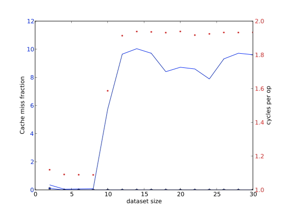
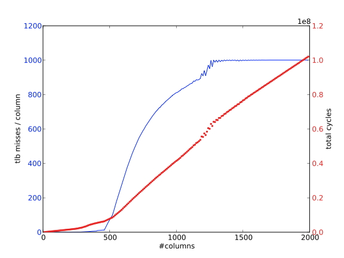

# 单处理器计算（三）

## 高性能的编程策略

在本节中，我们将研究不同的编程方式如何影响代码的性能。这将只是对这一主题的介绍，进一步的讨论见Goedeker和Hoisie的书[78]。

这里列出的代码的完整清单和对数据图表的解释可以在第37章中找到。所有的性能结果都是在TACC Ranger集群的AMD Opteron处理器上获得的[173]。

### 峰值性能

出于营销的目的，可能需要为CPU定义一个 "最高速度"。由于一个流水线上的浮点单元可以渐进地在每个周期产生一个结果，你可以把理论上的峰值性能计算为时钟速度（以每秒ticks为单位）、浮点单元数量和核心数量的乘积；见1.4节。这个最高速度在实践中是无法实现的，很少有代码能接近它。Linpack基准是衡量你能接近它的标准之一；该基准的并行版本被列入 "前500名"；见第2.11.4节。

###  流水线

在1.2.1.3节中，你了解到现代CPU中的浮点运算单元是流水线式的，流水线需要一些独立的操作才能有效地运行。典型的可流水线操作是向量加法；不能流水线操作的一个例子是内积积累

```c
for (i=0; i<N; i++)
     s += a[i]*b[i]
```

$s$ 既被读又被写的事实使加法流水线停止。填充浮点管道的一个方法是应用循环解卷。

```c
for (i = 0; i < N/2-1; i ++) {
     sum1 += a[2*i] * b[2*i];
     sum2 += a[2*i+1] * b[2*i+1];
}
```

现在，在累积之间有两个独立的乘法。通过一点索引优化，这就变成了。

```c
for (i = 0; i < N/2-1; i ++) {
  sum1 += *(a + 0) * *(b + 0);
  sum2 += *(a + 1) * *(b + 1);
  a += 2; b += 2; 
}
```

关于这段代码的第一个观察点是，我们隐含地使用了加法的关联性和交换性：虽然同样的量被加起来，但它们现在实际上是以不同的顺序加起来的。正如你将在第三章看到的，在计算机算术中，这并不能保证得到完全相同的结果。

在进一步的优化中，我们将每条指令的加法和乘法部分分离开来。希望在积累等待乘法结果的时候，中间的指令能让处理器忙起来，实际上是增加了每秒的操作数。

```c
for (i = 0; i < N/2-1; i ++) {
     temp1 = *(a + 0) * *(b + 0);
     temp2 = *(a + 1) * *(b + 1);
     sum1 += temp1; sum2 += temp2;
a += 2; b += 2; 
}
```

最后，我们意识到，我们可以将加法从乘法中移开的最远距离是将它放在下一次迭代的乘法前面。

```c
for (i = 0; i < N/2-1; i ++) {
     sum1 += temp1;
     temp1 = *(a + 0) * *(b + 0);
     sum2 += temp2;
     temp2 = *(a + 1) * *(b + 1);
     a += 2; b += 2; 
}
s = temp1 + temp2;
```

当然，我们可以将操作解卷超过2倍。虽然我们期望因为更长的流水线操作序列而提高性能，但大的解卷因子需要大量的寄存器。对寄存器的要求超过了CPU所拥有的数量，这就是所谓的寄存器溢出，这将降低性能。
另一个需要注意的问题是，操作的总数不太可能被解卷因子所除。这就需要在循环之后进行清理代码，以考虑到最后的迭代。因此，解卷的代码比直接的代码更难写，人们已经写了一些工具来自动执行这种源到源的转换。
表1.2中给出了解卷内积操作的周期时间，最多为六次。请注意，在解开四次的时候，时间并没有显示出单调的行为。这种变化是由于各种与内存有关的因素造成的。

| 1    | 2    | 3    | 4    | 5    | 6    |
| ---- | ---- | ---- | ---- | ---- | ---- |
| 6794 | 507  | 340  | 359  | 334  | 528  |

内积操作的周期时间，最多展开六次。


### Cache 尺寸

上面，你了解到，从L1移动数据可以比从L2移动数据有更低的延迟和更高的带宽，而L2又比L3或内存快。这很容易用重复访问相同数据的代码来证明。

```c
for (i=0; i<NRUNS; i++)
     for (j=0; j<size; j++)
       array[j] = 2.3*array[j]+1.2;
```

如果尺寸参数允许阵列适合于缓存，那么操作会相对较快。随着数据集大小的增长，它的一部分将从L1缓存中驱逐其他部分，所以操作的速度将由L2缓存的延迟和带宽决定。这可以从图1.18中看出。完整的代码在第37.2节给出。每个操作的平均周期数与数据集大小的关系图如下：



**练习 1.19** 论证一下，如果有一个足够大的问题和LRU替换策略（第1.3.4.6节），基本上L1中的所有数据都会在外循环的每次迭代中被替换。你能不能写一个例子，让一些L1的数据保持不变？

通常情况下，可以通过安排操作来将数据保留在L1缓存中。例如，在我们的例子中，我们可以编写

```c
for (b=0; b<size/l1size; b++) {
     blockstart = 0;
     for (i=0; i<NRUNS; i++) {
       for (j=0; j<l1size; j++)
         array[blockstart+j] = 2.3*array[blockstart+j]+1.2;
     }
     blockstart += l1size;
}
```

假设L1大小与数据集大小平均分配。这种策略被称为缓存阻塞或缓存重复使用的阻塞。

在下面的循环中，针对不同的缓存大小值，测量每个周期的内存访问次数。如果你观察到时间与缓冲区大小无关，让你的编译器生成一个优化报告。对于英特尔的编译器使用-qopt-report。

```c
for (int irepeat=0; irepeat<how_many_repeats; irepeat++) { 
  for (int iword=0; iword<cachesize_in_words; iword++)
    memory[iword] += 1.1; 
}
```

论证发生了什么。你能找到防止循环交换的方法吗？

**练习 1.21** 为了得到封锁的代码，j的循环被分割成一个块的循环和一个块元素的内循环；然后i的外循环被替换成块的循环。在这个特殊的例子中，你也可以简单地交换i和j的循环。为什么这不是最佳性能？

**注释 7** 封锁的代码可能会改变表达式的评估顺序。由于浮点运算不是关联性的，所以阻塞不是编译器允许进行的转换。

### 缓存线和striding

由于数据是以连续的块状形式从内存转移到缓存中的，称为缓存线（见第1.3.4.7节），没有利用缓存线中所有数据的代码要付出带宽的代价。这可以从一个简单的代码中看出来

```c
for (i=0,n=0; i<L1WORDS; i++,n+=stride)
     array[n] = 2.3*array[n]+1.2;
```

在这里，一个固定数量的操作被执行，但是在距离跨度上的元素上。随着跨度的增加，我们预计运行时间也会增加，这在图1.19中得到了证实。


图中还显示了高速缓存线的重复使用率在下降，定义为向量元素的数量除以L1失误的数量。的数量除以L1失误的数量（失速时；见1.3.5节）。完整的代码在第37.3节给出。

下表为：在Frontera的56个核心上，每个核心的数据量为3.2M，每次操作的时间（纳秒）是跨度的函数。

| stride | nsec/word <br />56 cores, 3M | 56 cores, .3M | 28 cores, 3M |
| ------ | ---------------------------- | ------------- | ------------ |
| 1      | 7.268                        | 1.368         | 1.841        |
| 2      | 13.716                       | 1.313         | 2.051        |
| 3      | 20.597                       | 1.319         | 2.852        |
| 4      | 27.524                       | 1.316         | 3.259        |
| 5      | 34.004                       | 1.329         | 3.895        |
| 6      | 40.582                       | 1.333         | 4.479        |
| 7      | 47.366                       | 1.331         | 5.233        |
| 8      | 53.863                       | 1.346         | 5.773        |

滞后的影响可以通过处理器的带宽和缓存行为来缓解。考虑在TACC的Frontera集群的英特尔Cascadelake处理器上的一些运行情况（每个插座28个核，双插座，每个节点总共56个核）。我们测量了一个简单的流媒体内核的每操作时间，使用递增的步长。表1.3在第二栏中报告了每个操作时间确实随着步长的增加而线性上升。

然而，这是对一个溢出二级缓存的数据集而言的。如果我们让这个运行包含在二级缓存中，就像第三列中报告的那样，这种增加就会消失，因为有足够的带宽可以从二级缓存中全速流式传输数据。


### TLB

正如第1.3.8.2节所解释的，转换查找缓冲区（TLB）维护着一个经常使用的内存页及其位置的小列表；寻址位于这些页上的数据比不在其中的数据快得多。因此，人们希望以这样的方式编写代码，使访问的页数保持在低水平。
考虑以两种不同的方式遍历一个二维数组的元素的代码。

```c
#define INDEX(i,j,m,n) i+j*m
   array = (double*) malloc(m*n*sizeof(double));
   /* traversal #1 */
   for (j=0; j<n; j++)
     for (i=0; i<m; i++)
       array[INDEX(i,j,m,n)] = array[INDEX(i,j,m,n)]+1;
   /* traversal #2 */
   for (i=0; i<m; i++)
     for (j=0; j<n; j++)
       array[INDEX(i,j,m,n)] = array[INDEX(i,j,m,n)]+1;
```

结果（源代码见附录37.5）绘制在图1.21和1.20中。


每一列的TLB失误数与列数的函数关系；阵列的列向追踪。

使用 $m=1000$ 意味着，在AMD Opteron上有512个双倍的页面，我们每列大约需要两个页面。我们运行这个例子，绘制 "TLB缺失 "的数量，也就是说，一个页面被引用的次数没有被记录在TLB中。
1. 在最初的遍历中，这确实是发生的情况。在我们接触到一个元素，并且TLB记录了它所在的页面后，该页面上的所有其他元素随后被使用，所以没有进一步的TLB缺失发生。图1.20显示，随着𝑛的增加，每列的TLB缺失次数大约为2次。
2. 在第二次遍历中，我们为第一行的每一个元素接触一个新的页面。第二行的元素将在这些页面上，因此，只要列的数量少于TLB条目的数量，这些页面仍将被记录在TLB中。随着列数的增加，TLB的数量也在增加，最终每个元素的访问都会有一个TLB缺失。图1.21显示，在列数足够多的情况下，每列的TLB缺失次数等于每列的元素数。

### 缓存关联性

有许多算法是通过对一个问题的递归划分来工作的，例如快速傅里叶变换（FFT）算法。因此，这类算法的代码经常在长度为2的幂的向量上操作。不幸的是，这可能会与CPU的某些架构特征产生冲突，其中许多涉及到二的幂。



每一列的TLB缺失次数与列数的函数；阵列的ROWISE遍历。

在1.3.4.9节中，你看到了将少量向量相加的操作是如何进行的
$$
\forall_j : y_j = y_j + \sum_{i=1}^m x_{i,j}
$$
对于直接映射的缓冲区或具有关联性的集合关联缓冲区是一个问题。

我们以AMD Opteron为例，它有一个64K字节的L1高速缓存，而且是双向设置的关联性。由于设置了关联性，该缓存可以处理两个地址被映射到同一个缓存位置，但不能处理三个或更多。因此，我们让向量的大小 $n=4096$ 个双倍数，我们测量了让 $m=1, 2, ....$ 的缓存缺失和周期的影响。

首先，我们注意到我们是按顺序使用向量的，因此，在一个有8个双倍数的缓存线中，我们最好能看到1/8倍于向量数量𝑚的缓存丢失率。相反，在图1.22中，我们看到了一个与𝑚成正比的速率，这意味着确实有缓存行被立即驱逐。这里的例外是𝑚=1的情况，双向关联性允许两个向量的缓存线留在缓存中。

对比图1.23，我们使用了一个稍长的向量长度，所以具有相同𝑗的位置不再被映射到同一个缓存位置。因此，我们看到的缓存缺失率约为1/8，而周期数较少，相当于完全重复使用了缓存线。

有两点需要注意的是：由于处理器会使用预取流，所以缓存缺失数实际上比理论预测的要低。其次，在图1.23中，我们看到时间随着 $m$ 的增加而减少；这可能是由于负载和存储操作之间逐渐形成了有利的平衡。由于各种原因，存储操作比负载更昂贵。


L1缓存丢失的次数和每个 $j$ 列累积的周期数，向量长度为4096


L1缓存丢失的次数和每个𝑗列累积的周期数，向量长度4096+8

### 循环嵌套

如果你的代码有嵌套的循环，而且外循环的迭代是独立的，你可以选择把哪个循环变成外循环，哪个变成内循环。

**练习 1.22** 给出一个双嵌套循环的例子，其中的循环可以交换；给出一个不能交换的例子。如果可能的话，请使用本书中的实际例子。

如果你有这样的选择，有许多因素可以影响你的决定。

**编程语言：C与Fortran的比较**：如果你的循环描述一个二维数组的 $(i, j)$ 索引，对于Fortran来说，通常最好让 $i$ 索引在内循环中，对于C来说，$j$ 索引在内部。

**练习 1.23** 你能想出至少两个理由，说明这可能对性能更好吗？

然而，这并不是一条硬性规定。它可能取决于循环的大小，以及其他因素。例如，在矩阵-向量乘积中，改变循环的顺序会改变输入和输出向量的使用方式。

**并行性模式**：如果你想用OpenMP来并行化你的循环，你通常希望外循环比内循环大。拥有一个非常短的外循环肯定是不好的。一个短的内循环通常也可以被编译器矢量化。

另一方面，如果你的目标是GPU，你希望大循环是内循环。并行工作的单元不应该有分支或循环。

### 循环分块

在某些情况下，可以通过将一个循环分解成两个嵌套的循环来提高性能，一个是用于迭代空间中的块的外循环，一个是穿过块的内循环。这就是所谓的循环平铺：（短的）内循环是一个平铺，其许多连续的实例构成了迭代空间。

例如

```c
for (i=0; i<n; i++)
  ...
```

变成

```c
bs = ...       /* the blocksize */
   nblocks = n/bs /* assume that n is a multiple of bs */
   for (b=0; b<nblocks; b++)
     for (i=b*bs,j=0; j<bs; i++,j++)
       ...
```

对于一个单一的循环来说，这可能不会产生任何影响，但是在合适的情况下，它可能会产生影响。例如，如果一个数组被重复使用，但它太大，无法装入缓存。

```c
for (n=0; n<10; n++)
     for (i=0; i<100000; i++)
       ... = ...x[i] ...
```

那么循环平铺可能会导致一种情况，即数组被划分为适合缓存的块。

```c
 bs = ... /* the blocksize */
   for (b=0; b<100000/bs; b++)
     for (n=0; n<10; n++)
       for (i=b*bs; i<(b+1)*bs; i++)
         ... = ...x[i] ...
```

由于这个原因，循环叠加也被称为缓存阻塞。块的大小取决于在循环体中访问多少数据；理想情况下，你会尽量使数据在L1缓存中得到重用，但也有可能为L2重用进行阻塞。当然，L2重用的性能不会像L1重用那样高。

分析一下这个例子。$x$ 什么时候被带入缓存，什么时候被重新使用，什么时候被刷新？在这个例子中，所需的缓冲区大小是多少？重写这个例子，用一个常数

```c
#define L1SIZE 65536
```

对于一个不那么微不足道的例子，让我们看看矩阵转置 $A \leftarrow Bt$。通常情况下，你会遍历输入和输出矩阵。

```c
// regular.c
   for (int i=0; i<N; i++)
     for (int j=0; j<N; j++)
       A[i][j] += B[j][i];
```

使用阻断，这就变成了

```c
// blocked.c
   for (int ii=0; ii<N; ii+=blocksize)
     for (int jj=0; jj<N; jj+=blocksize)
       for (int i=ii*blocksize; i<MIN(N,(ii+1)*blocksize); i++)
         for (int j=jj*blocksize; j<MIN(N,(jj+1)*blocksize); j++)
           A[i][j] += B[j][i];
```

与上面的例子不同，输入和输出的每个元素只被触及一次，所以没有直接的重复使用。然而，缓存线是可以重复使用的。

图1.24显示了其中一个矩阵是如何以与它的存储顺序不同的顺序被遍历的，比如说按列存储，而按行存储。这样做的结果是，每个元素的加载都会传输一个缓存线，其中只有一个元素会被立即使用。在常规的遍历中，这种缓存线流很快就溢出了缓存，而且没有重复使用。然而，在阻塞式遍历中，在需要这些行的下一个元素之前，只有少量的缓存行被遍历了。因此，缓存线是可以重复使用的，也就是空间定位。


通过阻塞获得性能的最重要的例子是矩阵！矩阵积！平铺。在第1.6.2节中，我们研究了矩阵与矩阵的乘法，得出的结论是在高速缓存中可以保留的数据很少。通过循环平铺，我们可以改善这种情况。例如，这个乘法的标准写法是

```c
for i=1..n
     for j=1..n
       for k=1..n
         c[i,j] += a[i,k]*b[k,j]
```

只能通过优化使 $c[i,j]$ 保持在寄存器中。

```c
 for i=1..n
     for j=1..n
       s=0
       for k=1..n
         s += a[i,k]*b[k,j]
       c[i,j] += s
```

假设 $a$ 是按行存储的，使用循环平铺法，我们可以将 $a[i,:]$ 的部分内容保留在缓存中。

```c
for kk=1..n/bs
     for i=1..n
       for j=1..n 
         s=0
         for k=(kk-1)*bs+1..kk*bs
           s += a[i,k]*b[k,j]
         c[i,j] += s
```

### 优化策略


离散傅里叶变换的朴素和优化实现的性能


矩阵-矩阵乘积的朴素和优化实现的性能

图1.25和1.26显示，一个操作的朴素实现（有时称为 "参考实现"）和优化实现的性能之间可能存在很大的差异。不幸的是，优化的实现并不容易找到。首先，由于它们依赖于阻塞，它们的循环巢是正常深度的两倍：矩阵-矩阵乘法成为一个六深度的循环。然后，最佳块大小取决于目标架构等因素。

我们提出以下意见。

- 编译器无法提取接近最佳性能的东西。

- 有一些自动调整项目，用于自动生成根据架构进行调整的实现。这种方法可以是适度的，也可以是非常成功的。这些项目中最著名的是用于Blas内核的Atlas[199]和用于变换的Spiral[172]。

### 缓存感知和缓存遗忘的程序设计

与寄存器和主存储器不同，两者都可以在（汇编）代码中寻址，缓存的使用是隐含的。即使在汇编语言中，程序员也不可能明确地将数据加载到某个缓冲区。

然而，以 "缓冲区意识 "的方式进行编码是可能的。假设一段代码重复操作的数据量小于缓冲区的大小。我们可以假设在第一次访问该数据时，它被带入了缓冲区；在下一次访问时，它已经在缓冲区内了。另一方面，如果数据量超过了缓存的大小5，那么在访问的过程中，它将部分或全部被冲出缓存。

我们可以通过实验来证明这个现象。用一个非常精确的计数器，代码片段

```c
for (x=0; x<NX; x++)
     for (i=0; i<N; i++)
       a[i] = sqrt(a[i]);
```

将花费N的线性时间，直到a填满缓存的时候。一个更容易理解的方法是计算归一化的时间，基本上是每次执行内循环的时间。

```c
 t = time();
   for (x=0; x<NX; x++)
     for (i=0; i<N; i++)
       a[i] = sqrt(a[i]);
 t = time()-t;
 t_normalized = t/(N*NX);
```

归一化的时间将是恒定的，直到阵列a填满缓存，然后增加，最终再次持平。(见1.7.3节的详细讨论）
解释是，只要 $a[0]...a[N-1]$ 适合在L1缓存中，内循环就会使用L1缓存中的数据。访问的速度由L1缓存的延迟和带宽决定。当数据量的增长超过L1缓存的大小时，部分或全部的数据将从L1缓存中刷出，而性能将由L2缓存的特性决定。让数据量进一步增长，性能将再次下降到由主内存的带宽决定的线性行为。

如果你知道高速缓存的大小，在如上的情况下，就有可能安排算法来最佳地使用高速缓存。但是，每个处理器的缓存大小是不同的，所以这使得你的代码不能移植，或者至少其高性能不能移植。另外，对多级缓存的阻塞也很复杂。由于由于这些原因，有些人主张采用遗忘缓存的编程方式[70]。

缓存遗忘编程可以被描述为一种自动使用所有级别的缓存层次的编程方式。这通常是通过使用分而治之的策略来实现的，也就是对问题进行递归细分。

作为缓存遗忘编程的一个简单例子，矩阵转置操作 $B \leftarrow At$。首先我们观察到，两个矩阵的每个元素都被访问一次，所以唯一的重用是在缓存线的利用上。如果两个矩阵都是按行存储的，我们按行遍历 $B$，那么 $A$ 是按列遍历的，每访问一个元素就加载一条缓存线。如果行数乘以每条缓存线的元素数超过了缓存容量，那么在重新使用之前，行将被驱逐。


矩阵转置操作，对源矩阵进行简单和递归的遍历

在缓存遗忘的实现中，我们将$A$和$B$划分为2$\times$2的块矩阵，并递归计算$B_{11} \leftarrow A_{11}^t, B_{12} \leftarrow A_{21}^t$ 等等，见上图。在递归的某一点上，块$A_{ij}$现在将小到足以容纳在缓存中，并且$A$的缓存线将被完全使用。因此，这个算法比简单的算法提高了一个系数，等于缓存线的大小。

遗忘缓存的策略通常可以产生改进，但它不一定是最佳的。在矩阵-矩阵乘积中，它比天真的算法有所改进，但是它还不如一个明确设计为优化使用缓存的算法[85]。

参见第6.8.4节关于模版计算中的此类技术的讨论。

### 矩阵-向量乘积的案例研究

让我们考虑如下的矩阵向量乘积：
$$
\forall_{i,j}: y_i \leftarrow a_{ij}·x_j
$$
这涉及到对$n^2+2n$数据项的 $2n^2$操作，所以重用率为𝑂(1)：内存访问和操作的顺序相同。然而，我们注意到，这里涉及到一个双循环，而且$x,y$向量只有一个索引，所以其中的每个元素都被多次使用。

利用这种理论上的再利用并非易事。在

```c
/* variant 1*/
for (i)
  for (j)
    y[i] = y[i] + a[i][j] * x[j];
```

元素$y[i]$ 似乎被重复使用。然而，这里给出的语句会在每次内存迭代中把$y[i]写入内存，我们必须把循环写成：

```c
/* variant 2 */
for (i){
  s = 0;
  for (j)
    s =s +a[i][j] * x[j];
  y[i] = s;
}
```

以保证重复使用。这个变体使用了$2n^2$的负载和$n$的存储。

这个代码片段只是明确地利用了$y$的重复使用。如果缓冲区太小，不能容纳整个向量$x$和$a$的一列，$x$的每个元素仍然在每个外层迭代中被重复加载。将循环反转为

```c
/* variant 3 */
for (j)
  for (i)
    y [i] = y[i] + a[i][j] * x[j];
```

暴露了$x$的重复使用，特别是如果我们把它写成：

```c
/* variant 3 */
for (j){
  t = x[j];
  for (i)
    y[i] = y[i] + a[i][j] * t;
}
```

此外，我们现在有$2n^2+n$的负载，与variant 2相当，但有$n^2$的存储，这是一个更高的顺序。

我们有可能重复使用$𝑥$和$𝑦$，但这需要更复杂的编程。这里的关键是将循环分成若干块。比如说

```c
for (i=0; i<M; i+=2){
  s1 =s2 =0;
  for (j){
    s1 = s1 +a[i][j] * x[j];
    s2 = s2 + a[i+1][j] * x[j];
  }
  y[i] = s1; y[i+1] = s2;
}
```

这也被称为循环解卷（loopunrolling），或带状采矿。解除循环的数量由可用寄存器的数量决定。

## 拓展探究

### 功率消耗

高性能计算机的另一个重要话题是其功耗。在这里，我们需要区分单个处理器芯片的功耗和一个完整的集群的功耗。

随着芯片上组件数量的增加，其功耗也会增加。幸运的是，在一个反作用的趋势下，芯片特征的小型化同时也在减少必要的功率。假设特征尺寸$\lambda$（想想看：导线的厚度）按比例缩小到$s\lambda$，其中$s<1$。为了保持晶体管中的电场不变，通道的长度和宽度、氧化物厚度、基质浓度密度和工作电压都按相同的因素进行缩放。

### 缩放属性的推导

恒定磁场缩放或Dennard缩放的特性[18, 44]是对电路微型化时的特性的理想情况描述。一个重要的结果是，当芯片特征变小时，功率密度保持不变，而频率同时增加。

从电路理论中得出的基本属性是，如果我们将特征尺寸缩小$s$。

| 属性         | 情况 |
| ------------ | ---- |
| Feature size | ~s   |
| Voltage      | ~s   |
| Current      | ~s   |
| Frequency    | ~s   |

则可以推导：
$$
功率消耗 = V·I\sim s^2
$$
而由于电路的总尺寸也随着 $ s^2$ 的减少而减少，功率密度不变。因此，在一个点路上放置更多的晶体管也可能从根本上不改变冷却问题。

这一结果可以被认为是摩尔定律背后的驱动力，摩尔定律指出，处理其中的晶体管数量每18个月翻一番。一个程序所需的与频率有关的部分功率来自于对电路电容的充电和放电，因此

| 状态 | 公式                |
| ---- | ------------------- |
| 充电 | q = CV              |
| 工作 | W=qV=$CV^2$         |
| 功率 | W/time = WF = CV^2F |


这一分析可以用来证明引入多核处理器的合理性。

 ### 多核

在2010年左右，元件的微型化几乎已经停滞不前了，因为降低电压已经达到了峰值。频率也不能扩大，因为这将提高芯片的发热量，导致芯片的发热量过大，下图给出了一种戏剧化的例子。说明了一个芯片所产生的热量，如果采用单核结构：


如果趋势继续下去，CPU的预计散热量情况 - （由Pat Helsinger提供）

处理器的趋势仍在继续。

一个结论是：计算机设计正在面临一道电源墙，单核的复杂性不能再增加了（所以我们不能再增加ILP和流水线深度），提高性能的唯一途径是增加明确可见的并行性。这一发展导致了当前一带多核处理器的出现。这也是GPU以其简化的处理设计并因此降低能耗而具有吸引力的原因。回顾上述共识，讲一个处理器与两个频率为一般的处理器进行比较，这应该具有相同的计算能力，对吗？由于我们降低了频率，如果我们保持相同的工业技术，我们可以降低电压。

理想情况下，两个处理器核心的总电功率为：
$$
\left.\begin{array}{l}
C_{\text {multi }}=2C \\
F_{multi}=F/2 \\
V_{multi}=F/2
\end{array}\right\} \Rightarrow P_{multi} = P/4.
$$
在实际中，电容会上升到2以上，而电压则不可能完全下降2，所以更可能是$P_{multi}\approx 0.4  \times P$ 当然，集成方面的问题在实践中要复杂一些[19]；重要的结论是，现在为了降低功率（或者反过来说，为了在保持功率不变的情况下进一步提高性能），我们现在必须开始并行编程。

### 计算机总功率

并行计算机的总功率由每个处理器的功率和全部的处理汽车数量决定。目前，这通常是几兆瓦。根据上述推理，增加处理器数量所需的功率增加已经不能被更多的高能效处理器所消耗，所以当并行计算机从petascale（2008年IBM的 Roadrunner达到）到预计的exascale时，功率正在成为压倒一切的考虑因素。

在最近几代的处理器中，功率正在成为压倒一切的考虑因素，并且在不可能的地方产生影响。例如：处理器的胆汁另多数据(SIMD)设计是由解码的功率成本决定的。

### 操作系统影响

HPC从业人员通常不怎么担心操作系统（OS）。然而，有时可以感觉到操作系统的存在，影响到性能。其原因是周期性中断，即操作系统每秒中断当前进程100次以上，以让另一个进程或系统守护进程拥有一个时间片。

如果你基本上只运行一个程序，你不希望出现开销和抖动，以及进程运行时间的不可预测性，这就引入了一个问题。因此，已经存在的计算机基本上不需要有操作系统来提高性能。

周期性中断有进一步的负面影响。例如，它污染了高速缓存和TLB。作为抖动的细微影响，它降低了依赖线程间障碍的代码的性能，比如经常发生在OpenMP中（2.6.2节）。

特别是在金融应用中，非常严格的同步是很重要的，我们采用了一种Linux内核模式，周期性定时器每秒只跳动一次，而不是数百次。这就是所谓的tickless内核。

### 回顾问题

对于真或假问题，如果你选择假的答案，请给出解释：

**练习 1.25** “真”还是“假”

```c
for (i=0; i<N; i++)
  a[i] = b[i] + 1;
```

对a和b中的每个元素都遍历一次，所以每个元素都会有一次缓存丢失。

**练习 1.26** 请举例说明3路关联缓存会有冲突，但4路缓存不会有冲突的代码片段。

**练习 1.27** 考虑用一个$N\times N$的矩阵向量积。在执行这个操作时，需要多大的缓存容量才会出现强制性的缓存丢失？你的答案取决于操作的实现方式：分别回答矩阵的行和列的遍历，你可以假设矩阵总是按行存储。

