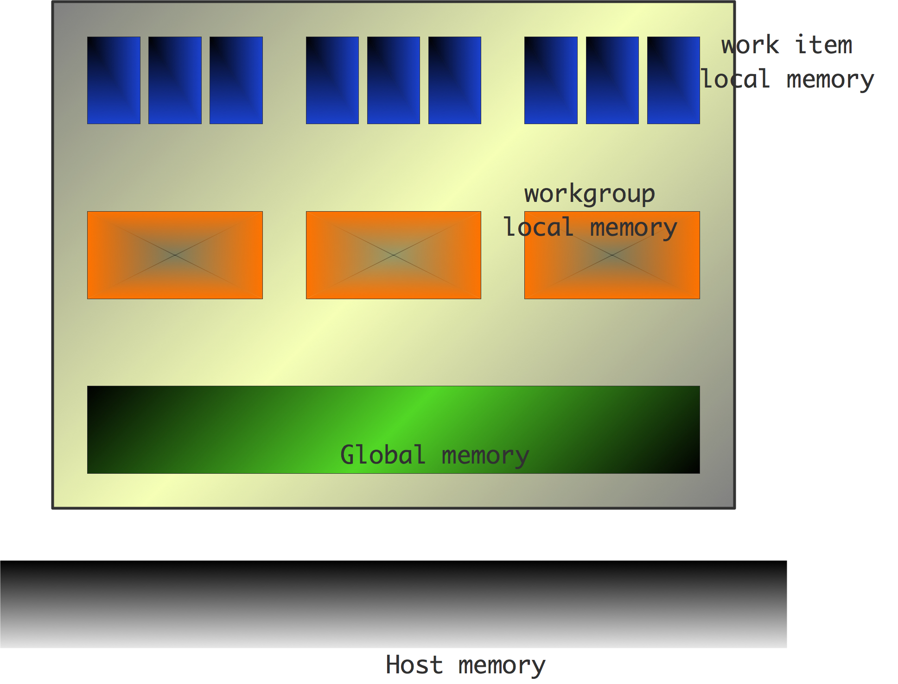
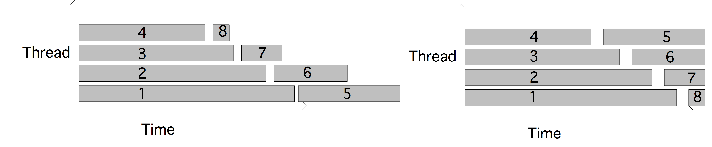
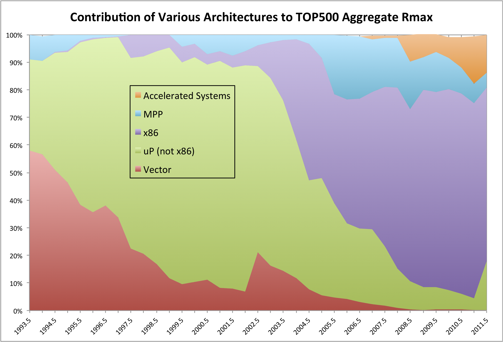
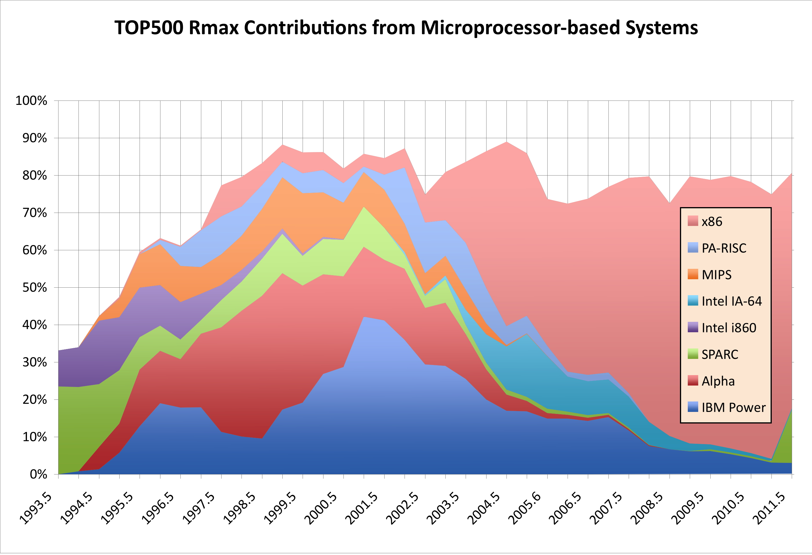

# 并行计算（三）

## 多线程架构

当代CPU架构模式很大程度上取决于：机器从内存中获取数据要远比处理这些数据要慢得多。因此，由更快更小的存储器组成的层次结构试图通过靠近处理单元以缓解内存的长延迟和低带宽。此外，在处理单元中进行指令级并行也有助于隐藏延迟、充分利用带宽。

然而，寻找指令级并行属于编译器的工作范畴，该处可执行空间有限；另一方面，科学计算中的代码往往更加适合数据并行，这对于编译器来说较为困难但对程序员说却显而易见。能否让程序员明确地指出这种并行性？并让处理器使用它？

前面我们看到SIMD架构可以以明确的数据并行方式进行编程。如果我们有大量的数据并行，但没有那么多的处理单元该怎么办？在这种情况下，我们可以把指令并行变成线程并行，让多个线程在每个处理单元上执行。每当一个线程因为未完成的内存请求而停滞不前时，处理器可以切换到另一个线程，因为所有必要的输入都是可用的。这就是所谓的「**多线程**」（multi-threading）。虽然这听起来像是一种防止处理器等待内存的方法，但也可以被看作是一种保持内存最大限度被占用的方法。

**练习 2.41** 把内存的长延迟和有限的带宽看作是两个独立的问题，多线程是否同时解决了这两个问题？

这里的问题是，大多数CPU并不擅长在线程之间快速切换。上下文切换（在一个线程和另一个线程之间切换）需要大量的周期，与等待主内存的数据相当。在所谓的「**多线程架构**」（Multi-Threaded Architecture，MTA）中，上下文切换是非常有效的，有时只需要一个周期，这使得一个处理器可以同时在许多线程上工作。

多线程的概念在Tera Computer MTA机器中得到了探索，该机器演变成了目前的Cray XMT9。

MTA的另一个例子是GPU，其中处理器作为SIMD单元工作，同时本身也是多线程的。

## GPU与协处理器

当前，CPU在处理各种计算中都参与了一定程度的作用，也就是说，如果限制处理器处理的功能，有可能提高其专注效率，或降低其功耗。因此我们试图在主机进程中加入一个辅助处理器如，英特尔的8086芯片，为第一代的IBM PC提供动力；可以添加一个数字协处理器，即80287，这种处理器在超越函数方面非常有效，而且它还采用了SIMD技术；使用独立的图形功能也很流行，导致了X86处理器的SSE指令，以及独立的GPU单元被连接到PCI-X总线。

进一步的例子是使用数字信号处理（DSP）指令的协处理器，以及可以重新配置以适应特定需求的FPGA板。早期的阵列处理器，如ICL DAP也是协处理器。

在本节中，我们将简要介绍这一理念的一些现代化身，特别是GPU。

### 追溯历史

协处理器可以用两种不同的方式进行编程：有时它是无缝集成的，某些指令在协处理器中自动执行，而不是在 "主 "处理器上执行。另一方面，也有可能需要明确调用协处理器功能，甚至有可能将协处理器功能与主机功能重叠。从效率的角度看，后一种情况可能听起来很有吸引力，但它提出了一个严重的编程问题。程序员现在需要确定两个工作流：一个用于主机处理器，一个用于协处理器。

采用协处理器的并行机器有：

- 英特尔Paragon（1993）每个节点有两个处理器，一个用于通信，另一个用于计算。这些处理器实际上是相同的，即英特尔i860英特尔i860处理器。在后来的修订中，有可能将数据和函数指针传递给通信处理器。
- 洛斯阿拉莫斯的IBM Roadrunner是第一台达到PetaFlop的机器。(葡萄计算机更早达到了这一点，但那是一台用于分子动力学计算的特殊用途机器）。它通过使用Cell协处理器达到了这个速度。顺便说一下，Cell处理器实质上是索尼Playstation3的引擎，再次显示了超级计算机的商品化。
- 中国的 "天河一号 "在2010年登上了Top500榜单，由于使用了NVidia GPU，达到了约2.5PetaFlop。
- 天河二号和TACC Stampede集群使用英特尔Xeon Phi协处理器。

Roadrunner和Tianhe-1A是协处理器的例子，它们非常强大，需要独立于主机CPU进行明确编程。例如，在天河-1A的GPU上运行的代码是用CUDA编程并单独编译的。

在这两种情况下，由于协处理器不能直接通过网络交流，可编程性问题进一步加剧。要把数据从一个协处理器发送到另一个协处理器，必须先传到一个主处理器，再从那里通过网络传到另一个主处理器，然后才移到目标协处理器。

### 瓶颈问题

协处理器通常有自己的内存，英特尔Xeon Phi可以独立运行程序，但更多时候存在如何访问主处理器内存的问题。一个流行的解决方案是通过PCI总线连接协处理器。这样访问主机内存的速度比主机处理器的直接连接要慢。例如，Intel Xeon Phi 的带宽为512位宽，每秒5.5GT（我们将在第二部分讨论这个 "GT"），而它与主机内存的连接为5.0GT/s，但只有16位宽。

**GT测量** 我们习惯于看到以千兆位/秒为单位的带宽。对于PCI总线，人们经常看到GT测量。这代表了千兆传输，它衡量了总线在零和一之间改变状态的速度。通常情况下，每个状态转换都对应一个比特，但总线必须提供自己的时钟信息，如果你发送一个相同的比特流，时钟会被混淆。因此，为了防止这种情况，通常将每8位编码为10位。然而，这意味着有效带宽比理论数字要低，在这种情况下是4/5的系数。

由于制造商喜欢讨论事情的积极一面，因此他们报告的数字会更高。

### GPU计算

**图形处理单元**（Graphics Processing Unit，GPU），有时也称为「**通用图形处理单元**」（General Purpose Graphics Processing Unit，GPGPU），是一种特殊用途的处理器，是为快速图形处理而设计的。然而，由于为图形所做的操作是一种算术形式，GPU已经逐渐发展出对非图形计算也很有用的设计。GPU的一般设计是由 "图形流水线 "激发的：在数据并行的形式下，对许多数据元素进行相同的操作，并且许多这样的数据并行块可以在同一时间激活。

CPU的基本限制也适用于GPU：对内存的访问会产生很长的延迟。在CPU中解决这个问题的方法是引入各级缓存；在GPU中则采取不同的方法。GPU关注的是吞吐量计算，以高平均速率提供大量数据，而不是尽可能快地提供任何单一结果。这是通过支持许多线程=并在它们之间快速切换而实现的。当一个线程在等待内存中的数据时，另一个已经拥有数据的线程可以继续进行计算。



#### 用内核进行SIMD型编程

当前的GPU的一个架构中结合了SIMD和SPMD并行性。线程并非完全独立，而是在线程块中排列，所有的线程块中执行相同的指令以实现SIMD。也有可能将同一指令流（CUDA术语中的 "内核"）安排在一个以上的线程块上。在这种情况下，线程块可以不同步，这有点类似于SPMD上下文中的进程。然而，由于我们在这里处理的是线程，而不是进程，所以使用了「**单指令多线程**」（Single Instruction Multiple Thread，SIMT）这一术语。

这种软件设计在硬件中很明显；例如，NVidia GPU有16-30个流式多处理器（SMs），一个SMs由8个流式处理器（SPs）组成，对应于处理器内核；见图2.34。SPs以真正的SIMD方式行动。GPU中的内核数量通常比传统的多核处理器要多，但内核的数量却更加有限。因此，这里使用了多核这个术语。


GPU的SIMD（即数据并行）性质在CUDA启动进程的方式中变得很明显。内核，即一个将在GPU上执行的函数，在𝑚𝑛核上启动。

```c
KernelProc<< m,n >>(args)
```

执行内核的𝑚𝑛内核的集合被称为「**网格**」（grid），它的结构为𝑚线程块，每个线程块有𝑛线程。一个线程块最多可以有512个线程。

回顾一下，线程共享一个地址空间，所以它们需要一种方法来识别每个线程将对哪一部分数据进行操作。为此，线程中的区块用𝑥 , 𝑦坐标编号，而区块中的线程用𝑥 , 𝑦 , 𝑧坐标编号。每个线程都知道自己在块中的坐标，以及其块在网格中的坐标。

我们用一个向量加法的例子来说明这一点。

```c
 // 每个线程执行一次加法
   __global__ void vecAdd(float* A, float* B, float* C)
   {
     int i = threadIdx.x + blockDim.x * blockIdx.x;
     C[i] = A[i] + B[i];
   }
int main() {
     // 运行N/256块的网格，每块256个线程
     vecAdd<<< N/256, 256>>>(d_A, d_B, d_C);
   }
```

这显示了GPU的SIMD性质：每个线程都在执行相同的标量程序，只是在不同的数据上执行。


线程块中的线程是真正的数据并行：如果有一个条件，使一些线程走真分支，其他线程走假分支，那么一个分支将首先被执行，另一个分支的所有线程都被停止。随后，而不是同时，另一个分支上的线程将执行他们的代码。这可能会引起严重的性能损失。

GPU依赖于大量的数据并行性和快速上下文切换的能力。这意味着它们将在有大量数据并行的图形和科学应用中茁壮成长。然而，它们不太可能在 "商业应用 "和操作系统中表现良好，因为那里的并行性是指令级并行性（ILP）类型，通常是有限的。

#### GPU与CPU的对比

这些是GPU和普通CPU之间的一些区别。

- 截至2010年底，GPU是附加的处理器，例如通过PCI-X总线，所以它们操作的任何数据都必须从CPU传输。由于这种传输的内存带宽很低，至少比GPU的内存带宽低10倍，因此必须在GPU上做足够的工作来克服这种开销。
- 由于GPU是图形处理器，所以它强调的是单精度浮点运算的metic。为了适应科学计算界，对双精度的支持正在增加，但双精度速度通常是单精度翻转率的一半。这种差异可能会在未来几代中得到解决。
- CPU被优化为处理单一的指令流，这些指令可能具有很强的异质性；而GPU是明确为数据并行化而制造的，在传统代码上表现很差。
- CPU是为了处理一个线程，或最多是少量的线程。GPU需要大量的线程，远远大于计算核心的数量，才能有效地执行。

#### GPU的预期收益

GPU在实现高性能、高成本效益方面已经迅速获得了声誉。关于用最小的努力将代码移植到CUDA上的故事比比皆是，由此带来的速度提升有时达到400倍。GPU真的是如此神奇的机器吗？原有的代码是否编程不当？如果GPU这么厉害，为什么我们不把它用于所有的事情呢？

事实有几个方面。

首先，GPU并不像普通CPU那样具有通用性。GPU非常擅长做数据并行计算，而CUDA则擅长优雅地表达这种细粒度的并行性。换句话说，GPU适用于某种类型的计算，而对许多其他类型的计算则不适合。

相反，普通的CPU不一定擅长数据并行化。除非代码写得非常仔细，否则性能会从最佳状态下降，大约有以下几个因素：

- 除非使用明确的并行结构指令，否则编译后的代码将永远使用可用内核中的一个，例如4个。
- 如果指令没有流水线，那么浮点流水线的延迟又会增加4个系数。
- 如果内核有独立的加法和乘法管线，如果不同时使用，又会增加2个因素。
- 如果不使用SIMD寄存器，就会在峰值性能方面增加更多的减慢。
- 编写计算内核的最佳CPU实现往往需要使用汇编程序，而直接的CUDA代码将以相对较少的努力实现高性能，当然，前提是计算有足够的数据并行性。

### 英特尔Xeon Phi

英特尔Xeon Phi，也被其架构设计称为多集成核心（MIC），是一种专门为数值计算设计的设计。最初的设计，即Knight’s Corner是一个协处理器，而第二次迭代，即Knight’s Landing是自带主机的。

作为一个协处理器，Xeon Phi与GPU既有区别又有相似之处。

- 两者都是通过PCI-X总线连接，这意味着设备上的操作在启动时有相当的延迟。
- Xeon Phi有通用的内核，因此它可以运行整个程序；而GPU只在有限的范围内具有这种功能（见2.9.3.1节）。
- Xeon Phi接受普通的C代码。
- 两种架构都需要大量的SIMD式并行，在Xeon Phi的情况下，因为有8字宽的AVX指令。
- 两种设备都是通过加载主机程序来工作，或者可以通过加载主机程序来工作。

## 负载均衡

在本章的大部分内容中，我们都假设的是一个问题可以被完美分配到各个处理器上，即一个处理器总是在进行有效的工作且只会因为通信延迟而空闲。然而在实际中，处理器的空闲可能因为其正在等待消息，而发送处理器甚至还没有达到其代码中的发送指令。这种情况下，一个处理器在工作，另一个处理器在闲置，被描述为**负载不均衡**（load unbalance）：一个处理器闲置没有内在的原因，如果我们以不同的方式分配工作负载，它本来可以工作。

在处理器有太多的工作和没有足够的工作之间存在着不对称性：有一个处理器提前完成任务，比有一个超负荷的处理器使所有其他处理器都在等待它要好。

**练习 2.42** 将这个概念精确化。假设一个并行任务在所有处理器上都需要时间1，但只有一个处理器。

- 假设$0<\alpha<1$，而一个并行任务花费的时间是$1+\alpha$，那么速度提升和效率与处理器数量的关系是什么？在Amdahl和Gustafsson的意义上考虑这个问题（2.2.3节）。

- 如果一个处理器需要时间$1-\alpha$，请回答同样的问题。

负载均衡的代价往往是昂贵的，因为它需要移动大量的数据。例如，第6.5节有一个分析表明，在稀疏矩阵与向量乘积过程中的数据交换比存储在处理器上的数据要低一阶。然而，我们不会去研究移动的实际成本：我们在这里主要关注的是均衡工作均衡，以及保留原始负载分布中的任何位置性。

### 负载均衡与数据分配

工作和数据之间存在着双重性：在许多应用中，数据的分布意味着工作的分布，反之亦然。如果一个应用程序更新一个大的数组，数组的每个元素通常 "生活 "在一个唯一确定的处理器上，该处理器负责该元素的所有更新。这种策略被称为**拥有者计算**（owner computes）。

因此，数据和工作之间存在着直接的关系，相应地，数据分配和负载均衡也是相辅相成的。例如，在第6.2节中，我们将谈论数据分布如何影响效率，但这立即转化为对负载分布的关注。

- 负载需要被均匀地分配。这通常可以通过均匀地分配数据来实现，但有时这种关系并不是线性的。
- 任务需要被放置，以尽量减少它们之间的流量。在矩阵-向量乘法的情况下，这意味着二维分布要优于一维分布；关于空间填充曲线的讨论也是类似的动机。

作为数据分布如何影响负载均衡的一个简单例子，考虑一个线性数组，其中每个点经历相同的计算，每个计算需要相同的时间。如果数组的长度$𝑁$，完全可以被处理器的数量$𝑝$所分割，那么工作就完全均匀分布。如果数据不能平均分割，我们首先将$⌊N/p⌋$点分配给每个处理器，剩下的$N- p⌊N/p⌋$点分配给最后几个处理器。

**练习 2.43** 在最坏的情况下，处理器的工作将变得多么不均衡？将这个方案与将$⌈N/p⌉$点分配给所有处理器的方案进行比较，除了一个处理器得到的点数较少；见上面的练习。

将剩余的$r=N-p⌊N/p⌋$分摊到$𝑟$处理器上比一个更好。这可以通过给第一个或最后一个𝑟处理器提供一个额外的数据点来实现。这可以通过给进程$𝑝$分配范围来实现
$$
[p \times\lfloor(N+p-1) / p\rfloor,(p+1) \times\lfloor(N+p-1) / p\rfloor)
$$
虽然这个方案是很均衡的，但例如计算一个给定的点属于哪个处理器是很棘手的。下面的方案使这种计算更容易：让$f(i)=⌊iN/p⌋$，那么处理器𝑖得到的点$f(i)$直到$f(i + 1)$。

**练习 2.44** 证明$⌊N/p⌋ ≤ f(i + 1) - f(i) \leqslant ⌈N/p⌉$。

根据这个方案，拥有索引𝑖的处理器是$⌊(p(i + 1) - 1)/N ⌋$。

### 负载调度

有些情况下，负载可以比较自由的进行分配，可以通过负载调度实现负载均衡。例如在共享内存的背景下，所有处理器都可以访问所有的数据。在这种情况下，我们可以考虑使用预先确定的工作分配给处理器的**静态调度**（static scheduling），或在执行期间确定分配的**动态调度**（dynamic scheduling）之间的区别。



为了说明动态调度的优点，考虑在4个线程上调度8个运行时间递减的任务（图2.36）。在静态调度中，第一个线程得到任务1和4，第二个线程得到2和5，依此类推。在动态调度中，任何完成其任务的线程都会得到下一个任务。在这个特定的例子中，这显然给出了一个更好的运行时间。另一方面，动态调度可能会有更高的开销。

### 独立任务的负载均衡

在其他情况下，工作负荷不是由数据直接决定的。如果有一个待完成的工作池，而每个工作项目的处理时间不容易从其描述中计算出来，就会发生这种情况。在这种情况下，我们可能希望在给流程分配工作时有一些灵活性。

让我们首先考虑这样一种情况：一项工作可以被划分为不相通的独立任务。一个例子是计算Mandelbrot集图片的像素，其中每个像素都是根据一个不依赖于周围像素的数学函数来设置的。如果我们能够预测绘制图片的任意部分所需的时间，我们就可以对工作进行完美的划分，并将其分配给处理器。这就是所谓的「**静态负载均衡**」（static load balancing）。

更现实的是，我们无法完美地预测工作的某一部分的运行时间，于是我们采用了「**过度分解**」（overdecomposition）工作的方法：我们将工作分成比处理器数量更多的任务。然后，这些任务被分配到一个「**工作池**」（work pool）中，每当处理器完成一项工作，就从工作池中抽取下一项工作。这就是所谓的「**动态负载均衡**」（dynamic load balancing）。许多图形和组合问题都可以用这种方式来解决。

有结果表明，随机分配任务到处理器在统计学上接近于最优[122]，但这忽略了科学计算中的任务通常是频繁交流的方面。

**练习2.45** 假设你有任务$\{T_i\}_{i=1,...,N}$，运行时间为$𝑡_𝑖$，处理器数量不限。查阅2.2.4节中的Brent定理，并从中推导出任务的最快执行方案可以被描述为：有一个处理器只执行具有最大$𝑡_𝑖$值的任务。(这个练习受到了[170]的启发）。

### 负载均衡是图论问题

接下来，让我们考虑一个并行的工作，其中各部分都有通信。在这种情况下，我们需要均衡标量工作负载和通信。

一个并行计算可以被表述为一个图（见附录18的图论介绍），其中处理器是顶点，如果两个顶点的处理器需要在某个点上进行通信，那么这两个顶点之间就有一条边。这样的图通常是由被解决的问题的基本图衍生出来的。作为一个例子，考虑矩阵-向量乘积$y=Ax$，其中$A$是一个稀疏的矩阵，详细地看一下正在计算$y_i$的处理器，对于一些$𝑖$。$y_i \leftarrow y_{i} + A_{ij}x_j$意味着这个处理器将需要$x_j$的值，所以，如果这个变量在不同的处理器上，它需要被送过去。

我们可以将其标准化。让向量$x$和$y$不相连地分布在处理器上，并唯一地定义$P(i)$为拥有索引$i$的处理器。如果存在一个非零的元素$a_{ij}$，且$P= P(i)$，$Q = P(j)$，那么就有一条边$(P,Q)$。在结构对称矩阵的情况下，这个图是无定向的，即$a_{ij} \neq 0\Leftrightarrow a_{ij}\neq 0$。

指数在处理器上的分布现在给了我们顶点和边的权重：一个处理器有一个顶点权重，即它所拥有的指数数量；一条边$（P,Q）$有一个权重，即需要从$Q$发送到𝑃的向量成分的数量，如上所述。

现在可以将负载均衡问题表述如下。

找到一个分区$\mathbb{P} = \cup_𝑖\mathbb{P}_i$，这样顶点权重的变化最小，同时边缘权重也尽可能的低。

顶点权重的变化最小化意味着所有处理器的工作量大致相同。保持边缘权重低意味着通信量低。这两个目标不需要同时满足：可能会有一些折衷。

**练习 2.46** 考虑极限情况，即处理器的速度是无限的，处理器之间的带宽也是无限的。剩下的决定运行时间的唯一因素是什么？你现在需要解决什么图形问题来找到最佳的负载均衡？稀疏矩阵的什么属性给出了最坏情况下的行为？

一个有趣的负载均衡方法来自谱图理论：如果$𝐴𝐺$是无向图的邻接矩阵，$𝐷_𝐺-𝐴_𝐺$是「**拉普拉斯矩阵**」（graph Laplacian），那么通往最小特征值0的特征向量$u_1$是正的，而通往下一个特征值的特征向量$u_2$是与它正交。因此，$u_2$必须有交替符号的元素；进一步分析表明，有正符号的元素和负符号的元素是相连的。这就导致了图形的自然分割。

### 负载重分配

在某些应用中，最初的载荷分布是明确的，但后来需要调整。一个典型的例子是在有限元方法（FEM）代码中，载荷可以通过物理域的划分来分配。如果后来领域的离散化发生了变化，负载就必须重新或重新分配。在接下来的小节中，我们将看到旨在保持局部性的负载均衡和再均衡的技术。

#### 扩散负载均衡

在许多实际情况下，我们可以将处理器图与我们的问题联系起来：任何一对进程之间都有一个顶点，通过点对点通信直接互动。因此，在负载均衡中使用这个图似乎是一个很自然的想法，只把负载从一个处理器转移到图中的邻居那里。这就是扩散式负载均衡的想法[37, 112]。虽然该图在本质上不是有向的，但为了负载均衡，我们在边上放上任意的方向。负载均衡的描述如下。

设$l$是进程$i$的负载，$\tau (j)$是边$j\rightarrow i$上负载的转移。那么
$$
\ell_{i} \leftarrow \ell_{i}+\sum_{j \rightarrow i} \tau_{i}^{(j)}-\sum_{i \rightarrow j} \tau_{j}^{(i)}
$$
虽然我们只是用了一个$i, j$的边数，但在实践中，我们把边数线性化了。然后我们得到一个系统
$$
A T=\bar{L}
$$
 其中，

- $A$是一个大小为$|N|\times |E|$的矩阵，描述了连接到方节点的各条边，其元素值等于$\pm1$，取决于

- $T$是转移的向量，大小为$|E|$；和
 - $\bar{L}$是负荷偏差向量，表明每个节点比平均负荷高出/低出多少。

在线性处理器阵列的情况下，这个矩阵是欠确定的，边比处理器少，但在大多数情况下，系统将是超确定的，边比进程多。因此，我们要解决
$$
T=\left(A^{t} A\right)^{-1} A^{t} \bar{L} \quad \text { or } T=A^{t}\left(A A^{t}\right)^{-1} \bar{L}
$$
由于$A^tA$和$AA^t$是非正定的，我们可以通过放松来解决大约，只需要局部知识。当然, 这种松弛的收敛速度很慢, 全局性的方法, 如Conjugate Gradients (CG), 会更快[112].

#### 用空间填充曲线实现负载均衡

在前面的章节中，我们考虑了负载均衡的两个方面：确保所有的处理器都有大致相等的工作量，以及让分布反映问题的结构，以便将通信控制在合理范围内。我们可以这样表述第二点，当分布在并行机器上时，试图保持问题的局部性：空间中靠近的点很可能会发生交互，所以它们应该在同一个处理器上，或者至少是一个不太远的处理器。

努力保持位置性显然不是正确的策略。在BSP中，有一个统计学上的论点，即随机放置将提供一个良好的负载均衡以及通信均衡。

**练习 2.47** 考虑将进程分配给处理器，问题的结构是每个进程只与最近的邻居通信，并让处理器在一个二维网格中排序。如果我们对进程网格进行明显的分配，就不会有争执。现在写一个程序，将进程分配给随机的处理器，并评估会有多少争用。

在上一节中，你看到了图划分技术是如何帮助实现第二点，即保持问题的局部性。在本节中，你将看到一种不同的技术，它对初始负载分配和后续的负载再均衡都有吸引力。在后一种情况下，一个处理器的工作可能会增加或减少，需要将一些负载转移到不同的处理器。


例如，有些问题是自适应细化的 。这在图2.37中得到了说明。如果我们跟踪这些细化水平，问题就会得到一个树状结构，其中的叶子包含所有的工作。负载均衡变成了在处理器上划分树叶的问题；图2.38。现在我们观察到，这个问题有一定的局部性：任何非叶子节点的子树在物理上都很接近，所以它们之间可能会有通信。

- 可能会有更多的子域出现在处理器上；为了尽量减少处理器之间的通信，我们希望每个处理器都包含一个简单连接的子域组。此外，我们希望每个处理器所覆盖的域的一部分是 "紧凑 "的，即它具有低长宽比和低表面体积比。
- 当一个子域被进一步细分时，其处理器的部分负载可能需要转移到另一个处理器。这个负载重新分配的过程应该保持位置性。

为了满足这些要求，我们使用空间填充曲线（SFC）。负载均衡树的空间填充曲线（SFC）如图2.39所示。我们不会对SFC进行正式的讨论；相反，我们将让图2.40代表一个定义：SFC是一个递归定义的曲线，每个子域都接触一次12


SFC的特性是，在物理上相近的领域元素在曲线上也会相近，所以如果我们将SFC映射到处理器的线性排序上，我们将保留问题的局部性。

更重要的是，如果领域再细化一个层次，我们就可以相应地细化曲线。然后，负载可以被重新分配到曲线上的相邻处理器上，而我们仍然会保留位置性。

(空间填充曲线（SFCs）在N体问题中的使用在[198]和[187]中讨论过）。

## 其他话题

### 分布式计算、网格计算、云计算

在本节中，我们将对云计算等术语以及早先的一个术语分布式计算进行简短的了解。这些都是与科学意义上的并行计算有关系的概念，但它们在某些基本方面是不同的。


分布式计算可以追溯到来自大型数据库服务器，如航空公司的预订系统，它必须被许多旅行社同时访问。对于足够大的数据库访问量，单台服务器是不够的，因此发明了「**远程过程调用**」（remote procedure call）的机制，中央服务器将调用不同（远程）机器上的代码（有关的过程）。远程调用可能涉及数据的传输，数据可能已经在远程机器上，或者有一些机制使两台机器的数据保持同步。这就产生了「**存储区域网络**」（Storage Area Network，SAN）。比分布式数据库系统晚了一代，网络服务器不得不处理同样的问题，即许多人同时访问必须表现得像一个单一的服务器。

我们已经看到了分布式计算和高性能并行计算之间的一个巨大区别。科学计算需要并行性，因为单一的模拟对一台机器来说变得太大或者太慢；上面描述的商业应用涉及许多用户针对一个大数据集执行小程序（即数据库或网络查询）。对于科学需要，并行机器的处理器（集群中的节点）必须有一个非常快的连接；对于商业需要，只要中央数据集保持一致，就不需要这样的网络。

在高性能计算和商业计算中，服务器都必须保持可用和运行，但在分布式计算中，在如何实现这一点上有相当大的自由度。对于一个连接到数据库等服务的用户来说，由哪个实际的服务器来执行他们的请求并不重要。因此，分布式计算可以利用虚拟化：一个虚拟服务器可以在任何硬件上生成。

可以在远程服务器和电网之间做一个类比，前者在需要的地方提供计算能力，后者在需要的地方提供电力。这导致了网格计算或实用计算的出现，美国国家科学基金会拥有的Teragrid就是一个例子。网格计算最初是作为一种连接计算机的方式，通过「**局域网**」（Local Area Network，LAN）或「**广域网**」（Wide Area Network，WAN），通常是互联网连接起来。这些机器本身可以是平行的，而且通常由不同的机构拥有。最近，它被视为一种通过网络共享资源的方式，包括数据集、软件资源和科学仪器。

实用计算作为一种提供服务的方式的概念，你从上述分布式计算的描述中认识到，随着谷歌的搜索引擎成为主流，它为整个互联网建立了索引。另一个例子是安卓手机的GPS功能，它结合了地理信息系统、GPS和混搭数据。Google的收集和处理数据的计算模型已经在MapReduce[40]中正式化。它结合了数据并行方面（"地图 "部分）和中央积累部分（"规约"）。两者都不涉及科学计算中常见的紧密耦合的邻居间通信。一个用于MapReduce计算的开源框架为Hadoop[95]。亚马逊提供了一个商业的Hadoop服务。

即使不涉及大型数据集，由远程计算机为用户需求服务的概念也很有吸引力，因为它免除了用户在其本地机器上维护软件的需要。因此，Google Docs提供了各种 "办公 "应用程序，用户无需实际安装任何软件。这种想法有时被称为软件即服务（SAS），用户连接到一个 "应用服务器"，并通过一个客户端（如网络浏览器）访问它。在谷歌文档的情况下，不再有一个大型的中央数据集，而是每个用户与他们自己的数据互动，这些数据在谷歌的服务器上维护。这当然有一个很大的好处，那就是用户可以从任何可以使用网络浏览器的地方获得数据。

SAS的概念与早期技术有一些联系。例如，在大型机和工作站时代之后，所谓的瘦客户机想法曾短暂流行。在这里，用户将拥有一个工作站而不是一个终端，但却可以在一个中央服务器上存储的数据上工作。沿着这种思路的一个产品是Sun公司的Sun Ray（大约在1999年），用户依靠一张智能卡在一个任意的、无状态的工作站上建立他们的本地环境。

#### 使用场景

按需提供服务的模式对企业很有吸引力，这些企业越来越多地使用云服务。它的优点是不需要最初的货币和时间投资，也不需要对设备的类型和大小做出决定。目前，云服务主要集中在数据库和办公应用上，但具有高性能互连的科学云正在开发中。

以下是对云资源使用场景的大致分类13。

- **扩展**。在这里，云资源被用作一个平台，可以根据用户需求进行扩展。这可以被认为是平台即服务（PAS）：云提供软件和开发平台，免除了用户的管理和维护。
  我们可以区分两种情况：如果用户正在运行单个作业并积极等待。如果用户正在运行单个作业并积极等待输出，可以增加资源以减少这些作业的等待时间（能力测试）。另一方面，如果用户正在向一个队列提交作业，并且任何特定作业的完成时间并不重要（能力组合），资源可以随着队列的增长而增加。在HPC应用中，用户可以将云资源视为一个集群；这属于基础设施即服务（IAS）：云服务是一个计算平台，允许在操作系统层面进行定制。
- **多租户**。在这里，同一个软件被提供给多个用户，让每个人都有机会进行个性化定制。这属于软件即服务（SAS）：软件按需提供；客户不购买软件，只为其使用付费。
- **批量处理**。这是上述扩展方案之一的有限版本：用户有大量的数据需要以批处理模式进行处理。然后，云就成为一个批处理者。这种模式是MapReduce计算的良好候选者；2.11.3节。
- **存储**。大多数云供应商都提供数据库服务，这些模式都是为了让用户不需要维护自己的数据库，就像缩放和批量处理模式让用户不需要担心维护集群硬件一样。
- **同步化**。这种模式在商业用户应用中很受欢迎。Netflix和亚马逊的Kindle允许用户消费在线内容（分别是流媒体电影和电子书）；暂停内容后，他们可以从任何其他平台恢复。苹果公司最近的iCloud为办公应用中的数据提供了同步，但与Google Docs不同的是，这些应用不是 "在云中"，而是在用户机器上。

第一个可以公开访问的云是亚马逊的弹性计算云（EC2），于2006年推出。EC2提供各种不同的计算平台和存储设施。现在有一百多家公司提供基于云的服务，远远超出了最初的计算机出租的概念。

从计算机科学的角度来看，云计算的基础设施可能是有趣的，涉及到分布式文件系统、调度、虚拟化和确保高可靠性的机制。

一个有趣的项目，结合了网格和云计算的各个方面，是加拿大天文研究高级网络[179]。在这里，大量的中央数据集被提供给天文学家，就像在一个网格中一样，同时还有计算资源，以类似云的方式对其进行分析。有趣的是，云资源甚至采取了用户可配置的虚拟集群的形式。

#### 角色定位

综上所述，14 我们有三种云计算服务模式。

- **软件即服务**：消费者运行供应商的应用程序，通常通过浏览器等客户端；消费者不安装或管理软件。谷歌文档就是一个很好的例子。

- **平台即服务**：向消费者提供的服务是运行由消费者开发的应用程序的能力，消费者不管理所涉及的处理平台或数据存储。

- **基础设施即服务**：供应商向消费者提供运行软件的能力，并管理存储和网络。消费者可以负责操作系统的选择和网络组件，如防火墙。

这些可以按以下方式部署。

- 私有云：云基础设施由一个组织管理，供其独家使用。

- 公共云：云基础设施由广大客户群管理使用。我们还可以定义混合模式，如社区云。

那么，云计算的特点是。

- **按需和自我服务**：消费者可以快速请求服务和改变服务水平，而不需要与提供者进行人工互动。

- **快速弹性**：在消费者看来，存储或计算能力的数量是无限的，只受预算的限制。请求额外的设施是快速的，在某些情况下是自动的。

- **资源池**：虚拟化机制使云看起来像一个单一的实体，而不考虑其底层基础设施。在某些情况下，云会记住用户访问的 "状态"；例如，亚马逊的Kindle书籍允许人们在个人电脑和智能手机上阅读同一本书；云存储的书籍 "记住 "读者离开的地方，而不管平台如何。

- **网络访问**：云可以通过各种网络机制使用，从网络浏览器到专用门户。

- **测量服务**：云服务通常是 "计量 "的，消费者为计算时间、存储和带宽付费。

### 能力与容量计算

大型并行计算机可以以两种不同的方式使用。在后面的章节中，你将看到科学问题是如何几乎可以任意扩大规模的。这意味着，随着对精度或规模的需求越来越大，需要越来越大的计算机。使用整台机器来解决一个问题，只以解决问题的时间作为衡量成功的标准，这被称为能力计算。

另一方面，许多问题需要比整台超级计算机更少的时间来解决，所以通常一个计算中心会设置一台机器，让它为连续的用户问题服务，每个问题都比整台机器小。在这种模式下，衡量成功的标准是单位成本的持续性能。这就是所谓的容量计算，它需要一个精细调整的作业调度策略。

一个流行的方案是公平分享调度，它试图在用户之间，而不是在进程之间平均分配资源。这意味着，如果一个用户最近有作业，它将降低该用户的优先级，它将给短的或小的作业以更高的优先级。这个原则的调度器的例子是SGE和Slurm。

作业可以有依赖性，这使得调度更加困难。事实上，在许多现实条件下，调度问题是NP-complete的，所以在实践中会使用启发式方法。这个话题虽然有趣，但在本书中没有进一步讨论。

### MapReduce

MapReduce[40]是一种用于某些并行操作的编程模型。它的一个显著特点是使用函数式编程来实现。MapReduce模型处理以下形式的编译。

- 对于所有可用的数据，选择满足某种标准的项目。

- 并为它们发出一个键值对。这就是映射阶段。

- 可以选择有一个组合/排序阶段，将所有与相同键值有关的对归为一组。

- 然后对键进行全局还原，产生一个或多个相应的值。这

  这是还原阶段。

现在我们将举几个使用MapReduce的例子，并介绍支撑MapReduce抽象的函数式编程模型。

#### MapReduce模型的表达能力

MapReduce模型的减少部分使其成为计算数据集全局统计数据的主要候选者。一个例子是计算一组词在一些文档中出现的次数。被映射的函数知道这组词，并为每个文档输出一对文档名称和一个包含词的出现次数的列表。然后，减法对出现次数进行分量级的求和。

MapReduce的组合阶段使得数据转换成为可能。一个例子是 "反向网络链接图"：map函数为在名为 "源 "的页面中发现的每个目标URL链接输出目标-源对。reduce函数将与一个给定的目标URL相关的所有源URL的列表连接起来，并排放出目标列表(source)对。

一个不太明显的例子是用MapReduce计算PageRank（第9.4节）。在这里，我们利用PageRank的计算依赖于分布式稀疏矩阵-向量乘积的事实。每个网页对应于网页矩阵𝑊的一列；给定一个在网页$p$上的概率$j$，然后该网页可以计算出图元$⟨i, w_{ij}p_j⟩$。然后MapReduce的组合阶段将$(W p)_{i}=\sum_{j} w_{i j} p_{j}$。

数据库操作可以用MapReduce来实现，但由于它的延迟比较大，不太可能与独立的数据库竞争，因为独立的数据库是为快速处理单个查询而优化的，而不是批量统计。

第8.5.1节中考虑了用MapReduce进行排序。

其他应用见http://horicky.blogspot.com/2010/08/designing-algorithmis-for-map-reduce.html。

#### MapReduce软件

谷歌对MapReduce的实现是以Hadoop的名义发布的。虽然它适合谷歌的单阶段读取和处理数据的模式，但对许多其他用户来说，它有相当大的缺点。

- Hadoop会在每个MapReduce周期后将所有数据冲回磁盘，所以对于需要超过一个周期的操作来说，文件系统和带宽需求太大。

- 在计算中心环境中，用户的数据不是连续在线的，将数据加载到Hadoop文件系统（HDFS）所需要的时间很可能会压倒实际分析。

由于这些原因，进一步的项目，如Apache Spark（https://spark.apache.org/）提供了数据的缓存。

#### 执行问题

在分布式系统上实现MapReduce有一个有趣的问题：键-值对中的键集是动态确定的。例如，在上面的 "字数 "类型的应用中，我们并不是先验地知道字数的集合。因此，我们并不清楚应该将键值对发送给哪个还原器进程。

例如，我们可以使用一个哈希函数来确定这一点。由于每个进程都使用相同的函数，所以不存在分歧。这就留下了一个问题，即一个进程不知道要接收多少个带有键值对的消息。这个问题的解决方案在第6.5.6节中描述过。

#### 函数式编程

映射和规约操作很容易在任何类型的并行架构上实现，使用线程和消息传递的组合。然而，在开发这个模型的谷歌公司，传统的并行性没有吸引力，原因有二。首先，处理器在计算过程中可能会出现故障，所以传统的并行模式必须要用容错机制来加强。其次，计算硬件可能已经有了负荷，所以部分计算可能需要迁移，而且一般来说，任务之间的任何类型的同步都会非常困难。

MapReduce是一种从并行计算的这些细节中抽象出来的方法，即通过采用函数式编程模型。在这样的模型中，唯一的操作是对一个函数的评估，应用于一些参数，其中参数本身就是一个函数应用的结果，而计算的结果又被作为另一个函数应用的参数。特别是，在严格的函数模型中，没有变量，所以没有静态数据。

一个函数应用，用Lisp风格写成(f a b)（意思是函数f被应用于参数a和b），然后通过收集输入，从它们所在的地方到评估函数f的处理器，来执行。

```c
(map f (some list of arguments))
```

而结果是一个将f应用于输入列表的函数结果列表。所有并行的细节和保证计算成功完成的所有细节都由map函数处理。现在我们只缺少还原阶段，它也同样简单。

```c
(reduce g (map f (the list of inputs)))
```

reduce函数接收一个输入列表并对其进行还原。

这种函数模型的吸引力在于函数不能有副作用：因为它们只能产生一个输出结果，不能改变环境，因此不存在多个任务访问相同数据的协调问题。

因此，对于处理大量数据的程序员来说，MapReduce是一个有用的抽象。当然，在实现层面上，MapReduce软件使用了熟悉的概念，如分解数据空间、保存工作列表、将任务分配给处理器、重试失败的操作等等。

### TOP500名单

有几种非正式的方法来衡量一台计算机 "有多大"。最流行的是TOP500名单，在http://www.top500.org/，它记录了计算机在Linpack基准上的性能。Linpack是一个用于线性代数操作的软件包，现在已经不再使用了，因为它已经被用于共享内存的Lapack和用于分布式内存计算机的Scalapack取代了。基准操作是通过部分枢轴的LU因子化来解决一个（方形、非星形、密集）的线性系统，并随后进行前向和后向解决。

LU因子化操作是一个有很大机会可以重用缓存的操作，因为它是基于1.6.1节中讨论的矩阵-矩阵乘法内核。它还具有工作量大于通信量的特性：$O(n^3)$与$O(n^2)$。因此，Linpack 基准的运行速度很可能是机器峰值速度的一小部分。另一种说法是，Linpack基准是一种受CPU约束或计算约束的算法。

典型的效率数字在60%到90%之间。然而，应该注意的是，许多科学代码并不具有密集的线性求解内核，所以这个基准的性能并不代表典型代码的性能。例如，通过迭代方法的线性系统求解（第5.5节），从每秒钟运算次数的角度来看，效率要低得多，因为它受CPU和内存之间的带宽所支配（一种带宽约束算法）。

经常使用的Linpack基准的一个实现是 "高性能LINPACK"（http: //www.netlib.org/benchmark/hpl/），它有几个参数，如块大小，可以选择来调整性能。

#### 超级计算近年来的top500名单

TOP500名单提供了近20年的超级计算历史。在本节中，我们将简要介绍一下历史发展15。首先，图2.41显示了体系结构类型的演变情况，图中显示了整个榜单的总峰值性能中有多少部分是由每一种类型引起的。



- 向量机的特点是有相对少量的非常强大的向量流水线处理器。这种类型的架构已基本消失；这种类型的最后一台大型机器是日本的地球模拟器，它在2002年前后被视为图表中的尖峰，并在两年内一直处于榜首。
- 基于微处理器的架构从一台机器中的大量处理器中获得其动力。该图区分了x86（英特尔和AMD处理器，英特尔Itanium除外）处理器和其他处理器；另见下图。
- 一些系统被设计成高度可扩展的架构：这些系统被表示为MPP，即 "大规模并行处理器"。在时间轴的早期部分，这包括诸如Connection Machine这样的架构，后来几乎只包括IBM的BlueGene。
- 近年来，"加速系统 "是即将到来的趋势。在这里，一个处理单元（如GPU）被连接到联网的主处理器上

接下来，图2.42显示了x86处理器类型相对于其他微处理器的主导地位。(由于我们将 IBM BlueGene 归为 MPP，其处理器在此不属于 "功率 "类别）。



- 在1990年代，男人的处理器是由多个芯片组成的。在某些情况下，一个插座实际上可以包含两个独立的芯片。
- 随着多核处理器的出现，图形中的部分非常接近垂直方向，这一点非常显著。这意味着新的处理器类型很快就会被采用，而较低的核心数量同样很快就会完全消失。
- 对于加速系统（主要是带有GPU的系统），"核心数 "的概念更难定义；该图只是显示了这种类型的架构越来越重要。


### 异构计算

你现在已经看到了几种计算模型：单核、共享内存多核、分布式内存集群、GPU。这些模型的共同点是，如果有一个以上的指令流处于活动状态，所有的指令流都是可以互换的。关于GPU，我们需要细化这一说法：GPU上的所有指令流都是可互换的。然而，GPU并不是一个独立的设备，而是可以被认为是主机处理器的一个协处理器。

如果我们想让主机执行有用的工作，而协处理器处于活动状态，我们现在有两个不同的指令流或指令流类型。这种情况被称为异构计算。在GPU的情况下，这些指令流的编程机制甚至略有不同--为GPU使用CUDA，但情况不必如此：英特尔许多集成核心（MIC）架构是用普通C语言编程的。

