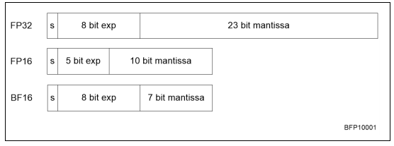

# 计算机中的运算

科学计算等领域中常见的数字类型有：整数（或整型）$\cdots$,-2,-1,0,1,2,$\cdots$ 实数 0，1，-1.5，2/3，$\sqrt 2$，log 10，$\cdots$，以及复数 $1+2i$，$\sqrt3-\sqrt5i, \cdots$， 计算机硬件的组织方式是只给一定的空间来表示每个数字，是「**字节**」（bytes）的倍数，每个字节包含8「**位**」（bits）。典型的数值是整数为4字节，实数为4或8字节，复数为8或16字节。

由于内存空间有限，计算机并不能存储所有范围的数字。整数中计算机只能存储一个范围（Python等语言有任意大的整数，但这没有硬件支持）；而在实数里，甚至不能存储一个范围，因为任意区间[a,b]都包含无限多的数字。任何实数的代表都会导致存储的数字之间存在间隔。计算机中的计算被称为「**有限精度的运算**」（finite precision arithmetic）。由于许多结果是无法表示的，任何导致这种数字的运算都必须通过发出错误或近似的结果来处理。在本章中，我们将研究这种对数值计算的 "真实 "结果的近似的影响。

关于详细的讨论，请参见Overton的书[165]；在网上很容易找到Goldberg的文章[80]。关于算法中舍入误差分析的广泛讨论，见Higham [106] 和Wilkinson [201] 的书。

## 位运算

计算机的最底层是以「**位**」（bits）来存储和表示的。比特，是 "二进制数字 "的简称，分为0和1。使用比特我们就可以用二进制表达数字。
$$
101_2 = 8_{10}
$$
其中的下标表示数字的进制。

存储器的下一个组织层次是「**字节**」（bytes）：一个字节由8位组成，因此可以代表0-255的数值。

**练习 3.1** 使用位操作来测试一个数字是奇数还是偶数。你能多想几种方法吗？

## 整数

科学计算绝大多数情况都是在实数上的运算。除了密码学等应用，对整数的计算很少增加到任意多的位数。也有一些应用，如 "「**粒子模型**」（particle-in-cell）"，可以用位操作来实现。然而，整数在索引计算中仍有经验。

整数通常以16、32或64位存储，16位越来越少，64位则越来越多。这种增长的主要原因不是计算性质的变化，而是因为整数被用于数组索引。数据集的增长（特别是在并行计算中），需要更大的索引。例如，在32位中可以存储从0到 $2^{32}- 1 \approx 4⋅10^9$的数字。换句话说，一个32位的索引可以解决4GB的内存。直到最近，这对大多数用途来说已经足够了；如今，对更大的数据集的需求使得64位索引成为必要。

我们对数组进行索引时只需要正整数。当然，在一般的整数计算中，我们也需要容纳负整数。现在我们将讨论几种实现负整数的策略。我们的初衷是，正负整数的算术应该和正整数一样简单：我们用于比较和操作比特串的电路应该可以用于（有符号）整数。

有几种实现负整数的方法。其中最简单的是保留一位作为**符号位**（sign bit），用剩下的31位（或15位或63位；从现在开始，我们将以32位为标准）位来存储绝对大小。通过比较，我们将把比特串的直接解释称为「**无符号整数**」（unsigned integers）。

| 比特串           | 00⋯0 ... 01⋯1    | 10⋯0 ... 11⋯1       |
| ---------------- | ---------------- | ------------------- |
| 解释为无符号int  | 0 ... $2^{31}-1$ | $2^{31}...2^{32}-1$ |
| 解释为有符号整数 | 0 ... $2^{31}-1$ | $-0...(2^{31}-1)$   |

这种方案有一些缺点，其中之一是同时存在正数和负数0。这意味着对平等的测试变得更加复杂，而不是简单地作为一个位串来测试平等。更重要的是，在比特串的后半部分，作为有符号的整数的解释减少了，向右走了。这意味着对大于的测试变得复杂；同时，将一个正数加到一个负数上，现在必须与将其加到一个正数上区别对待。

另一个解决方案是将无符号数$n$解释为$n-B$，其中$B$是某个合理的基数，例如 $2^{31}$。

| 比特串          | 00⋯0 ... 01⋯1    | 10⋯0 ... 11⋯1       |
| --------------- | ---------------- | ------------------- |
| 解释为无符号int | $0 ... 2^{31}-1$ | $2^{31}...2^{32}-1$ |
| 解释为移位的int | $-2^{31}...-1$   | $0...2^{31}-1$      |

这种移位方案不存在$\pm$0的问题，数字的排序也是一致的。然而，如果我们通过对代表$n$的位串进行操作来计算$n-n$，我们并没有得到零的位串。

为了保证这种理想的行为，我们改用正负数旋转数线，将零的模式放回零处。

由此产生的方案，也就是最常用的方案，被称为「**二进制补码**」（2’s complement）。使用这种方案，整数的表示方法正式定义如下。

**定义2**：设$n$是一个整数，则其二进制$\beta(n)$是个非负整数定义如下：

- 如果$0\leqslant n\leqslant 2^{31}-1$，则使用正常的$n$比特模式，即
  $$
  0 \leq n \leq 2^{31}-1 \Rightarrow \beta(n)=n
  $$

- 对于$-2^{31} \leqslant n \leqslant -1$，$n$是由$2^{32} - |n|$的比特模式表示。

我们用$\eta=\beta-1$来表示接受一个比特模式并解释为整数的反函数。

下表显示了比特串与它们作为二进制整数的解释之间的对应关系。

| 比特串$n$                  | 00...0 ... 01...1 | 10...0 ... 11...1     |
| -------------------------- | ----------------- | --------------------- |
| 解释为无符号int            | $0 ...2^{31}-1$   | $2^{31} ... 2^{32}-1$ |
| 解释$\beta(n)$为二进制整数 | $0 ...2^{31}-1$   | $-2^{31} ... -1$      |

值得注意的是：

- 正整数和负整数的比特模式之间没有重叠，特别是，只有一个零的模式。
- 正数的前导位是零，而负数的前导位是1。这使得前导位就像一个符号位；但是请注意上面的讨论
- 如果你有一个正数𝑛，你可以通过翻转所有的位，然后加1来得到-𝑛。

**练习 3.2** 对于负数的原始方案和二进制补码方案，给出比较测试 $m < n$的伪码，其中 $m$ 和 $n$是整数。请注意区分$m、n$为正数、零数或负数的所有情况。

### 整数溢出

两个相同符号的数字相加，或两个任意符号的数字相乘，都可能导致结果过大或过小而无法表示。这就是所谓的「**溢出**」（overflow）。下面以一个例子进行讨论：

**练习 3.3** 调查一下当你进行这样的计算时会发生什么。如果你试图明确写下一个不可表示的数字，例如在一个赋值语句中，编译器会如何提示？

如果使用C语言，我们可能得到一个有意义的结果，这是因为在有符号数的情况下，C标准下并没有定义溢出行为。

### 二进制加法

让我们考虑对二进制整数做一些简单的算术。我们首先假设我们拥有能处理无符号整数的硬件。我们的目标是看到我们可以用这个硬件对有符号的整数进行计算，就像用二进制表示一样。

我们考虑$m+n$的计算，其中$m，n$是可表示的数字。
$$
0 \leq|m|,|n|<2^{31}
$$
我们区分了不同的情况。

- 简单的情况是 $0 < m, n$。在这种情况下，我们进行正常的加法运算，只要结果保持在$2^{31}$以下，我们就能得到正确的结果。如果结果是$2^{31}$或更多，我们就会出现整数溢出，对此我们无能为力。

  

- 当$m>0，n<0$，并且$m+n>0$.那么$\beta(m)=m$和$\beta(n)=2^{32}-|n|$，所以无符号加法就变成
  $$
  \beta(m)+\beta(n)=m+\left(2^{32}-|n|\right)=2^{32}+m-|n|
  $$
  由于$m - |n|>0$，这个结果$>2^{32}$。(见图 3.1)然而，我们观察到这基本上是$m + n$的第 33 位被设置。如果我们忽略这个溢出的位，我们就会得到正确的结果。

- 当$m>0, n<0$但$m+n<0$，那么
  $$
  \beta(m)+\beta(n)=m+\left(2^{32}-|n|\right)=2^{32}-(|n|-m)
  $$
  因为$|n|-m>0$，所以得到
  $$
  \eta\left(2^{32}-(|n|-m)\right)=-|(|n|-m)|=m-|n|=m+n
  $$

### 二进制减法

在上面的练习3.2中，我们探索了两个整数的比较。现在让我们来探讨一下如何实现两个补码的减法。考虑$0\leqslant m\leqslant 2^{31}-1$和$1\leqslant n\leqslant 2^{31}$，让我们看看在计算$m-n$时会发生什么。

假设我们有一个无符号32位数加减法的算法。我们能不能用它来减去两个补码的整数？我们先观察一下，整数减法$m-n$变成无符号加法$m+(2^{32}-n)$。

- 当$m<|n|$时，$m-n$为负数且$1\leqslant |m-n|\leqslant 2^{31}$，那么$m-n$的比特形式为
  $$
  \beta(m-n)=2^{32}-(n-m)
  $$
  现在，$2^{32}-（n-m）=m+（2^{32}-n）$，所以我们可以通过将$m$和$-n$的位型相加作为无符号整数来计算$m-n$的二进制码。
  $$
  \eta(\beta(m)+\beta(-n))=\eta\left(m+\left(2^{32}-|n|\right)\right)=\eta\left(2^{32}+(m-|n|)\right)=\eta\left(2^{32}-|m-| n||\right)=m-|n|=m+n
  $$

- 当$m>n$，我们注意到$m+(2^{32}-n)=2^{32}+m-n$。由于$m-n>0$，这个数>232，因此不是一个合法的负数表示。然而，如果我们将这个数字存储在33位，我们会发现它是正确的结果$m-n$，加上33位的一个比特。因此，通过执行无符号加法，并忽略溢出位，我们再次得到正确的结果。

在这两种情况下，我们的结论是，我们可以通过将代表$m$和$-n$的无符号数相加，并忽略溢出的情况，来执行减法$m-n$。

### 其他操作

有些操作在二进制中非常简单：乘以2相当于将所有位向左移动一个，而除以2相当于向右移动一位。至少，无符号整数是这样的。

**练习 3.4** 当你使用位移在二进制码中乘以或除以2时，是否有额外的复杂情况？

在C语言中，左移操作是<<，右移是>>，因此

```c
i<<3
```

相当于乘以8。

#### 基于二进制的十进制编码

十进制在科学计算中并不重要，但在金融领域却十分有用，因为设计货币的计算绝对要精确。二进制并不擅长使用十进制转换，因为像1/10这样的数字在二进制中是重复的分数。由于尾数的位数有限，这意味着1/10这个数字不能用二进制精确表示。由于这个原因，二进制的十进制编码方案被用于老式的IBM主机，事实上，在IEEE 754[113]的修订中也被标准化了；另见3.3.7节。

在BCD方案中，一个或多个十进制数字被编码为若干比特。最简单的方案是将数字0 ... 9的四个比特。这样做的好处是，一个BCD数字中每个数字都很容易被识别；它的缺点是，大约有1/3的比特被浪费了，因为4个比特可以编码0 ... 15. 更有效的编码方法是将0 ... 999的10个比特，原则上可以存储数字$0 ... 10^{23}$. 虽然这样做的效率很高，因为浪费的位数很少，但是识别这样一个数字中的各个位数需要一些解码。由于这个原因，BCD算术需要处理器的硬件支持，现在很少有这种支持；一个例子是IBM Power架构，从IBM Power6开始。

### 用于计算机算术的其他数基

已经有一些关于三元运算的实验（见http://en.wikipedia.org/wiki/Ternary_computer和http://www.computer-museum.ru/english/setun.htm），但是，没有实际的硬件存在。

## 实数

在这一节中，我们将研究实数如何在计算机中表示，以及各种方案的局限性。下一节将探讨这对涉及计算机数字的算术的影响。

### 它们不是真正的实数

在数学科学中，我们通常用实数工作，所以假装计算机也能这样做是很方便的。然而，由于计算机中的数字只有有限的比特数，大多数实数都不能被准确表示。事实上，甚至许多分数也不能准确表示，因为它们会重复；例如，1/3=0.333...，这在十进制或二进制中都不能表示。附录37.6中给出了这方面的一个说明。

**练习 3.5** 一些编程语言允许你在写循环时不仅使用整数，还可以使用实数作为 "计数器"。解释一下为什么这是个坏主意。提示：何时达到上界？

一个分数是否重复取决于数字系统。(在二进制计算机中，这意味着像1/10这样的分数是重复的，而在十进制算术中，这些分数的位数是有限的。由于小数运算在金融计算中很重要，所以有些人关心这种算术的准确性；关于对此做了什么，见3.2.4.1节。

**练习3.6** 显示每个二进制分数，即形式为$1.01010111001_2$的数字，都可以精确地表示为一个终止的十进制分数。不是每个十进制分数都能表示为二进制分数的原因是什么？

### 实数的表示

实数的存储方式类似于所谓的 "科学符号"，即一个数字用一个显数和一个指数表示，例如$6.022⋅10^{23}$，它的显数是6022，第一个数字后有一个「**小数点**」（radix point），指数是23。这个数字代表
$$
6.022 \cdot 10^{23}=\left[6 \times 10^{0}+0 \times 10^{-1}+2 \times 10^{-2}+2 \times 10^{-3}\right] \cdot 10^{23}
$$
我们引入一个基数，一个小的整数，在前面的例子中是10，在计算机数字中是2，用它来写数字，作为$t$项的和。
$$
\begin{aligned}
x &=\pm 1 \times\left[d_{1} \beta^{0}+d_{2} \beta^{-1}+d_{3} \beta^{-2}+\cdots+d_{t} \beta^{-t+1} b\right] \times \beta^{e} \\
&=\pm \sum_{i=1}^{t} d_{i} \beta^{1-i} \times \beta^{e}
\end{aligned}
$$
其中的组成部分是

- 「**符号位**」（sign bit）：存储数字是正数还是负数的一个位。

- $\beta$是数字系统的基数。

- $0 \leqslant d_i \leqslant  \beta - 1$ 尾数或显数的位数 - 小数点的位置（小数的小数点）被隐含地假定为小数。小数点的位置被隐含地假定为紧随第一位的位置。

- $t$是尾数的长度。

- $e\in [L,U]$指数；通常$L<0<U$和$L\approx -U$。

注意，整数有一个明确的符号位；指数的符号处理方式不同。出于效率的考虑，$e$不是一个有符号的数字；相反，它被认为是一个超过某个最小值的无符号数字。例如，数字0的比特模式被解释为$e = L$。

#### 案例

让我们看一下浮点表示法的一些具体例子。对于人类来说，基数10是最合理的选择，但计算机是二进制的，所以基数2占据主导地位。老式的IBM大型机将比特分组，使之成为基数16的表示法。
$$
\begin{array}{r|r|r|r|r} 
& \beta & t & L & U \\
\hline \text { IEEE single precision (32 bit) } & 2 & 24 & -126 & 127 \\
\text { IEEE double precision (64 bit) } & 2 & 53 & -1022 & 1023 \\
\text { Old Cray 64 bit } & 2 & 48 & -16383 & 16384 \\
\text { IBM mainframe 32 bit } & 16 & 6 & -64 & 63 \\
\text { packed decimal } & 10 & 50 & -999 & 999 \\
\text { Setun } & 3 & &
\end{array}
$$
其中，单精度和双精度格式是迄今为止最常见的。我们将在第3.3.7节和进一步讨论这些问题。

### 限制：溢出和下溢

由于我们只用有限的比特来存储浮点数，所以不是所有的数字都能被表示出来。那些不能被表示的数字分为两类：那些太大或太小（在某种意义上）的数字，以及那些落在空白处的数字。

第二类是计算结果必须经过四舍五入或截断才能表示，这是舍入误差分析领域的基础。我们将在下面的章节中详细研究这个问题。

数字过大或过小有以下几种情况。溢出 我们可以存储的最大的数字，其每个数字都等于$\beta$。

|          | unit       | fractional                    | exponent |
| -------- | ---------- | ----------------------------- | -------- |
| position | 0          | 1 ... t-1                     |          |
| digit    | $\beta -1$ | $\beta-1 ... \beta -1$        |          |
| value    | 1          | $\beta^{-1}...\beta^{-(t-1)}$ |          |

加起来就是
$$
(\beta-1) \cdot 1+(\beta-1) \cdot \beta^{-1}+\cdots+(\beta-1) \cdot \beta^{-(t-1)}=\beta-\beta^{-(t-1)}
$$
而最小的数字（即最负数）是$-(\beta - \beta^{-(t-1)})$；任何大于前者或小于后者的情况都会导致溢出。大于前者或小于后者都会导致「**溢出**」（overflow）的情况发生。

下溢最接近零的数字是$\beta-(t-1)⋅L$。如果计算结果小于该值(绝对值)，就会导致一种叫做「**下溢**」（underflow）的情况。。

只有少数实数可以被精确表示，这一事实是舍入误差分析领域的基础。我们将在下面的章节中详细研究这个问题。

溢出或下溢的发生意味着你的计算将从这一点上 "出错"。溢出将使计算在本应是非零的地方以零进行；溢出被表示为Inf，简称 "无限"。

**练习 3.7** 对于实数$x,y$，$g=\sqrt{(x^2+y^2/2)}$满足
$$
g\leqslant \max\{|x|,|y|\}
$$
所以，如果𝑥和𝑦是可表示的。如果你用上述公式计算𝑔，会出现什么问题？你能想到一个更好的方法吗？

用Inf计算在某种程度上是可能的：将这些数量中的两个相加又会得到Inf。然而，减去它们会得到NaN："不是一个数字"。

在这些情况下，计算都不会结束：处理器会继续，除非你告诉它不这样做。这个 "否则 "是指你告诉编译器产生一个「**中断**」（interrupt），用一个错误信息来停止计算。见3.6.5节。

### 归一化和非归一化的数字

浮点数的一般定义，方程式（3.1），给我们留下了一个问题，即数字有不止一种表示方法。例如，$.5\times 10^2=.05\times 10^3$。由于这将使计算机运算变得不必要的复杂，例如在测试数字是否相等时，我们使用规范化的浮点数。如果一个数字的第一个数字是非零的，那么这个数字就是归一化的。这意味着尾数部分是
$$
\beta > x_m >1
$$
在二进制数的情况下，一个实际的含义是，第一个数字总是1，所以我们不需要明确地存储它。在IEEE 754标准中，这意味着每个浮点数的形式为
$$
1.d_1d_2...d_t\times 2^{exp}
$$
而只有数字$d_1d_2...d_t$被存储。

这个方案的另一个含义是，我们必须修改下溢的定义(见上面3.3.3节)：任何小于$1⋅\beta L$的数字现在都会导致下溢。试图计算一个绝对值小于该值的数，有时会通过使用非正常化的浮点数来处理，这个过程被称为「**渐进式下溢**」（gradual underflow）。在这种情况下，指数的一个特殊值表明该数字不再被规范化。在IEEE标准算术的情况下，这是通过一个零指数域来实现的。

然而，这通常比用普通的浮点数计算要慢几十或几百倍。在写这篇文章的时候，只有IBM Power6有硬件支持渐进式下溢。

### 表示性误差

让我们考虑一个在计算机的数字系统中无法表示的实数。

一个不可表示的数字可以通过普通四舍五入、向上或向下四舍五入或截断来近似表示。这意味着，一个机器数$x$是它周围的所有$x$的代表。在尾数为$t$的情况下，这是与$x$不同的数字的区间，在$t+1$个数字中。对于尾数部分，我们得到。
$$
\left\{\begin{array}{ll}
x \in\left[\tilde{x}, \tilde{x}+\beta^{-t+1}\right) & \text { truncation } \\
x \in\left[\tilde{x}-\frac{1}{2} \beta^{-t+1}, \tilde{x}+\frac{1}{2} \beta^{-t+1}\right) & \text { rounding }
\end{array}\right.
$$
如果𝑥是一个数字，$\tilde{x}$它在计算机中的表示，我们称$x-\tilde{x}$为「**表示性误差**」（representation error）或「**绝对表示误差**」（absolute representation error），$(x-\tilde{x})/x$为「**相对表示误差**」（relative representation error）。通常情况下，我们对误差的符号不感兴趣。所以我们可以将误差和相对误差分别应用于$|𝑥-\tilde{x}|$和$|\frac{\tilde{x}-x}{x}|$。

通常，我们只对误差的界限感兴趣。如果$\epsilon$是对误差的约束，我们将写成
$$
\tilde{x}=x \pm \epsilon \underset{\mathrm{D}}{\equiv}|x-\tilde{x}| \leq \epsilon \Leftrightarrow \tilde{x} \in[x-\epsilon, x+\epsilon]
$$
对于相对误差，我们注意到
$$
\tilde{x}=x(1+\epsilon) \Leftrightarrow\left|\frac{\tilde{x}-x}{x}\right| \leq \epsilon
$$
让我们考虑一个十进制算术的例子，即$\beta=10$，并且有一个3位数的尾数：$t=3$。数字$x=1.256$，其表示方法取决于我们是四舍五入还是截断。$\tilde{x}_{round} = 1.26$, $\tilde{x}_{truncate} = 1.25$。误差在第四位：如果$\varepsilon =x-\tilde{x}$那么$|\varepsilon| < \beta^{-(t-1)}$。

**练习3.8** 本例中的数字没有指数部分。如果有的话，其误差和相对误差是多少？

**练习3.9** 如上所述，在二进制运算中，单位数总是1。这对表示错误有什么影响？

### 机器精度

通常我们只对表示误差的数量级感兴趣，我们将写$\tilde{x}=x（1+\varepsilon）$，其中$|\epsilon| \leqslant  \beta-t$。这个最大的相对误差被称为「**机器精度**」（machine precision）（有时也称为machine epsilon），典型的数值是。
$$
\left\{\begin{array}{ll}
\epsilon \approx 10^{-7} & \text { 32-bit single precision } \\
\epsilon \approx 10^{-16} & \text { 64-bit double precision }
\end{array}\right.
$$
机器精度可以用另一种方式定义：$\epsilon$是可以加到1上的最小的数字，这样$1+\epsilon$的表示方法与1不同。一个小例子表明，对齐指数可以转移一个太小的操作数，这样它在加法运算中就被有效地忽略。
$$
\begin{aligned}
1.0000 & \times 10^{0} \\
+\quad 1.0000 & \times 10^{-5} \\
\hline
\end{aligned} \Rightarrow 
\begin{aligned}
& \quad 1.0000 &\times 10^0 \\
+& \quad 0.00001 &\times 10^0\\
\hline=& \quad 1.0000 & \times 10^{0}
\end{aligned}
$$
另一种方法是，在加法$x+y$中，如果$x$和$y$的比例过大，结果将与$x$相同。

机器精度是计算可达到的最大精度：如果要求单精度超过6位或更多位数的精度，或者双精度超过15位，是没有意义的。

**练习3.10** 写一个小程序，计算机器的$\epsilon$值。如果你把编译器的优化级别设置得低或高，有什么区别吗？

**练习3.11** 数字$e\approx 2.72$，自然对数的基数，有多种定义。其中一个是
$$
e=\lim_{n\rightarrow \infty}(1+1/n)^n.
$$
写一个单精度程序，尝试用这种方式计算$e$。评估上界$n=10^k$的表达式，$k=1, .... , 10$. 解释一下大$n$的输出。对误差的行为进行评论。

### IEEE 754的浮点数标准

几十年前，像尾数的长度和操作的四舍五入行为等问题在不同的计算机制造商之间，甚至在同一制造商的不同型号之间可能会有所不同。从代码的可移植性和结果的可重复性来看，这显然是一个坏情况。IEEE 754标准对这一切进行了编纂，例如，规定单精度和双精度算术的尾数为24和53位，使用符号位、指数、尾数的存储序列，见图3.2。图中列出了单精度标准中所有可能的位模式的含义。
$$
\begin{array}{|l||l||l|}
\hline \text { sign } & \text { exponent } & \text { mantissa } \\
\hline p & e=e_{1} \cdots e_{8} & s=s_{1} \cdots s_{23} \\
\hline 31 & 30 \cdots 23 & 22 \cdots 0 \\
\hline \pm & 2^{e-127} & 2^{-s_{1}}+\cdots+2^{-s_{23}} \\
& \text { (except } e=0,255) & \\
\hline
\end{array}
\begin{array}{|l||l||l|}
\hline \text { sign } & \text { exponent } & \text { mantissa } \\
\hline s & e_{1} \cdots e_{11} & s_{1} \ldots s_{52} \\
\hline 63 & 62 \cdots 52 & 51 \cdots 0 \\
\hline
\end{array}
$$
**注释 11** 754标准的全称是'IEEE二进制浮点运算标准（AN- SI/IEEE Std 754-1985）'。它也与IEC 559：'微处理器系统的二进制浮点算术'相同，被ISO/IEC/IEEE 60559:2011所取代。

IEEE 754是二进制算术的标准；还有一个标准，IEEE 854，允许十进制算术。

**注释 12** 令人瞩目的是，在场的这么多硬件人士在知道p754有多难的情况下，都同意它应该对整个社区有益。如果它能鼓励浮点软件的生产，缓解可靠软件的开发，就能为大家的硬件创造一个更大的市场。这种利他主义的程度是如此惊人，以至于MATLAB的创建者Cleve Moler博士曾经建议外国游客不要错过该国最令人敬畏的两大景观：大峡谷和IEEE p754的会议。W. Kahan，http://www.cs.berkeley.edu/~wkahan/ieee754status/754story.html。

该标准还宣布四舍五入行为是正确的四舍五入：一个操作的结果应该是精确结果的四舍五入版本。关于四舍五入（和截断）对数字计算的影响，下面会有更多的介绍。


在上面，我们已经看到了溢出和下溢的现象，也就是导致不可表示的数字的操作。还有一种特殊情况需要处理：如果程序要求进行非法运算，如$\sqrt{-4}$，应该返回什么结果？IEEE 754标准对此有两个特殊量。Inf和NaN代表 "无穷大 "和 "不是一个数字"。Inf是指溢出或除以0的结果，not-a-number是指，例如，从infinity中减去infinity的结果。如果NaN出现在一个表达式中，整个表达式将评估为该值。用Inf计算的规则要复杂一些[80]。

图3.3给出了IEEE 754单精度中所有位模式的含义清单。从上面可以看出，对于归一化的数字，第一个非零位是1，它不被存储，所以位模式$d_1d_2 ... d_t$被解释为$1.d_1d_2 ... d_t$ 。

**练习 3.12** 每个程序员都会犯这样的错误：将一个实数存储在一个整数中，或者反过来存储。例如，如果你调用一个函数的方式与它的定义不同，就会发生这种情况。

```c
void a(double x) {....}
    int main() {
      int i;
      .... a(i) ....
}
```

当在函数中打印x时会发生什么？考虑一个小整数的比特模式，并使用图3.3中的表格将其解释为一个浮点数。解释一下，它将是一个未归一化的数字。

如今，几乎所有的处理器都遵守了IEEE 754标准。早期的NVidia Tesla GPU在单精度方面不符合标准。这样做的理由是，单精度更可能用于图形，在那里，准确的合规性不太重要。对于许多科学计算，双精度是必要的，因为计算的精度会随着问题大小或运行时间的增加而变差。这对于第四章中的那种计算来说是正确的，但对于其他的计算，如格子玻尔兹曼法（LBM），则不是这样。

### 浮点数异常

各种各样的操作可能会给出一个无法表示为浮点数的结果。这种情况被称为**异常**（exception），我们说提出了一个异常。结果取决于错误的类型，而计算则正常进行。(可以让程序中断：第3.6.6节)。

#### Not-a-Number

以下情况处理器将表示为NaN（'不是一个数字'）的结果。

- 两个无穷大相减，注意两个无穷大相加仍为无穷大
- 0乘以无穷大
- 0除以0或无穷大除以无穷大
- $\sqrt x$当$x<0$时
- 比较 $x < y$ 或 $x > y$ 时，其中任意一个数为$NaN$

由于处理器可以继续对这样的数字进行计算，所以它被称为「**安静的NaN**」（quiet NaN）。相比之下，一些NaN数量可以导致处理器产生一个中断或异常。这被称为「**信号型NaN**」（signalling NaN）。

信号NaN是有用途的。例如，你可以用这样一个值来填充分配的内存，以表明它在计算中是未初始化的。任何使用这样一个值的行为都是一个程序错误，并会引起一个异常。

2008年修订的IEEE 754建议使用NaN的最有效位作为is_quiet位来区分安静和信号NaN。

关于GNU编译器中对Nan的处理，请参见https://www.gnu.org/software/libc/manual/html_node/Infinity-and-NaN.html。

#### 除以零

除以0的结果是Inf。如果一个结果不能作为一个有限的数字来表示，就会引发这个异常。

#### 下溢

如果一个数字太小，不能被表示，就会出现这个异常。

#### 不精确

如果出现不精确的结果，例如平方根，就会引发这个异常，如果没有被困住，就会出现溢出。

## 舍入误差分析

过大或过小的数字无法表示，导致溢出和下溢，是不正常的：通常可以安排计算，使这种情况不会发生。相比之下，计算机数字之间的计算结果（甚至像一个简单的加法）无法表示的情况是非常普遍的。因此，看一个算法的实现，我们需要分析这种小错误在计算中传播的影响。这就是通常所说的「**舍入误差分析**」（round-off error analysis）。

### 正确的舍入

3.3.7节中提到的IEEE 754标准，不仅声明了浮点数的存储方式，还给出了加、减、乘、除等运算的准确性标准。该标准中的算术模型是正确的四舍五入模型：一个操作的结果应该像遵循以下程序一样。

- 计算出运算的确切结果，无论这是否可以表示。

- 然后将这个结果四舍五入到最接近的计算机数字。

简而言之：一个操作的结果的表示就是该操作的四舍五入的准确结果。(当然，在两次操作之后，它不再需要坚持计算的结果是精确结果的四舍五入版本)。

如果这句话听起来微不足道或不言而喻，请考虑以减法为例。在尾数为两位的十进制数制中，计算结果为$1.0 - 9.4 ⋅ 10^{-1} = 1.0 - 0.94 = 0.06 = 0.6 ⋅ 10^{-2}$。请注意，在一个中间步骤中，尾数.094出现了，它比我们为我们的数字系统声明的两个数字多了一个数字。这个额外的数字被称为「**警戒位**」（guard digit）。

如果没有警戒位，这个运算将以$1.0-9.4⋅10^{-1}$的形式进行，其中$9.4⋅10^{-1}$将被四舍五入为0.9，最终结果为0.1，这几乎是正确结果的两倍。

**练习 3.13** 考虑$1.0-9.5⋅10^{-1}$的计算，并再次假设数字被四舍五入以适应两位数的尾数。为什么这个计算在某种程度上比刚才的例子要差很多？

一个警戒位不足以保证正确的舍入。一项我们在此不做转载的分析表明，需要额外的三个比特[79]。

#### 多重添加操作

2008年，IEEE 754标准进行了修订，以包括融合乘加（FMA）操作的行为，也就是说，操作形式为
$$
c \leftarrow a * b +c.
$$
这种操作有两方面的动机。

首先，FMA有可能比单独的乘法和加法更精确，因为它可以对中间结果使用更高的精度，例如使用80位的扩展精度格式；3.7.3节。

这里的标准定义了正确的四舍五入，即这种组合计算的结果应该是四舍五入后的正确结果。这种操作的原始实现将涉及两次舍入：一次在乘法之后，一次在加法之后3。

**练习3.14** 你能想出一个例子，说明对FMA进行正确的舍入比对乘法和加法分别进行舍入更准确吗？提示：让c项的符号与a*b相反，并尝试在减法中强制取消。

其次，FMA指令是一种获得更高性能的方法：通过流水线，我们可以在每个周期内获得两个操作。因此，一个FMA单元比单独的加法和乘法单元更便宜。幸运的是，FMA在实际计算中经常出现。

**练习3.15** 你能想到一些以FMA运算为特征的线性代数运算吗？参见1.2.1.2节，了解FMA在处理器中的历史应用。

### 加法

两个浮点数的加法是通过几个步骤完成的。首先，指数被对齐：两个数字中较小的数字被写成与较大的数字具有相同的指数。然后再加上尾数。最后，对结果进行调整，使其再次成为一个标准化的数字。

作为一个例子，考虑$1.00+2.00×10^{-2}$。对准指数，这就变成了1.00+0.02=1.02，这个结果不需要最后调整。我们注意到这个计算是精确的，但是和$1.00+2.55×10^{-2}$有同样的结果，这里的计算显然是不精确的：精确的结果是1.0255，它不能用三位数的尾数来表示。

在$6.15\times 10^1+3.98\times 10^1=10.13\times 101=1.013\times 10^2\rightarrow 1.01\times 10^2$的例子中，我们看到在加上尾数后，需要对指数进行调整。误差又来自于对不适合尾数的结果的第一个数字的截断或四舍五入：如果$x$是真实的和，$\tilde{x}$是计算的和，那么$\tilde{x}=x(1+\varepsilon)$ 其中，3位尾数$|\varepsilon|<10^{-3}$。

形式上，让我们考虑计算$s=x_1+x_2$，我们假设数字$i$表示为$\tilde{x}_i= x_i(1 + \varepsilon_i)$。那么和$s$就表示为
$$
\begin{aligned}
\tilde{s} &=\left(\tilde{x}_{1}+\tilde{x}_{2}\right)\left(1+\epsilon_{3}\right) \\
&=x_{1}\left(1+\epsilon_{1}\right)\left(1+\epsilon_{3}\right)+x_{2}\left(1+\epsilon_{2}\right)\left(1+\epsilon_{3}\right) \\
& \approx x_{1}\left(1+\epsilon_{1}+\epsilon_{3}\right)+x_{2}\left(1+\epsilon_{2}+\epsilon_{3}\right) \\
& \approx s(1+2 \epsilon)
\end{aligned}
$$
在所有$\epsilon_i$都很小且大小大致相等，并且$𝑥_𝑖>0$的假设下，我们看到相对误差在加法下被加上了。

### 乘法

浮点乘法，就像加法一样，包括几个步骤。为了使两个数字$m_1\times \beta^{e_1}$和$m_2\times\beta^{e_2}$相乘，需要采取以下步骤。

- 指数相加：$e \leftarrow e_1 + e_2$。
 - 尾数相乘： $m \leftarrow m_1 \times m_2$。
 - 尾数被归一化，指数也相应调整。

例如：$1.23·10^0 ×5.67⋅10^1 =0.69741⋅10^1→6.9741⋅10^0→6.97⋅10^0$。

**练习 3.16** 分析乘法的相对误差。

### 减法

减法的表现与加法非常不同。在加法中，误差是相加的，只是逐步增加整体的舍入误差，而减法则有可能在一次操作中大大增加误差。

例如，考虑尾数为3位的减法：$1.24 - 1.23 = 0.01 → 1.00⋅ 10^{-2}$。虽然结果是准确的，但它只有一个有效数字4 。为了了解这一点，可以考虑这样的情况：第一个操作数1.24实际上是一个四舍五入的计算结果，其结果应该是1.235。在这种情况下，减法的结果应该是$5.00 ⋅ 10^{-3}$，也就是说，存在100%的误差，尽管输入的相对误差是可以预期的小。显然，涉及这一减法结果的后续操作也将是不准确的。我们的结论是，减去几乎相等的数字可能是造成数字四舍五入的原因。

这个例子有一些微妙之处。几乎相等的数字的减法是准确的，而且我们有IEEE算术的正确舍入行为。尽管如此，单一运算的正确性并不意味着包含它的运算序列会是准确的。虽然加法的例子只显示了数字精度的适度下降，但这个例子中的取消会产生灾难性的影响。你会在第3.5.1节看到一个例子。

**练习3.17**  考虑迭代
$$
x_{n+1}=f\left(x_{n}\right)=\left\{\begin{array}{ll}
2 x_{n} & \text { if } 2 x_{n}<1 \\
2 x_{n}-1 & \text { if } 2 x_{n} 1
\end{array}\right.
$$
这个函数是否有一个固定点，$x_0\equiv f(x_0)$，或者是否有一个循环$x_1=f(x_0)，x_0\equiv x_2=f(x_1)$等等？现在对这个函数进行编码。是否有可能重现固定点？不同的起始点$x_0$会发生什么。你能解释一下吗？

### 关联性

处理浮点数的方式的另一个影响是对运算的「**关联性**」（associativity），如求和。虽然求和在数学上是关联性的，但在计算机运算中却不再是这样。

让我们考虑一个简单的例子，说明这如何由浮点数的舍入行为引起。让浮点数存储为尾数的一个数字，指数的一个数字，以及一个保护数字；现在考虑4+6+7的计算。从左到右的计算结果是：
$$
\begin{array}{rlr}
\left(4 \cdot 10^{0}+6 \cdot 10^{0}\right)+7 \cdot 10^{0} & \Rightarrow 10 \cdot 10^{0}+7 \cdot 10^{0} & \text { addition } \\
& \Rightarrow 1 \cdot 10^{1}+7 \cdot 10^{0} & \text { rounding } \\
& \Rightarrow 1.0 \cdot 10^{1}+0.7 \cdot 10^{1} & \text { using guard digit } \\
& \Rightarrow 1.7 \cdot 10^{1} & \\
& \Rightarrow 2 \cdot 10^{1} & \text { rounding }
\end{array}
$$
另一方面，从右到左的评估给出了。
$$
\begin{aligned}
4 \cdot 10^{0}+\left(6 \cdot 10^{0}+7 \cdot 10^{0}\right) & \Rightarrow & 4 \cdot 10^{0}+13 \cdot 10^{0} & & \text { addition } \\
& \Rightarrow & 4 \cdot 10^{0}+1 \cdot 10^{1} & & \text { rounding } \\
& \Rightarrow & 0.4 \cdot 10^{1}+1.0 \cdot 10^{1} & & \text { using guard digit } \\
& \Rightarrow & 1.4 \cdot 10^{1} & & \\
& \Rightarrow & 1 \cdot 10^{1} & & \text { rounding }
\end{aligned}
$$
结论是，对中间结果进行四舍五入和截断的顺序是有区别的。你还可以观察到，从较小的数字开始会得到更准确的结果。在3.5.2节中，你会看到这个原理的一个更详细的例子。

**练习 3.18** 上面的例子使用了四舍五入。你能在算术系统中想出一个使用截断的类似例子吗？

通常情况下，表达式的求值顺序是由编程语言的定义决定的，或者至少是由编译器决定的。在第3.5.5节中，我们将看到在并行计算中，关联性不是那么唯一地确定。

## 舍入误差的例子

从上面的介绍中，读者可能会得到这样的印象：舍入误差只在特殊情况下才会导致严重的问题。在这一节中，我们将讨论一些非常实际的例子，在这些例子中，计算机算术的不精确性在计算结果中变得非常明显。这些将是相当简单的例子；更复杂的例子存在于本书的范围之外，例如矩阵反演的不稳定性。有兴趣的读者可以参考[201，106]。

### 取消："abc模式"。

作为一个实际的例子，考虑二次方程$ax^2+bx+c=0$，其解$x=\frac{-b \pm \sqrt {b^2-4ac}}{2a}$。假设$b>0$且$b^2>>4ac$，则$\sqrt{b^2-4ac}\approx b$，'+'解将是不准确的。在这种情况下，最好计算$x_-= -b-\sqrt{b^2-4ac}$并使用$𝑥_+ - x_- =c/a$。

**练习 3.19** 探索计算的根基
$$
\varepsilon x^2- (1+\varepsilon ^2)x+\varepsilon
$$
通过 "教科书 "的方法，并如上所述。

- 这些根是什么？
- 为什么 "教科书 "方法把一个小的根计算为零？
- 两种方法计算的函数值是多少？相对误差？

**练习3.20** 写一个程序来计算一元二次方程的根，包括 "教科书 "上的方法和上面描述的方法。

- 让$b=-1$，$a=-c$，$4ac\downarrow 0$，逐步取较小的$a$和$c$值。
- 打印出计算出的根，使用稳定计算的根，以及计算出的根中的$f（x）= ax^2 + bx + c$的值。

现在，假设你不太关心根的实际值：你想确保在计算的根中，残差$f（x）$很小。让$x^∗$ 是准确的根，那么
$$
f\left(x^{*}+h\right) \approx f\left(x^{*}\right)+h f^{\prime}\left(x^{*}\right)=h f^{\prime}\left(x^{*}\right)
$$
现在分别研究$a \downarrow  0$,$c = -1$ 和 $a = -1$,$ c \downarrow 0$ 的情况，你能解释其中的区别吗？

**练习 3.21** 考虑函数
$$
\left\{\begin{array}{l}
f(x)=\sqrt{x+1}-\sqrt{x} \\
g(x)=1 /(\sqrt{x+1}+\sqrt{x})
\end{array}\right.
$$

- 证明它们在精确算术中是相同的；但是。

- 证明$f$可以表现出取消，而$g$则没有这个问题。

- 编写代码以显示$f$和$g$之间的差异。你可能需要使用较大的$x$的值。

- 从𝑥和机器精度的角度来分析取消的情况。当$\sqrt{x+1}$和$\sqrt{x}$的距离小于$\varepsilon$？这时会发生什么？(为了更精确的分析，当它们之间相差$\sqrt \varepsilon$，又是如何表现出来的？）

- 𝑦＝𝑓（𝑥）的反函数是
  $$
  x=(y^2-1)^2/(4y^2)
  $$
  把这个添加到你的代码中。这是否说明了计算的准确性？

请确保在单精度和双精度下测试你的代码。如果你会用python，可以试试bigfloat包。

### 总结系列

前面的例子是关于防止一次操作中出现大的舍入误差。这个例子表明，即使是逐渐积累的舍入误差也可以用不同的方法来处理。

考虑总和$\sum_{n=1}^{10000}\frac{1}{n^2} = 1.644834$，假设我们使用的是单精度，这对大多数计算机上意味着机器精度为 $10^{-7}$. 这个例子的问题在于，无论是项之间的比率，还是项与部分和的比率，都在不断增加。在 3.3.6 节中，我们注意到过大的比率会导致加法的一个操作数被忽略。

如果我们按照给出的序列对数列进行求和，我们会发现第一项是 1，所以所有的部分和（$\sum^N_{n=1}$，其中$N < 10000$）至少是 1。这意味着任何 $1/n^2 < 10^{-7}$ 的项都会被忽略，因为它小于机器精度。具体来说，最后7000个项被忽略，计算出的总和是1.644725。前4位数字是正确的。

然而，如果我们以相反的顺序评估和，我们会得到单精度的精确结果。我们仍然是把小量加到大量上，但现在的比例永远不会像一比$\epsilon$那样糟糕，所以小的数字永远不会被忽略。要看到这一点，请考虑两个项的比率随后的项。
$$
\frac{n^{2}}{(n-1)^{2}}=\frac{n^{2}}{n^{2}-2 n+1}=\frac{1}{1-2 / n+1 / n^{2}} \approx 1+\frac{2}{n}
$$
由于我们只对105项求和，而且机器的精度是10-7，所以在加法1/𝑛2+1/(𝑛-1)2中，第二项不会像我们从大到小求和时那样被完全忽略。

**练习 3.22** 在我们的推理中还缺少一个步骤。我们已经表明，在加两个后续项时，较小的一项不会被忽略。然而，在计算过程中，我们对序列中的下一个项添加了部分和。说明这不会使情况恶化。

这里的教训是，单调（或接近单调）的数列应该从小到大相加，因为如果要加的量的大小比较接近，误差就最小。请注意，这与减法的情况相反，涉及类似数量的操作会导致较大的误差。这意味着，如果一个应用要求对数列进行加减运算，而我们预先知道哪些项是正数，哪些项是负数，那么相应地重新安排算法可能会有收获。

**练习3.23** 正弦函数定义为
$$
\begin{aligned}
\sin (x) &=x-\frac{x^{3}}{3 !}+\frac{x^{5}}{5 !}-\frac{x^{7}}{7 !}+\cdots \\
&=\sum_{i \geq 0}^{\infty}(-1)^{i} \frac{x^{2 i+1}}{(2 i+1) !}
\end{aligned}
$$
下面是两个计算这个和的代码片段（假设给定了$x$和$n$个项）。

```c
double term = x, sum = term;
for (int i=1; i<=nterms; i+=2) {
  term *=
    - x*x / (double)((i+1)*(i+2));
  sum += term; 
}
printf("Sum: %e\n\n",sum);
```

```c
double term = x, sum = term;
double power = x, factorial = 1., factor = 1.;
for (int i=1; i<=nterms; i+=2) {
  power *= -x*x;
  factorial *= (factor+1)*(factor+2);
  term = power / factorial;
  sum += term; factor += 2;
}
printf("Sum: %e\n\n",sum);
```

- 解释一下，如果你计算$x>1$的大量项会发生什么。
- 对于大量的术语，这两种代码是否有意义？
- 是否有可能从最小的项开始对其进行求和？
- 你能提出其他方案来改进sin(𝑥)的计算吗？

### 不稳定的算法

现在我们将考虑一个例子，在这个例子中，我们可以直接论证该算法无法应对因不准确表示的实数而引起的问题。

考虑递归$y_n=\int^1_0\frac{x^n}{x-5}dx=\frac{1}{n}-5y_{n-1}$，它是单调递减的；第一个项可以计算为 $y_0 = ln6 - ln5$。

以小数点后3位数进行计算，我们得到。
$$
\begin{array}{lll}
\text { computation } &\ &\text {correct result } \\
y_{0}=\ln 6-\ln 5=.182 \mid 322 \times 10^{1} \ldots & &1.82 \\
y_{1}=.900 \times 10^{-1} & &.884 \\
y_{2}=.500 \times 10^{-1} & &.0580 \\
y_{3}=.830 \times 10^{-1} &\text { going up? } & .0431 \\
y_{4}=-.165 &\text { negative? } & .0343\\

\end{array}
$$
我们看到，计算出来的结果很快就不只是不准确，而且实际上是毫无意义的。我们可以分析一下为什么会出现这种情况。

如果我们将$n$在第$n$步中的误差$\varepsilon_n$定义为：
$$
\tilde{y}_n-y_n = \varepsilon_n,
$$
 那么
$$
\tilde{y}_n=1/n-5\tilde{y}_{n-1}=1/n+5n_{n-1}+5\varepsilon_{n-1}=y_n+5\varepsilon_{n-1}
$$
于是$\varepsilon_n \geqslant 5\varepsilon_{n-1}$. 这种计算所产生的误差呈现指数式增长。

### 线性系统求解

有时我们甚至可以在不指定使用何种算法的情况下对问题的数值精度做出说明。假设我们想解决一个线性系统，也就是说，我们有一个$n\times n$矩阵和一个大小为$n$的向量$b$，我们想计算出使$Ax=b$的向量。(由于向量𝑏将是某种计算或测量的结果，我们实际上是在处理一个向量$\tilde{b}$，它是理想𝑏的某种扰动。
$$
\tilde{b}=b+\Delta b.
$$
扰动向量$\Delta b$可以是机器精度的数量级，如果它仅仅来自于代表误差。

扰动向量$\Delta b$可以是机器精度的数量级，如果它仅仅来自于代表误差，或者它可以更大，这取决于产生$\tilde{b}$的计算。

我们现在要问的是$x$的精确值与计算值之间的关系，前者是通过对$A$和$b$进行精确计算得到的，而后者是通过对$A$和$\tilde{b}$进行计算得到的。（在讨论中我们将假设𝐴本身是精确的，但这是一种简化）。

写作$\tilde{x}=x+\Delta x$，我们的计算结果现在是
$$
A\tilde{x}=\tilde{b}
$$
或者
$$
A(x+\Delta x)=b+\Delta b.
$$
由于$Ax = b$，我们得到$A\Delta x = \Delta b$。由此，我们可以得到（详见附录13）。
$$
\left\{\begin{aligned}
\Delta x &=A^{-1} \Delta b \\
A x &=b
\end{aligned}\right\} \Rightarrow\left\{\begin{array}{rl}
\|A\|\|x\| & \geqslant \|b\| \\
\|\Delta x\| & \leqslant \left\|A^{-1}\right\| \Delta b \|
\end{array} \Rightarrow \frac{\|\Delta x\|}{\|x\|} \leqslant \|A\|\left\|A^{-1}\right\| \frac{\|\Delta b\|}{\|b\|}\right.
$$
$\|A\|\|A^{-1}\|$的数量被称为矩阵的条件数。边界（3.2）说的是，任何右手边的扰动都会导致解决方案的扰动，该扰动最多只能大于矩阵的条件数$A$。请注意，这并不是说𝑥的扰动必须接近这个大小，但我们不能排除这个可能性，而且在某些情况下，确实可以达到这个界限。

假设$b$是精确到机器精度的，并且$A$的条件数是$10^4$。边界（3.2）通常被解释为：$x$的最后4位数字是不可靠的，或者说，计算 "失去了4位数字的准确性"。

方程（3.2）也可以解释为：当我们解决一个线性系统$ Ax = b$时，我们得到一个近似解$x + \Delta x$，这是一个扰动系统$A（x + \Delta x） = b+ \Delta b$的精确解。解中的扰动可以与系统中的扰动相关，这一事实可以通过说该算法表现出逆向稳定性来表达。

线性代数算法的精度分析本身就是一个研究领域；例如，见Higham的书[106]。

### 并行计算中的舍入误差

正如我们在第3.4.5节中所讨论的，以及你在上面的数列求和的例子中所看到的，计算机算术中的加法不是关联的。一个类似的事实也适用于乘法。这对并行计算来说有一个有趣的结论：计算在并行处理器上的分布方式会影响结果。

作为一个简单的例子，考虑计算总数 $a+b+c+d$。在单个处理器上，普通执行对应于以下关联性。
$$
((a+b)+c)+d
$$
另一方面，将这个计算分散到两个处理器上，其中处理器0有$a$，$b$，处理器1有$c$，$d$，相当于
$$
((a+b)+(c+d))
$$
推而广之，我们看到，在不同数量的处理器上，规约操作很可能会得到不同的结果。(MPI标准规定，在同一组处理器上运行的两个程序应该得到相同的结果）。有可能规避这个问题，用对所有处理器的集合操作来代替还原操作，然后再进行局部规约。然而，这增加了处理器的内存需求。

对于并行求和问题，还有一个有趣的解决方案。如果我们用4000比特的尾数来存储浮点数，就不需要指数，这样存储的数字的所有计算都是精确的，因为它们是定点计算的一种形式[129, 128]。虽然用这样的数字做整个应用是非常浪费的，但只为偶尔的内积计算保留这种方案可能是解决可重复性问题的办法。

## 编程语言中的计算机运算

不同的语言有不同的方法来声明整数和浮点数。这里我们研究一些问题。

### Fortran

在Fortran中，变量声明可以采取各种形式。例如，一个类型标识符有可能声明存储一个变量所需的字节数integer2, real8。这种方法的一个优点是容易与其他语言或MPI库互操作。

通常情况下，可以只用INTEGER、REAL来写代码，用编译器标志来表示整数和实数的字节数大小。

更复杂的、现代版本的Fortran可以指出一个浮点数需要有多少位的精度。

```fortran
integer, parameter :: k9 = selected_real_kind(9)
real(kind=k9) :: r
r = 2._k9; print *, sqrt(r) ! prints 1.4142135623730
```

`kind` 值通常为4,8,16，但这取决于编译器。

C99和Fortran2003 最近的C语言和Fortran语言的标准包含了C/Fortran in-teroperability标准，它可以用来声明一种语言的类型，使其与另一种语言的某种类型兼容。

### C

在C语言中，常用的类型标识符并不对应于一个标准的长度。对于整数来说，有short int、int、long int，而对于浮点float来说，有double。sizeof()操作符给出了用于存储一个数据类型的字节数。

C整数的数值范围在limit.h中定义，通常给出一个上限或下限。例如，INT_MAX被定义为32767或更大。

浮点类型在float.h中指定。

C语言中存在指定的存储类型：常数如int64_t是由stdint.h中的typedef定义的。

常数NAN是在math.h中声明的。对于检查一个值是否为NaN，可以使用isan()。

#### Printing bit patterns

```c
// printbits.c
void printBits(size_t const size, void const * const ptr) {
  unsigned char *b = (unsigned char*) ptr;
  unsigned char byte;
  int i, j;
  
  for (i=size-1;i>=0;i--) for (j=7;j>=0;j--) {
    byte = (b[i] >> j) & 1;
    printf("%u", byte);
  }
}
```

用作:

```c
// bits.c
int five = 5;
printf("Five=%d, in bits: ",five); 
printBits(sizeof(five),&five); 
printf("\n");
```

### C++

C++语言有以下浮点类型。

- float：这通常是作为IEEE 754 32位浮点数实现的。

- double：定义为至少和浮点数一样精确，通常实现为IEEE 754的64位浮点数。

- long double：这也被定义为至少和double一样精确。在一些架构上，它可以是80位的扩展精度，在其他架构上则是全128位的精度。处理器通常通过软件和硬件功能的结合来实现后者，所以性能会比前两种类型低很多。

####  边界

你仍然可以使用C头的limit.h或 climits，但最好使用std::numeric_limits，它在类型上是模板化的。比如说

```c++
std::numerical_limits<int>.max();
```

有以下几种功能。

- std::numeric_limits<T>::max() for the largest number.
- std::numeric_limits<T>::min() for the smallest normalized positive number. 
- std::numeric_limits<T>::lowest() for the most negative number. 
- std::numeric_limits<T>::epsilon() for machine epsilon.
- std::numeric_limits<T>::denorm_min() for smallest subnormal. (See also std::numeric_limits<T >::has_denorm.)
- std::nextafter(x,y)

#### 例外的情况

定义的例外情况。

- FE_DIVBYZERO pole error occurred in an earlier floating-point operation.

- FE_INEXACT inexact result: rounding was necessary to store the result of an earlier floating-point operation.

- FE_INVALID domain error occurred in an earlier floating-point operation.

- FE_OVERFLOW the result of the earlier floating-point operation was too large to be representable.

- FE_UNDERFLOW the result of the earlier floating-point operation was subnormal with a loss of

  precision.

- FE_ALL_EXCEPT bitwise OR of all supported floating-point exceptions .

用法：

```c++
std::feclearexcept(FE_ALL_EXCEPT); 
if(std::fetestexcept(FE_UNDERFLOW)) { /* ... */ }
```

在C++中，std::numeric_limits<double>::quiet_NaN()是在limit中声明的，如果std::numeric_limits::has_quiet_NaN为真，这就是有意义的，如果std::numeric_limits::is_iec559为真。(ICE 559本质上是IEEE 754；见3.3.7节)。

同一模块还有 infinity() 和 signaling_NaN()。

对于检查一个值是否为NaN，可以使用C++中cmath的std::isan()。请进一步参阅http://en.cppreference.com/w/cpp/numeric/math/nan。

#### 例外情况

IEEE 754标准和C++语言都定义了一个例外的概念，这两个概念是相互不同的。754例外是指 "没有适合每个合理应用的结果 "的操作的发生。这不一定能转化为语言定义的异常。

#### 打印位元模式

```c++
// bitprint.cxx
void format(const std::string &s) 
{
  // sign bit
  std::cout << s.substr(0,1) << ' '; 
  // exponent
  std::cout << s.substr(1,8);
  // mantissa in groups of 4
  for(int walk=9;walk<32;walk+=4) 
    std::cout << ' ' << s.substr(walk,4);
  // newline
  std::cout << "\n"; 
}

   uint32_t u; 
   std::memcpy(&u,&d,sizeof(u)); 
   std::bitset<32> b{u}; 
   std::stringstream s;
    s << std::hexfloat << b << '\n'; 
    format(s.str());
    //codesnippet cppbitprint
    return 0; 
}
```

### 程序设计中的舍入行为

从上面的讨论中可以看出，一些对数学实数成立的简单说法在浮点数上并不成立。例如，在浮点运算中
$$
(a+b)+c\neq +(b+c)
$$
这意味着编译器不能在不影响取舍行为的情况下进行某些优化。在一些代码中，这种轻微的差异是可以被容忍的，例如，因为方法有内置的保护措施。例如，第5.5节的静止迭代方法就能抑制任何引入的错误。

另一方面，如果程序员在编写代码时考虑到了舍入行为，那么编译器就没有这样的自由了。这在上面的练习3.10中有所暗示。我们用价值安全的概念来描述编译器被允许如何改变计算的解释。在最严格的情况下，编译器是不允许做任何影响计算结果的改变的。

编译器通常有一个选项，控制是否允许优化，以改变数值行为。对于英特尔的编译器，它是-fp-model=....。另一方面，像-Ofast这样的选项只是为了提高性能，可能会严重影响数值行为。对于Gnu编译器来说，完全符合754标准的选项是-frounding-math，而-ffast-math则允许以性能为导向的编译器转换，这违反了754和/或语言标准。

如果你关心结果的可重复性，这些问题也很重要。如果一个代码被两个不同的编译器编译，用相同的输入运行时，应该有相同的输出？如果一个代码在两个不同的处理器配置上并行运行？这些问题是非常微妙的。在第一种情况下，人们有时会坚持位数的可重复性，而在第二种情况下，只要结果保持 "科学 "上的等价，一些差异是允许的。当然，这个概念是很难做到严格的。

下面是在考虑编译器对代码行为和重现性的影响时的一些相关问题。

**重新关联** 在编译器对计算所做的改变中，最重要的是重新关联，即把𝑎 + 𝑏 + 𝑐归为𝑎 + （𝑏 + 𝑐）的技术术语。C语言标准和C++语言标准规定了对没有括号的表达式进行严格的从左到右的评估，所以重新关联实际上是标准所不允许的。Fortran语言标准没有这样的规定，但是编译器必须尊重小括号所暗示的评估顺序。

重新关联的一个常见来源是循环解卷；见第1.7.2节。在严格的值安全条件下，编译器在如何展开循环方面受到限制，这对性能有影响。循环解卷的数量，以及是否进行解卷，都取决于编译器的优化水平、编译器的选择和目标平台。

重新关联的一个更微妙的来源是并行执行；见3.5.5节。这意味着代码的输出在不同的并行配置上的两次运行之间不需要严格的重现。

**常量表达式** 在编译时计算常量表达式是一种常见的编译器优化。例如，在

```c
floaat one = 1, ;
...
x = 2. + y + one;
```

编译器将赋值改为$x = y+3$。然而，这违反了上面的重新关联规则，而且它忽略了任何动态设置的四舍五入行为。

**表达式评估** 在评估表达式$a+(b+c)$时，处理器会产生一个中间结果为$b+c$，这个结果没有分配给任何变量。许多处理器能够分配一个更高的中间结果精度。编译器可以有一个标志来决定是否使用这种设施。

**浮点单元的行为** 四舍五入行为（截断与四舍五入）和渐进下溢的处理可由库函数或编译器选项控制。

**库函数** IEEE 754标准只规定了简单的操作；目前还没有处理正弦或对数函数的标准。因此，它们的实现可能是一个变化的来源。

更多的讨论，见[144]。

### 改变舍入行为

IEEE 754标准还声明，一个处理器应该能够在普通四舍五入、向上或向下四舍五入（有时分别表述为 "向正无穷大 "和 "向负无穷大"）或截断之间切换其四舍五入行为。在C99中，这个API包含在fenv.h中（或者对于C++ cfenv）。

```c
#include <fenv.h>
int roundings[] =
  {FE_TONEAREST, FE_UPWARD, FE_DOWNWARD, FE_TOWARDZERO};
rchoice = ....
int status = fesetround(roundings[rchoice]);
```

在Fortran2003中，函数IEEE_SET_ROUNDING_MODE在IEEE_ARITHMETIC模块中可用。设置四舍五入行为可以作为一种快速测试算法稳定性的方法：如果结果在两种不同的四舍五入策略之间有明显的变化，那么该算法很可能不稳定。

如果结果在两种不同的四舍五入策略之间有明显的变化，那么该算法可能是不稳定的。

### 捕捉异常情况

异常这个词有几种含义。

- 浮点异常是指 "无效数字 "的发生，比如通过溢出或除以零（见3.3.8.1节）。

- 如果发生任何类型的意外事件，编程语言可以 "抛出异常"，也就是中断正常的程序控制流程。

溢出时的行为也可以被设置为产生一个异常。在C语言中，你可以用一个库调用来指定。

```c
#include <fenv.h>
   int main() {
    ...
    feenableexcept(FE_DIVBYZERO | FE_INVALID | FE_OVERFLOW);
```

####  编译器特定行为

捕获异常有时可以由编译器指定。例如，gcc编译器可以通过标志-ffpe-trap=list来捕获异常；见https://gcc.gnu.org/onlinedocs/gfortran/Debugging-Options.html。


## 更多关于浮点运算的内容

### Kahan的总结

3.4.5节中的例子让我们看到了计算机算术的一些问题：四舍五入会导致结果相当错误，而且非常依赖于评估顺序。有一些算法试图弥补这些问题，特别是在加法的情况下。我们简单讨论一下以William Kahan命名的Kahan求和法[117]，它是补偿求和算法的一个例子。
$$
\begin{array}{l}
\text { sum } \leftarrow 0 \\
\text { correction } \leftarrow 0 \\
\text { while there is another input do } \\
\text { oldsum } \leftarrow \text { sum } \\
\text { input } \leftarrow \text { input }-\text { correction } \\
\text { sum } \leftarrow \text { oldsum }+\text { input } \\
\text { correction } \leftarrow \text { (sum }-\text { oldsum) }-\text { input }
\end{array}
$$
**练习3.24** 通过3.4.5节中的例子，增加最后一项3；即在该例子的条件下计算4+6+7+3和6+7+4+3。表明当17被四舍五入为20时，修正值正好是3的下限，或者当14被四舍五入为10时，修正值是4的过限；在这两种情况下，都能计算出20的正确结果。

### 其他计算机运算系统

有人提出了其他系统来处理计算机上的不精确算术问题。一个解决方案是扩展精度算术，即以比平常更多的比特存储数字。这方面的一个常见用途是计算向量的内积：在内部以扩展精度进行累加，但以普通浮点数返回。另外，还有一些库，如GMPlib [77]，允许以更高的精度进行任何计算。

另一个解决计算机算术不精确问题的方法是 "区间算术"[114]，即对每个计算都保持区间界限。虽然这种方法已经研究了相当长的时间，但除了通过专门的库[21]外，它并没有实际使用。

### 扩展精度

在制定IEEE 754标准时，人们设想处理器可以有一系列的精度。在实践中，只有单精度和双精度的定义被使用。然而，有一个扩展精度的例子仍然存在。英特尔处理器有80位寄存器用于存储中间结果。(这可以追溯到英特尔80287协处理器。)这种策略在FMA指令和内积的积累中是有意义的。

这些80位寄存器有一个奇怪的结构，有一个显著的整数位，可以产生不是任何定义数字的有效表示的位模式[171]。

### 降低精度

你可以问 "双精度是否总是比单精度有好处"，答案并不总是 "是"，而是："这取决于"。

#### 迭代细化中的低精度

在迭代线性系统求解中（第5.5节，精度是由计算残差的精度决定的，而不是由求解步骤的精度决定的。因此，人们可以在降低精度的情况下进行操作，如应用预处理程序（第5.5.6节）[1]。这是一种迭代细化的形式；见5.5.6节。

#### 深度学习中的低精度

 IEEE 754-2008有一个二进制16半精度格式的定义，它有一个5位指数和11位尾数。

在深度学习（DL）中，表达值的范围比精确的值更重要。(这与传统的科学应用相反，在传统的科学应用中，接近的数值需要重新解决）。这导致了bfloat16 "大脑浮点 "格式的定义 https://en.wikipedia.org/wiki/Bfloat16_floating-point_format 这是一种16位的浮点格式。它使用8位作为指数，7位作为尾数。这意味着它与IEEE单精度格式共享相同的指数范围；见图3.4。



- 由于bfloat16和fp32的前两个字节结构相同，通过截断第三和第四字节，可以从fp32的数字中得出bfloat16的数字。然而，在实践中，四舍五入可能会得到更好的结果。
- 相反，将一个bloat16转换成fp32只需要在最后两个字节中填充0。

bfloat16的有限精度可能足以代表DL应用中的数量，但为了不失去更多的精度，我们设想FMA硬件在内部使用32位数：两个bfloat16数字的乘积是一个常规的32位数。为了计算内积（作为DL中矩阵-矩阵乘法的一部分），我们需要一个FMA单元，如图3.5所示。


- 基于Intel Knights Landing的Intel Knights Mill支持降低精度。
- 英特尔Cooper Lake实现了bfloat16格式[35]。

甚至在[46]中讨论了进一步减少到8位。

### 定点运算

一个定点数（比这里更深入的讨论，见[206]）可以表示为⟨𝑁 , 𝐹 ⟩ 其中$𝑁 \geqslant \beta_0$是整数部分，$𝐹 < 1$是小数部分。另一种说法是，定点数字是以$𝑁+𝐹$位数存储的整数，在第一个$𝑁$位数后隐含小数点。

固定点计算可能会溢出，没有可能调整指数。考虑乘法$⟨𝑁_1,𝐹_1⟩\times⟨𝑁_2,F_2⟩$，其中$𝑁_1\geqslant \beta^{𝑛_1}$，$𝑁_2\geqslant \beta^{𝑛_2}$。如果$𝑛_1+𝑛_2$超过了整数部分的可用位置数，则溢出。(非正式地，乘积的位数是操作数的位数之和)。这意味着在使用定点运算的程序中，如果要进行乘法运算，需要有一定数量的前导零位，这就降低了数字的准确性。这也意味着程序员必须更努力地思考计算问题，以保证不会发生溢出，并在合理范围内保持数字的准确性。

那么，人们为什么要使用定点数字呢？其中一个重要的应用是嵌入式低功耗设备，比如电池供电的数字温度计。由于定点计算与整数计算基本相同，因此不需要浮点运算单元，从而降低了芯片尺寸，减少了对功耗的需求。另外，许多早期的视频游戏系统的处理器要么没有浮点单元，要么整数单元比浮点单元快得多。在这两种情况下，使用整数单元将非整数计算变成定点计算，是实现高吞吐量的关键。

另一个仍然使用定点运算的领域是信号处理。在现代CPU中，整数和浮点运算的速度基本相同，但它们之间的转换相对较慢。现在，如果正弦函数是通过查表实现的，这意味着在sin(sin 𝑥 )中，一个函数的输出被用来索引下一个函数的应用。显然，以定点方式输出正弦函数就不需要在实数和整数之间进行转换，这就简化了所需的芯片逻辑，并加快了计算速度。

### 复数

有些编程语言将复数作为一种内置的数据类型，有些则不是，还有一些则介于两者之间。例如，在Fortran中你可以声明

```c
COMPLEX z1,z2, z(32)
COMPLEX*16 zz1, zz2, zz(36)
```

一个复数由一对实数组成，分为实部和虚部，在内存中相邻分配。第一个声明用8个字节来存储REAL \*4的数字，第二个声明用REAL*8来存储实部和虚部。(另外，第二行使用DOUBLE COMPLEX或在Fortran90中使用COMPLEX(KIND=2)）。

相比之下，C语言没有直接的复数，但是C99和C++都有一个复数.h头文件。

complex.h头文件。这就像Fortran中定义复数一样，定义为两个实数。

像这样存储一个复数是很容易的，但有时在计算上并不是最好的解决方案。当我们研究复数的数组时，这就变得很明显了。如果一个计算经常完全依赖于对复数实部（或虚部）的访问，那么在复数数组中跨步，就会有一个跨步二，这是很不利的（见1.3.4.7节）。在这种情况下，最好为实部分配一个数组，为虚部分配另一个数组。

**练习 3.25** 假设复数数组是以Fortran方式存储的。分析对数组相乘的内存访问模式，即$\forall_i ∶ c_i \leftarrow a_i ⋅ b_i$，其中a(), b(), c()是复数的数组。

**练习 3.26**  说明复数上的$n\times n$线性系统$Ax=b$可以写成实数上的$2n\times 2n$系统。提示：将矩阵和向量分成实部和虚部。论证复数数组的实部和虚部分开存储的效率。

## 结论

在计算机上进行的计算无一例外地存在着数字错误。有些时候错误的原因是计算机运算的不完善：如果我们能用实际的实数进行计算，就不会有问题。(仍然会有数据的测量误差和数值方法中的近似问题；见下一章)。然而，如果我们接受四舍五入作为生活中的一个事实，那么各种观察就会成立。

- 从稳定性的角度来看，数学上的等价运算不需要表现得完全一样；见 "abc公式 "的例子。

- 即使是相同计算的重新排列也不会有相同的表现；请看求和的例子。

因此，必须分析计算机算法的舍入行为：舍入是否作为问题参数的一个缓慢增长的函数而增加，比如被演算的项的数量，或者有可能出现更糟糕的行为？我们不会在本书中进一步详细讨论这些问题。

## 复习题

**练习 3.27** 判断真假

- 对于整数类型，"最负 "的整数是 "最正 "的负数。
- 对于浮点类型，"最负 "的数字是 "最正 "的数字的负数。
- 对于浮点类型，最小的正数是最大的正数的倒数。
