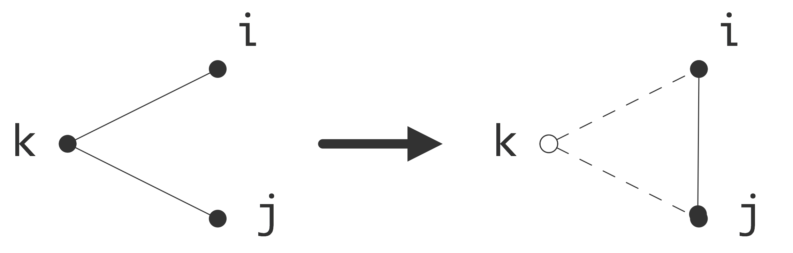

# 数值线性代数

在第四章中，我们了解了偏微分方程的数值解法是如何产生线性代数的问题。在前向欧拉法的情况下是一个矩阵与向量乘法，较为简单；而在后向欧拉方法下是一个线性方程组的解，较为复杂。解决线性系统将是本章的重点；此处我们将不讨论需要解决特征值问题。

你可能已经学过一种解线性方程组的简单算法：消除未知数，也叫「**高斯消元法**」（Gaussian elimination）。这种方法仍然可以使用，但我们需要对其效率进行一些仔细的讨论。还有其他一些算法即所谓的迭代求解法，它们通过逐步逼近线性系统的解来进行，这也是我们要讨论的内容。

由于PDE的背景，我们只考虑方形和非星形的线性系统。矩形系统，特别是超定系统，在最优化理论的数值分析中也有重要的应用。然而，在本书中我们不会涉及这些。

关于数值线性代数的标准著作是Golub和Van Loan的《矩阵计算》[83]。它包括算法、误差分析和计算细节。Heath的《科学计算》涵盖了科学计算中出现的最常见的计算类型；这本书有许多优秀的练习和实践项目。

## 消除未知数

下面我们将系统地讲述高斯消元法。

**注释 17** 我们可以通过**高斯-若尔当**（Gauss Jordan）方法，乘以逆矩阵$A^{-1}：x \leftarrow A^{-1}x$，来求解方程，但出于数字精度的考虑，本书不讨论这种方法。

本章的讨论主线是各种算法的效率。即便你学会了高斯消元法，也可能从未在大于$4\times 4$的矩阵上使用这种方法。在PDE求解中出现的线性系统可能要大几千倍，计算它们需要操作数以及内存是十分重要的。

正确选择算法对效率而言十分重要。**克拉默法则**（Cramer’s rule）指出：线性方程组的解可以用一个相当简单的公式表示，即行列式。尽管它在数学上很优雅，但对我们来说却并不实用。

如果给定了一个矩阵$𝐴$和一个向量$𝑏$，想要求解$𝐴𝑥=𝑏$的解，则$|A|$的行列式：
$$
x_{i}=\left|\begin{array}{cccccccc}
a_{11} & a_{12} & \ldots & a_{1 i-1} & b_{1} & a_{1 i+1} & \ldots & a_{1 n} \\
a_{21} & & \ldots & & b_{2} & & \ldots & a_{2 n} \\
\vdots & & & & \vdots & & & \vdots \\
a_{n 1} & & \ldots & & b_{n} & & \ldots & a_{n n}
\end{array}\right| /|A|
$$
对于任何矩阵$M$，行列式被递归定义为
$$
|M|=\sum_{i}(-1)^{i} m_{1 i}\left|M^{[1, i]}\right|
$$
其中$M[1,i]$表示从$M$中删除第1行和第$i$列而得到的矩阵。计算一个$n$阶行列式要计算$n$次$n-1$阶行列式。每一次都需要$n-1$个大小为$n-2$的行列式，所以行列式的计算所需操作是矩阵大小的阶乘。在本章的后面，我们会用其他合理的方法解决线性方程组。

现在让我们看一下用消除未知数的方法解线性方程的一个简单例子。考虑以下线性方程组
$$
\begin{aligned}
6 x_{1}-2 x_{2}+2 x_{3}=& 16 \\
12 x_{1}-8 x_{2}+6 x_{3}=& 26 \\
3 x_{1}-13 x_{2}+3 x_{3}=&-19
\end{aligned}
$$
我们从第二和第三个方程中消除$x_1$，方法是
 - 将第二个方程减去第一个方程$\times 2$；

- 将第三个方程减去第一个方程$\times 1/2$。

这样，线性方程组就变成了
$$
\begin{array}{l}
6 x_{1}-2 x_{2}+2 x_{3}=16 \\
0 x_{1}-4 x_{2}+2 x_{3}=-6 \\
0 x_{1}-12 x_{2}+2 x_{3}=-27
\end{array}
$$
最后，我们通过将第二个方程乘以3，在第三个方程中将其减去，消除三式中的$x_2$。
$$
\begin{array}{lll}
6 x_{1} & -2 x_{2} & +2 x_{3}=16 \\
0 x_{1} & -4 x_{2} & +2 x_{3}=-6 \\
0 x_{1} & +0 x_{2} & -4 x_{3}=-9
\end{array}
$$
现在我们可以根据上一个方程求出$x_3=9/4$。将其代入第二个方程，我们得到$-4x_2=-6-2x_2=-21/2$，所以$x_2=21/8$。最后，从第一个方程中，$6x_1=16+2x_2-2x_3=16+21/4-9/2=76/4$，所以$x_1=19/6$。

我们可以通过省略$x_i$系数来写得更紧凑。将
$$
\left(\begin{array}{ccc}
6 & -2 & 2 \\
12 & -8 & 6 \\
3 & -13 & 3
\end{array}\right)\left(\begin{array}{l}
x_{1} \\
x_{2} \\
x_{3}
\end{array}\right)=\left(\begin{array}{c}
16 \\
26 \\
-19
\end{array}\right)
$$
记为
$$
\left[\begin{array}{ccc|c}
6 & -2 & 2 & 16 \\
12 & -8 & 6 & 26 \\
3 & -13 & 3 & -19
\end{array}\right]
$$
那么消元的过程为
$$
\left[\begin{array}{ccccc}
6 & -2 & 2 & \mid & 16 \\
12 & -8 & 6 & \mid & 26 \\
3 & -13 & 3 & \mid & -19
\end{array}\right] \rightarrow\left[\begin{array}{ccccc}
6 & -2 & 2 & \mid & 16 \\
0 & -4 & 2 & \mid & -6 \\
0 & -12 & 2 & \mid & -27
\end{array}\right] \rightarrow\left[\begin{array}{ccccc}
6 & -2 & 2 & \mid & 16 \\
0 & -4 & 2 & \mid & -6 \\
0 & 0 & -4 & \mid & -9
\end{array}\right]
$$

在上面的例子中，矩阵系数可以是任何实数（或复数）系数。我们可以重复上面的过程求解任何线性方程组，但有一个例外。数字6、-4、-4，最后处在矩阵的对角线上，这些非零数字被称为**主元**（pivots）。

**练习 5.1** 线性方程组
$$
\begin{array}{rrr}
6 x_{1} & -2 x_{2} & +2 x_{3}= & 16 \\
12 x_{1} & -4 x_{2} & +6 x_{3}= & 26 \\
3 x_{1} & -13 x_{2} & +3 x_{3}= & -19
\end{array}
$$
与我们刚才在公式中研究的相同，除了（2，2）元素。确认你在第二步中得到一个零主元。

第一个主元是原矩阵的一个元素；正如你在前面的练习中所看到的，如果不消元，就无法找到其他主元。没有简单的方法可以预测零主元。

如果一个主元被证明是零，所有的计算都不会丢失：我们总是可以交换两个矩阵行；这就是所谓的主元。不难发现（你可以在任何一本初级线性代数教科书中找到），对于一个非奇异矩阵，总有一个行的交换可以将一个非零元素放在主元的位置。

**练习 5.2** 假设我们想交换方程中方程组的矩阵第2行和第3行。还需要做哪些调整以确保仍然能计算出正确的解？通过交换第2行和第3行，继续求解上一个练习的解，并检查你得到的答案是否正确。

**练习 5.3** 再看一下练习5.1。不交换第2和第3行，而要交换第2和第3列。就线性方程组而言，这意味着什么？继续求解该系统；检查你是否得到与之前相同的解。

一般来说，在浮点数和四舍五入的情况下，在计算过程中，一个矩阵元素不太可能完全变成零。另外，在PDE背景下，对角线通常是不为零的。这是否意味着主元运算在实践中没有必要？答案是否定的：从数值稳定性的角度来看，主元是可取的。在下一节，你将看到一个例子来说明这个事实。

## 线性代数在计算机运算中的应用

本章的大部分内容都可以通过数学运算求解，然而由于计算机的精度有限，我们需要设计将舍入误差降到最小的算法。对数值线性代数的算法需要进行严格而全面的误差分析，然而，这超出了本课程的范围。计算机算术中的计算误差分析是威尔金森的经典《代数过程中的舍入误差》[201]和海姆最近的《数值算法的准确性和稳定性》[106]的重点。

本书将注重计算机运算过程中出现的经典例子：将说明为何在LU分解中主元方法不仅仅是理论手段，此外，我们将给出两个由于计算机算术的有限精度而导致的特征值计算中的问题的例子。

### 消除过程中的舍弃控制

上面我们看到，如果在消除该行和列的过程中，对角线上出现了一个零元素，那么行间交换（'主元'）是必要的。现在我们讨论如果主元元素不是零，但接近零会发生什么。

考虑线性方程组
$$
\left(\begin{array}{ll}
\epsilon & 1 \\
1 & 1
\end{array}\right) x=\left(\begin{array}{c}
1+\epsilon \\
2
\end{array}\right)
$$
其中的解决方案是$𝑥=(1, 1)^𝑡$。使用(1, 1)元素清除第一列的剩余部分，可以得到。
$$
\left(\begin{array}{ll}
\epsilon & 1 \\
1 & 1
\end{array}\right) x=\left(\begin{array}{c}
1+\epsilon \\
2
\end{array}\right)
$$
现在我们可以解决$x_2$，并从它得到$x_1$。
$$
\left\{\begin{array}{l}
x_{2}=\left(1-\epsilon^{-1}\right) /\left(1-\epsilon^{-1}\right)=1 \\
x_{1}=\epsilon^{-1}\left(1+\epsilon-x_{2}\right)=1
\end{array}\right.
$$
如果$\epsilon$较小，如$\epsilon <\epsilon_{mach}$，则右侧的1+𝜖替换为1：线性方程组改写为
$$
\left(\begin{array}{ll}
\epsilon & 1 \\
1 & 1
\end{array}\right) x=\left(\begin{array}{l}
1 \\
2
\end{array}\right)
$$
但解$(1, 1)^𝑡$仍将满足机器运算。接下来，$1/\epsilon $将非常大，所以消除后的右手边第二部分将是$2-\frac{1}{\epsilon}=-1/\epsilon$，并且（2,2）矩阵中的元素是$-1/\epsilon$而不是$1-1/\epsilon$。

$$
\left(\begin{array}{cc}
\epsilon & 1 \\
0 & 1-\epsilon^{-1}
\end{array}\right) x=\left(\begin{array}{c}
1 \\
2-\epsilon^{-1}
\end{array}\right) \Rightarrow\left(\begin{array}{cc}
\epsilon & 1 \\
0 & -\epsilon^{-1}
\end{array}\right) x=\left(\begin{array}{c}
1 \\
-\epsilon^{-1}
\end{array}\right)
$$
首先求解$x_2$，然后求解$x_1$，我们得到。
$$
\left\{\begin{array}{l}
x_{2}=\epsilon^{-1} / \epsilon^{-1}=1 \\
x_{1}=\epsilon^{-1}\left(1-1 \cdot x_{2}\right)=\epsilon^{-1} \cdot 0=0
\end{array}\right.
$$
所以$x_2$是正确的，但$x_1$是完全错误的。

**注释 18** 在这个例子中，计算机运算中的数字与精确运算中的数字偏差不大。然而，结果却可能是大错特错。对这种现象的分析见[99]的第一章。

如果我们按照上述方法进行透视，会发生什么？我们交换矩阵的行，得到
$$
\left(\begin{array}{ll}
1 & 1 \\
\epsilon & 1
\end{array}\right) x=\left(\begin{array}{c}
2 \\
1+\epsilon
\end{array}\right) \Rightarrow\left(\begin{array}{cc}
1 & 1 \\
0 & 1-\epsilon
\end{array}\right) x=\left(\begin{array}{c}
2 \\
1-\epsilon
\end{array}\right)
$$
交换矩阵的行，得到
$$
x_{2}=\frac{1-\epsilon}{1-\epsilon}=1, \quad x_{1}=2-x_{2}=1
$$
现在得到的是，无论$\epsilon$的大小如何。
$$
x_2=\frac{1-\epsilon}{1-\epsilon}=1 \quad x_1=2-x_2=1
$$
在这个例子中，我们使用了一个非常小的$\epsilon $值；更精细的分析表明，即使$\epsilon$值大于机器精度，主元交换仍然是有意义的。一般的经验法则是。始终进行换行，使当前列中最大的剩余元素进入主元位置。在第4章中，你看到了在某些实际应用中出现的矩阵；可以证明，对它们来说主元是没有必要的；见练习5.13。

上面讨论的主元也被称为**部分主元**（partial pivoting），因为它只基于行的交换。另一个选择是**完全主元**（full pivoting），即结合行和列的交换，找到剩余子块中最大的元素，作为主元。最后，对角线主元将同样的交换应用于行和列。(这相当于对问题的未知数进行重新编号）。这意味着主元只在对角线上被搜索到。从现在开始，我们将只考虑部分主元的问题。

### 舍入对特征值计算的影响

考虑矩阵
$$
A=\left(\begin{array}{c}
1 & \epsilon \\
\epsilon & 1
\end{array}\right)
$$
其中$\epsilon_{mach} < |\epsilon| < \sqrt{\epsilon_{mach}}$，其特征值为$1 + \epsilon $和$1 - \epsilon$。如果我们用计算机运算来计算它的特征多项式
$$
\left|\begin{array}{cc}
1-\lambda & \epsilon \\
\epsilon & 1-\lambda
\end{array}\right|=\lambda^{2}-2 \lambda+\left(1-\epsilon^{2}\right)=\lambda^{2}-2 \lambda+1
$$
我们发现一个双重特征值1。请注意，准确的特征值是可以用工作精度来表达的；是算法导致了错误。显然，使用特征多项式并不是计算特征值的正确方法，即使在行为良好的对称正定矩阵中也是如此。

一个非对称的例子：让$A$为大小为20的矩阵
$$
A=\left(\begin{array}{ccccc}
20 & 20 & & & \varnothing \\
& 19 & 20 & & \\
& & \ddots & \ddots & \\
& & & 2 & 20 \\
\varnothing & & & & 1
\end{array}\right)
$$
由于这是一个三角矩阵，其特征值是对角线元素。如果我们通过设置$A_{20,1}=10^{-6}$来扰动这个矩阵，我们发现特征值的扰动要比元素的扰动大得多。
$$
\lambda=20.6 \pm 1.9 i, 20.0 \pm 3.8 i, 21.2,16.6 \pm 5.4 i, \ldots
$$
另外，有几个计算出来的特征值有虚数的成分，而准确的特征值没有这个成分。

## LU分解

到目前为止，我们已经在解决单一线性方程组的背景下研究了消除未知数的问题。假设我们需要解决一个以上的具有相同矩阵的系统，但有不同的右手边。例如，如果在隐式欧拉方法中采取多个时间步骤，就会发生这种情况。我们能否利用第一个系统中所做的工作来使后面的内容更加容易解决？

答案是肯定的。我们可以将求解过程分为只涉及矩阵的部分和专门针对右手边的部分。如果有一系列的系统需要解决，我们只需要做一次第一部分，幸运的是，这甚至是我们需要做的主要工作。

让我们再看一个例子：
$$
A=\left(\begin{array}{c}
6 & -2 & 2\\
12 & -8 & 6\\
3 & -13 & 3
\end{array}\right)
$$
在消除的过程中，我们把第二行减去$2\times $第一行，第三行减去$1/2\times$第一行。说服你自己，这种合并行的做法可以通过从左边的$A$乘以

$$
L_{1}=\left(\begin{array}{ccc}
1 & 0 & 0 \\
-2 & 1 & 0 \\
-1 / 2 & 0 & 1
\end{array}\right)
$$
这是与对角线下第一列中的消除系数相同的。消除变量的第一步相当于将系统$Ax=b$转换为$L_1Ax=L_1b$。

在下一步，你从第三行减去3$\times $第二行。让你自己相信，这相当于将当前的矩阵$L_1A$左乘以
$$
L_{2}=\left(\begin{array}{ccc}
1 & 0 & 0 \\
0 & 1 & 0 \\
0 & -3 & 1
\end{array}\right)
$$
这是与对角线下第一列中的消除系数相同的。消除变量的第一步相当于将系统$Ax=b$转换为$L_2L_1Ax=L_2L_1b$。并且$L_2L_1A$是 "上三角 "形式。如果我们定义$U = L_2L_1A$, 那么$A= L_1^{-1}L_2^{-1}U$。计算诸如$L^{-1}$这样的矩阵有多难？很容易，事实证明是这样。

我们提出以下意见：
$$
L_{1}=\left(\begin{array}{ccc}
1 & 0 & 0 \\
-2 & 1 & 0 \\
-1 / 2 & 0 & 1
\end{array}\right) \quad L_{1}^{-1}=\left(\begin{array}{ccc}
1 & 0 & 0 \\
2 & 1 & 0 \\
1 / 2 & 0 & 1
\end{array}\right)
$$
同样地
$$
L_{2}=\left(\begin{array}{ccc}
1 & 0 & 0 \\
0 & 1 & 0 \\
0 & -3 & 1
\end{array}\right) \quad L_{2}^{-1}=\left(\begin{array}{ccc}
1 & 0 & 0 \\
0 & 1 & 0 \\
0 & 3 & 1
\end{array}\right)
$$
甚至更显著的
$$
{L_{1}^{-1}} L_{2}^{-1}=\left(\begin{array}{ccc}
1 & 0 & 0 \\
2 & 1 & 0 \\
1 / 2 & 3 & 1
\end{array}\right)
$$
即$L_1^{-1}L_2^{-1}$包含$L^{-1}$的非对角线元素，$L^{-1}$不变，它们又包含消除系数。(这是Householder反射器的一个特殊情况，见13.6）。

**练习 5.4**  证明类似的声明是成立的，即使在对角线之上有元素存在。

如果定义$L=L_1^{-1}L_2^{-1}$，现在有$A=LU$；这被称为$LU$因子化。我们看到，对角线以下的$L$系数是消除过程中所用系数的负数。更好的是，$L$的第一列可以在消除$A$的第一列时写出来，所以$L$和$U$的计算可以在没有额外存储的情况下完成，至少我们可以承受失去$𝐴$。

### 算法

让我们把$LU$因式分解算法写成正式代码

```c
⟨𝐿𝑈 factorization⟩: 
    for 𝑘 = 1, 𝑛 − 1:
         ⟨eliminate values in column 𝑘⟩ 
⟨eliminate values in column 𝑘⟩:
    for 𝑖 = 𝑘 + 1 to 𝑛:
          ⟨compute multiplier for row 𝑖⟩ 
          ⟨update row 𝑖⟩
⟨compute multiplier for row 𝑖⟩
     𝑎𝑖𝑘 ← 𝑎𝑖𝑘/𝑎𝑘𝑘
⟨update row 𝑖⟩:
     for 𝑗 = 𝑘 + 1 to 𝑛:
          𝑎𝑖𝑗 ← 𝑎𝑖𝑗 − 𝑎𝑖𝑘 ∗ 𝑎𝑘𝑗
```

或者说，把所有东西放在一起。

```c
⟨𝐿𝑈 factorization⟩: 
      for 𝑘 = 1, 𝑛 − 1:
           for 𝑖 = 𝑘 + 1 to 𝑛:
                𝑎𝑖𝑘 ← 𝑎𝑖𝑘/𝑎𝑘𝑘
                for 𝑗 = 𝑘 + 1 to 𝑛:
                     𝑎𝑖𝑗 ← 𝑎𝑖𝑗 − 𝑎𝑖𝑘 ∗ 𝑎𝑘𝑗
```

这是呈现$LU$因子化的最常见方式。然而，也存在其他计算相同结果的方法。像$LU$因子化这样的算法可以用几种方式进行编码，这些方式在数学上是等价的，但它们有不同的计算行为。这个问题，在密集矩阵的背景下，是van de Geijn和Quintana的《矩阵计算编程的科学》[193]的重点。

### Cholesky因式分解

一个对称矩阵的$LU$因式分解并不能得到相互转置的$L$和$U$：$L$在对角线上有1，而$U$有主元。然而，我们可以对对称矩阵$A$进行因式分解，其形式为$A=LL^t$。这样做的好处是，因式分解所占用的空间与原始矩阵相同，即$n(n+1)/2$个元素。如果运气好的话，我们可以像在$LU$情况下一样，用因子化覆盖矩阵。

我们通过归纳推理来推导出这个算法。让我们把$A＝LL^t$写成块状。
$$
A=\left(\begin{array}{ll}
A_{11} & A_{21}^{t} \\
A_{21} & A_{22}
\end{array}\right)=L L^{t}=\left(\begin{array}{cc}
\ell_{11} & 0 \\
\ell_{21} & L_{22}
\end{array}\right)\left(\begin{array}{cc}
\ell_{11} & \ell_{21}^{t} \\
0 & L_{22}^{t}
\end{array}\right)
$$
则$\ell_{11}^2=a_{11}$，由此得到$\ell_{11}$。我们还发现$\ell_{11}(L^t)_{1j} = \ell_{j1} = a_{1j}$，所以我们可以计算出整个$L$的第一列。最后，$A_{22} = L_{22}L^t_{22} + \ell_{12}\ell^t_{12}$，所以

$$
L_{22} L_{22}^{t}=A_{22}-\ell_{12} \ell_{12}^{t}
$$
这表明$L_{22}$是更新的$A_{22}$块的Cholesky因子。递归后，现在定义了该算法。

### 唯一性

我们时常需要分析不同的计算方式是否会导致相同的结果，这被称为结果的“唯一性”：如果计算结果唯一，那么不论我们使用何种软件库，都不会改变计算的有效性。

下面我们分析LU因式分解的唯一性。$LU$因式分解算法的定义是：给定一个非奇异矩阵$A$，它将给出一个下三角矩阵$L$和上三角矩阵$U$，使得$A= LU$。上述计算$LU$因式分解的算法是确定的（它不包含 "取任何满足...的行 "的指令），所以给定相同的输入，它将总是计算相同的输出。然而，其他的算法也是可能的，所以我们需要担心他们是否会得到相同的结果。

我们假设$A=L_1U_1=L_2U_2$，其中$L1、L2$为下三角，$U_1、U_2$为上三角。那么，$L^{-1}L=UU^{-1}$。 在这个等式中，左手边是下三角矩阵的乘积，而右手边只包含上三角矩阵。

**练习 5.5** 证明下三角矩阵的乘积是下三角，而上三角矩阵的乘积是上三角。对于非奇异三角形矩阵的倒数，类似的说法是否成立？

积$L^{-1}L$显然既是下三角又是上三角，所以它一定是对角线的。我们称它为$D$，那么$L_1=L_2D$，$U_2=D_1$。结论是，𝐿𝑈因式分解不是唯一的，但它是唯一的 "直到对角线缩放"。

**练习 5.6** 第5.3.1节中的算法产生了一个下三角因子$L$，其对角线上有1。证明这个额外的条件使得因式分解是唯一的。

**练习 5.7**  证明另一个条件，即$U$的对角线上有1，也足以实现因式分解的唯一性。

由于我们可以要求$L$或$U$中的单位对角线，你可能想知道是否有可能两者都有。(我们可以这样做：假设$A=LU$，其中$L$和$U$是非星形下三角和上三角，但没有以任何方式归一化。请写出
$$
L=(I+L')D_L, \quad U=D_u(I+U')
$$
经过重命名，我们现在有一个因式分解
$$
A=(I+L)D(I+U)
$$
其中$D$是一个包含主元的对角线矩阵。

**练习 5.8** 证明你也可以将因式分解的形式定为$A= (D+L)D^{-1}(D+ U )$ 。这个$D$与前面的有什么关系？

**练习 5.9** 这样考虑一个三对角矩阵的因式分解。$L$和$U$与$A$的三角部分有什么关系？推导出$D$和$D_A$之间的关系，并说明这是产生主元的方程。

### 主元

在上面的因式分解例子中，我们为了保证非零主元的存在，或者为了数值的稳定性，需要进行主元化，也就是交换行。现在我们将把透视纳入$LU$因式分解。

首先，行交换可以用矩阵乘法来描述。令


那么$P^{(i,j)}A$是交换了行$i$和$j$的矩阵$A$。由于我们可能要在因式分解过程的每次迭代中进行透视，我们引入一个序列$p(·)$，其中$p(i)$是与第𝑖行交换的第𝑗行的值。简写为$P^{(i)}\equiv P^{(i,p(i))}$。

**练习 5.10** 证明$P^{(i)}$是其自身的逆。

现在可以将部分主元的因式分解过程描述为:

- 让$A^{(i)}$为矩阵，列$1 ... i- 1$被消除，并应用部分主元以获得$(i, i)$位置上的所需元素。
- 让$\ell^{(i)}$为第$i$个消除步骤中的乘数向量。(也就是说，这一步的消除矩阵$L_i$是身份加$\ell(i)$的第$i$列)。
- 让$P^{(i+1)}（j\geqslant i+1）$是为下一个消除步骤做部分透视的矩阵，如上所述。
- 那么$A^{(i+1)} = P^{(i+1)}L_iA^{(i)}$。

这样，我们就得到了一个因式分解的形式
$$
L_{n-1} P^{(n-2)} L_{n-2} \cdots L_{1} P^{(1)} A=U
$$
此时我们无法写出$ A= LU$：而是写出
$$
A=P^{(1)} L_{1}^{-1} \cdots P^{(n-2)} L_{n-1}^{-1} U
$$
**练习 5.11** 回顾前面的内容，从性能角度看，分块算法通常是可取的。为什么方程(5.5)中的 "$LU$因子化与交错主元矩阵 "对性能来说是个坏消息？

幸运的是，方程（5.5）可以被简化：$P$和$L$矩阵 "几乎相通"。我们通过一个例子来证明这一点：$P^{(2)}L_1=\tilde{L_1}𝑃^{(2)}$，其中$\tilde{L}_1$非常接近于$L_1$。


其中$\tilde{\ell}^{(1)}$与$\ell^{(1)}$相同，只是元素$i$和$p(i)$被调换了。你现在可以说服自己，同样$P^{(2)}$等也可以 "拉过 "$L_1$。

因此，我们得到
$$
P^{(n-2)} \cdots P^{(1)} A=\tilde{L}_{1}^{-1} \cdots L_{n-1}^{-1} U=\tilde{L} U
$$
这意味着我们可以像以前一样再次形成一个矩阵$L$，只是每次我们进行主元时，我们需要更新已经计算过的$L$的列。

**练习 5.12** 如果我们把方程写成$PA= LU$，得到$A= P^{-1}LU$。是否能得出一个用$P$ 表示的 $P^{-1}$？提示：每个$P^{(i)}$都是对称的，而且是它自己的逆数；见上面的练习。

**练习 5.13** 早些时候，我们看到二维BVP产生了某种矩阵。我们在没有证明的情况下指出，对于这些矩阵不需要主元。现在我们可以正式证明这一点，重点放在对角线支配的关键属性上。
$$
\forall_ia_{ii}\geqslant \sum_{j\neq i}|a_{ij}|.
$$
假设矩阵$A$满足$\forall j\neq i: a_{ij} \leqslant 0$，表明该矩阵是对角域的，即存在向量$u, v \geqslant 0$（意味着每个分量都是非负的），使得$Au = v$。 证明在消除一个变量后，对于剩余的矩阵$\tilde{A}$又有向量$\tilde{u}，\tilde{v} \geqslant 0$，使得$\tilde{A}\tilde{u} =\tilde{v}$。 现在完成论证，如果$A$是对称的、对角线主导的，（部分）主元是不必要的。（实际上可以证明，主元对于任何对称正定（SPD）矩阵都是不必要的，对角线主导是比SPD-性更强的条件）。

### 解决系统问题

现有一个因式分解$A = LU$，我们可以用它来解决线性系统$Ax= LUx =b$。如果我们引入一个临时向量$y= Ux$，那么我们可以看到这需要两个步骤。
$$
Ly=b,\quad Ux=z
$$
第一部分，$Ly = b$被称为 "下三角解"，因为它涉及下三角矩阵$L$。
$$
\left(\begin{array}{ccccc}
1 & & & & \varnothing \\
l_{21} & 1 & & & \\
l_{31} & l_{32} & 1 & & \\
\vdots & & & \ddots & \\
\ell_{n 1} & l_{n 2} & & \cdots & 1
\end{array}\right)\left(\begin{array}{c}
y_{1} \\
y_{2} \\
\vdots \\
y_{n}
\end{array}\right)=\left(\begin{array}{c}
b_{1} \\
b_{2} \\
\vdots \\
b_{n}
\end{array}\right)
$$
在第一行，你看到$y_1=b_1$.然后，在第二行$\ell_{21}y_1+y_2=b_2$，所以$y_2=b_2-\ell_{21}y_1$。你可以想象这如何继续：在每$i$行，你可以从以前的$y$值计算$y_i$。
$$
y_i=b_i-\sum_{y<i}\ell_{ij}y_j
$$
由于我们以递增的方式计算$y_i$，这也被称为正向替换、正向求解或正向扫瞄。

求解过程的后半部分，即上三角求解、后向替换或后向扫描，从$Ux=y$中计算出$x$。
$$
\left(\begin{array}{cccc}
u_{11} & u_{12} & \ldots & u_{1 n} \\
& u_{22} & \ldots & u_{2 n} \\
& & \ddots & \vdots \\
\varnothing & & & u_{n n}
\end{array}\right)\left(\begin{array}{c}
x_{1} \\
x_{2} \\
\vdots \\
x_{n}
\end{array}\right)=\left(\begin{array}{c}
y_{1} \\
y_{2} \\
\vdots \\
y_{n}
\end{array}\right)
$$
现在我们看一下最后一行，它立即告诉我们$x_n=u^{-1}_{nn}y_n$。由此可见，最后一行说明了$u_{n-1n-1}x_{n-1}+u_{n-1n}x_n=y_{n-1}$，从而得出$x_{n-1}=u^{-1}_{n-1n-1}(y_{n-1}u{_{n-1n}x_n})$。更一般地，我们可以计算
$$
x_{i}=u_{i i}^{-1}\left(y_{i}-\sum_{j>i} u_{i j} y_{j}\right)
$$
对$i$的数值递减。

**练习 5.14** 在回扫中，你必须用数字$𝑢_𝑖$进行除法。如果其中任何一个是零，这是不可能的。把这个问题与上面的讨论联系起来。

### 复杂度

在本章的开头，我们指出，并不是每一种解决线性系统的方法都需要相同数量的操作。因此，让我们仔细研究一下复杂度1，也就是在解决线性系统时使用LU因子化的操作数与问题大小的函数关系。

首先，我们看一下从$LUx = b$（"解决线性系统"）计算$x$，因为我们已经有了因子化$A= LU$。把下三角和上三角部分放在一起看，会发现与所有对角线外的元素（即元素$\ell_{ij}$或$u_{ij}$与$i\neq j$）进行了乘法。 此外，上三角解涉及到对$u_i$元素的除法。 现在，除法运算通常比乘法运算昂贵得多，所以在这种情况下，我们会计算出$1/u_i$的值，并将其存储起来。

**练习 5.15** 请看一下因式分解算法，并论证存储主元的倒数并不增加计算的复杂性。

总结一下会发现，在一个大小为$n\times n$的系统中，我们要进行$n^2$的乘法运算和大致相同数量的加法运算。这表明，给定一个因式分解，解决一个线性系统的复杂度与简单的矩阵-向量乘法相同，也就是说，给定$A$和$x$的计算复杂度。

构建$LU$因式分解的复杂度，计算起来就比较麻烦了。你可以看到，在$k$第三步发生了两件事：乘数的计算和行的更新。有$𝑛 - 𝑘$个乘数需要计算，每个乘数都涉及一个除数。除法之后，更新需要$(n-k)^2$次加法和乘法。如果我们暂时不考虑除法的问题。因为它们的数量较少，我们发现$LU$因子化需要$\sum_{k=1}^{n-1}2(n-k)^2$次运算。如果我们顺序给这个和中的项编号，我们会发现
$$
\text { \#ops }=\sum_{k=1}^{n-1} 2 k^{2}
$$
由于可以通过积分来近似求和，我们发现这是$2/3n^3$加上一些低阶项。这比解决线性系统要高一阶：随着系统规模的增长，构建$LU$因子化的成本完全占据了主导地位。

当然，算法分析还有比运算计数更重要的内容。虽然解线性系统的复杂度与矩阵-向量乘法相同，但这两种操作的性质非常不同。一个很大的区别是，因式分解和前向/后向求解都涉及递归，所以它们不容易并行化。关于这一点，我们将在后面详细说明。

### 分块算法

通常，矩阵有一个自然的块状结构，比如二维BVP的情况。许多线性代数操作可以用这些块来表述。与传统的矩阵标量观点相比，这可能有几个好处。例如，它可以改善缓存阻塞；它也有利于在多核架构上调度线性代数算法。

对于分块算法，我们把矩阵写成
$$
A=\left(\begin{array}{ccc}
A_{11} & \ldots & A_{1 N} \\
\vdots & & \vdots \\
A_{M 1} & \ldots & A_{M N}
\end{array}\right)
$$
其中$M, N$是块的大小，即用子块表示的大小。通常情况下。

我们选择的块是：$M = N$，对角线块为正方形。作为一个简单的例子，考虑矩阵-向量乘积$y= Ax$，以块的形式表示。
$$
\left(\begin{array}{c}
Y_{1} \\
\vdots \\
Y_{M}
\end{array}\right)=\left(\begin{array}{ccc}
A_{11} & \ldots & A_{1 M} \\
\vdots & & \vdots \\
A_{M 1} & \ldots & A_{M M}
\end{array}\right)\left(\begin{array}{c}
X_{1} \\
\vdots \\
X_{M}
\end{array}\right)
$$
为了说明区块算法的计算结果与旧的标量算法相同，我们看一下一个分支$Y_{i_k}$，也就是第$i$块的$k$个标量分量。首先。
$$
Y_{i}=\sum_{j} A_{i j} X_{j}
$$
于是
$$
Y_{i_{k}}=\left(\sum_{j} A_{i j} X_{j}\right)_{k}=\sum_{j}\left(A_{i j} X_{j}\right)_{k}=\sum_{j} \sum_{\ell} A_{i j_{k l}} X_{j_{\ell}}
$$
是$a$的第$i$个区块行的第$k$行与整个$X$的积。

一个更有趣的算法是$LU$因子化的分块版。算法就变成了

```c
⟨𝐿𝑈 factorization⟩: 
        for 𝑘 = 1, 𝑛 − 1:
            for 𝑖 = 𝑘 + 1 to 𝑛:
                 Aij ← AikA^{−1}
                 for 𝑗 = 𝑘 + 1 to 𝑛:
                      𝐴𝑖𝑗 ← 𝐴𝑖𝑗 − 𝐴𝑖𝑘 ⋅ 𝐴𝑘𝑗
```

该算法与之前的算法有很大的不同，即除以$a_{kk}$的方法被一个乘以$A^{-1}_{kk}$。另外，$U$因子现在在对角线上有支点块，而不是支点元素。所以$U$只是 "块状上三角形"，而不是严格的上三角形。

**练习 5.16** 我们想表明，这里的块状算法再次计算出与标量算法相同的结果。通过明确查看计算的元素来做到这一点是很麻烦的，所以我们采取另一种方法。首先，回顾一下第5.3.3节，$LU$面化是唯一的：如果$A=L_1U_1=L_2U_2$且$L_1、L_2$有单位斜线，那么$L_1=L_2$。$U_1 = U_2$

接下来，考虑计算$A^{-1}_{kk}$的问题。证明这可以通过以下方式完成：首先计算$A_{kk}$的$LU$因子化。现在用它来证明，块状$LU$因子化可以给出严格意义上的三角形的$L$和$U$因子。$LU$因式分解的唯一性就证明了块算法可以计算出标量结果。

## 稀疏矩阵

BVP（和IBVP）的离散化可能会引起稀疏矩阵的出现。由于这样的矩阵有$N^2$个元素，但只有$O(N)$个非零元素，将其存储为二维数组将是对空间的极大浪费。此外，我们希望避免对零元素进行操作。

在本节中，我们将探讨稀疏矩阵的有效存储方案，以及使用稀疏存储时熟悉的线性代数操作的形式。

### 稀疏矩阵的存储

稀疏矩阵没有明确定义，只要当矩阵中的零元素多到需要专门存储时，该矩阵即为**稀疏矩阵**（sparse matrix）。

我们将在此简要讨论最流行的稀疏矩阵的存储方案。由于矩阵不再是作为一个简单的2维数组来存储，使用这种存储方案的算法也需要重写。

#### 带状存储和对角线存储

带状稀疏矩阵的非零元素正好位于一些子对角线上。对于这样的矩阵，可以采用专门的存储方案。

以一维BVP的矩阵为例。它的元素位于三个子对角线上：主对角线和第一个超对角线和子对角线。在带状存储中，我们只将包含非零点的带状存储在内存中。对于这样一个矩阵，最经济的存储方案是连续存储 $2n-2$ 的元素。然而，由于各种原因，浪费一些存储位置会更方便，如图 5.1 所示。


因此，对于一个大小为$n\times n$，矩阵带宽为$p$的矩阵，我们需要一个大小为$n\times p$的矩形数组来存储矩阵。那么，矩阵将被存储为

$$
\begin{array}{ccc}
\star & 2 & -1 \\
-1 & 2 & -1 \\
\vdots & \vdots & \vdots \\
-1 & 2 & \star
\end{array}
$$
其中星星表示不对应矩阵元素的数组元素：它们是图5.1中左上和右下的三角形。

当然，现在我们要想知道阵列元素$A(i,j)$和矩阵元素$𝐴_{𝑖𝑗}$之间的转换。这在Fortran语言中是最容易做到的。如果我们将数组分配为

```c
dimension A(n,-1:1)
```

那么主对角线$A_i$就被储存在$A(*,0)$中。例如，$A(1,0) \sim A_{11}$。在矩阵$A$的同一行的下一个位置，$A(1,1) \sim A_{12}$。很容易看出，我们一起有这样的转换
$$
A(i,j) \sim A_{i,i+j}.
$$
**练习 5.17** 什么是反向转换，也就是说，矩阵元素$A_{ij}$对应于哪个数组位置$A(?,?)$？

**练习 5.18** 如果你是一个C语言程序员，请推导出矩阵元素$A_{ij}$与数组元素$A[i][j]$之间的转换。

如果我们将这种将矩阵存储为$N\times p$数组的方案应用于二维BVP的矩阵，就会变得很浪费，因为我们会存储许多存在于带内的零。因此，在对角线存储或对角线存储中，我们通过只存储非零对角线来完善这一方案：如果矩阵有$p$个非零对角线，我们需要一个$n\times p$数组。对于方程的矩阵，这意味着。
$$
\begin{array}{ccccc}
\star & \star & 4 & -1 & -1 \\
\vdots & \vdots & 4 & -1 & -1 \\
\vdots & -1 & 4 & -1 & -1 \\
-1 & -1 & 4 & -1 & -1 \\
\vdots & \vdots & \vdots & \vdots & \vdots \\
-1 & -1 & 4 & \star & \star
\end{array}
$$
当然，我们需要一个额外的整数阵来告诉我们这些非零对角线的位置。

**练习 5.19** 对于$d=1, 2, 3$空间维度的中心差分矩阵，作为$N$阶的带宽是多少？离散化参数$h$的阶数是多少？

在前面的例子中，矩阵在主对角线上下有相同数量的非零对角线。在一般情况下，这不一定是真的。为此，我们引入了以下概念
 - **左半带宽度**（left halfbandwidth）：如果$A$的左半带宽度为$p$，那么$A_{ij} = 0$，因为$i> j + p$，和

- **右半带宽度**（right halfbandwidth）：如果$A$的右半带宽度为$p$，那么$A_{ij}=0$，因为$j>i+p$。如果左边和右边的半带宽度相同，我们就直接指半带宽度。

#### 对角线存储的操作

对稀疏矩阵最重要的操作是矩阵-向量乘积。对于一个按对角线存储的矩阵，如上所述，仍然可以使用转换公式（5.9）进行普通的ROWISE或Lumnwise乘积；事实上，这就是Lapack带状程序的工作方式。然而，在带宽较小的情况下，这样做的向量长度较短，循环开销相对较高，所以效率不高。有可能做得比这好得多。

如果我们看一下矩阵元素在矩阵-向量乘积中是如何使用的，我们会发现主对角线被用作
$$
y_i\leftarrow y_i +A_{ii}x_i
$$
第一个超对角线被用作
$$
y_i \leftarrow y_i +A_{ii+1}x_{i+1},\quad \text{for }i<n
$$
第一条对角线为
$$
y_i \leftarrow y_i +A_{ii-1}x_{i-1},\quad \text{for }i>1.
$$
换句话说，整个矩阵-向量乘积只需执行三个长度为$n$（或$n-1$）的向量运算，而不是长度为3（或2）的$n$内积。

```c
for diag = -diag_left, diag_right
       for loc = max(1,1-diag), min(n,n-diag)
           y(loc) = y(loc) + val(loc,diag) * x(loc+diag)
       end
end
```

**练习 5.20** 写一个程序，通过对角线计算$y \leftarrow A^tx$。用你喜欢的语言来实现它，并在一个随机矩阵上测试它。

**练习 5.21** 如果矩阵在带内是密集的，上述代码片段是有效的。例如，二维BVP的矩阵就不是这种情况。写出只使用非零对角线的矩阵-向量乘积的代码。

**练习 5.22** 矩阵相乘比矩阵与向量相乘更难。如果矩阵$A$的左半带宽度为$p_A,q_Q$,而矩阵$B$的左半带宽度为$p_B,q_B$, $C=AB
$的左半带宽度为多少? 假设已经为$C$分配了一个足够大的数组，请写一个程序来计算$C \leftarrow AB$。

#### 压缩行存储

如果我们有一个不具有简单带状结构的稀疏矩阵，或者非零对角线的数量变得不切实际，我们可以使用更通用的**压缩行存储**（Compressed Row Storage，CRS）方案。顾名思义，这个方案是基于压缩所有的行，消除零值；见图5.2。由于这失去了非零最初来自哪一列的信息，我们必须明确地存储这些信息。考虑一个稀疏矩阵的例子。
$$
A=\left(\begin{array}{rrrrrr}
10 & 0 & 0 & 0 & -2 & 0 \\
3 & 9 & 0 & 0 & 0 & 3 \\
0 & 7 & 8 & 7 & 0 & 0 \\
3 & 0 & 8 & 7 & 5 & 0 \\
0 & 8 & 0 & 9 & 9 & 13 \\
0 & 4 & 0 & 0 & 2 & -1
\end{array}\right)
$$
在压缩了所有的行之后，我们将所有的非零点存储在一个单一的实数数组中。列的索引也同样存储在一个整数数组中，我们存储指向列开始位置的指针。使用基于0的索引，这就得到了。


$$
\begin{array}{r|rrrrrrrrrrrrr}
\hline
\text { val } & 10 & -2 & 3 & 9 & 3 & 7 & 8 & 7 & 3 \cdots 9 & 13 & 4 & 2 & -1 \\
\hline \text { colind } & 0 & 4 & 0 & 1 & 5 & 1 & 2 & 3 & 0 \cdots 4 & 5 & 1 & 4 & 5 \\
\hline \text { rowptr } & 0 & 2 & 5 & 8 & 12 & 16 & 19 & & & & & & \\
\hline
\end{array}
$$
CRS的一个简单变体是压缩列存储（CCS），其中列中的元素被连续存储。这也被称为Harwell-Boeing矩阵格式[55]。你可能会遇到的另一种存储方案是坐标存储，其中矩阵被存储为三联体列表$<i,j,a_{ij}>$.流行的矩阵市场网站[161]使用这种方案的一个变体。

#### 关于压缩行存储的算法

在这一节中，我们将看一下一些算法在CRS中的形式。首先我们考虑稀疏矩阵-向量乘积的实现。

```c
for (row=0; row<nrows; row++) {
      s = 0;
      for (icol=ptr[row]; icol<ptr[row+1]; icol++) {
         int col = ind[icol];
         s += a[icol] * x[col];
      }
  y[row] = s; 
}
```

标准的矩阵-向量乘积算法$y=Ax$，其中每一行$A_{i∗}$与输入向量$x$进行内积。然而，请注意，内循环不再以列号为索引，而是以要找到该列号的位置为索引。这个额外的步骤被称为间接寻址。

**练习 5.23** 比较密集矩阵-向量乘积（按行执行）和刚才给出的稀疏乘积的数据位置性。说明对于一般的稀疏矩阵来说，在处理输入向量$x$时的空间局部性已经消失了。是否有一些矩阵结构，我们仍然可以期待一些空间局部性？

现在，如果我们想计算乘积$y=A^tx$呢？在这种情况下，我们需要$A^t$的行，或者说，相当于$A$的列。找到$A$的任意列是很难的，需要大量的搜索，所以可能认为这个算法也相应地难以计算。幸运的是，这并不是真的。

如果我们将标准算法中的$i$和$j$循环交换为$y=Ax$，我们可以得到
$$
\begin{array}{ll}
\text {Original: } & \text {Indices reversed: } \\
y \leftarrow 0 & y \leftarrow 0 \\
\text { for } i: & \text { for } j: \\
\quad \text { for } j: & \quad \text { for } i \text { : } \\
\quad \quad y_{i} \leftarrow y_{i}+a_{i j} x_{j} &\quad \quad y_{i} \leftarrow y_{i}+a_{j i} x_{j}
\end{array}
$$
使用第二种算法来计算$A^tx$的乘积。

**练习 5.24** 写出转置积$y=A^tx$的代码，其中$A$是以CRS格式存储。写一个简单的测试程序，确认你的代码计算正确。

**练习 5.25** 如果需要同时访问行和列呢？实现一种算法，测试以CRS格式存储的矩阵是否对称。提示：保留一个指针数组，每行一个，用来记录在该行的进展情况。

**练习 5.26** 到目前为止所描述的操作是相当简单的，因为它们从未改变过矩阵的稀疏结构。如上所述，CRS格式并不允许在矩阵中添加新的非零点，但做一个允许添加的扩展并不难。

让数字$p_i, i = 1 ... n$，描述第$i$行中非零点的数量。设计一个对CRS的扩展，使每一行都有$q$额外元素的空间。实施这个方案并进行测试：构造一个第$i$行有$p_i$个非零点的矩阵，在添加新元素之前和之后检查矩阵-向量乘积的正确性，每行最多有$q$个元素。

现在假设矩阵中的非零点总数不会超过𝑞𝑛。修改你的代码，使其能够处理从空矩阵开始，并逐渐在随机位置添加非零点。再次，检查正确性。

我们将在第6.5.5节在共享内存并行的背景下重新审视转置积算法。

### 稀疏矩阵和图论

许多关于稀疏矩阵的论点都可以用图论来表述。为了了解为什么可以这样做，考虑一个大小为$n$的矩阵$A$，并观察到我们可以通过$V={1,...,n}$定义一个图$⟨E,V⟩$，$E=\{(i,j)∶a_{ij} \neq 0\}$。 这被称为矩阵的邻接图。 为简单起见，我们假设$A$有一个非零的对角线。 如果有必要，我们可以给这个图附加权重，定义为$w_{ij}= a_{ij}$。 然后，该图被表示为$⟨E,V,W⟩$。 (如果你不熟悉图论的基本知识，请看附录18)。 图的属性现在与矩阵属性相对应；例如，图的度数是每行的最大非零数，不包括对角线元素。 再比如，如果矩阵的图形是一个无向图，这意味着$a_{ij}\neq 0 \Leftrightarrow  a_{ij} \neq 0$。 我们称这样的矩阵为结构对称：它不是真正意义上的对称，即$\forall_{ij}∶ a_{ij} = a_{ij}$ ，但上三角的每个非零都对应于下三角的一个，反之亦然。

#### 变换下的图的特性

考虑矩阵图的一个好处是，图的性质并不取决于我们如何对节点进行排序，也就是说，它们在矩阵的变化下是不变的。

**练习 5.27** 让我们来看看，当矩阵的图形$G=⟨V,E,W⟩$的节点被重新编号后会发生什么。作为一个简单的例子，我们对节点进行反向编号；也就是说，以$n$为节点数，我们将节点$i$映射为$n+1-i$。相应地，我们发现一个新的图$G'=⟨V,E',W'⟩$ 其中
$$
(i, j) \in E^{\prime} \Leftrightarrow(n+1-i, n+1-j) \in E
$$
这种重新编号对与$G′$相对应的矩阵$A'$意味着什么？如果你交换两个节点上的标签$i, j$，对矩阵$A$有什么影响？

**注释 19** 有些属性在变异中保持不变。说服自己变异不会改变矩阵的特征值。

有些图的特性很难从矩阵的稀疏模式中看出来，但从图中更容易推导出来。

**练习 5.28** 让$A$是大小为$n$的一维BVP的三对角矩阵，$n$为奇数。$A$的图形是什么样子的？请考虑将节点按以下顺序排列所产生的变化。
$$
1,3,5,...,n,2,4,6,...n-1.
$$
矩阵的疏散模式是什么样子的？

现在取这个矩阵，将最接近矩阵 "中间 "的对角线元素归零：让
$$
a_{(n+1)/2,(n+1)/2+1}=a_{(n+1)/2+1,(n+1)/2}=0
$$
描述一下这对$A$的图形有什么影响。这样的图被称为**可约图**（reducible）。现在应用前面练习中的置换法，画出所产生的稀疏模式。请注意，现在图形的可还原性更难从稀疏模式中读出。

### 稀疏矩阵的LU因子化

一维BVP导致了一个具有三对角系数矩阵的线性系统。如果我们做一步高斯消除，唯一需要消除的元素是在第二行。
$$
\left(\begin{array}{ccccc}
2 & -1 & 0 & \ldots & \\
-1 & 2 & -1 & & \\
0 & -1 & 2 & -1 & \\
& \ddots & \ddots & \ddots & \ddots
\end{array}\right) \Rightarrow\left(\begin{array}{c|cccc}
2 & -1 & 0 & \ldots & \\
\hline 0 & 2-\frac{1}{2} & -1 & & \\
0 & -1 & 2 & -1 & \\
& \ddots & \ddots & \ddots & \ddots
\end{array}\right)
$$
有两个重要的观察结果：一个是这个消除步骤并没有将任何零元素变为非零。另一个观察结果是，剩下要消除的那部分矩阵又是三对角的。归纳起来，在消除过程中，没有零元素变为非零：$L+U$的稀疏模式与$A$相同，因此因式分解所需的存储空间与矩阵的相同。

不幸的是，三对角矩阵的情况并不典型，我们很快就会看到二维问题的情况。但首先我们将把第5.4.2节关于图论的讨论扩展到因子化。

#### 稀疏LU因子化的图论

在讨论稀疏矩阵的LU因子化时，图论往往是有用的。让我们研究一下消除第一个未知数（或扫除第一列）在图论方面意味着什么。我们假设是一个结构对称的矩阵。

我们认为消除一个未知数是一个过程，它将一个图$G=⟨V, E⟩$变成一个图$G'=⟨V', E'⟩$。这些图形之间的关系首先是一个顶点，比如说$k$，已经从顶点中被移除。$k \notin V',V'\cup{k}=V$ 。



$E$和$E′$之间的关系更为复杂。在高斯消除算法中，消除变量$k$的结果是：声明
$$
a_{ij}\leftarrow a_{ij}-a_{ik}a_{kk}^{-1}a_{kj}
$$
对所有$i, j \neq k$执行。 如果$a_{ij}$最初$\neq 0$，即$(i，j)\in E$，那么$a_{ij}$的值只是被改变。 如果原矩阵中的$a_{ij}=0$，即$(i, j)\notin E$，在消除$k$未知数后，会有一个非零元素，称为补入元素。
$$
(i,j)\notin E \quad \text{but}\quad (i,j)\in E'
$$
这在图5.3中有所说明。

综上所述，消除一个未知数可以得到一个少了一个顶点的图，并且对所有$i、j$都有边，这样在$i$或$j$与被消除的变量$k$之间有边。图5.4给出了一个小矩阵上的完整说明。

**练习 5.29** 回到练习5.28。使用图形参数来确定奇数变量被消除后的稀疏模式。

**练习 5.30** 证明上述关于消除单一变量的论证的一般化。设$I\subset V$是任意一个顶点集合，设$J$是连接到$I$的顶点。
$$
J\cap I = \phi,\quad \forall_{i\in I}\exists_{j\in J}: (i,j)\in E.
$$
现在表明，消除$I$中的变量会导致一个图$⟨V′，E′⟩$，其中$J$中的所有节点在剩余的图中是相连的，如果它们之间有一条路径通过$I$。
$$
\forall_{j_1,j_2\in J}: \quad \text{there is a path } j_1\rightarrow j_2 \text{ through }I \text{ in } E \Rightarrow (j_1,j_2)\in E'
$$

#### 填充

现在我们回到二维问题的矩阵因式分解上。我们把这种大小为$N\times N$的矩阵写成块维度为$n$的块矩阵，每个块的大小为$n$。(复习问题：这些块从何而来？) 现在，在第一个消除步骤中，我们需要将两个元素归零，即$a_{21}$和$_{n+1,1}$。


你看，消除$a_{21}$和$a_{n+1,1}$会导致两个填充元素的出现：在原矩阵中，$a_{2,n+1}$和$a_{n+1,2}$为零，但在修改后的矩阵中，这些位置是非零的。我们将填充位置定义为$(i,j)$，其中$a_{ij}=0$，但是$(L+U)_{ij}\neq 0$。 很明显，在因式分解过程中，矩阵被填满了。 只要有一点想象力，你也可以看到，在第一个对角线块之外的带子中的每个元素都会填满。 然而，使用第5.4.3.1节的图形方法，可以很容易地将所产生的填充连接可视化。 在图5.5中，对2d BVP例子的图进行了说明。 (第一行的每个变量被消除后，都会在下一个变量和第二行之间以及第二行的变量之间建立联系。 归纳起来，你会发现在第一行被消除后，第二行是完全连接的。 (将此与练习5.30联系起来。) 

**练习 5.31** 完成这个论证。 第二行的变量是完全相连的，这对矩阵结构意味着什么？ 在图中画出第二行的第一个变量被消除后的情况。


**练习 5.32** 用于密集线性代数的LAPACK软件有一个$LU$因子化程序，可以用因子覆盖输入矩阵。上面你看到了这是可能的，因为$L$的列正是随着$A$的列被消除而产生的。如果矩阵是以稀疏格式存储的，为什么这样的算法是不可能的？

#### 填充估计

在上面的例子中，你看到稀疏矩阵的因式分解所占用的空间可能比矩阵本身要大得多，但仍比存储整个矩阵维度大小的正方形数组要小。现在我们将给出因式分解的空间复杂度的一些界限，也就是执行因式分解算法所需的空间量。

**练习 5.33** 证明以下陈述。

1. 假设矩阵$A$有一个半带宽$p$，也就是说，如果$|i - j| > p$，则$a_{ij} = 0$。表明在无主元的因式分解后，$L+U$具有相同的半带宽度。
2. 证明在经过部分主元的因式分解后，$L$的左半带宽为$p$，而$U$的右半带宽为$2p$。
3. 假设没有透视，表明填空可以有如下特征：考虑行$i$。让$j_{min}$是第$i$行中最左边的非零点，即在$j<j_{min}$时，$a_{ij}=0$。那么，在$j_{min}$列左边的第$i$行中就不会有填充物。同样地，如果$i_{min}$是第$j$列中最上面的非零值，那么在第$j$列中就不会有高于$i_{min}$行的填充。给定一个稀疏矩阵，现在很容易分配足够的存储来适应一个没有主元的因式分解：这被称为天际线存储。

**练习 5.34** 考虑矩阵
$$
$A=\left(\begin{array}{cccccccc}a_{11} & 0 & a_{13} & & & & &\phi \\ 0 & a_{22} & 0 & a_{24} & & & & \\ a_{31} & 0 & a_{33} & 0 & a_{35} & & & & \\ & a_{42} & 0 & a_{44} & 0 & a_{46} & & & \\ & & \ddots & \ddots & \ddots & \ddots & \ddots & & \\ \varnothing & & & & & a_{n, n-1} & 0 & a_{n n}\end{array}\right)$
$$


前面已经证明，执行𝐿𝑈因式分解的任何填充都只限于包含原始矩阵元素的带。在这种情况下，不存在填充。归纳地证明这一点。

看一下邻接图。(这种图有个名字，叫什么?) 你能根据这个图给出一个没有填充的证明吗?

练习5.33表明，我们可以为带状矩阵的因式分解分配足够的存储空间。

- 对于带宽为𝑝的矩阵的因式分解，有一个大小为$N\times p$的阵列就可以了。

- 矩阵的一半带宽$p$和一半带宽$q$的部分主元的因素化。可以用$N\times (p+2q+1)$来描述。

- 可以根据具体的矩阵来构建足以存储因子化的Askylin配置文件矩阵。


我们可以将这个估计应用于二维BVP的矩阵，第4.2.3节。

**练习 5.35** 证明在方程（4.16）中，原始矩阵有 $O(N) = O(n^2)$非零元素，$O(N^2) = O(n^4)$元素，而因子化有 $O(nN) = O(n^3) = O(N^{3/2})$ 非零。

这些估计表明，一个𝐿𝑈因式分解所需的存储量可能比𝐴所需的更多，而且这个差别不是一个常数，而是与矩阵大小有关。在没有证明的情况下，我们指出，到目前为止你所看到的那种稀疏矩阵的求逆数是完全密集的，所以存储它们需要更多的时间。这是解决线性系统$Ax=y$的一个重要原因，在实践中不是通过计算$A^{-1}$和随后乘以$x=A^{-1}y$来完成。(数值稳定性是不这样做的另一个原因）。事实上，即使是因式分解也会占用很多空间，这是考虑迭代方法的一个原因，我们将在第5.5节中进行。

上面，你看到一个大小为$n\times n$的密集矩阵的因式分解需要$O(n^3)$操作。对于稀疏矩阵来说，这又是怎么回事呢？让我们考虑一个半带宽度为$p$的矩阵的情况，并假设原始矩阵在该带内是密集的。主元元素$a_{11}$用于将第一列中的$p$元素归零，对于每一个第一行的元素都要加到该行，涉及到$p$乘法和加法。总而言之，我们发现操作的数量大致为
$$
\sum_{i=1}^n p^2=p^2·n
$$
加上或减去低阶项。

**练习 5.36** 对于二维BVP的矩阵来说，初始密集带的假设并不成立。为什么上述估计仍然成立，直到一些低阶项？

在上面的练习5.33中，你得出了一个易于应用的填充量的估计。然而，这可能是一个相当高的估计。我们希望能以比实际因式分解更少的工作量来计算或估计填充的数量。现在我们将勾勒出一种算法，用于寻找$L+U$中非零点的确切数量，其成本与这个数字呈线性关系。我们将在（结构上）对称的情况下这样做。关键的观察是以下几点。假设列𝑖在对角线下有一个以上的非零。
$$
\left(\begin{array}{cccc}
\ddots & & & \\
& a_{i i} & & a_{i j} & & a_{i k} \\
  & & \ddots & & &\\
&a_{j i} & & a_{j j} &  & \\
& & & & \ddots &\\
& a_{k i} & & ? a_{k j} ? && a_{k k}
\end{array}\right)
$$
在第$i$步中消除$a_{ki}$会导致更新$a_{kj}$，如果最初$a_{kj}=0$，则会有一个填充元素。然而，我们可以推断出这个非零值的存在：消除$a_{ji}$会导致位置$(j，k)$的填充元素，而且我们知道结构对称性被保留了。换句话说，如果我们只计算非零点，那么只需看看消除$(j, i)$位置的影响，或者一般来说，消除主元下方的第一个非零点的影响。按照这个论点，我们只需要在每一个主元的一行中记录非零点，整个过程的复杂性与因式分解中的非零点数量成线性关系。

#### 减少填充

矩阵的图形属性，如度数和直径，在对变量重新编号时是不变的。其他属性，如因子化过程中的填充，会受到重新编号的影响。事实上，值得研究的是，是否有可能通过对矩阵图的节点重新编号来减少填充量，或者说，通过对线性系统进行置换来减少填充量。

**练习 5.37** 考虑 "箭头 "矩阵，只在第一行和第二列以及对角线上有非零点。
$$
\left(\begin{array}{cccc}
\star & \star & \cdots & * \\
\star & \star & & \varnothing \\
\vdots & & \ddots & \\
\star & \varnothing & & *
\end{array}\right)
$$
假设任何加法都不为零，那么矩阵中和因式分解中的非零数是多少？你能找到一个问题的变量的对称排列，使新的矩阵没有填充物吗？

这个例子并不典型，但是通过对矩阵进行巧妙的置换，有时确实可以改善填充估计（例如见第6.8.1节）。即使这样，作为一项规则，声明也是成立的，稀疏矩阵的𝐿𝑈因式分解比矩阵本身需要的空间大得多。这也是下一节中迭代方法的激励因素之一。

#### Fill-in reducing orderings

一些矩阵的特性在对称排列下是不变的。

**练习 5.38** 在线性代数课上，你通常会研究矩阵的特性，以及它们在基数变化下是否不变，特别是在单元基的变换下。
$$
B=VAV^t,\quad \text{其中 }VV^t=I.
$$
证明对称互换是一种特殊的基础变化。说出一些矩阵

属性在单数变换下不会改变。

其他属性则不然：在上一节中，你看到填空量就是其中之一。因此，你可能会想知道什么是最好的排序，以减少给定矩阵的因式分解的填充量。这个问题在实践中是难以解决的，但存在各种启发式方法。其中一些启发式方法也可以从并行的角度进行论证；事实上，嵌套剖分的排序将只在关于并行的6.8.1节中讨论。在这里，我们简要地展示一下其他两个启发式方法，它们比并行性的需求更早。

首先，我们看一下Cuthill-McKee排序，它直接将填充矩阵的带宽降到最低。由于填充量可以用带宽来约束，我们希望这样一个减少带宽的排序也能减少填充量。

其次，我们将考虑最小度数排序，其目的是更直接地减少填充量。

**Cuthill-McKee排序** Cuthill-McKee排序[36]是一种减少带宽的排序，它通过对变量进行水平集排序来实现。它考虑了矩阵的邻接图，并按以下步骤进行。

1. 取一个任意的节点，称其为 "零级"。

2. 给定一个级别$n$，将所有连接到级别𝑛的节点，以及尚未进入级别的节点，分配到级别$n+1$。

3. 对于所谓的 "反向Cuthill-McKee排序"，请将各层的编号倒过来。

**练习 5.39** 证明根据Cuthill-McKee排序对矩阵进行置换有一个块状三对角结构。

我们将在第6.10.1节中考虑并行性时重新审视这个算法。当然，我们可以想知道带宽可以减少到什么程度。

**练习 5.40** 一个图的直径被定义为两个节点之间的最大最短距离。

1. 论证在二维椭圆问题的图中，这个直径是$O(N^{1/2})$。
2. 用带宽来表示节点1和$N$之间的路径长度。
3. 认为这给出了直径的下限，并使用指针对带宽进行了下限边界。

**最小程度排序** 另一个排序的动机是观察到填充量与节点的程度有关。

**练习 5.41** 证明消除一个度数为𝑑的节点会导致最多 2𝑑的填充元素 所谓最小度数排序的过程如下。

- 找到具有最低度数的节点。
 - 剔除该节点，并更新其余节点的学位信息。

- 从第一步开始，用更新的矩阵图重复。

**练习 5.42** 指出上述两种方法的区别。这两种方法都是基于对矩阵图的检查；然而，最小度数方法在使用的数据结构上需要更大的灵活性。解释一下原因并详细讨论两个方面。

## 迭代法

高斯消除法，即使用𝐿𝑈因式分解法，是一种寻找线性系统解的简单方法，但正如我们在上面看到的，在那种来自离散化PDE的问题中，它可以产生大量的填充。在这一节中，我们将研究一种完全不同的方法，即迭代求解，即通过一连串的逼近来找到系统的解。

这个计算方案看起来，非常粗略，就像。
$$
\left\{\begin{array}{l}
\text {Choose any starting vector } x_{0} \text { and repeat for } i \geq 0: \\
x_{i+1}=B x_{i}+c \\
\text {until some stopping test is satisfied. }
\end{array}\right.
$$
这里的重要特征是，没有任何系统是用原始系数矩阵解决的；相反，每一次迭代都涉及到矩阵-向量乘法或一个更简单系统的解决。因此，我们用一个重复的更简单、更便宜的操作取代了一个复杂的操作，即构造一个𝐿𝑈因式分解并用它来解决一个系统。这使得迭代方法更容易编码，并有可能更有效率。

让我们考虑一个简单的例子来激励迭代方法的精确定义。假设我们想解决系统
$$
\left(\begin{array}{ccc}
10 & 0 & 1 \\
1 / 2 & 7 & 1 \\
1 & 0 & 6
\end{array}\right)\left(\begin{array}{l}
x_{1} \\
x_{2} \\
x_{3}
\end{array}\right)=\left(\begin{array}{c}
21 \\
9 \\
8
\end{array}\right)
$$
其解为（2，1，1）。假设你知道（例如，从物理学的角度考虑），这么做的分量是大致相同的大小。观察对角线的主导大小，然后，决定
$$
\left(\begin{array}{lll}
10 & & \\
& 7 & \\
& & 6
\end{array}\right)\left(\begin{array}{l}
x_{1} \\
x_{2} \\
x_{3}
\end{array}\right)=\left(\begin{array}{c}
21 \\
9 \\
8
\end{array}\right)
$$
可能是一个很好的近似值。这有一个解决方案（2.1，9/7，8/6）。显然，解决一个只涉及原系统对角线的系统既容易做到，而且，至少在这种情况下，相当准确。
$$
\left(\begin{array}{ccc}
10 & & \\
1 / 2 & 7 & \\
1 & 0 & 6
\end{array}\right)\left(\begin{array}{l}
x_{1} \\
x_{2} \\
x_{3}
\end{array}\right)=\left(\begin{array}{c}
21 \\
9 \\
8
\end{array}\right)
$$
有解（2.1，7.95/7，5.9/6）。解三角形系统比对角线系统更费事一些，但仍比计算𝐿𝑈因式分解容易得多。另外，我们在寻找这个近似解的过程中没有产生任何填充物。

因此我们看到，有一些容易计算的方法可以合理地接近解决方案。我们能否以某种方式重复这个技巧呢？

更抽象地表述一下，我们所做的是不求解$Ax=b$，而是求解$L\tilde{x}=b$。现在将$\Delta x$定义为与真解的距离：$\tilde{x}=x+\Delta x$。这样，$A\Delta x=A\tilde{x}-b \equiv r$，其中$r$是残差。接下来我们再次求解$L\widetilde{\Delta x} = r$，并更新$x = x - \widetilde{\Delta x}$。
$$
\begin{array}{|l|ccc|}
\hline \text { iteration } & 1 & 2 & 3 \\
x_{1} & 2.1000 & 2.0017 & 2.000028 \\
x_{2} & 1.1357 & 1.0023 & 1.000038 \\
x_{3} & 0.9833 & 0.9997 & 0.999995 \\
\hline
\end{array}
$$
在这种情况下，我们每次迭代得到两个小数，这并不典型。

现在很清楚为什么迭代方法会有吸引力。如上图所示，通过高斯消除法解决一个系统需要进行$O(n^3)$运算。如果矩阵是密集的，则上述方案中的单次迭代需要$O(n^2)$操作，对于稀疏矩阵，可能需要低至$O(n)$操作。如果迭代次数少，这就使得迭代方法具有竞争力。

**练习 5.43** 当比较迭代法和直接法时，运算次数不是唯一相关的指标。概述一些与两种情况下的代码效率有关的问题。同时比较解决一个线性系统和解决多个线性系统的情况。

### 抽象介绍

现在是时候对上述例子的迭代方案做一个正式介绍了。假设我们想解决$Ax = b$，而直接求解的成本太高，但乘以𝐴是可行的。再假设我们有一个矩阵$K \approx A$，这样就可以廉价地求出 $Ax = b$ 。

我们不求解$Ax=b$，而是求解$Kx=b$，并定义$x_0$为解决方案：$Kx_0=b$。这就给我们留下了一个误差$e_0=x_0-x$，对此我们有一个公式$A(x_0-e_0)=b$或$Ae_0=A_0-b$。我们把$r_0\equiv Ax_0-b$残差；然后误差满足$Ae_0=r_0$。

如果我们能从$Ae_0 = r_0$的方程中解出误差，我们就完成了：然后找到真正的解决方案。然而，由于上次用$A$求解的成本太高，我们这次也不能这样做。

所以我们近似地确定误差修正。我们求解$K\tilde{e}_0 = r_0$，并设定$x_1 ∶= x_0 - \tilde{e}_0$；故事可以继续进行，$e_1=x_1-x$，$r_1=Ax_1-b$，$K\tilde{e}_1=r_1$，$x_2=x_1-\tilde{e}_1$，等等。

那么，迭代方案就是

```c
Let 𝑥0 be given 
For 𝑖 ≥ 0:
    let 𝑟𝑖 = 𝐴𝑥𝑖 − 𝑏
    compute 𝑒𝑖 from 𝐾𝑒𝑖 = 𝑟𝑖 update 𝑥𝑖+1 = 𝑥𝑖 − 𝑒𝑖
```

我们把基本方案称为
$$
x_{i+1}=x_i-K^{-1}r_i
$$
一个固定的迭代。它是静止的，因为每次更新都是以相同的方式进行的，不依赖于迭代数。这种方案的分析很简单，但不幸的是适用性有限。

关于迭代方案，我们有几个问题需要回答。

- 这个方案是否总能带我们找到解决方案？- 如果这个方案收敛了，有多快？
 - 我们何时停止迭代？
 - 我们如何选择$K$？

现在我们将对这些问题给予一些关注，尽管全面的讨论超出了本书的范围。

### 收敛性和误差分析

我们从迭代方案是否收敛，以及收敛速度如何的问题开始。考虑一个迭代步骤。
$$
\begin{aligned}
r_{1} &=A x_{1}-b=A\left(x_{0}-\tilde{e}_{0}\right)-b \\
&=r_{0}-A K^{-1} r_{0} \\
&=\left(I-A K^{-1}\right) r_{0}
\end{aligned}
$$
归纳起来，我们发现$r_n=(I-AK^{-1})^nr_0$，所以如果所有的特征值都满足$|\lambda(I-AK^{-1})|<12$，那么$r_n\downarrow 0$。最后这句话给了我们一个收敛的条件，即把$K$与$A$联系起来，以及一个几何收敛率。

如果$K$足够接近的话，我们可以得到一个收敛的条件。

**练习 5.44** 为$e_n$推导一个类似的归纳关系。

通过计算实际的特征值，很难确定是否满足条件$|\lambda (I- AK^{-1})| < 1$。然而，有时格什哥林定理（附录13.5）给了我们足够的信息。

**练习 5.45** 考虑我们从二维BVP离散化中得到的方程（4.16）的矩阵$A$。设$K$为包含$A$的对角线的矩阵，即$k_i = a_i$和$k_{ij}= 0$，对于$i\neq j$。 使用格什哥林定理证明$|\lambda (I-AK^{-1})| < 1$。 这个练习中的论证很难推广到更复杂的$K$的选择，例如你将在下面看到。 这里我们只说对于某些矩阵$A$，这些$K$的选择将总是导致收敛，其速度随着矩阵大小的增加而减少。 除了说明对于$M$矩阵（见第4.2.2节），这些迭代方法会收敛外，我们将不做详细说明。 关于静止迭代方法收敛理论的更多细节，见[195]。

### 计算形式

在上面第5.5.1节中，我们将静止迭代推导为一个涉及到乘以$A$和解$K$的过程。然而，在某些情况下，更简单的实现是可能的。考虑一下这样的情况：$A = K- N$ ，并且我们知道 $K$ 和 $N$ 。然后，我们将$Ax=b$写为
$$
Kx=Nx+b
$$
我们观察到，满足(5.13)的𝑥是迭代的一个固定点。
$$
Kx^{(n+1)}=Nx^{(i)}+b
$$
很容易看出，这是一个静止的迭代。

这就是方程（5.11）的基本形式。收敛准则$|\lambda (I-AK^{-1})|<1$（见上文）现在简化为$|\lambda (NK^{-1})|<1$。

让我们考虑一些特殊情况。首先，让$K=DA$，即包含$A$的对角线部分的矩阵：$k_i=a_i$和$k_{ij}=0$，对于所有$i\neq j$。同样地，$n_i =0$和 $n_{ij}=-a_{ij}$对于所有$i\neq j$。

这就是所谓的雅可比方法。迭代方案$Kx^{(n+1)} = Nx^{(n)} + b$ 现在变为

```c
for 𝑡 = 1, ... until convergence, do: 
     for 𝑖 = 1 ... 𝑛:
         //𝑎𝑥(𝑡+1)=∑ 𝑎𝑥(𝑡)+𝑏 becomes:
𝑖𝑖 𝑖 𝑗≠𝑖 𝑖𝑗 𝑗 𝑖
𝑥(𝑡+1)=𝑎−1(∑ 𝑎𝑥(𝑡)+𝑏) 𝑖 𝑖𝑖 𝑗≠𝑖𝑖𝑗𝑗 𝑖
```

(考虑到除法的成本相对较高，第1.2节，我们实际上会明确地存储$a^{-1}$的数量，并以乘法代替除法）。

这就要求我们为当前迭代$x^{(t)}$准备一个向量，为下一个向量$x^{(t+1)}$准备一个临时$u$。最简单的写法可能是。

```c
for 𝑡 = 1, ... until convergence, do: for 𝑖 = 1 ... 𝑛:
𝑢=𝑎−1(−∑ 𝑎𝑥+𝑏) 𝑖 𝑖𝑖 𝑗≠𝑖𝑖𝑗𝑗 𝑖
copy 𝑥 ← 𝑢
```

对于一个简单的一维问题，如图5.6所示：在每个$x_i$点上，两个相邻点的值与当前值相结合，产生一个新值。由于所有$x_i$点的计算都是独立的，这可以在并行计算机上并行完成。

但是，你可能会想，在总和$\sum_{j\neq i} a_{ij}x_j$为什么不使用已经计算过的$x^{(t+1)}$的值？ 就向量$x^(t)$而言，这意味着


```c
for 𝑘 = 1, ... until convergence, do:
     for 𝑖 = 1 ... 𝑛:
          𝑥(𝑡+1)=𝑎−1(−∑ 𝑎𝑥(𝑡+1)−∑ 𝑎𝑥(𝑡)+𝑏)
```

令人惊讶的是，该方法的实现比雅可比方法更简单。

```c
for 𝑡 = 1, ... until convergence, do: 
     for 𝑖 = 1 ... 𝑛:
           𝑥=𝑎−1(−∑ 𝑎𝑥+𝑏)
```

如果你把这写成一个矩阵方程，你会发现新计算的元素$x^(t+1)$与$D_A+L_A$的元素相乘，而旧的元素$x_j$被$U_A$所取代，得到
$$
(D_A+L_A)x^{(k+1)}=-U_Ax^{(k)}+b
$$
这被称为Gauss-Seidel方法。


对于一维的情况，高斯-塞德尔方法如图5.7所示；每一个$x_i$点仍然结合其邻居的值，但现在左边的值实际上是来自下一个外迭代。

最后，我们可以在Gauss-Seidel方案中插入一个阻尼参数，从而得到Successive Over- Relaxation（SOR）方法。

```c
for 𝑡 = 1, ... until convergence, do: 
     for 𝑖 = 1 ... 𝑛:
           𝑥(𝑡+1)=𝜔𝑎−1(−∑ 𝑎 𝑥(𝑡+1)−∑ 𝑎 𝑥(𝑡)+𝑏)+(1−𝜔)𝑥(𝑡)
```

令人惊讶的是，对于看起来像插值的东西，该方法实际上在$\omega\in (0，2)$的范围内对$\omega $起作用，最佳值大于1[96]。计算最佳的$\omega$并不简单。

### 该方法的收敛性

我们对两个问题感兴趣：首先，迭代方法是否完全收敛，如果是的话，速度如何。这些问题背后的理论远远超出了本书的范围。上面我们说过，对于$M$矩阵来说，收敛通常是可以保证的；至于收敛速度，通常只有在模型情况下才能进行全面分析。对于来自BVP的矩阵，如第4.2.3节所述，我们不需要证明，就说系数矩阵的最小特征值是$O(h^2)$。那么，上面得出的几何收敛比$|\lambda(I-AK^{-1})|$可以证明如下。

- 对于雅可比方法，该比率为$1 - O(h^2)$。
- 对于高斯-赛德尔迭代，它也是$1-O(h^2)$，但该方法的收敛速度是两倍。
- 对于SOR方法，最佳$\Omega$可以将收敛系数提高到$1 - O(h)$。

### 雅可比与高斯-塞德尔和并行性的对比

以上，我们主要是从数学的角度看雅可比、高斯-赛德尔和SOR方法。然而，这种考虑在很大程度上被现代计算机上的并行化问题所取代。

首先，我们观察到雅可比方法的一次迭代中的所有计算都是完全独立的，所以它们可以简单地被矢量化或并行完成。高斯-赛德尔法则不同（从现在开始我们忽略SOR，因为它与高斯-赛德尔法的区别仅在于阻尼参数）：由于一次迭代的$x_i$点的计算现在是独立的，这种类型的迭代不是简单的矢量化或在并行计算机上实现。

在许多情况下，这两种方法被认为是被CG或广义最小残差（GMRES）方法所取代的（第5.5.11和5.5.13节）。雅可比方法有时被用作这些方法的预处理。高斯-赛德尔方法仍然很流行的一个地方是作为一个多网格平滑器。在这种情况下，经常通过使用变量的红黑排序来找到并行性。

关于这些问题的进一步讨论可以在第6.7节找到。

### 𝐾的选择

上面的收敛和误差分析表明，$K$越接近$A$，收敛就越快。在最初的例子中，我们已经看到$K$的对角线和下三角的选择。我们可以通过让$A = D_A + L_A + U_A$来正式描述这些，即把$A$分成对角线、下三角、上三角部分。下面是一些方法及其传统名称。

- 理查德森迭代法：$K = \alpha I$。
- 雅可比方法：$K = D_A$（对角线部分）。
- 高斯-塞德尔方法：$K=D_A+L_A$（下三角，包括对角线）
- SOR法：$K=\omega^{-1}D_A+L_{A}$
- 对称SOR（SSOR）法：$K =（D_A+L_A）D_A^{-1}（D_A+U_A）$。
- 在迭代细化中，我们让$K=LU$是$A$的真正因子化。在精确算术中，求解系统$LUx=y$可以得到精确解，所以在迭代方法中使用$K=LU$会在一步之后得到收敛。在实践中，舍入误差会使解不精确，所以人们有时会迭代几步以获得更高的精度。

**练习 5.46** 假设是密集系统，几步迭代细化的额外成本是多少？
**练习 5.47** 线性系统$Ax=b$的雅可比迭代定义为
$$
x_{i+1}=x_i-K^{-1}(Ax_i-b)
$$
其中𝐾是𝐴的对角线。证明你可以转换这个线性系统（也就是说，找到一个不同的系数矩阵和右手边的向量，仍然有相同的解），这样你就可以计算相同的𝑥𝑖向量，但是𝐾 = 𝐼，身份矩阵。

这种策略在存储和操作数方面有什么影响？如果𝐴是一个稀疏的矩阵，是否有特殊的影响？

假设𝐴是对称的。请举一个简单的例子，说明𝐾-1𝐴不一定是对称的。你能想出一个不同的系统变换，使系数矩阵的对称性得到保留，并具有与上述变换相同的优点吗？你可以假设该矩阵有正对角线元素。

**练习 5.48** 证明上一练习的变换也可以用于高斯-赛德尔方法。给出几个理由，为什么这不是一个好主意。

**注释 20** 静态迭代可以看作是不精确的牛顿方法的一种形式，每次迭代都使用相同的导数逆的近似值。标准的函数分析结果[120]说明了这种近似值可以偏离精确的逆值多远。

一个特殊的情况是迭代细化，牛顿方法应该在一个步骤内收敛，但实际上由于计算机运算中的舍入，需要多个步骤。只要函数（或残差）的计算足够精确，牛顿方法就会收敛，这一事实可以通过以较低的精度进行$LU$解来加以利用，从而获得更高的性能[1]。

选择预处理矩阵$K$有许多不同的方法。其中有一些是按常规定义的，比如下面讨论的不完全因式分解。其他的选择则是受到差分方程的启发。例如，如果算子是
$$
\frac{\delta}{\delta x}\left(a(x, y) \frac{\delta}{\delta x} u(x, y)\right)+\frac{\delta}{\delta y}\left(b(x, y) \frac{\delta}{\delta y} u(x, y)\right)=f(x, y)
$$
那么矩阵$K$可由算子导出
$$
\frac{\delta}{\delta x}\left(\tilde{a}(x) \frac{\delta}{\delta x} u(x, y)\right)+\frac{\delta}{\delta y}\left(\tilde{b}(y) \frac{\delta}{\delta y} u(x, y)\right)=f(x, y)
$$
对于一些选择的$\tilde{a}，\tilde{b}$。第二组方程被称为可分离问题，并且有快速解算器，意思是它们具有$O(N\log N)$的时间复杂性；见[200]。

#### 构建$K$的不完全$LU$因子化

我们简单提一下$K$的另一个选择，这是受高斯消除法的启发。和高斯消除法一样，我们让$K=LU$，但现在我们使用不完全$LU$（$ILU$）分解法。记住，常规的$LU$因式分解是昂贵的，因为有填充现象。在不完全因式分解中，我们人为地限制了填入的情况。

如果我们把高斯消除法写成

```c
for k,i,j:
      a[i,j] = a[i,j] - a[i,k] * a[k,j] / a[k,k]
```

我们通过以下方式定义一个不完整的变体

```c
for k,i,j:
     if a[i,j] not zero:
       a[i,j] = a[i,j] - a[i,k] * a[k,j] / a[k,k]
```

- 得到的因式分解不再是精确的：$LU\approx A$，所以它被称为不完全$LU（ILU）$因式分解。
- $ILU$因式分解比完全因式分解占用的空间要小得多：$L+U$的稀疏程度与$A$相同。

上述算法被称为 "ILU(0)"，其中的 "0 "指的是在不完全因式分解过程中绝对不允许填入。其他允许有限数量的填充的方案也存在。关于这个方法可以说得更多；我们只想说，对于$M$矩阵，这个方案通常会给出一个收敛的方法[154]。

**练习 5.49** 矩阵-向量乘积的运算次数与用ILU因式分解解系统的运算次数如何比较？

你已经看到，稀疏矩阵的完全因式分解可能需要更高的存储量(因式分解需要3/2，而矩阵需要𝑁)，但是不完全因式分解需要𝑂(𝑁)，就像矩阵一样。因此，我们可能会惊讶地发现，误差矩阵𝑅 = 𝐴 - 𝐿𝑈不是密集的，而是本身是稀疏的。

**练习 5.50** 设𝐴是泊松方程的矩阵，𝐿𝑈是不完全因式分解，𝑅 = 𝐴 - 𝐿𝑈 。证明𝑅是一个双对角矩阵。

- 考虑到𝑅是由那些在分解过程中被忽略的元素组成的。它们在矩阵中的位置是什么？

- 或者，写出乘积𝐿𝑈的稀疏性模式，并与𝐴的稀疏性模式进行比较。

#### 构建预处理程序的成本

在热方程的例子中（第4.3节），你看到每个时间步骤都涉及到解决一个线性系统。作为一个重要的实际结果，解决线性系统的任何设置成本，如构建预处理程序，将在要解决的系统序列中摊销。类似的论点在非线性方程的背景下也是成立的，我们将不讨论这个问题。非线性方程是通过迭代过程（如牛顿方法）来解决的，它的多维形式导致了一连串的线性系统。尽管这些系统有不同的系数矩阵，但通过重复使用牛顿步骤的预处理程序，又可以摊销设置成本。

#### 并行调节器

构建和使用一个预调节器是许多考虑因素的平衡行为：一个更准确的预调节器会导致在更少的迭代中收敛，但这些迭代可能更昂贵；此外，一个更准确的预调节器的构建成本可能更高。在并行情况下，这种情况甚至更加复杂，因为某些预处理程序一开始就不是非常并行的。因此，我们可能会接受一个并行的预处理程序，但它的迭代次数比串行预处理程序要少。更多的讨论请见第6.7节。

### 停止测试

我们需要解决的下一个问题是何时停止迭代。上面我们看到，误差以几何级数递减，所以很明显，我们永远不会精确地达到解决方案，即使这在计算机运算中是可能的。既然我们只有这种相对收敛的行为，那么我们怎么知道什么时候已经足够接近了呢？

我们希望误差$e_i = x - x_i$ 很小，但是测量这个误差是不可能的。上面我们观察到，$Ae_i = r_i$，所以
$$
\left\|e_{i}\right\| \leq\left\|A^{-1}\right\||| r_{i}\left\|\leq \lambda_{\max }\left(A^{-1}\right)\right\| r_{i} \|
$$
如果我们对$A$的特征值有所了解，这就给了我们一个误差的约束。($A$的准则是只有对称性$A$的最大特征值。一般来说，我们在这里需要奇异值）。另一种可能性是监测计算出的解决方案的变化。如果这些变化很小。

$$
\|x_{n+1}-x_n\|/\|x_n\| <\varepsilon
$$
我们也可以得出结论，我们已经接近解决了。

**练习 5.51** 证明迭代数之间的距离和到真解的距离之间的分析关系。如果你的方程中含有常数，它们可以在理论上或实践中确定吗？

**练习 5.52** 编写一个简单的程序来试验线性系统的解法。从一维BVP中获取矩阵（使用有效的存储方案），并使用选择$K = D_A$的迭代方法编程。对残差和迭代间的距离进行停止测试的实验。迭代次数如何取决于矩阵的大小？

改变矩阵结构，使某一数量加入对角线，即在原矩阵中加入$\alpha I$。当$\alpha >0$时会发生什么？当$\alpha <0$时会发生什么？你能找到行为改变的数值吗？该值是否取决于矩阵的大小？

### 一般多项式迭代法的理论

上面，你看到了$x_{i+1}=x_i-K^{-1}r_i$ 的迭代方法，现在我们将看到更一般形式的迭代方法。
$$
x_{i+1} = x_i +\sum_{j\leqslant i}K^{-1}r_j\alpha_{ji},
$$
也就是说，使用所有以前的残差来更新迭代。有人可能会问，"为什么不引入一个额外的参数而写成$x_{i+1} = \alpha_i x_i + ...？$"这里我们给出一个简短的论证，即前一种方案描述了一大类方法。事实上，目前作者并不知道有哪些方法不属于这个方案。

在给定近似解$\tilde{x}$的情况下，我们将残差定义为$ \tilde{r} = A\tilde{x} - b$。在这个一般性讨论中，我们将系统的预设条件定为$K^{-1}Ax＝K^{-1}b$。(见第5.5.6节，我们讨论了线性系统的转换。) 初始猜测$x$的相应残差为
$$
\tilde{r}=K^{-1}A\tilde{x}-K^{-1}b.
$$
我们发现，
$$
x=A^{-1}b=\tilde{x}-A^{-1}K\tilde{r}=\tilde{x}-(K^{-1}A)^{-1}\tilde{r}.
$$
现在，Cayley-Hamilton定理指出，对于每一个$A$，都存在一个多项式$\phi (x)$（特征多项式），以便
$$
\phi(A)=0
$$
我们观察到，我们可以把这个多项式$\phi $写为
$$
\phi(x)=1+x \pi(x)
$$
其中$\pi $是另一个多项式。将此应用于$K^{-1}A$，我们有
$$
0=\phi (K^{-1}A)=I+K^{-1}A\pi (K^{-1}A) \Rightarrow (K^{-1}A)^{-1}=-\pi(K^{-1}A)
$$
所以$x=\tilde{x}+\pi (K^{-1}A)\tilde{r}$。现在，如果我们让$x_0=\tilde{x}$，那么$\tilde{r}=K^{-1}r_0$，得到的公式是
$$
x=x_0+\pi(K^{-1}A)K^{-1}r_0
$$
这个方程提出了一个迭代方案：如果我们能找到一系列度数为𝑖的多项式$\pi(i)$来近似$\pi$，它将给我们一串迭代的结果
$$
x_{i+1}=x_0 +\pi^{(i)}(K^{-1}A)K^{-1}r_0=x_0+K^{-1}\pi^{(i)}(AK^{-1})r_0
$$
最终达到真解。基于这种在迭代过程中对多项式的使用，这种方法被称为多项式迭代法。

**练习 5.53** 静止的迭代方法是多项式方法吗？你能与霍纳法则建立联系吗？

将方程（5.15）乘以$A$，两边减去$b$，得到
$$
r_{i+1}=r_0+\tilde{\pi}^{(i)}(AK^{-1})r_0
$$
其中$\tilde{\pi}^{(i)}(x)=x\pi^{(i)}(x)$。这就立即得到了
$$
r_i=\hat{\pi}^{(i)}(AK^{-1})r_0
$$
其中$\hat{\pi}(i)$是一个度数为𝑖的多项式，$\hat{\pi}(i)(0)=1$。这个声明可以作为迭代方法收敛理论的基础。然而，这已经超出了本书的范围。

让我们看一下方程（5.16）的几个实例。对于$i = 1$，我们有
$$
r_1 = (\alpha_1AK^{-1}+\alpha_2I)r_0 \Rightarrow AK^{-1}r_0=\beta_1r_1+\beta_0r_0
$$
对于某些值$\alpha_i, \beta_i$。对于$i = 2$
$$
r_2=(\alpha_2(AK^{-1})^2+\alpha_1AK^{-1}+\alpha_0)r_0
$$
对于不同的值$\alpha_i$。但我们已经确定$AK_{0}^{-1}$是$r_1, r_0$的组合，所以现在我们可以得出
$$
\left(A K^{-1}\right)^{2} r_{0} \in \llbracket r_{2}, r_{1}, r_{0} \rrbracket
$$
而且很清楚如何归纳证明
$$
\left(A K^{-1}\right)^{i} r_{0} \in \llbracket r_{i}, \cdots, r_{0} \rrbracket
$$
将其代入（5.15），最后得到
$$
x_{i+1}=x_0+\sum_{j\leqslant i}K^{-1}r_j \alpha_{ji}
$$
很容易看出，方案（5.14）的形式是（5.18），反过来的含义也是成立的。综上所述，迭代方法的基础是一个方案，其中迭代数被迄今为止计算的所有残差所更新。
$$
x_{i+1}=x_i+\sum_{j\leqslant i}K^{-1}r_j \alpha_{ji}
$$
与静止迭代（第5.5.1节）相比，在静止迭代中，迭代数只从最后的残差中更新，而且系数保持不变。

我们可以对$\alpha_{ij}$系数说得更多。如果我们用方程（5.19）乘以$A$，再从两边减去$b$，我们会发现
$$
r_{i+1} = r_i +\sum_{j\leqslant i}AK^{-1}r_j\alpha_{ji}
$$
让我们暂时考虑一下这个方程。如果我们有一个起始残差$r_0$，下一个残差的计算方法是
$$
r_1 = r_0 +AK^{-1}r_0\alpha_{00}
$$
由此我们得到$AK^{-1}r_0=\alpha_{00}^{-1}(r_1-r_0)$，所以对于下一个残差。
$$
\begin{aligned}
r_{2} &=r_{1}+A K^{-1} r_{1} \alpha_{11}+A K^{-1} r_{0} \alpha_{01} \\
&=r_{1}+A K^{-1} r_{1} \alpha_{11}+\alpha_{00}^{-1} \alpha_{01}\left(r_{1}-r_{0}\right) \\
\Rightarrow A K^{-1} r_{1} &=\alpha_{11}^{-1}\left(r_{2}-\left(1+\alpha_{00}^{-1} \alpha_{01}\right) r_{1}+\alpha_{00}^{-1} \alpha_{01} r_{0}\right)
\end{aligned}
$$
我们看到，我们可以把$AK^{-1}r_1$表示为总和$r_2\beta_2 + r_1\beta_1 + r_0\beta_0$，并且$\sum_i \beta_i = 0$。推而广之，我们发现（与上述不同的$\alpha_{ij}$）：

$$
\begin{array}{rlrl}
r_{i+1} & =r_{i}+A K^{-1} r_{i} \delta_{i}+\sum_{j \leq i+1} r_{j} \alpha_{j i} & & \\
r_{i+1}\left(1-\alpha_{i+1, i}\right) & =A K^{-1} r_{i} \delta_{i}+r_{i}\left(1+\alpha_{i i}\right)+\sum_{j<i} r_{j} \alpha_{j i} & & \\
r_{i+1} \alpha_{i+1, i} & =A K^{-1} r_{i} \delta_{i}+\sum_{j \leq i} r_{j} \alpha_{j i} & & \text { substituting } \alpha_{i i}:=1+\alpha_{i i}& \\
& & & \qquad \qquad \qquad  \alpha_{i+1, i}:=1-\alpha_{i+1, i} \\
r_{i+1} \alpha_{i+1, i} \delta_{i}^{-1} & =A K^{-1} r_{i}+\sum_{j \leq i} r_{j} \alpha_{j i} \delta_{i}^{-1} & & \text { note that } \alpha_{i+1, i}=\sum_{j \leq i} \alpha_{j i} \\
r_{i+1} \alpha_{i+1, i} \delta_{i}^{-1} & =A K^{-1} r_{i}+\sum_{j \leq i} r_{j} \alpha_{j i} \delta_{i}^{-1} & & \\
r_{i+1} \gamma_{i+1, i} & A K^{-1} r_{i}+\sum_{j \leq i} r_{j} \gamma_{j i} & & \text { substituting } \gamma_{i j}=\alpha_{i j} \delta_{j}^{-1}
\end{array}
$$
而我们有$\gamma_{i+1,i}=\sum_{j\leqslant i}\gamma_{ji}$。

我们可以把这最后一个方程写成$AK^{-1}R = RH$ 其中
$$
H=\left(\begin{array}{cccc}
-\gamma_{11} & -\gamma_{12} & \ldots & & \\
\gamma_{21} & -\gamma_{22} & -\gamma_{23} & \ldots & \\
0 & \gamma_{32} & -\gamma_{33} & -\gamma_{34} & \\
\varnothing & \ddots & \ddots & \ddots & \ddots
\end{array}\right)
$$
其中，$H$是一个所谓的海森堡矩阵：它是上三角加一个下对角线。我们还注意到，$H$每一列中的元素之和为零。

由于同一性$\gamma_{i+1,i}=\sum_{j\leqslant i}\gamma_{ji}$，我们可以从$b$方程的两边减去$r_{i+1}$并 "除以$A$"，得到
$$
x_{i+1} \gamma_{i+1, i}=K^{-1} r_{i}+\sum_{j \leq i} x_{j} \gamma_{j i}
$$
这为我们提供了迭代方法的一般形式。
$$
\left\{\begin{array}{l}
r_{i}=A x_{i}-b \\
x_{i+1} \gamma_{i+1, i}=K^{-1} r_{i}+\sum_{j \leq i} x_{j} \gamma_{j i} \\
r_{i+1} \gamma_{i+1, i}=A K^{-1} r_{i}+\sum_{j \leq i} r_{j} \gamma_{j i}
\end{array} \quad \text { where } \gamma_{i+1, i}=\sum_{j \leq i} \gamma_{j i}\right.
$$
这种形式适用于许多迭代方法，包括你在上面看到的静止迭代方法。在接下来的章节中，你将看到𝛾𝑖𝑗系数是如何从残差的正交条件中得出的。

### 通过正交进行迭代

上面描述的静止方法（第5.5.1节）已经以某种形式存在了很长时间了。高斯在给一个学生的信中描述了一些变体。它们在1950年杨的论文[208]中得到完善；最后的参考资料可能是瓦尔加[195]的书。这些方法现在很少被使用，除了在多网格平滑器的专门背景下，这个主题在本课程中没有讨论。

几乎在同一时间，基于正交化的方法领域由两个人[136, 104]拉开了序幕，尽管他们花了几十年时间才找到广泛的适用性。(进一步的历史，见[81]）。

其基本思想如下。

如果你能使所有的残差相互正交，并且矩阵的尺寸为$n$，那么经过$n$的迭代，你就已经收敛了：不可能有一个$n+1$的残差与之前所有的残差正交并且不为零。由于零残差意味着相应的迭代就是解，所以我们得出结论，经过$n$的迭代，我们已经掌握了真正的解。

随着当代应用所产生的矩阵的大小，这种推理已经不再适用：在计算上，迭代𝑛次是不现实的。此外，四舍五入可能会破坏解决方案的任何准确性。然而，后来人们意识到[175]，在对称正定（SPD）矩阵的情况下，这种方法是一种现实的选择。当时的推理是。

残差序列跨越了一系列维度增加的子空间，通过正交，新的残差被投射到这些空间上。这意味着它们的尺寸会越来越小。


这在图5.8中有所说明。在本节中，你将看到正交迭代的基本思想。这里介绍的方法只具有理论意义；接下来你将看到共轭梯度（CG）和广义最小残差（GMRES）方法，它们是许多现实生活应用的基础。

现在让我们采取基本方案（5.21）并对残差进行正交。我们使用$K^{-1}$内积来代替正常内积。
$$
(x,y)_{K^{-1}}=x^tK^{-1}y
$$
并且我们将强制残差为$K^{-1}$-正交。
$$
\forall_{i\neq j}: r_i \bot_{K^{-1}} r_j \Leftrightarrow \forall_{i \neq j}: r_i K^{-1}r_j=0
$$
这被称为全正交法（FOM）方案。

```c
Let 𝑟0 be given
For 𝑖 ≥ 0:
let 𝑠 ← 𝐾−1𝑟𝑖 let 𝑡 ← 𝐴𝐾−1𝑟𝑖 for 𝑗 ≤ 𝑖:
let 𝛾𝑗 be the coefficient so that 𝑡 − 𝛾𝑗𝑟𝑗 ⟂ 𝑟𝑗 for 𝑗 ≤ 𝑖:
form 𝑠 ← 𝑠 − 𝛾𝑗 𝑥𝑗
and 𝑡←𝑡−𝛾𝑗𝑟𝑗
let 𝑥𝑖+1 = (∑𝑗 𝛾𝑗)−1𝑠, 𝑟𝑖+1 = (∑𝑗 𝛾𝑗)−1𝑡.
```

你可能认识到其中的Gram-Schmidt正交化（见附录13.2的解释）：在每次迭代中，$r_{i+1}$最初被设置为$AK^{-1}r_i$，并对$r_j$进行正交，$j\leqslant i$。

我们可以使用修改后的Gram-Schmidt，将算法改写为。

```c
Let 𝑟0 be given For 𝑖 ≥ 0:
let 𝑠 ← 𝐾−1𝑟𝑖 let 𝑡 ← 𝐴𝐾−1𝑟𝑖 for 𝑗 ≤ 𝑖:
let 𝛾𝑗 be the coefficient so that 𝑡 − 𝛾𝑗𝑟𝑗 ⟂ 𝑟𝑗 form 𝑠 ← 𝑠 − 𝛾𝑗 𝑥𝑗
and 𝑡←𝑡−𝛾𝑗𝑟𝑗
let 𝑥𝑖+1 = (∑𝑗 𝛾𝑗)−1𝑠, 𝑟𝑖+1 = (∑𝑗 𝛾𝑗)−1𝑡.
```

这两个版本的FOM算法在精确算术中是等价的，但在实际情况中却有两个不同。

状况下有两个不同之处。

- 修改后的Gram-Schmidt方法在数值上更加稳定。
 - 未修改的方法允许你同时计算所有内积。我们在下面的6.6节中讨论

我们将在下文第6.6节讨论这个问题。即使FOM算法在实践中没有被使用，这些计算上的考虑也会延续到下面的GMRES方法中。

### 迭代方法的耦合递归形式

上面，你看到了生成迭代和搜索方向的一般方程（5.21）。这个方程通常被分割为

- $x_i$迭代的更新，来自单一搜索方向。
  $$
  x_{i+1}=x_i-\delta_ip_i
  $$
  且

- 从目前已知的残差中构建搜索方向。
  $$
  p_i=K^{-1}r_i+\sum_{j<i}\beta_{ij}K^{-1}r_j
  $$
  不难看出，我们也可以通过归纳法来定义
  $$
  p_i=K^{-1}r_i+\sum_{j<i}\gamma_{ji}p_j
  $$
  而这最后一种形式是在实践中使用的一种。

迭代依赖系数的选择通常是为了让残差满足各种正交性条件。例如，可以选择让方法通过让残差正交来定义$(r_i^tr_j=0\text{ if } i \neq j)$，或者$A$正交$(r_i^tAr_j=0 \text{ if } i\neq j )$ 这种方法的收敛速度比静止迭代快得多，或者对更多的矩阵和预处理程序类型都能收敛。 下面我们将看到两种这样的方法；然而，它们的分析超出了本课程的范围。

### 共轭梯度的方法

在本节中，我们将推导出共轭梯度（CG）方法，它是FOM算法的一个具体实现。特别是，在SPD矩阵𝐴的情况下，它具有令人愉快的计算特性。CG方法的基本形式是上述的耦合递归公式，系数的定义是要求残差序列$r_0, r_1, r_2, ...$满足
$$
r_i^tK^{-1}r_j=0\quad \text{if } i\neq j
$$
我们首先推导出非对称系统的CG方法，然后说明它在对称情况下是如何简化的。(这里的方法取自[60]）。基本方程是
$$
\left\{\begin{array}{l}
x_{i+1}=x_{i}-\delta_{i} p_{i} \\
r_{i+1}=r_{i}-\delta_{i} A p_{i} \\
p_{i+1}=K^{-1} r_{i+1}+\sum_{j \leq i} \gamma_{j i+1} p_{j}
\end{array}\right.
$$
其中第一个和第三个方程在上面已经介绍过了，第二个方程可以通过第一个方程乘以𝐴找到（检查一下！）。

现在我们将通过归纳法推导出这个方法中的系数。实质上，我们假设我们有当前的残差$r_{cur}$，一个待计算的残差$r_{new}$，和一个已知的残差$R_{old}$的集合。我们不使用下标 "old, cur, new"，而使用以下惯例。

- $x_1, r_1, p_1$是当前迭代数、残差和搜索方向。请注意，这里的下标1并不表示迭代数。

- $x_2, r_2, p_2$是我们将要计算的迭代数、残差和搜索方向。同样，下标不等于迭代数。

- $X_0, R_0, P_0$是所有以前的迭代、残差和搜索方向捆绑在一起的一个向量块。

就这些数量而言，更新方程为
$$
\left\{\begin{array}{l}
x_{2}=x_{1}-\delta_{1} p_{1} \\
r_{2}=r_{1}-\delta_{i} A p_{1} \\
p_{2}=K^{-1} r_{2}+v_{12} p_{1}+P_{0} u_{02}
\end{array}\right.
$$
其中$\delta_1，v_{12}$是标量，$u_{02}$是一个向量，长度为当前迭代前的次数。现在我们从残差的正交性推导出$\delta_1，v_{12}，u_{02}$。具体来说，残差在$K^{-1}$内积下必须是正交的：我们希望有
$$
r_2^tK^{-1}r_1=0,\quad r_2^tK^{-1}R_0=0
$$
结合这些关系，我们可以得到，比如说。
$$
\left(R_{0}, r_{1}, r_{2}\right)\left(\begin{array}{ccc|c|c}
1 & & & & \\
-1 & 1 & & & \\
& \ddots & \ddots & & \\
\hline & & -1 & 1 & \\
\hline & & & -1 & 1
\end{array}\right)=A\left(P_{0}, p_{1}, p_{2}\right) \operatorname{diag}\left(D_{0}, d_{1}, d_{2}\right)
$$

$$
\left(P_{0}, p_{1}, p_{2}\right)\left(\begin{array}{ccc}
I-U_{00} & -u_{01} & -u_{02} \\
& 1 & -v_{12} \\
& &1
\end{array}\right)=K^{-1}\left(R_{0}, r_{1}, r_{2}\right)
$$

或缩写为$RJ=APD$，$P(I-U)=R$其中$J$是具有同一对角线和减去同一对角线的矩阵。然后我们观察到

- $R^tK^{-1}R$是对角线，表达了残差的正交性。

- 结合$R{-1}R$是对角线和$P(I-U)=R$，可以得出$R^tP=R^tK^{-1}R(I-U)^{-1}$。我们 现在我们可以推断，$(I-U)^{-1}$是上对角线，所以$R^tP$是上三角形。这告诉我们 诸如$r_2^t p_1$等量是零。

- 结合$R$和$P$的关系，我们首先得到的是
  $$
  R^tK^{-t}AP = R^tK^{-t}RJD^{-1}
  $$
  这告诉我们，$R^t K^{-t}AP$ 是下对角线。在此方程中展开$R$，可以得到
  $$
  P^tAP=(I-U)^{-t}R^tRJD^{-1}
  $$
  这里$D$和$R^tK^{-1}R$是对角线，$(I-U)^{-t}$和$J$是下三角形，所以$P^tAP$是下三角形。

- 这告诉我们，$P_0^t Ap_2 = 0$，$p_1^tAp_2 = 0$。

- 将𝑃0𝑡 𝐴, 𝑝1𝑡 𝐴与方程（5.23）中的𝑝2定义相乘，得到
  $$
  u_{02}=-(P_0^tAP_0)^{-1}P_0^tAK^{-1}r_2,\quad v_{12}=-(p_1^tAp_1)^{-1}p_1^{t}AK^{-1}r_2.
  $$

- 如果$A$是对称的，$P^tAP$是下三角（见上文）和对称的，所以它实际上是对角的。另外，$R^tK^-{t}AP$是下对角线，所以，利用$A=A^t$，$P^{t}AK^{-1}R$是上对角线。由于$P^tAK^{-1}R=P^tAP(I-U)$，我们得出结论：$I-U$是上二角的，所以，只有在对称情况下，$u_{02}=0$。

关于这个推导的一些看法。

- 严格地说，我们在这里只证明了必要的关系。可以证明，这些也是充分的。
- 有一些不同的公式可以计算出相同的向量，在精确的算术中。例如，很容易推导出$p_1^t r_1 = r_1^t r_1$，所以可以将其代入刚才的公式中。图5.9给出了CG方法的典型实现方式。

- 在第3次迭代中，计算$P_0^tAr_2$（需要用于$u_{02}$）需要用到𝑘内积。首先，内积在并行情况下是很不利的。其次，这要求我们无限期地存储所有搜索方向。这第二点意味着工作和存储都随着迭代次数的增加而上升。与此相反，在静止迭代方案中，存储仅限于矩阵和几个向量，而每次迭代的工作量是一样的。
- 刚才提出的反对意见在对称情况下消失了。由于$u_{02}$为零，对$P_0$的依赖消失了，只剩下对$p_1$的依赖。因此，存储是恒定的，每次迭代的工作量也是恒定的。可以证明每次迭代的内积数只有两个。

**练习 5.54** 对CG方法的一次迭代中的各种操作做一个翻转计数。假设𝐴是一个五点模版的矩阵，预处理器𝑀是𝐴的不完全因式分解（5.5.6.1节）。让𝑁为矩阵大小。

### 从最小化推导出

上述CG方法的推导在文献中并不常见。典型的推导是从一个具有对称正定（SPD）矩阵$A$的最小化问题开始。
$$
\text { For which vector } x \text { with }\|x\|=1 \text { is } f(x)=1 / 2 x^{t} A x-b^{t} x \text { minimal? }
$$
如果我们接受函数𝑓有一个最小值的事实，这是由正定性得出的，我们通过计算导数找到最小值
$$
f'(x)=Ax-b
$$
然后问：f '(𝑥) = 0在哪？

**练习 5.55** 推导上面的导数公式。(提示：将导数的定义写成$\lim_{h\downarrow 0} ...$）注意，这要求$A$是对称的。


对于迭代方法的推导，我们指出，迭代的𝑥以一定的步长$\delta_i$更新。沿着一个搜索方向$p_i$更新。
$$
x_{i+1}=x_i+p_i\delta_i
$$
最佳步长
$$
\delta_i = \frac{r^t_ip_i}{p_1^tAp_i}
$$
然后推导出沿着$x_i+ \delta\delta p_i$ 的函数$f$的最小化。
$$
\delta_i = \text{arg}\min_\delta \|f(x_i+p_i\delta)\|
$$
从残差中构建搜索方向是通过归纳证明的，即要求残差是正交的。一个典型的证明，见[5]。

### GMRES

在上面关于CG方法的讨论中，指出残差的正交性需要存储所有的残差，以及第$k$次迭代中的𝑘内部积。不幸的是，可以证明CG方法的工作节省，就所有的实际情况而言，在SPD矩阵之外无法找到[62]。

GMRES方法是这种完全正交化方案的一个流行实现。为了将计算成本控制在一定范围内，它通常被实现为一种重启的方法。也就是说，只保留一定数量（比如$k=$5或20）的残差，每迭代$k$次，方法就会重新启动。

还有一些方法没有GMRES那样不断增长的存储需求，例如QMR [69] 和 BiCGstab [194]。尽管根据上面的评论，这些方法不能对残差进行正交，但在实践中仍然具有吸引力。

### 复杂性

高斯消除法的效率相当容易评估：一个系统的因式分解和求解，确定性地需要$\frac{1}{3}n^3$的操作。对于一个迭代方法来说，运算次数是每个迭代的运算次数与迭代次数的乘积。虽然每个单独的迭代都很容易分析，但没有好的理论来预测迭代次数。(事实上，一个迭代方法甚至可能一开始就不收敛。)此外，高斯消除法的编码方式可以有相当多的缓存重用，使算法在计算机峰值速度的相当大比例下运行。另一方面，迭代方法在每秒钟的运算量上要慢得多。

所有这些考虑使得迭代方法在线性系统求解中的应用介于工艺和黑色艺术之间。在实践中，人们做了相当多的实验来决定迭代方法是否会有回报，如果有的话，哪种方法更可取。

## 特征值法

在本章中，我们到目前为止只限于线性系统的求解。特征值问题是线性代数应用的另一个重要类别，但它们的兴趣更多地在于数学而不是计算本身。我们对所涉及的计算类型做一个简要的概述。

### 幂法

**幂法**（power method）是一个简单的迭代过程：给定一个矩阵𝐴和一个任意的起始矢量𝑣，反复计算
$$
v \leftarrow Av, \quad v \leftarrow v/\|v\|
$$
向量 "$v$ "很快就成为与绝对值最大的特征值相对应的特征向量大小，因此$\|Av\|/\|v\|$成为该最大特征值的近似值。

对$A^{-1}$的应用被称为**反迭代**（inverse iteration），它可以得到绝对值最小的特征值的反值。

功率法的另一个变种是移位逆向迭代，它可以用来寻找内部特征值。如果$\sigma$接近一个内部特征值，那么对$A - \sigma I$的反迭代将找到该内部特征值。

### 正交迭代法

不同特征值的特征向量是正交的，这一事实可以被利用。例如，在找到一个特征向量后，可以在与之正交的子空间中进行迭代。另一个选择是在一个向量块上进行迭代，并在每次幂法迭代后对这个块进行正交。这将产生与区块大小一样多的显性特征值。重新启动的Arnoldi方法[141]是这种方案的一个例子。

### 全光谱法

刚才讨论的迭代方案只产生局部的特征值。其他方法是计算矩阵的全谱。其中最流行的是QR方法。

### 并行执行

基于Lanczos的方案比QR方法更容易并行化；讨论见[13]。

## 延伸阅读

迭代方法是一个非常深入的领域。作为对所涉及问题的实际介绍，你可以阅读 "模板书"[9]，在http://netlib.org/templates/。对于更深入的理论处理，请看Saad的书[176]，其第一版可以在http://www-users.cs.umn. edu/~saad/books.html下载。