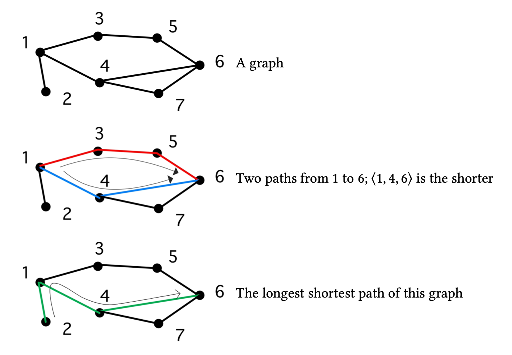
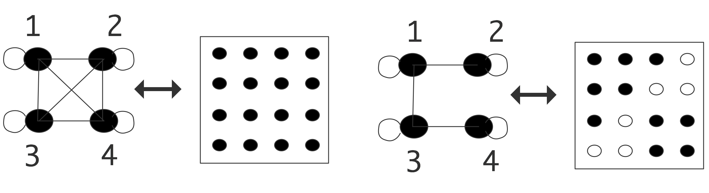

# 图论

图论是研究物体之间成对关系的数学分支。图既可以作为分析HPC中问题的工具，也可以作为研究对象。本附录介绍了基本概念和相关理论。

## 定义

图由一组对象以及它们之间的一组关系组成。这些对象，称为图的节点或顶点，通常形成一个有限集，所以我们通常用连续的整数$1…n$或$0…n−1$。节点之间的关系由图的边来描述：如果$i$和$j$是相关的，我们就说$(i，j)$是图的边。这个关系不需要是对称的，例如“小于”关系。那么，正式图是一个元组$G=<V,E>，$其中$V=\{1,\cdots,n\}$，且$E\subset \{(i,j): 1\leqslant i,j \leqslant n, i\neq j\}$。

如果$(i,j)\in E\Leftrightarrow (ji)\in E$，则图为“无向图”。另一种是有向图，我们用从$i$到$j$的箭头指示边缘$(i，j)$。
图论中经常出现的两个概念是图的度数和直径。

**定义 3** 度表示连接到任意节点的最大节点数：
$$
d(G) \equiv \max _{i}|\{j: j \neq i \wedge(i, j) \in E\}| .
$$
**定义 4** 图的直径是图中最长的最短路径的长度，其中路径定义为一组顶点$v_1，…，v_{k+1}$，即对于所有$i\neq j$和$v_i\neq v_j$。
$$
\forall_{1\leqslant i \leqslant k}:(v_i,v_{i+1})\in E.
$$
路径长度为$k$。

直径的概念如图18.2所示

除$v_1 =v_k+1$外，所有节点都不相交的路径称为圈。有时我们只对边的存在感兴趣$(i，j)$，有时我们给边附加一个值或“权重”$w_{ij}$。带加权边的图称为加权图。这样的图可以表示为元组$G=<V,E,W>$，其中$E$和$W$具有相同的基数。相反，一个未加权图的所有权值都是相同的，在这种情况下我们忽略权值。

## 图的一般类型

### 有向无环图

没有圈的图称为无循环图。这类图的一个特殊情况是有向无环图（DAG）。例如，这种类型的图可以用于建模任务之间的依赖关系：如果在$i$和$j$之间有一条边，这意味着任务$i$必须在任务$j$之前完成。

### 树

DAGs的一种特殊情况是树形图:在这里，任何节点都可以有多个传入边，但只有一条传出边。没有入边的节点是叶节点;没有出线边的节点称为根（可以有多个根吗？），而所有其他节点称为内部节点。

### 二部图

如果一个图可以划分为两个节点集，其中边只从一个节点集延伸到另一个节点集，而不是在一个集合内，我们称之为**二部图**（bipartite graph）。

## 图着色和独立集

我们可以给图的节点分配标签，这相当于把一组节点划分成不相交的子集。其中一种有趣的标记是图形着色：这里选择的标签（或“颜色”）是这样的，如果节点$i$和$j$具有相同的颜色，则没有边连接它们：$i, j \notin E$。

图的颜色很简单，每个节点都有自己的颜色。更有趣的是，可以给图着色的最小颜色数称为图的色数。

**练习 18.1** 证明如果一个图的度数为$d$，则颜色数最多为$d+ 1$。

一个著名的图着色问题是“**四色定理**”：如果一个图在二维地图（所谓的平面图）上描绘国家，那么颜色数最多为4。一般来说，找到颜色数字是困难的（事实上，这是一个np难题）。

图着色的颜色集也被称为**独立集**（independent sets），因为在每个颜色中，没有节点连接到相同颜色的节点。有一个简单的方法可以找到独立的集合：声明每个节点都有自己独特的颜色。另一方面，在独立集合中寻找“最佳”除法，例如通过寻找图的颜色数，是很困难的。然而，通常只需找到将节点合理划分为独立集就足够了，例如在构建并行ILU预处理器时。下面的算法做到了[116,149]：

- 给每个节点一个唯一的随机数。
- 现在找到一组节点，其数量高于其所有邻居；称之为第一个独立集。
- 从图中删除这个集合，并再次找到比它们所有的节点数量都高的节点邻居；这将是第二组。
- 重复此过程，直到所有节点都在一个独立的集合中。

**练习 18.2** 试着证明以这种方式找到的集合确实是独立的。

## 图论算法

在本节中，我们只简单地接触图算法；完整的讨论可以在9.1节中找到。

- **距离算法**：在诸如流量路由这样的应用中，知道从一个给定节点到所有其他节点的最短距离是很有意义的:单源最短路径问题;或者任意一对的最短距离全对最短路径问题。
- **连接算法**：在社交网络中，我们很有兴趣知道两个人是否有联系，这个图是否可以划分为不联系的子图，或者某个人是否两个群体之间的关键桥梁。

## 图和矩阵

图可以用多种方式呈现。当然，您可以只列出节点和边，但这种方法几乎不能得到深入的了解。简单的图可以通过绘制顶点和边来可视化，但对于大的图来说，这就变得笨拙了。另一种方法是构造图的邻接矩阵。对于图$G=<V,E>$，定义邻接矩阵$M$（其大小$n$等于顶点的数量$|V|$）
$$
M_{i j}=\left\{\begin{array}{ll}
1 & (i, j) \in E \\
0 & \text { otherwise }
\end{array}\right.
$$
相反，如果我们有一个矩阵，特别是一个稀疏矩阵，我们可以构造它的邻接图。这在图18.3中对密集矩阵和稀疏矩阵进行了说明。在这个例子中，矩阵在结构上是对称的，所以我们在图中使用直线而不是箭头。每个顶点上都有一条边对应于对角线元素；这条边通常会被省略在插图中。

对于带边权值的图，我们将邻接矩阵的元素设为权值：
$$
M_{i j}=\left\{\begin{array}{ll}
w_{i j} & (i, j) \in E \\
0 & \text { otherwise }
\end{array}\right.
$$
如果一个矩阵没有零元素，它的邻接图在每一对顶点之间有一条边。这样的图叫做**小团**（clique）。如果图是无向的，邻接矩阵是**对称的**（structurally symmetric），反之，如果一个矩阵是结构对称的，它的邻接图是无向的。

### 排列

图通常用来表示现实世界中物体之间的关系。Facebook上的“朋友关系”就是一个例子。在这种情况下，图中的节点没有自然编号:它们由名称标识，任何编号都是人为的。因此，如果我们采用不同的编号方式，我们就会想知道哪些图形属性保持不变，哪些属性会改变。

对一组对象重新编号可以通过应用一个排列矩阵进行代数建模。排列矩阵是一个方阵，其中每一行和每一列都恰好有一个元素等于1；其他所有元素都是零。

**练习 18.3** 让一组$N$对象$x_1，…，x_N$得到。排列为$x_1, x_3,\cdots,x_2, x_4\cdots$的排列矩阵是什么？也就是说，求矩阵$P$，使得：
$$
\left(\begin{array}{c}
x_{1} \\
x_{3} \\
\vdots \\
x_{2} \\
x_{4} \\
\vdots
\end{array}\right)=P\left(\begin{array}{c}
x_{1} \\
\vdots \\
x_{N}
\end{array}\right)
$$

**练习 18.4** 证明矩阵的特征值在置换下是不变的。

### 不可约性

作为在邻接矩阵中易于解释的图概念的一个例子，考虑可重延性。

**定义 6** 如果一个图的每个节点对$i，j$都有一条从$i$到$j$和从$j$到$i$的路径，则该图称为不可约图。如果一个图不是不可约的，它就是可约的。

**练习 18.5** 令矩阵$A$：
$$
A=\left(\begin{array}{ll}
B & C \\
\varnothing & D
\end{array}\right)
$$
其中$B$和$D$为方阵。证明它所对应的图的可约性邻接矩阵。

如果我们置换图，它的可约性或不可约性是不变的。然而，从邻接矩阵来看，它现在可能不再明显。

### 图的闭包

这是邻接矩阵如何简化图的推理的另一个例子。

**练习 18.6** 让𝐺=⟨𝑉，𝐸⟩为无向图，让𝐺' =𝑉，𝐸'为具有相同顶点的图，但顶点由定义
$$
(i,j)\in E' \Leftrightarrow \exist_k:(i,k)\in E \wedge (k,j) \in E
$$
若$M$为$G$的邻接矩阵，则证明$M^2$为$G'$的邻接矩阵，其中我们使用布尔乘法对元素：1⋅1 = 1，1 + 1 = 1。

### 线性代数中的图运算

在上述大多数情况下，邻接矩阵不过是一个表。现在我们将证明我们可以用它来做线性代数，使它配得上“矩阵”这个名字。作为在邻接矩阵$G$上使用线性代数的一个简单示例，设$e$为所有1的向量，则$Ge$是列出节点的度数的向量。

我们可以用这种方法做很多操作。考虑一个加权图$G$。为每个节点$i$寻找最大权重$g_{ij}$可以描述为
$$
y=G \otimes e \quad \text { where } \quad y_{i}=\max _{j} g_{i j} \cdot 1
$$

这看起来像正规的矩阵向量乘积$Ge$，但是用最大值计算代替了总和。

在很多情况下，我们实际上需要左积，也就是说，从左到右的邻接矩阵乘以一个行向量。例如，$e_i$是位置$i$为1，其他位置为0的向量。那么$e_i^tG$在每$j$中都有一个1，在$G$的邻接图中是$i$的一个邻居。

#### 马尔可夫链

这个左矩阵向量积有一个巧妙的应用：马尔可夫链。假设我们有一个系统（参见实例19）可以是任何$n$状态。然后我们可以使用邻接矩阵来建模状态转换。

让$G$通过一个邻接矩阵，其属性是所有元素都是非负的，并且每一行的元素和为1。我们现在将$g_{ij}$解释为从状态$i$到状态$j$的概率。设$x$为概率向量，即$x_i$为处于状态$i$的非负概率，则$y^t = x^tG$描述了这些概率，在一次状态转换之后。

**练习 18.7** 一个向量$x$要成为一个合适的概率向量，其元素的和需要为1。表明$y$元素的和再次为1。

#### 一般的矩阵-向量乘积

上面的例子表明，有时我们对具有矩阵-向量乘积结构的邻接矩阵进行运算，但不一定使用加法和乘法（更多的例子可以在9.1节中找到）。

基于此，我们定义了一般乘积
$$
y=G \oplus \cdot_{\otimes} x
$$
其中$\otimes $为二元算子，$\oplus$为约简算子，为
$$
y_{i}=\bigoplus_{j}\left(g_{i j} \otimes x_{j}\right)
$$
在这个符号中，求出最大的权值
$$
w=G \max \cdot_\times e
$$
这将在第9章的几个算法中使用;其他应用请参见[133]。

## 谱图理论

对于图$G$及其邻接矩阵$A_G$，我们可以通过缩放$A_G$定义随机矩阵或马尔可夫矩阵，得到单位行和：
$$
W_{G}=D_{G}^{-1} A_{G} \quad \text { where }\left(D_{G}\right)_{i i}=\operatorname{deg}(i)
$$
为了了解如何解释这一点，让我们看一个简单的例子。让我们取一个带邻接矩阵的非加权图
$$
A_{G}=\left(\begin{array}{llll}
1 & & 1 & 1 \\
& & 1 & 1 \\
1 & & 1 & 1 \\
& 1 & 1 &
\end{array}\right)
$$
再看第二行，这里有边(2,3)和(2,4)这意味着如果在节点2上，我们可以到节点3和4。对这个矩阵进行缩放
$$
W_{G}=\left(\begin{array}{llll}
1 / 3 & & 1 / 3 & 1 / 3 \\
& & 1 / 2 & 1 / 2 \\
1 / 3 & & 1 / 3 & 1 / 3 \\
& 1 / 2 & 1 / 2 &
\end{array}\right)
$$
第二行表示从节点2得到节点3和节点4的概率相等。我们也可以从数学上推导出这个命题：
$$
\left(\begin{array}{llll}
0 & 1 & 0 & 0
\end{array}\right) W_{G}=\left(\begin{array}{llll}
0 & 0 & 1 / 2 & 1 / 2
\end{array}\right)
$$
可以很简单地推断：如果$p$是一个向量，其中第$i$组件给出了节点$i$存在的概率，那么$(p^tW_G)_i$是节点$i$的概率，如果沿着图沿再走一步的话。

**练习 18.8** 证明$p^tW_G$确实是一个概率向量。提示：可以表达出来$p$是一个概率向量$p^te=e$，其中$e$是所有1的向量。

### 图拉普拉斯算子

另一个与图相关联的矩阵是图拉普拉斯矩阵
$$
L_G=D_G-A_G
$$
这个矩阵的行和为零，且对角项为正，因此根据Gershgorin定理（第13.5节），它的所有特征值都在复右半平面上。

**练习 18.9** 证明所有1的向量是一个特征值为1的特征向量。这个拉普拉斯矩阵给出了一个二次形式
$$
x^{t} L_{G} x=\sum_{(i, j) \in E}\left(x_{i}-x_{j}\right)^{2}
$$

### 通过拉普拉斯矩阵进行区域分解

有许多有趣的定理与图邻接和拉普拉斯矩阵有关。这些对于区域分解有非常实际的应用。我们受到椭圆偏微分方程的启发。

与拉普拉斯方程$-\Delta u=f$相联系的是一个算子$Lu = -\Delta u$。在单位区间[0,1]上，该算子的特征函数，即$Lu=\lambda u$的函数为$n>0$的$u_n(x)=\sin \pi x$。它们的性质是$u_n(x)$在间隔的内部有$n−1$个零，并且它们分割了函数为正或负的$n$连接区域中的间隔。因此，如果我们想在$p$处理器上划分域$\Omega$，您可以考虑$\Omega$上拉普拉斯算子的第$p$特征函数，并找到其为正或为负的连通区域。

这个关于偏微分方程的陈述在费德勒定理的两个版本中具有图等价性。(在这部分我们不会给出任何证明;参见[185])。

**定理 6** 设$G$为$n$顶点上的加权路径图，设$L_P$特征值为$0 =\lambda_1 <\lambda_2\leqslant \cdots \leqslant \lambda_n$，设$v_k$为$\lambda_k$的特征向量。然后$v_k$修改“$k−1$”。

第二个定理更有用[64]：

**定理 7** 设$G=(V,E,w)$为加权连通图，设$L_G$为其拉普拉斯矩阵。令$0 =\lambda_1 <\lambda_2\leqslant \cdots \leqslant \lambda_n$的特征值$L_G$让$v_1,\cdots, v_n$ 为对应的特征向量。对于任何$k\geqslant 2$，让$W_k=\{i\in V: v_k(i)\geqslant 0\}$。那么由$G$在$W_k$上生成的图最多有$k−1$个连接的组件。

这一结果的重要结果是，特征向量的第一个非平凡特征值可以用来把图分割成两个连接的部分——一个是特征向量为正的节点，一个是特征向量为负的节点。这个特征向量被称为**费德勒向量**。邻接矩阵是非负的，对于这种类型的矩阵[12]有一个广泛的理论；见第13.4节的Perron-Frobenius定理。

一般来说，通过测量边数的比例，并不能保证这种分解有多好，但在实践中，可以证明这种行为是相当好的[186]。

### Cheeger不等式

上面我们讨论了图拉普拉斯的第一个非平凡特征值与图分成两部分有关。齐格常数和齐格不等式将这个特征值与分割的某种质量度量联系起来。

设$V$为顶点的集合，$S\subset V$，则定义一个图的cheger常数为
$$
C=\min _{S} \frac{e(S, V-S)}{\min \operatorname{vol}(S), \operatorname{vol}(V-S)}
$$
其中$e(S，V−S)$表示连接$S$到$V-S$的边数，一组节点的容量定义为
$$
\operatorname{vol}(S)=\sum_{e \in S} d(e)
$$
Cheeger 不平等是这样说的：
$$
2 C \geqslant \lambda \geqslant \frac{C^{2}}{2}
$$
其中$\lambda$是图拉普拉斯矩阵的第一个非平凡特征值。