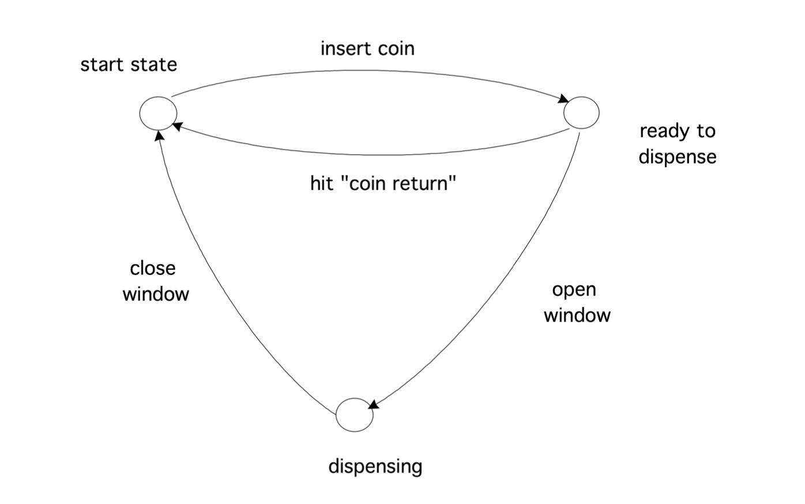

# 自动机理论

自动机是机器的数学抽象。自动机有一个广泛的理论;这里我们只讲基本概念。让我们从一个简单的例子开始。

## 有限状态自动机

有限状态自动机（FSA）是一种非常简单的机器，它与自动售货机一样，插入硬币后就会自动吐出一块糖果棒。自动贩卖机有四种操作方式：插入硬币，按“硬币返还”键要求归还所有插入的钱，打开窗口取糖果棒，然后再次关闭窗口。一个操作（特别是第三个）是否可能取决于机器所处的状态。这里有三种状态：开始状态，四分之一被插入并且窗口被解锁的状态（让我们称之为“准备分配”），以及窗口打开的状态（我们称之为“分配”）。

在某些状态下，某些行为是不可能的。例如，在开始状态下，窗口不能打开。这台自动售货机的数学描述包括1。州的列表，2。一个表格，显示可能的操作如何使机器从一种状态转到另一种状态。但是，与记录表格相比，图形表示通常更有洞察力。

## 一般讨论

从自动售货机的例子中，你可以看到自动售货机的一个重要特征:它允许某些操作，但只在某些情况下，最终它有一个对应于“成功”的状态，这只有在采取某些操作序列时才会达到。

对这一过程的正式描述如下:我们称个体行为为“字母表”，而基于该字母表的一系列行为为“单词”。然后，机器的“成功”结果对应于一个判断，即某个单词属于自动机器所接受的“语言”。因此，自动机理论与语言理论之间存在着某种对应关系。

**练习 19.1** 考虑alpha$\{a，b\}$，即只包含$a、b$的字母表，并考虑语言$\{a^m b^n:m，n> 0\}$，这是由一个或多个$as$后跟一个或多个方根组成的单词。画出接受这种语言的自动机。

FSA之所以是最简单的类型，是因为它没有内存。大多数自动贩卖机不会抱怨如果你放入超过1 / 4的硬币：它们除了“被插入了1 / 4”外没有任何记忆。更复杂的机器会计算你插入了多少枚25美分硬币，然后让你打开那么多窗口，看到不同的糖果棒。在上述正式的描述方式中，该机器将接受语言${q^nw^n∶n\geqslant 0}$，也就是说，您存入的硬币数($'q'$)与您打开的窗口数('$w$')相同。这种语言是所谓的上下文无关语言的一个例子；原始自动售货机的语言是常规语言。

这两种语言类型属于乔姆斯基语言的四级层次结构。识别递归可枚举语言类型的著名图灵机位于层次结构的顶层。缺失的步骤具有上下文敏感的语言类型，该类型由线性有界自动机识别。