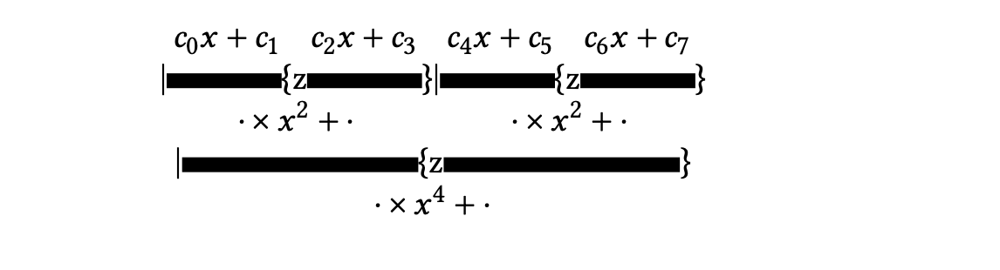

# 并行前缀

为了使操作能够并行执行，它们需要是独立的。这使得并行计算递归是困难的。递归出现在很明显的地方，比如解三角方程组（第5.3.5节），但它们也可以出现在排序和许多其他操作中。

在本附录中，我们将介绍并行前缀操作:并行执行由涉及关联操作符的递归定义的操作（请参阅第6.10.2节，了解并行化递归的“递归加倍”方法）。计算元素数组的和就是这种类型操作的一个例子（暂时忽略非结合性）。设$\pi(x，y)$为二进制和运算符：
$$
\pi (x,y)\equiv x+y
$$
然后定义$n\geqslant 2$项的前缀和为
$$
\Pi\left(x_{1}, \ldots, x_{n}\right)=\left\{\begin{array}{ll}
\pi\left(x_{1}, x_{2}\right) & \text { if } n=2 \\
\pi\left(\Pi\left(x_{1}, \ldots, x_{n-1}\right), x_{n}\right) & \text { otherwise }
\end{array}\right.
$$
作为一个非明显的前缀操作，我们可以计算具有特定属性的数组元素的数量。

**练习 20.1**  假设$p(⋅)$为一个谓词，$p(x)= 1$，如果对$x$成立，则为0。定义一个二元运算符$\pi (x，y)$，以便它对一个数字数组进行缩减，得到$p$为真的元素数量。

现在假设存在一个关联操作符$\oplus$，它是一个值为$x_1，…，x_n$的数组。然后我们将前缀问题定义为$X_1，…,X_n$，
$$
\left\{\begin{array}{l}
X_{1}=x_{1} \\
X_{k}=\oplus_{i \leq k} x_{i}
\end{array}\right.
$$

## 并行前缀

并行化的关键是实现我们可以并行计算部分约简:
$$
x_1\oplus x_2, \quad x_3 \oplus x_4, \cdots
$$
都是独立的。此外，这些削减的部分削减，
$$
(x_1 \oplus x_2 )\oplus (x_3 \oplus x_4), \cdots
$$
也是独立的。我们用这个符号
$$
X_{i,j} = x_i \oplus \cdots \oplus x_j
$$
对这些部分削减。

我们在之前的2.1节中已经看到:可以在$\lceil \log2n\rceil$步骤中减少$n$数字数组。要使这个操作成为一个完整的前缀操作，需要计算所有中间值。

观察一下，例如，$X_3 =(x_1\oplus x_2)\oplus x_3 =X_2 \oplus x_3$，我们现在可以想象整个过程;关于8个元素的情况，请参见图20.1。要计算，比如$X_{13}$，可以表示$13 = 8 + 4 + 1$并进行计算$x_{13}=x_8\oplus X_{9,12} \oplus x_13$.

在此图中，相同“距离”上的操作与SIMD类型执行相对应，已经水平对齐。如果按照任务图执行，有些步骤可以在图中建议的时间之前执行;例如$X_3$可以与$X_6$同时计算。

不管计算步骤的安排如何，不难看出整个前缀计算可以在$2 \log2n$步骤中完成：$\log2n$步骤用于计算最终约简$X_n$，然后另一个$\log2n$步骤用于填充中间值。

## 并行前缀的稀疏矩阵向量积

研究发现，稀疏矩阵向量积可以看作是一个前缀运算；参见[16]。这里的推理是先计算所有$y_{ij}\equiv a_{ij}x_j$，然后用前缀运算计算$y_i=\sum_j y_{ij}$的和。

上面解释的前缀和不能计算正确的结果。前两个$y_{ij}$术语的总和确实为$y_1$，但是继续前缀sum得到$y_1 +y_2$，而不是$y_2$。使此工作的技巧是考虑双组件数量$⟨y_{ij}，s_{ij}⟩$，其中
$$
s_{i j}=\left\{\begin{array}{ll}
1 & \text { if } j \text { is the first nonzero index in row } i \\
0 & \text { otherwise }
\end{array}\right.
$$
现在我们可以定义每次$s_{ij}= 1$时的前缀和为' reset '。

## Horner 法则

评估多项式的霍纳规则是一个简单递归的例子：
$$
y=c_{0} x^{n}+\cdots+c_{n} x^{0} \equiv\left\{\begin{array}{l}
t_{0} \leftarrow c_{0} \\
t_{i} \leftarrow t_{i-1} \cdot x+c_{i} \quad i=1, \ldots, n \\
y=t_{n}
\end{array}\right.
$$
或者写得更明确些
$$
y=\left(\left(\left(c_{0} \cdot x+c_{1}\right) \cdot x+c_{2}\right) \cdots\right)
$$
像许多其他递归一样，这个看似连续的操作可以并行：

然而，我们在这里看到需要一些聪明的方法：我们需要$x、x_2、x_4$等来相乘子结果。霍纳氏法则
上面解释的前缀和不能计算正确的结果。前两个$y_{ij}$术语的总和确实为$y_1$，但是继续前缀sum得到$y_1 +y_2$，而不是$y_2$。使此工作的技巧是考虑双组件数量$<y_{ij}，s_{ij}>$，其中将霍纳规则解释为前缀方案是失败的：“霍纳操作符” $hx(a，b)=ax+b$很容易被认为是没有联想性的。从上面的按树计算中可以看出，我们需要携带并更新$x$，而不是将其附加到操作符。

一些小实验证明了这一点
$$
h\left(\left[\begin{array}{l}
a \\
x
\end{array}\right],\left[\begin{array}{l}
b \\
y
\end{array}\right]\right) \equiv\left[\begin{array}{c}
a y+b \\
x y
\end{array}\right]
$$
可以达到：
$$
h\left(\left[\begin{array}{l}
a \\
x
\end{array}\right],\left[\begin{array}{l}
b \\
y
\end{array}\right],\left[\begin{array}{l}
c \\
z
\end{array}\right]\right)=\left\{\begin{array}{c}
h\left(h\left(\left[\begin{array}{l}
a \\
x
\end{array}\right],\left[\begin{array}{l}
b \\
y
\end{array}\right]\right),\left[\begin{array}{l}
c \\
z
\end{array}\right]\right)=h\left(\left[\begin{array}{c}
a y+b \\
x y
\end{array}\right],\left[\begin{array}{l}
c \\
z
\end{array}\right]\right) \\
h\left(\left[\begin{array}{l}
a \\
x
\end{array}\right], h\left(\left[\begin{array}{l}
b \\
y
\end{array}\right],\left[\begin{array}{l}
c \\
z
\end{array}\right]\right)\right)=h\left(\left[\begin{array}{c}
a \\
x
\end{array}\right],\left[\begin{array}{c}
a y z+b z+c \\
y z
\end{array}\right]\right)
\end{array}\right\}=\left[\begin{array}{c}
a y z+b z+c \\
x y z
\end{array}\right]
$$
这样我们就可以认识到霍纳规则是：
$$
h\left(\left[\begin{array}{l}
c_{0} \\
x
\end{array}\right],\left[\begin{array}{l}
c_{1} \\
x
\end{array}\right], \ldots,\left[\begin{array}{l}
c_{n} \\
x
\end{array}\right]\right)
$$
顺便说一句，这种特殊形式的“霍纳运算符”对应于程序设计语言APL中的“rho”运算符，它通常被表述为具有变基数的数字系统的求值。