# 分子动力学

分子动力学是一种模拟分子的逐个原子行为并从这些原子运动中推导出宏观属性的技术。它适用于生物分子，如蛋白质和核酸，以及材料科学和纳米技术的天然和合成分子。分子动力学属于粒子方法的范畴，其中包括天体力学和天体物理学中的N体问题，这里介绍的许多观点将延续到这些其他领域。此外，还有一些分子动力学的特殊情况，包括从头开始的分子动力学，其中电子被量子力学地处理，因此可以对化学反应进行建模。我们将不讨论这些特殊情况，而是集中讨论经典的分子动力学。

分子动力学的想法非常简单：一组粒子根据牛顿运动定律相互作用，$F = ma$。考虑到初始粒子的位置和速度、粒子的质量和其他参数，以及粒子之间的作用力模型，牛顿运动定律可以通过数值集成来给出每个粒子在未来（和过去）所有时间的运动轨迹。通常情况下，粒子居住在一个具有周期性边界条件的计算箱中。

因此，一个分子动力学的时间步骤由两部分组成。

1：计算各粒子的力量 2：更新位置（整合）。

力的计算是最昂贵的部分。最先进的分子动力学模拟是在并行计算机上进行的，因为力的计算是昂贵的，而且合理的模拟长度需要大量的时间步骤。在许多情况下，分子动力学也被应用于具有非常多原子的分子的模拟，例如，对于生物分子和长时间尺度来说，可以达到一百万，对于其他分子和短时间尺度来说，可以达到数十亿。

数值整合技术在分子动力学中也很有意义。对于需要大量时间步长的模拟来说，能量等量的保存比准确度更重要，必须使用的求解器与第四章中介绍的传统ODE求解器不同。

在下文中，我们将介绍用于生物分子模拟的力场，并讨论计算这些力的快速方法。然后，我们将专门讨论短程力的分子动力学并行化和用于长程力快速计算的三维 FFT的并行化。

最后，我们用一个章节来介绍适合于分子动力学模拟的集成技术类别。我们在本章中对分子动力学主题的处理是为了介绍和实用；如果想了解更多的信息，建议阅读文本[68]。

## 受力计算

### 力场

在经典的分子动力学中，势能和原子间作用力的模型被称为力场。力场是一个可操作但近似的量子力学效应模型，对于大分子来说，计算成本太高，无法确定。不同的力场用于不同类型的分子，也有不同的研究人员用于同一分子，而且没有一个是理想的。

在生化系统中，常用的力场将势能函数建模为键合能、范德瓦尔斯能和静电（库仑）能之和。
$$
E=E_{\text {bonded }}+E_{\text {Coul }}+E_{\mathrm{vdW}}
$$
势是模拟中所有原子位置的函数。原子上的力是原子位置上的这个势的负梯度。粘合能是由于分子中的共价键造成的。

$$
E_{\text {bonded }}=\sum_{\text {bonds }} k_{i}\left(r_{i}-r_{i, 0}\right)^{2}+\sum_{\text {angles }} k_{i}\left(\theta_{i}-\theta_{i, 0}\right)^{2}+\sum_{\text {torsions }} V_{n}(1+\cos (n \omega-\gamma))
$$
其中，这三个项分别是所有共价键的总和、两个键形成的所有角度的总和以及三个键形成的所有二面体角度的总和。固定参数$k_i, r_{i,0}$等取决于所涉及的原子类型，对于不同的力场可能有所不同。额外的项或具有不同函数形式的项也是常用的。

势能的其余两个项$E$统称为非键合项。理论上，它们构成了力计算的主体。静电能是由原子电荷引起的，其模型是我们熟悉的
$$
E_{\text {Coul }}=\sum_{i} \sum_{j>i} \frac{q_{i} q_{j}}{4 \pi \epsilon_{0} r_{i j}}
$$
其中，总和为所有原子对，$q_i$和$q_j$是原子$i$和$j$的电荷，$r_{ij}$是原子$i$和$j$之间的间距。最后，范德瓦尔斯能近似于剩余的吸引和排斥效应，通常用伦纳德-琼斯函数来模拟
$$
E_{\mathrm{vdW}}=\sum_{i} \sum_{j>i} 4 \epsilon_{i j}\left[\left(\frac{\sigma_{i j}}{r_{i j}}\right)^{12}-\left(\frac{\sigma_{i j}}{r_{i j}}\right)^{6}\right]
$$
其中$\varepsilon_{ij}$和$\sigma_{ij}$是力场参数，取决于原子类型。在短距离上，排斥性的($r^{12}$)项起作用，而在长距离上，分散(吸引，-$r^6$)项起作用。

分子动力学力计算的并行化取决于这些不同类型的力计算的并行化。键合力是局部计算，即对于一个给定的原子，只需要附近的原子位置和数据。范德瓦耳斯力也是局部的，被称为短程的，因为它们对于大的原子分离来说是可以忽略的。静电力是长程的，各种技术已经被开发出来以加快这些计算。在接下来的两个小节中，我们分别讨论短程和长程非键合力的计算。

### 计算短距离非结合力

对一个粒子的短程非粘合力的计算可以在超过该粒子的截止半径$r_c$时被截断。对某一粒子$i$进行这种计算的天真方法是检查所有其他粒子并计算它们与粒子$i$的距离。对于$n$粒子来说，这种方法的复杂性是$O(n^2)$，相当于计算所有粒子对之间的力。有两种数据结构，即单元格列表和Verlet邻居列表，可以独立用于加速这种计算，还有一种方法是将两者结合起来。


#### 细胞列表

单元列表的想法经常出现在寻求给定点附近的一组点的问题中。参照图7.1(a)，我们用一个二维的例子来说明这个想法，在粒子集合上铺设一个网格。如果网格间距不小于𝑟𝑐，那么为了计算对粒子𝑖的作用力，只需要考虑包含𝑖的单元和8个相邻单元的粒子。对所有的粒子进行一次扫描就可以为每个单元构建一个粒子列表。这些单元格列表被用来计算所有粒子的力。在下一个时间步骤中，由于粒子已经移动，必须重新生成或更新细胞列表。这种方法的复杂性是计算数据结构的$O(n)$和计算力的$O(n\times n_c$)，其中$n_c$是9个单元的平均粒子数（三维的27个单元）。单元列表数据结构所需的存储量为$O(n)$。

#### 维莱特邻居名单

单元列表结构有些低效，因为对于每个粒子$i$，$n_c$粒子被考虑，但这远远多于截止点$r_c$内的粒子数量。一个Verlet邻居列表是一个粒子𝑖的截止点内的粒子列表。每个粒子都有自己的列表，因此需要的存储量为$O(n\times n_v)$，其中$n_v$是截止点内粒子的平均数量。一旦构建了这些列表，计算力就会非常快，需要最小的复杂度$O(n \times  n_v)$。构建列表的成本较高，需要检查每个粒子的所有粒子，即不低于原来的复杂性$O(n^2)$。然而，其优点是，如果使用扩大的截止点$r_v$，邻居列表可以在许多时间步骤中重复使用。参考图7.1(b)中的一个二维例子，只要没有来自两个圆圈外的粒子在内圈内移动，邻居列表就可以被重复使用。如果粒子的最大速度可以被估计或限定，那么我们可以确定一个时间步数，在这个时间步数内重复使用邻居列表是安全的。(另外，也可以在任何粒子穿越到截止点内的位置时发出信号）。从技术上讲，Verlet邻居列表是在扩展的截止点内的粒子列表，$r_v$。

#### 同时使用小区和邻居列表

混合方法是简单地使用Verlet邻居列表，但使用单元格列表来构建邻居列表。这减少了需要重新生成邻居列表时的高成本。这种混合方法非常有效，也是最先进的分子动力学软件中经常使用的方法。

单元列表和Verlet邻居列表都可以被修改，以利用以下事实：由于粒子$f_{ij}$的作用力等于$-f_{ji}$（牛顿第三定律），只需要计算一次。例如，对于单元格列表，只需要考虑8个单元格中的4个（在二维）。

### 计算远距离的力量

静电力的计算具有挑战性，因为它们是长程的：每个粒子都感受到来自模拟中所有其他粒子的不可忽略的静电力。有时使用的一种近似方法是在某个截止半径后截断粒子的力计算（就像对短程范德瓦尔斯力所做的那样）。然而，这通常会在结果中产生不可接受的假象。

有几种更精确的方法可以加快静电力的计算，避免对所有$n$粒子的$O(n^2)$和。我们在此简要介绍其中一些方法。

#### 层次化的N体方法

分层$N$体方法，包括Barnes-Hut方法和快速多极方法，在天体物理粒子模拟中非常流行，但对于生物分子模拟所要求的精度来说，通常成本太高。在Barnes-Hut方法中，空间被递归地划分为8个相等的单元（三维），直到每个单元包含零或一个粒子。附近的粒子之间的作用力是单独计算的，就像正常情况一样，但是对于远处的粒子，作用力是在一个单元内的一个粒子和一组远处的粒子之间计算的。准确度的测量被用来确定是否可以使用远处的单元来计算力，或者必须通过单独考虑其子单元来计算。Barnes-Hut方法的复杂度为$O(n\log n)$。快速多极法的复杂度为$O(n)$；该方法计算势，不直接计算力。

#### 粒子网格法

在粒子网格方法中，我们利用了泊松方程
$$
\nabla^{2} \phi=-\frac{1}{\epsilon} \rho
$$


它将电势$\phi$与电荷密度$\rho$联系起来，其中$1/\varepsilon$是一个比例常数。为了利用这个方程，我们用一个网格来离散空间，给网格点分配电荷，解决网格上的泊松方程，得出网格上的势。力是电位的负梯度（对于保守力，如静电力）。许多技术已经被开发出来，用于将空间中的点电荷分布到一组网格点上，也用于数值插值点电荷上由于网格点的电势而产生的力。许多快速方法可用于解决泊松方程，包括多网格方法和快速傅里叶变换。在术语方面，粒子网格方法与天真的粒子-粒子方法相反，后者是在所有粒子对之间计算力。

事实证明，粒子网格法不是很准确，一个更准确的替代方法是将每个力分成短程、快速变化的部分和长程、缓慢变化的部分。
$$
f_{i j}=f_{i j}^{s r}+f_{i j}^{l r}
$$
实现这一目标的一个方法是用一个函数h(𝑟)来衡量𝑓，它强调短程部分（小𝑟），用1-h(𝑟)来强调长程部分（大𝑟）。短程部分是通过计算截止点内所有粒子对的相互作用来计算的（粒子-粒子方法），长程部分是用粒子-网格方法计算的。由此产生的方法，称为粒子-粒子-网格（PPPM，或P3），是由于霍克尼和伊斯特伍德在1973年开始的一系列论文中提出的。

#### 埃瓦尔德法

Ewald方法是迄今为止描述的生物分子模拟中最流行的静电力的方法，是为周期性边界条件的情况而开发的。该方法的结构与PPPM相似，即力被分成短程和长程两部分。同样，短程部分用粒子-粒子方法计算，长程部分用傅里叶变换计算。Ewald方法的变种与PPPM非常相似，因为长程部分使用网格，而快速傅里叶变换被用来解决网格上的泊松方程。更多的细节，请参见，例如[68]。在第7.3节中，我们描述了三维 FFT的并行化以解决三维 Poisson方程。

## 并行分解

我们现在讨论力的并行计算。Plimpton[169]创建了一个非常有用的分子动力学并行化方法的分类，确定了原子、力和空间分解的方法。在此，我们紧跟他对这些方法的描述。我们还增加了第四类，这类方法已被公认为与前面的类别不同，称为中性领土方法，这个名字是由Shaw[182]创造的。中立领地方法目前被许多最先进的分子动力学代码所使用。空间分解和中性领土方法对基于截止点的计算的并行化特别有利。

### 原子分解

在原子分解中，每个粒子被分配给一个处理器，该处理器负责计算粒子的力，并在整个模拟中更新其位置。为了使计算大致平衡，每个处理器被分配到大致相同数量的粒子（随机分布效果好）。原子分解的一个重要观点是，每个处理器一般都需要与所有其他处理器进行通信，以共享更新的粒子位置。


图7.2: 原子分解，显示了分布在8个处理器中的16个粒子的力矩阵。一个点代表力矩阵中的一个非零条目。在左边，矩阵是对称的；在右边，为了利用牛顿第三定律，只计算一对偏斜对称元素中的一个元素。

图7.2(a)中的力矩阵说明了一个原子分解。对于$n$粒子，力矩阵是一个$n\times n$的矩阵；行和列按粒子指数编号。矩阵中的非零条目$f_{ij}$表示由于粒子$j$而对粒子$i$产生的非零力，必须计算出来。这个力可能是一个非粘结力和/或粘结力。当使用截断时，矩阵是稀疏的，如本例中。如果在所有粒子对之间计算力，矩阵是密集的。由于牛顿第三定律$f_{ij}=-f_{ji}$，该矩阵是歪斜对称的。图7.2(a)中的线条显示了粒子是如何被分割的。在图中，16个粒子被划分到8个处理器中。

算法1从一个处理器的角度展示了一个时间步骤。在时间步骤开始时，每个处理器持有分配给它的粒子的位置。

一个优化是将计算量减半，这是有可能的，因为力矩阵是

```c
Algorithm 1 Atom decomposition time step
1: send/receiveparticlepositionsto/fromallotherprocessors
2: (ifnonbondedcutoffsareused)determinewhichnonbondedforcesneedtobecomputed 3: computeforcesforparticlesassignedtothisprocessor
4: updatepositions(integration)forparticlesassignedtothisprocessor
```

歪斜对称的。为了做到这一点，我们为所有偏斜对称对准确选择$f_i$或$f_{ji}$中的一个，这样每个处理器负责计算的力的数量大致相同。选择力矩阵的上三角或下三角部分是一个不好的选择，因为计算负荷是不平衡的。更好的选择是，如果$i + f_{ij}$在上三角中是偶数，或者如果$i + j$在下三角中是奇数，就计算$j$，如图7.2（b）所示。还有许多其他选择。

当利用力矩阵中的歪斜对称性时，一个处理器所拥有的粒子上的所有力不再由该处理器来计算。例如，在图7.2(b)中，粒子1上的力不再只由第一个处理器计算。为了完成力的计算，处理器必须通过通信来发送其他处理器需要的力，并接收其他处理器计算的力。现在必须修改上述算法，增加一个通信步骤（步骤4），如算法2所示。

````c
Algorithm 2 Atom decomposition time step, without redundant calculations 1: send/receiveparticlepositionsto/fromallotherprocessors
2: (ifnonbondedcutoffsareused)determinewhichnonbondedforcesneedtobecomputed
3: computepartialforcesforparticlesassignedtothisprocessor
4: sendparticleforcesneededbyotherprocessorsandreceiveparticleforcesneededbythisprocessor 5: updatepositions(integration)forparticlesassignedtothisprocessor
````

如果额外的通信量被节省的计算量所抵消，这种算法是有利的。请注意，一般情况下，通信量会增加一倍。

### 力的分解

在力的分解中，力被分配到各处理器中进行计算。做到这一点的直接方法是将力矩阵划分为块，并将每个块分配给一个处理器。图7.3（a）说明了16个粒子和16个处理器的情况。粒子也需要被分配给处理器（如在原子分解中），目的是让处理器被分配来更新粒子的位置。在图中的例子中，处理器𝑖被分配来更新粒子𝑖的位置；在实际问题中，一个处理器会被分配来更新许多粒子的位置。请注意，同样，我们首先考虑的是倾斜对称的力矩阵的情况。

现在我们来看看一个时间步骤中力的分解所需的通信。考虑处理器3，它计算粒子0、1、2、3的部分力，并需要粒子0、1、2、3以及12、13、14、15的位置。因此，处理器3需要与处理器0、1、2、3，以及处理器12、13、14、15进行通信。在所有处理器计算完力之后，处理器3需要收集由其他处理器计算的对粒子3的力。因此，处理器2需要再次与处理器0、1、2、3进行通信。

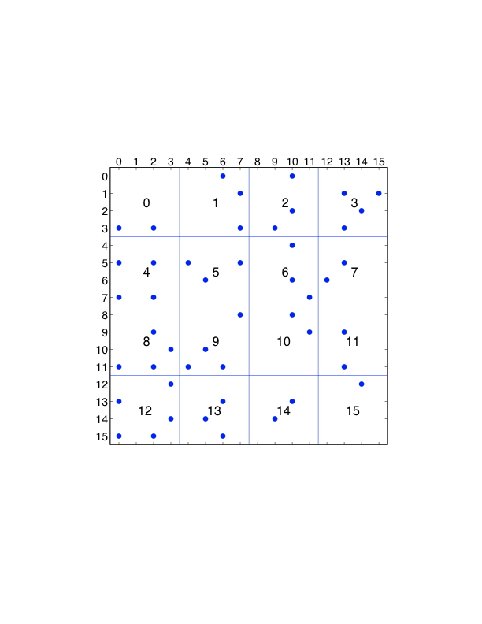

算法3显示了从一个处理器的角度来看，在一个时间步骤中所进行的工作。在时间步骤开始时，每个处理器持有分配给它的所有粒子的位置。

```c
Algorithm 3 Force decomposition time step
1: send positions of my assigned particles which are needed by other processors; receive row particle
positions needed by my processor (this communication is between processors in the same processor
row, e.g., processor 3 communicates with processors 0, 1, 2, 3)
2: receivecolumnparticlepositionsneededbymyprocessor(thiscommunicationisgenerallywithpro-
cessors in another processor row, e.g., processor 3 communicates with processors 12, 13, 14, 15)
3: (ifnonbondedcutoffsareused)determinewhichnonbondedforcesneedtobecomputed
4: computeforcesformyassignedparticles
5: send forces needed by other processors; receive forces needed for my assigned particles (this com-
munication is between processors in the same processor row, e.g., processor 3 communicates with
processors 0, 1, 2, 3)
6: updatepositions(integration)formyassignedparticles
```

一般来说，如果有$p$个处理器（为简单起见，$p$为正方形），那么力矩阵被$\sqrt{p}$个块分割成$\sqrt{p}$个。刚刚描述的力的分解需要处理器分三步进行通信，每一步都有$\sqrt{p}$个处理器。这比需要在所有$p$处理器之间进行通信的原子分解要有效得多。

我们还可以利用牛顿第三定律进行力的分解。像原子分解一样，我们首先选择一个修改过的力矩阵，其中只有$f_i$和$f_{ji}$中的一个被计算。粒子$i$上的力是由一排处理器计算的，现在也由一列处理器计算。因此，每个处理器需要一个额外的通信步骤，从一列处理器中收集分配给它的粒子的力。以前有三个通信步骤，现在利用牛顿第三定律时有四个通信步骤（在这种情况下，通信不是像原子分解那样加倍的）。

对力的分解的修改可以节省一些通信。在图7.4中，各列被重新排序，使用的是块-循环排序。再考虑一下处理器3，它计算粒子0、1、2、3的部分力。它需要来自粒子0、1、2、3的位置，和以前一样，但现在也需要处理器3、7、11、15。后者是与处理器3同列的处理器。因此，所有通信都在同一处理器行或处理器列内，这在基于网状的网络架构上可能是有利的。修改后的方法显示为算法4。

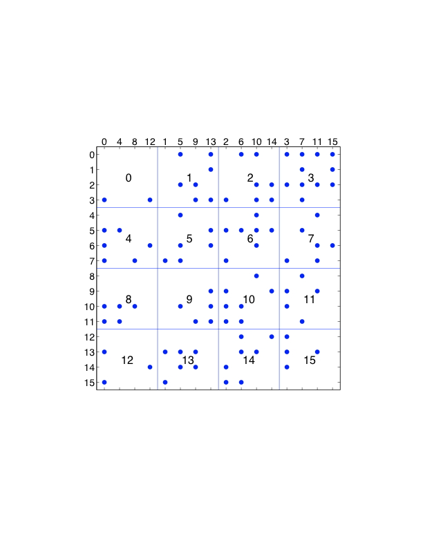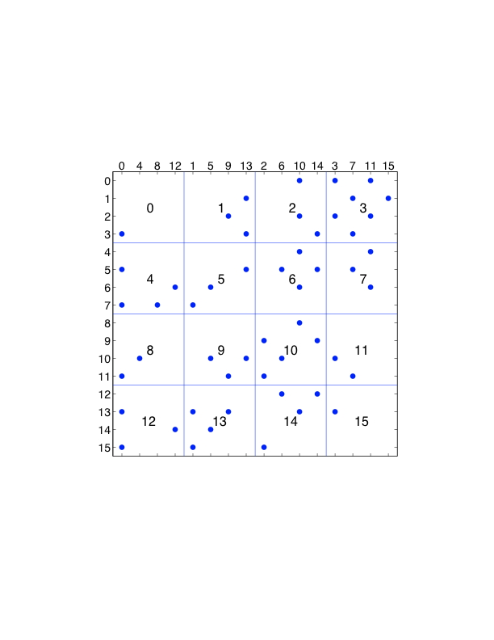

### 空间分解

在空间分解中，空间被分解为单元。每个单元被分配给一个处理器，负责计算位于该单元内的粒子上的力。图7.5(a)说明了在二维模拟的情况下，空间被分解为64个单元。(这是空间的分解，不能与力矩阵相混淆）。通常情况下，单元的数量被选择为与处理器的数量相等。由于粒子在模拟过程中移动，粒子在单元中的分配也随之改变。这与原子和力的分解相反。

图7.5(b)显示了一个单元（中间的正方形）和包含可能在截止半径𝑟𝑐内的粒子的空间区域（阴影），这些粒子在给定的单元中。阴影区域通常被称为导入区域，因为给定单元必须导入位于该区域的粒子的位置来进行受力计算。请注意，并不是给定单元中的所有粒子都必须与导入区域中的所有粒子相互作用，特别是如果导入区域与截止半径相比很大的话。

```c
Algorithm 4 Force decomposition time step, with permuted columns of force matrix
1: send positions of my assigned particles which are needed by other processors; receive row particle positions needed by my processor (this communication is between processors in the same processor
row, e.g., processor 3 communicates with processors 0, 1, 2, 3)
2: receivecolumnparticlepositionsneededbymyprocessor(thiscommunicationisgenerallywithpro-
cessors the same processor column, e.g., processor 3 communicates with processors 3, 7, 11, 15)
3: (ifnonbondedcutoffsareused)determinewhichnonbondedforcesneedtobecomputed
4: computeforcesformyassignedparticles
5: send forces needed by other processors; receive forces needed for my assigned particles (this com-
munication is between processors in the same processor row, e.g., processor 3 communicates with
processors 0, 1, 2, 3)
6: updatepositions(integration)formyassignedparticles
```

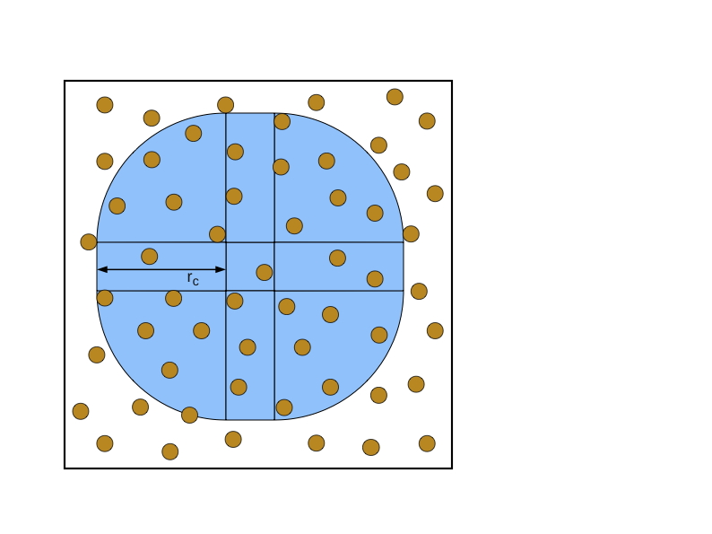

图7.5：空间分解，显示了二维计算盒中的粒子，（a）划分为64个单元，（b）一个单元的导入区域。

算法5显示了每个处理器在一个时间步骤中的执行情况。我们假设在时间步骤开始时，每个处理器持有其单元中的粒子的位置。

为了利用牛顿第三定律，进口区域的形状可以减半。现在，每个处理器只计算其单元中的粒子的部分力，并需要接收来自其他处理器的力来计算这些粒子的总力。因此涉及到一个额外的通信步骤。我们把这个问题留给读者去解决修改后的导入区域和这种情况下的伪代码的细节。

在空间分解方法的实施中，每个单元与它的导入区域的粒子列表相关联，类似于Verlet邻居列表。与Verlet邻居列表一样，如果进口区域略有扩大，则不必在每个时间步骤中更新该列表。这使得进口区域列表可以在几个时间步中重复使用，这与粒子穿越扩展区域的宽度所需的时间是一致的。这与Verlet邻居列表完全类似。

总之，空间分解方法的主要优点是它们只需要在对应于附近粒子的处理器之间进行通信。空间分解方法的一个缺点是，对于非常多的处理器来说，与每个单元内包含的粒子数量相比，导入区域很大。

```c
Algorithm 5 Spatial decomposition time step
1: sendpositionsneededbyotherprocessorsforparticlesintheirimportregions;receivepositionsfor
particles in my import region
2: computeforcesformyassignedparticles
3: updatepositions(integration)formyassignedparticles
```

### Neutral Territory Methods

我们对中立领土方法的描述与Shaw[182]的描述非常接近。中立领地方法可以被视为结合了空间分解和力分解的各个方面。为了并行化集成步骤，粒子根据空间的划分被分配到处理器。为了使力的计算并行化，每个处理器计算两组粒子之间的力，但这些粒子可能与被分配给处理器进行整合的粒子没有关系。由于这种额外的灵活性，中立领土方法需要的通信量可能比空间分解方法少得多。

图7.6是一个二维模拟的中性领土方法的例子。在图中所示的方法中，给定的处理器被指派计算位于横条的粒子与位于竖条的粒子之间的力。因此，这两个区域构成了这个方法的导入区域。通过与图7.6(b)的比较，这种中性领土方法的导入区域比相应的空间分解方法的导入区域小很多。当每个处理器所对应的单元的大小与截止半径相比很小时，这种优势就更大了。

在计算出力之后，给定的处理器将其计算出的力发送给需要这些力进行整合的处理器。因此，我们有了算法6。

````c
Algorithm 6 Neutral territory method time step
1: sendandreceiveparticlepositionscorrespondingtoimportregions
2: computeforcesassignedtothisprocessor
3: sendandreceiveforcesrequiredforintegration
4: updatepositions(integration)forparticlesassignedtothisprocessor
````

像其他方法一样，中立领土方法的进口区域可以被修改以利用牛顿第三定律。我们参考Shaw [182]，以了解更多的细节和中立领土方法在三维模拟中的图示。

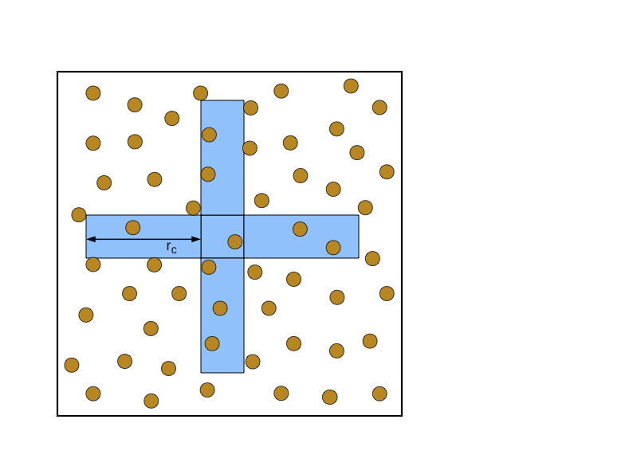

## 并行快速傅立叶变换

许多计算长程力的方法的一个共同组成部分是用于解决三维网格上泊松方程的三维FFT。傅里叶变换将泊松算子（称为拉普拉斯）对角化，在求解中需要一个正向和一个反向的FFT变换。考虑离散拉普拉斯算子$L$（具有周期性边界条件）和$\phi$在$-L\phi-\rho$的解。让$F$表示傅里叶变换。原问题相当于
$$
\begin{aligned}
-\left(F L F^{-1}\right) F \phi &=F \rho \\
\phi &=-F^{-1}\left(F L F^{-1}\right)^{-1} F \rho .
\end{aligned}
$$
矩阵$FLF^{-1}$是对角线。对$\rho$进行正向傅里叶变换$F$，然后用对角线矩阵的逆值对傅里叶空间分量进行缩放，最后，应用反傅里叶变换$F^{-1}$，得到解$\phi$。

对于现实中的蛋白质大小，通常使用大约1埃斯特朗的网格间距，从而导致一个按许多标准来说相当小的三维网格。 64×64×64，或128×128×128。 并行计算通常不会应用于这种大小的问题，但必须使用并行计算，因为数据𝜌已经分布在并行处理器之间（假设使用了空间分解）。 三维FFT是通过沿三个维度依次计算一维FFT来计算的。 对于64×64×64的网格大小，这就是4096个64维的一维FFT。 并行FFT计算通常受到通信的约束。 FFT的最佳并行化取决于变换的大小和计算机网络的结构。 下面，我们首先描述平行一维FFT的一些概念，然后描述平行三维FFT的一些概念。 对于目前致力于大型一维变换的并行化和高效计算（使用SIMD操作）的软件和研究，我们参考了SPIRAL和FFTW软件包。 这些软件包使用自动调谐来生成对用户的计算机结构来说是有效的FFT代码。

### 并行一维FFT

#### 无转置的一维FFT

图7.7显示了16点radix-2十进频FFT算法的输入（左边）和输出（右边）之间的数据依赖关系（数据流图）。(图中未显示的是计算中可能需要的位反转变换）。图中还显示了计算在四个处理器之间的划分。在这种并行化中，初始数据不在处理器之间移动，但在计算过程中会发生通信。在图中所示的例子中，通信发生在前两个FFT阶段；最后两个阶段不涉及通信。当通信发生时，每个处理器正好与另外一个处理器进行通信。

#### 转置的一维FFT

使用转置的方式来实现FFT计算的并行化是很常见的。图7.8(a)显示了与图7.7相同的数据流图，但为了清晰起见，删除了水平线并增加了额外的索引标签。和以前一样，前两个FFT阶段是在没有通信的情况下进行的。然后，数据在各处理器之间进行转置。有了这个转置的数据布局，最后两个FFT阶段可以在没有通信的情况下进行。最终的数据不按原来的顺序排列；可能需要额外的转置，或者数据可以按这个转置的顺序使用。图7.8(b)显示了转置前后指数在四个处理器中的分布情况。从这两个图中可以看出，前两个阶段的数据依赖性只涉及同一分区的指数。转置后的后两个阶段的分区情况也是如此。还要注意的是，转置前后的计算结构是相同的。

### 并行三维FFT

#### 块状分解的三维FFT

图7.9(a)显示了当使用空间分解时，FFT输入数据的块状分解，其大小为8×8×8，分布在以4×4×4拓扑结构排列的64个处理器中。并行一维FFT算法可以在每个维度上应用。对于图中所示的例子，每个一维FFT计算涉及4个处理器。每个处理器同时执行多个一维FFT（本例中为四个）。在每个处理器中，如果穿越其中一个维度，数据是连续排列的，因此在其他两个维度的计算中，数据访问是分层的。分层数据访问可能很慢，因此在计算每个维度的FFT时，可能值得在每个处理器中重新排序数据。

#### 3-D FFT与板块分解

图7.9(b)是4个处理器情况下的板块分解图。每个处理器持有输入数据的一个或多个平面。如果输入数据已经分布在板块中，或者可以以这种方式重新分布，就可以使用这种分解。板块平面内的两个一维FFT不需要通信。其余的一维FFT需要通信，可以使用上述两种平行一维FFT的方法之一。板块分解的缺点是，对于大量的处理器来说，处理器的数量可能会超过三维FFT中沿任何一个维度的点的数量。另一个选择是下面的铅笔分解。

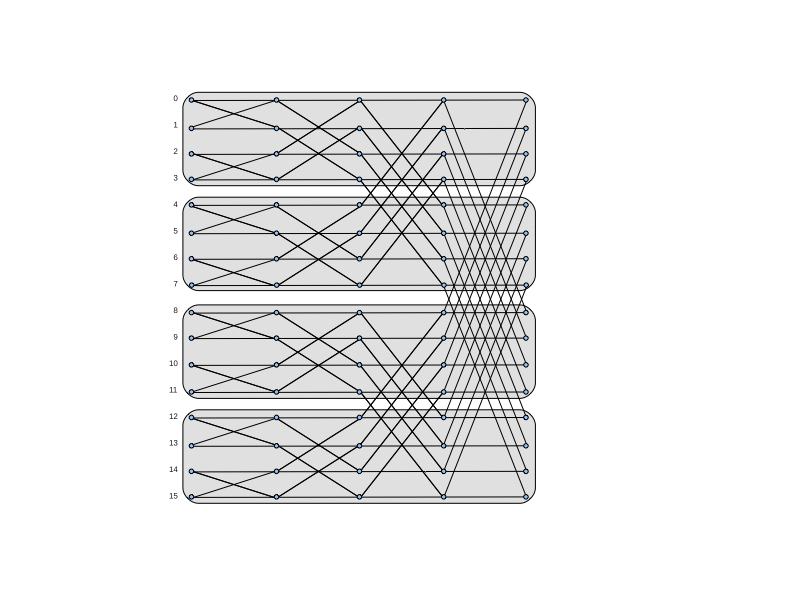

#### 三维FFT与铅笔式分解

图7.9(c)显示了16个处理器的情况下的铅笔分解情况。每个处理器持有一个或多个输入数据的铅笔。如果原始输入数据像图7.9(a)那样分布在块中，那么一排处理器之间的通信（在一个三维处理器网中）可以将数据分布到铅笔分解中。然后可以在没有通信的情况下执行一维FFT。为了在另一个维度上执行一维FFT，数据需要被重新分配到另一个维度的铅笔中。在整个三维FFT计算中，总共需要四个通信阶段。

## 分子动力学的整合

为了对分子动力学中的常微分方程系统进行数值积分，需要采用特殊的方法，与第四章中研究的传统ODE求解器不同。这些特殊的方法被称为对称方法，在产生具有恒定能量的解方面比其他方法更好，例如，对于那些被称为哈密尔顿的系统（包括分子动力学中的系统）。当哈密顿系统在很长的时间间隔内以许多时间步长进行积分时，保留结构（如总能量）往往比方法的精度顺序更重要。在这一节中，我们激励了一些想法，并给出了Störmer-Verlet方法的一些细节，该方法足以用于简单的分子动力学模拟。

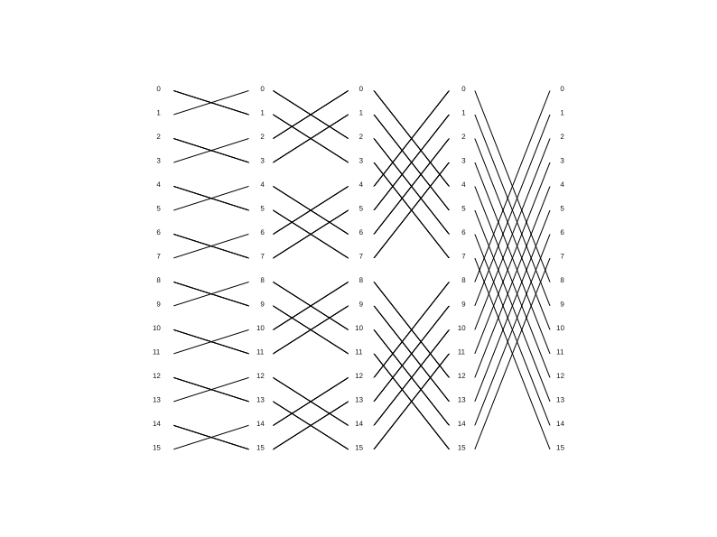

哈密顿系统是一类保存能量的动力系统，它可以被写成一种叫做哈密顿方程的形式。为了对称起见，考虑一下简单的谐波振荡器
$$
u''=-u
$$
其中$u$是单个粒子从平衡点的位移。这个方程可以模拟一个具有单位质量的粒子在一个具有单位弹簧常数的弹簧上。处于$u$位置的粒子受到的力是$-u$。这个系统看起来并不像一个分子动力学系统，但对说明几个观点很有用。

上述二阶方程可以写成一阶方程系统
$$
q'=p\\
p'=-q
$$
其中$q=u, p=u'$，这是经典力学中常用的符号。一般解决方案是
$$
\left(\begin{array}{l}
q \\
p
\end{array}\right)=\left(\begin{array}{rr}
\cos t & \sin t \\
-\sin t & \cos t
\end{array}\right)\left(\begin{array}{l}
q \\
p
\end{array}\right)
$$
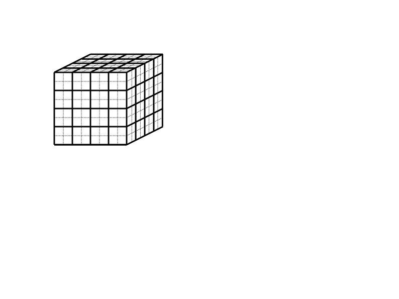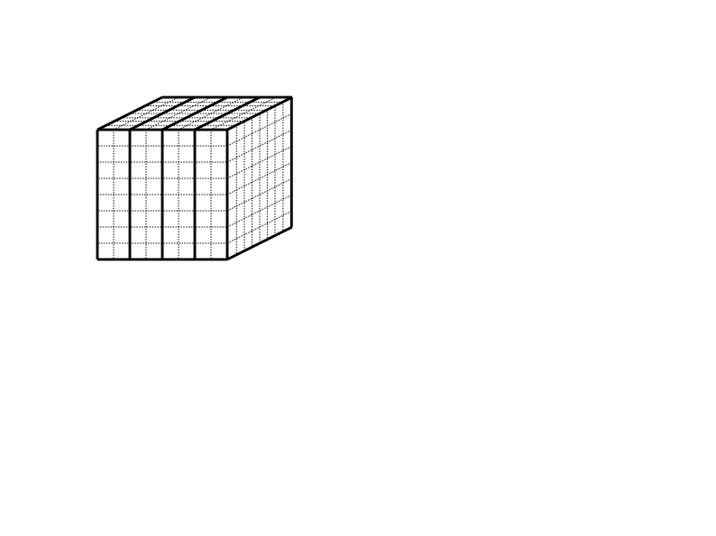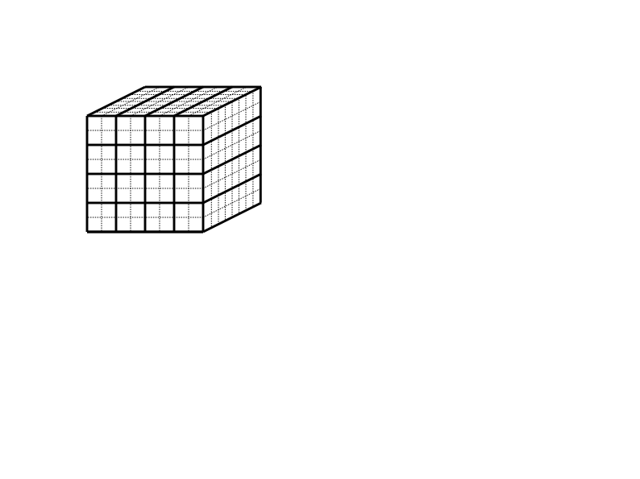

简谐振荡器的动能是$p^2/2$，势能是$q^2/2$（势能的负梯度是力，$-q$）。因此，总能量与$q^2+p^2$成正比。

现在考虑用三种方法解决一阶方程组，显式欧拉法、隐式欧拉法和一种叫做Störmer-Verlet的方法。 初始条件是$（q, p）$=（1, 0）。 我们使用$h=0.05$的时间步长，走500步。 我们将$q$和$p$分别绘制在横轴和纵轴上（称为相位图）。 如上所述，准确的解决方案是一个以原点为中心的单位圆。 图7.10显示了这些解。 对于显式欧拉，解决方案是向外螺旋式的，这意味着解决方案的位移和动量随时间而增加。 隐式欧拉方法的情况则相反。 总能量的图表将显示这两种情况下的能量分别增加和减少。 当采取较小的时间步长或使用高阶方法时，解决方案会更好，但这些方法完全不适合在长时间内对共轭系统进行积分。 图7.10(c)显示了使用一种叫做Störmer-Verlet方法的对称方法的解。 该解显示，$q^2+p^2$的保存情况比其他两种方法要好得多。

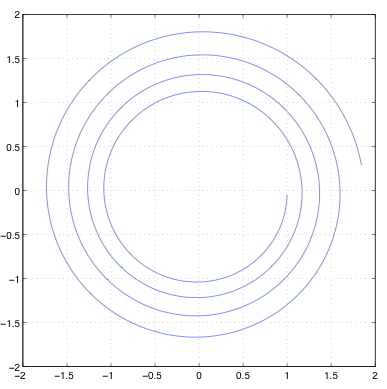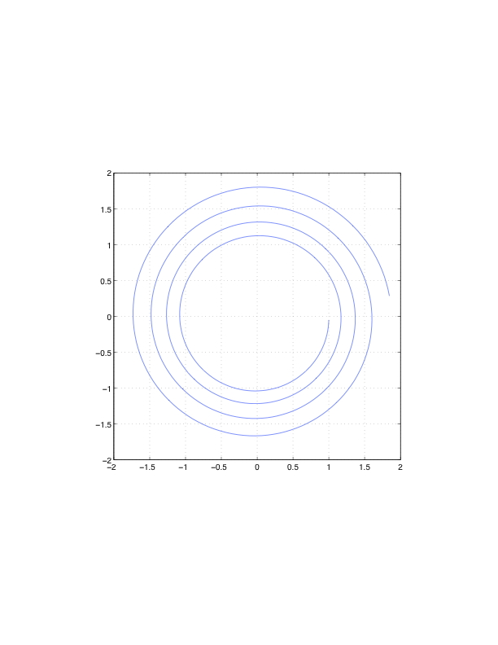

图7.10：初值（1,0）、时间步长0.05、步长500的三种方法的简谐振荡器解的相位图。对于显式Euler，解是向外旋的；对于隐式Euler，解是向内旋的；总能量在Störmer-Verlet方法中保存得最好。 我们推导出二阶方程的Störmer-Verlet方法
$$
u''=f(t,u)
$$
通过简单地用有限差分近似值取代左手边
$$
\frac{u_{k+1-2u_k+u_{k-1}}}{h^2}=f(t_k,u_k)
$$
这可以重新排列，得到的方法是
$$
u_{k+1}=2u_k-u_{k-1}+h^2f(t_k,u_k)
$$
该公式可以等效地从泰勒级数中导出。该方法与线性多步骤方法类似，需要一些其他技术来提供该方法的初始步骤。该方法也是时间可逆的，因为如果$k+1$和$k-1$互换，公式是一样的。遗憾的是，要解释为什么这种方法是对称性的，已经超出了本介绍的范围。

上面写的方法有一些缺点，最严重的是小$h^2$项的添加会受到灾难性的取消。因此，这个公式不应该以这种形式使用，已经开发了一些数学上等效的公式（可以从上面的公式推导出来）。

一个替代公式是跃迁法。
$$
\begin{aligned}
u_{k+1} &=u_{k}+h v_{k+1 / 2} \\
v_{k+1 / 2} &=v_{k-1 / 2}+h f\left(t_{k}, u_{k}\right)
\end{aligned}
$$
其中𝑣是第一导数（速度），与位移𝑢相差半步。这个公式没有同样的四舍五入问题，而且还提供了速度，尽管它们需要与位移重新对中，以计算给定步骤的总能量。这对方程中的第二个基本上是一个有限差分公式。

Störmer-Verlet方法的第三种形式是速度Verlet变体。
$$
\begin{array}{l}
u_{k+1}=u_{k}+h v_{k}+\frac{h^{2}}{2} f\left(t_{k}, u_{k}\right) \\
v_{k+1}=v_{k}+\frac{h^{2}}{2}\left(f\left(t_{k}, u_{k}\right)+f\left(t_{k+1}, u_{k+1}\right)\right)
\end{array}
$$
其中，现在速度是在与位移相同的点上计算的。这些算法中的每一种都可以被实现，从而只需要存储两组量（两个先前的位置，或者一个位置和一个速度）。Störmer-Verlet方法的这些变体由于其简单性而受到欢迎，每一步只需要一个昂贵的力评估。 高阶方法通常不实用。 速度Verlet方案也是分子动力学的多时间步长算法的基础。 在这些算法中，慢速变化的（典型的长程）力的评估频率较低，更新位置的频率也比快速变化的（典型的短程）力低。 最后，许多最先进的分子动力学集成了一个经过修改的哈密尔顿系统，以控制模拟温度和压力。 对于这些系统，已经开发出了复杂得多的对称性方法。