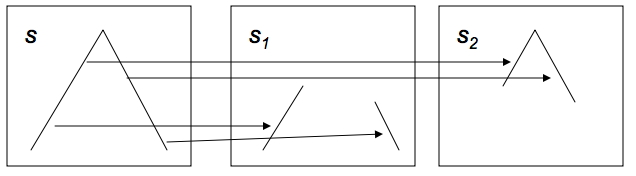
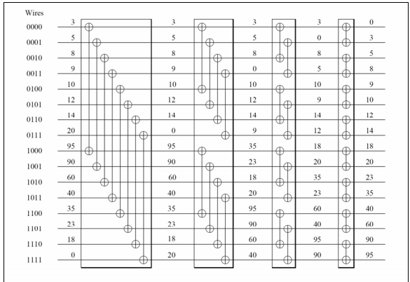

# 组合算法

在这一章中，我们将简要地考虑一些组合算法：排序，以及用埃拉托什尼的筛子寻找素数。

在科学计算中，排序并不是一个常见的操作：人们期望它在数据库中更为重要，无论是金融数据库还是生物数据库（例如在序列对齐中）。然而，它有时会出现，例如在自适应网格细化（AMR）和其他对数据结构进行重大调整的应用中。

在这一节中，我们将简要介绍一些基本的算法，以及如何以并行方式完成这些算法。更多的细节，见[131]和其中的参考文献。

## 排序算法概要

### 复杂度

有许多排序算法。传统上，这些算法是以其计算复杂度来区分的，也就是说，给定一个由$n$元素组成的数组，需要多少次操作来对它们进行排序，作为$n$的一个函数。

理论上，我们可以证明一个排序算法的复杂度至少要达到$O(n\log n)$。确实有几种算法可以保证达到这个复杂度，但是一种非常流行的算法，即快速排序，其 "预期 "复杂度为$O(n \log n)$，而最坏情况下的复杂度为$O(n^2)$。这种行为是由于快速排序需要选择 "基准元素"（我们将在下文第8.3节中详细介绍），如果这些选择一直是最差的，那么就无法达到最佳复杂度。

```c
while the input array has length > 1 do
  Find a pivot element of intermediate size
  Split the array in two, based on the pivot
  Sort the two arrays.
\\Algorithm 2: The quicksort algorithm
```

另一方面，非常简单的冒泡排序算法总是有相同的复杂性，因为它有一个静态结构。

```c
for pass from 1 to 𝑛 − 1 do 
  for 𝑒 from 1 to 𝑛 − pass do
    if elements 𝑒 and 𝑒 + 1 are ordered the wrong way then 
      exchange them
\\Algorithm 3: The bubble sort algorithm
```

很容易看出，这个算法的复杂度为$O(n^2)$：内循环做了$t$的比较和最多$t$的交换。从1到$n-1$相加，可以得到大约$n^2/2$的比较和最多相同数量的交换。

### 排序网络

上面我们看到，有些排序算法的操作独立于实际的输入数据，而有些则是根据这些数据做出决定。前一类有时被称为排序网络。它可以被认为是只实现一种算法的定制硬件。基本的硬件元素是比较和交换元素，它有两个输入和两个输出。对于两个输入$x$，$y$，输出是$\max(x，y)$和$\min(x，y)$。

在图8.1中，我们展示了由比较和交换元素构成的冒泡排序。


下面我们将把Bitonic排序算法作为排序网络的一个典型例子。

### 并行复杂性

上面我们说过，顺序排序至少需要$O(N \log N)$时间。如果我们能有完美的加速，为简单起见，使用$P=N$处理器，我们的并行时间为$O(\log N)$。如果并行时间超过这个数字，我们将顺序复杂性定义为所有处理器上的操作总数。

这相当于如果并行算法由一个进程执行，模拟所有其他进程的操作数。理想情况下，这与单进程算法的操作数相同，但不一定是这样。如果它更大，我们就发现了另一个开销的来源：使用并行算法的内在惩罚。

例如，下面我们将看到，排序算法的顺序复杂度通常为$O(N \log_2 N)$。

## 奇数-偶数转位排序

再看一下图8.1，你会发现，第二道工序实际上可以在第一道工序完全完成之前就开始了。这在图8.2中得到了说明。如果我们现在看一下在任何给定的时间会发生什么。

我们就可以得到奇数-偶数转位排序算法。


奇偶转位排序是一种简单的并行排序算法，其主要优点是在线性面积的处理器上比较容易实现。它的主要优点是在线性区域的处理器上容易实现。另一方面，它的效率也不是特别高。

该算法的一个步骤由两个子步骤组成。

- 每个偶数的处理器与它的右邻进行比较和交换；然后 
- 每个奇数处理器与它的右邻进行比较和交换。

**定理 2** 经过$N/$步骤，每个步骤由刚才给出的两个子步骤组成，一个序列被排序。证明。在每个三联体$2i, 2i+1, 2i+2$中，经过一个偶数和一个奇数步骤后，最大的元素将处于最右边的位置。通过归纳法进行。

在并行时间为$N$的情况下，可以得到顺序复杂度为$N$的2次比较和交换操作。

**练习 8.1** 讨论交换排序的速度和效率，我们对$N$个处理器的$P$个数字进行排序；为了简单起见，我们设定$N = P$，这样每个处理器都包含一个数字。用比较和交换操作表示执行时间。

1. 这个并行代码总共需要多少次比较和交换操作？
2. 该算法需要多少个顺序步骤？什么是$T_1, T_p,T_\infty, S_p, E_p$的$N$数排序？并行性的平均量是多少？
3. 交换排序可以被认为是冒泡排序的并行实现。现在让$T_1$指的是（顺序的）冒泡排序的执行时间。这对$S_p$和$E_p$有何影响？

## 快速排序

快速排序是一种递归算法，与冒泡排序不同，它不是确定性的。它是一个两步程序，基于序列的重新排序。

```c
Algorithm: Dutch National Flag ordering of an array
Input : An array of elements, and a ‘pivot’ value
Output: The input array with elements ordered as red-white-blue, where red elements are
larger than the pivot, white elements are equal to the pivot, and blue elements are less than the pivot
```

我们无需证明，这可以在$O(n)$操作中完成。这样一来，快速排序就变成了。

```c
Algorithm: Quicksort
Input : An array of elements
Output: The input array, sorted
while The array is longer than one element do
pick an arbitrary value as pivot
apply the Dutch National Flag reordering to this array 
  Quicksort( the blue elements )
  Quicksort( the red elements )
```

这个算法的不确定性，以及其复杂性的差异，源于支点的选择。在最坏的情况下，支点总是数组中（唯一）最小的元素。这样就没有蓝色元素了，唯一的白色元素是支点，递归调用的是数组中的$n-1$个红色元素。不难看出，此时的运行时间为$O(n^2)$。另一方面，如果中枢总是（接近）中位数，即大小适中的元素，那么递归调用的运行时间将大致相等，我们可以得到一个运行时间的递归公式。
$$
T_n = 2T_{n/2}+O(n)
$$
这就是（同样没有证明）$O(n \log n)$。现在我们将考虑快速排序的并行实现。

### 在共享内存中进行快速排序

通过并行执行两个递归调用，可以实现快速排序算法的简单并行化。这最容易通过共享内存模型和递归调用的线程（第2.6.1节）实现。然而，这种实现方式并不高效。

在一个长度为$n$的数组中，如果有完美的支点选择，在算法的最后阶段会有$n$的线程在活动。最理想的情况是，我们希望并行算法在$O(\log n)$的时间内运行，但是在这里，时间被第一个线程对数组的初始重新排序所支配。

**练习 8.2** 使这个论证精确化。这样并行化快速排序算法的总运行时间、速度提升和效率是多少？是否有办法使分割数组的效率更高？事实证明，是的，关键是要使用并行的前缀操作，见附录20。如果数组中的数值是$x_1,...,x_n$，我们使用并行前缀来计算有多少元素小于基准$\pi$。
$$
X_{i}=\#\left\{x_{j}: j<i \wedge x_{j}<\pi\right\}
$$
有了这个方法，如果一个处理器看了$x_i$，并且$x_i$小于基准，那么它需要被移到数组中的$X_{i + 1}$的位置，那里的元素是根据基准分割的。同样地，我们可以知道有多少元素超过了支点，并相应地移动这些元素。

这表明每一个枢轴步骤可以在$O(\log n)$的时间内完成，由于排序算法有$\log 𝑛$的步骤，整个算法的运行时间为$O((\log n)^2)$。快速排序算法的顺序复杂度$(\log_2 N)^2$。

### 超立方体上的快速排序

从上一节可以看出，为了使快速排序算法有效地并行化，我们也需要使Dutch National Flag reordering并行化。让我们假设数组已经被划分到维度为$p$的超立方体的$d$个处理器上（意味着$p=2d$）。

在并行算法的第一步，我们选择一个支点，并将其广播给所有处理器。然后，所有处理器将在其本地数据上独立地应用重新排序。

为了将第一层中的红色和蓝色元素聚集在一起，现在每个处理器都与一个二进制地址相同的处理器配对，但最重要的一位除外。在每一对中，蓝色元素被送到在该位上有1值的处理器；红色元素被送到在该位上有0值的处理器。

经过这次交换（这是本地的，因此是完全并行的），地址为1xx的处理器拥有所有的红色元素，地址为0xx的处理器拥有所有的蓝色元素。前面的步骤现在可以在子库中重复进行。

这种算法在每一步都能保持所有的处理器工作；但是，如果选择的枢轴远离中位数，就容易出现负载不平衡的情况。此外，在排序过程中，这种负载不平衡也不会减少。

### 在一般的并行处理器上进行快速排序

快速排序也可以在任何具有处理器线性排序的并行机器上进行。我们首先假设每个处理器正好持有一个数组元素，而且，由于标志重排，排序将总是涉及一组连续的处理器。

一个数组（或递归调用中的子数组）的并行快速排序开始于在存储数组的处理器上构建一个二进制树。选择一个枢轴值并在树上广播。然后，树状结构被用来在每个处理器上计算左、右子树中有多少元素小于、等于或大于枢轴值。

有了这些信息，根处理器可以计算出红色/白色/蓝色区域将被储存在哪里。这个信息被下发到树上，每个子树都计算出其子树中元素的目标位置。

如果我们忽略了网络竞争，现在可以在单位时间内完成重新排序，因为每个处理器最多发送一个元素。这意味着每个阶段只需要花费时间来计算子树中蓝色和红色元素的数量，在顶层是$O(\log n)$，在下层是$O(\log n/2)$，依此类推。这使得速度几乎完美。

## 基数排序

大多数排序算法都是基于比较完整的项值。相比之下，弧度排序在数字的位数上做一些部分排序阶段。每个数字值都有一个 "bin "被分配，数字被移入这些bin。将这些仓连接起来就得到了一个部分排序的数组，通过移动数字的位置，数组的排序会越来越多。

考虑一个最多两位数的例子，所以需要两个阶段。
$$
\begin{array}{|r|rrrr|}
\hline \text { array } & 25 & 52 & 71 & 12 \\
\hline \text { last digit } & 5 & 2 & 1 & 2 \\
 & \text { (only} &\text{bins}& 1,2,5 \text { receive}& \text{data) }&  \\
\text { sorted } & 71 & 52 & 12 & 25 \\
\text { next digit } & 7 & 5 & 1 & 2 \\
\text { sorted } & 12 & 25 & 52 & 71 \\
\hline
\end{array}
$$
重要的是，一个阶段的部分排序在下一个阶段得到了保留。归纳起来，我们最后会得到一个完全排序的数组。

### 并行基数排序

分布式内存排序算法已经对数据进行了明显的 "分档"，所以自然的径向排序的并行实现是基于使用𝑃，即进程的数量，作为径向。

我们用两个处理器上的例子来说明这一点，也就是说，我们看的是数值的二进制表示。


分析。

- 确定所考虑的数字，以及确定有多少本地值进入哪个仓都是本地操作。我们可以将其视为一个连接矩阵$C$，其中$C[i, j]$是进程$i$将发送至进程$j$的数据量。每个进程拥有其在该矩阵中的一行。

- 为了在洗牌中接收数据，每个进程都需要知道将从其他每个进程接收多少数据。这需要对连接矩阵进行 "转置"。在MPI术语中，这是一个全对全操作。MPI_Alltoall。

- 在这之后，实际的数据可以在另一个全对全操作中进行洗牌。然而，由于每个$i, j$组合的数量不同，我们需要MPI_Alltoallv程序。

### 有效小叔的基数排序

完全可以让弧度排序的阶段从最重要的数字到最小的数字进行，而不是相反。按顺序，这不会改变任何重要的东西。

然而。

- 我们不是完全洗牌，而是在越来越小的子集里洗牌，所以即使是顺序算法也会增加空间定位。
- 一个共享内存的并行版本将显示出类似的位置性改进。
- 一个MPI版本不再需要全对全的操作。如果我们认识到每一个下一阶段都将在一个子集的进程内，我们可以使用通信器分割机制。

**练习 8.3** 上面的位置性论证做得有点手忙脚乱。论证该算法可以以广度优先和深度优先的方式进行。讨论一下这种区别与位置性论证的关系。

## 样本排序

你在快速排序算法（第8.3节）中看到，有可能在排序算法中使用概率元素。我们可以将快速排序法中挑选一个基准的想法扩展为挑选有多少个处理器的枢轴。这不是对元素的一分为二，而是将元素分成与处理器数量一样多的 "桶"。然后，每个处理器对其元素进行完全并行的排序。
$$
Input : $p$ : the number of processors, $N$ : the numbers of elements to sort; $\left\{x_{i}\right\}_{i<N}$ the elements to sort
Let $x_{0}=b_{0}<b_{1}<\cdots<b_{p-1}<b_{p}=x_{N}$ (where $x_{N}>x_{N-1}$ arbitrary) for $i=0, \ldots, p-1$ do
Let $s_{i}=\left[b_{i}, \ldots b_{i+1}-1\right]$
for $i=0, \ldots, p-1$ do
Assign the elements in $s_{i}$ to processor $i$
for $i=0, \ldots, p-1$ in parallel do
Let processor $i$ sort its elements
$$
显然，如果不仔细选择桶的话，这种算法会出现严重的负载不平衡。随机抽取$p$元素可能还不够好；相反，需要对元素进行某种形式的抽样。相应地，这种算法被称为Samplesort[17]。

虽然桶的排序，一旦分配，是完全并行的，但这种算法仍然有一些关于并行性的问题。首先，采样是该算法的一个顺序瓶颈。另外，将桶分配给处理器的步骤本质上是一个全对全的操作。

为了对此进行分析，假设有$P$个进程首先作为映射器，然后作为还原器发挥作用。让𝑁为数据点的数量，并定义一个块大小$b\equiv N/P$。该算法的处理步骤的成本是。

局部确定每个元素的bin，需要时间$O(b)$；以及 - 局部排序，我们可以假设其最佳复杂度为$b \log b$。

然而，洗牌步骤是不简单的。除非数据被部分预排序，否则我们可以预期洗牌是一个完全的全对全，其时间复杂度为$P\alpha+b\beta$。另外，这可能会成为一个网络瓶颈。请注意，在超立方体上的快速排序法中，从来没有出现过对导线的争夺。

**练习 8.4** 论证对于少量的进程，$P <<N$，这个算法有完美的加速，顺序复杂性（见上文）为$N \log N$。

将这种算法与双调排序等排序网络相比较，这种排序算法看起来相当简单：它只有一个步骤的网络。前面的问题认为，在 "乐观扩展"（工作可以增加，同时保持处理器数量不变）中，顺序复杂性与顺序算法相同。然而，在我们按比例增加功和处理器的弱缩放分析中，顺序复杂度要差很多。

**练习 8.5** 考虑我们同时扩展$N、P$的情况，保持$b$不变。论证在这种情况下，洗牌步骤在算法中引入了一个$N^2$项。

### 通过MapReduce排序

terasort基准涉及在一个基于文件的大型数据集上进行排序。因此，它在某种程度上是大数据系统的一个标准。特别是，MapReduce是一个主要的候选者，见http://perspectives.mvdirona. com/2008/07/hadoop-wins-terasort/。

使用MapReduce，该算法的过程如下。

- 通过抽样或优先信息确定一组键值：键值是这样的，预计每对键值之间的记录数量大致相等。间隔的数量等于还原器进程的数量。
- 然后，映射器进程产生键/值对，其中键是区间或还原器编号。
- 然后，还原器进程执行局部排序。

 我们看到，除了术语的变化之外，这实际上是sampleort。

## 双调排序

为了激励双调排序，假设一个序列$x = ⟨x_0, ... ... , x_{n - 1}⟩$由升序和降序组成。现在把这个序列分成两个等长的子序列，定义为：


$$
\begin{array}{l}
s_{1}=\left\langle\min \left\{x_{0}, x_{n / 2}\right\}, \ldots \min \left\{x_{n / 2-1}, x_{n-1}\right\}\right. \\
s_{2}=\left\langle\max \left\{x_{0}, x_{n / 2}\right\}, \ldots \max \left\{x_{n / 2-1}, x_{n-1}\right\}\right.
\end{array}
$$
从图中不难看出，$s_1$, $s_2$又是具有升序和降序部分的序列。此外，$s_1$的所有元素都小于$s_2$的所有元素。

我们称(8.1)为升序双调拣器，因为第二个子序列中的元素比第一个子序列中的元素大。同样地，我们可以通过颠倒最大和最小的角色来构造一个降序分拣器。

不难想象这是排序算法中的一个步骤：从这个形式的序列开始，递归应用公式（8.1）得到一个排序的序列。图8.4显示了4个位元排序器，分别在8,4,2,1的距离上，如何对一个长度为16的序列进行排序。

双调序列的实际定义要稍微复杂一些。如果一个序列由一个升序部分和一个降序部分组成，或者是这样一个序列的循环变异，那么它就是比特序列。



**练习 8.6** 证明根据公式(8.1)分割一个位数序列可以得到两个位数序列。

所以问题是如何得到一个比特尼序列。答案是使用越来越大的双调网络。两个元素的位数排序给你一个排序的序列。如果你有两个长度为2的序列，一个向上排序，另一个向下排序，这就是一个双调序列。因此，这个长度为四的序列可以通过两个比特级的步骤进行排序。

两个长度为四的排序形成一个长度为四的比特序列。可以用三个比特步骤进行排序；等等。

从这个描述中你可以看到，你要用$\log_2N$个阶段来排序$N$个元素，其中第$i$个阶段的长度是$\log_2i$。这使得位数排序的总顺序复杂性为$(\log_2 N )^2$。

图8.5中的操作序列被称为排序网络，由简单的比较-交换元素构成。元素组成的排序网络。与快速排序的情况不同，它不依赖于数据元素的值。

## 素数查找

埃拉托塞尼的筛子是一种非常古老的寻找素数的方法。在某种程度上，它仍然是许多现代方法的基础。

写下从2到某个上限$N$的所有自然数，我们要把这些数字标记为素数或绝对非素数。所有的数字最初都是没有标记的。

- 第一个没有标记的数是2：把它标记为质数，并把它的所有倍数标记为非质数。
- 第一个没有标记的数字是3：把它标记为质数，并把它的所有倍数标记为非质数。
- 下一个数字是4，但它已经被标记过了，所以标记5和它的倍数。
- 下一个数字是6，但它已经被标记过了，所以标记7和它的倍数。
- 数字8，9，10已经被标记过了，所以继续标记11。
- 依此类推。