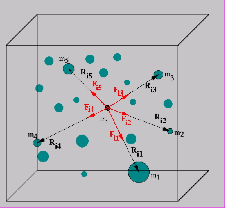
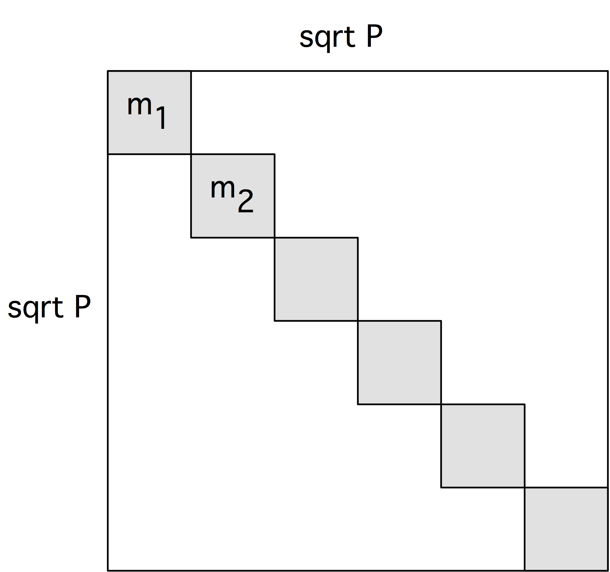
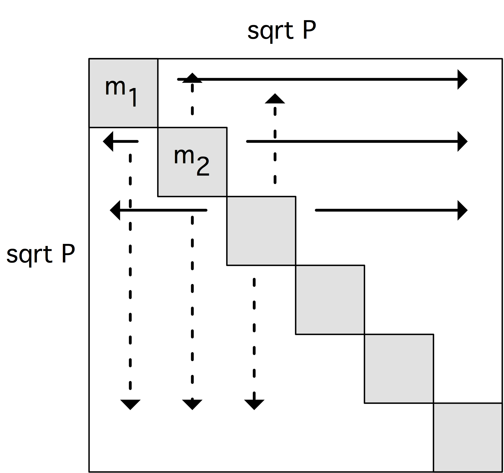
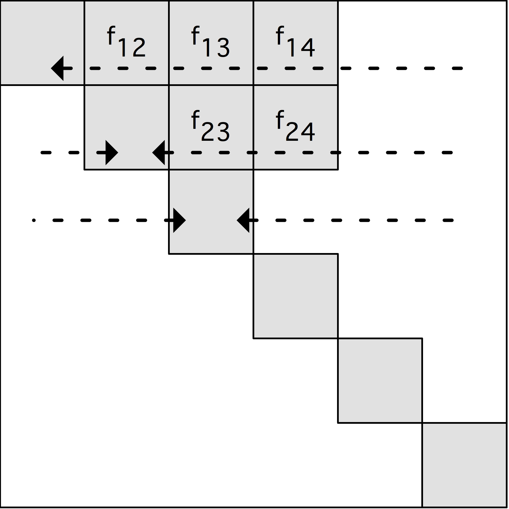

# N体问题

在第4章中，我们研究了连续现象，例如在整个区间[0，1]中，受热棒在一定时间内的行为。也有一些应用，你可能对有限数量的点感兴趣。一个这样的应用是研究粒子的集合，可能是非常大的粒子，如行星或恒星，在重力或电力的影响下。(也可能有外力，我们将忽略这一点；我们还假设没有碰撞，否则我们需要纳入最近邻的相互作用）。这种类型的问题被称为N体问题；关于介绍，见http://www.scholarpedia.org/article/N-body_simulations（引力）。



这个问题的基本算法是很容易的。

- 选择一些小的时间间隔。
- 根据所有粒子的位置，计算每个粒子上的力。
- 移动每个粒子的位置，就像它所受的力在整个时间间隔内保持不变一样。

对于一个足够小的时间间隔，这个算法给出了一个合理的近似事实。最后一步，更新粒子的位置，很容易而且完全并行：问题在于评估力。以一种天真的方式，这种计算足够简单，甚至是完全并行的。

```c
for each particle 𝑖
for each particle 𝑗
let 𝑟̄ be the vector between 𝑖 and 𝑗; 𝑖𝑗
  then the force on 𝑖 because of 𝑗 is
  𝑖𝑗 𝑖𝑗 |𝑟𝑖𝑗|
  (where 𝑚𝑖, 𝑚𝑗 are the masses or charges) and
  𝑓𝑗𝑖 = −𝑓𝑖𝑗.
```

该算法的主要缺点为复杂度太高：对于$N$个粒子，操作的数量是 $O(N^2)$。

**练习 10.1**  如果我们有$N$个处理器，一个更新步骤的计算将需要时间$O(N)$。通信复杂度是多少？提示：是否可以用集合运算？

已经发明了几种算法来使顺序复杂度降低到$O(N \log N)$甚至是$O(N)$。正如可以预期的那样，这些方法比原始的算法更难实现。我们将讨论一种流行的方法：Barnes-Hut算法[8]，其复杂度为$O(N \log N )$。

## 巴恩斯-胡特算法

导致复杂性降低的基本观察是以下几点。如果我们正在计算两个靠近的粒子$i_1,i_2$的力，这些力来自两个同样靠近的粒子$j_1,j_2$，你可以将$j_1,j_2$合并为一个粒子，并将其用于$i_1, i_2$。

接下来，该算法使用了空间的递归划分，在二维的象限和三维的八度空间中；见图10.2。


该算法如下。首先计算所有层的所有单元的总质量和质量中心。

```c
for each level l, from fine to coarse: for each cell 𝑐 on level l:
compute the total mass and center of mass for cell 𝑐 by considering its children
if there are no particles in this cell, set its mass to zero
```

这些级别被用来计算与每个粒子的相互作用。

```c
for each particle 𝑝:
for each cell 𝑐 on the top level
if 𝑐 is far enough away from 𝑝:
use the total mass and center of mass of 𝑐;
otherwise consider the children of 𝑐
```


对一个细胞是否足够远的测试通常是以其直径与距离足够小的比率来实施的。这有时被称为 "细胞开放标准"。以这种方式，每个粒子与若干同心环的细胞相互作用，每个下一个环的宽度是双倍的；见图10.3。

如果细胞被组织成一棵树，这种算法就很容易实现。在三维的情况下，每个单元有八个孩子，所以这被称为八叉树。

质量中心的计算必须在粒子移动后每次进行。更新可能比从头开始计算的成本要低。另外，可能会发生一个粒子穿过一个单元的边界，在这种情况下，数据结构需要被更新。在最坏的情况下，一个粒子移动到一个原来是空的单元。

## 快速多极点法

快速多极法（FMM）计算每一点上的势的表达式，而不是像巴恩斯-胡特那样计算力。FMM使用的信息比盒子里的粒子的质量和中心还要多。这种更复杂的扩展更准确，但也更昂贵。作为补偿，FMM使用一组固定的盒子来计算势，而不是一组随精度参数θ和质心位置变化的盒子。

然而，在计算上，FMM很像Barnes-Hut方法，所以我们将共同讨论它们的实施。

## 全程计算

尽管有上述明智的近似方法，但也有对$N^2$相互作用进行全面计算的努力；例如，见Sverre Aarseth的NBODY6代码；见http://www.ast.cam.ac.uk/~sverre/web/pages/home.htm。这些代码使用高阶积分器和自适应时间步长。在Grape计算机上的快速实现是存在的；由于需要定期的负载平衡，一般的并行化通常是困难的。

## 执行

八叉树方法在高性能架构上提供了一些挑战。首先，问题是不规则的，其次，不规则性是动态变化的。第二方面主要是分布式内存中的问题，它需要负载再平衡；见2.10节。在本节中，我们集中讨论了单步的力计算。

### 矢量化

如图10.2的问题结构是很不规则的。这对于小规模的SSE/AVX指令和大规模的矢量流水线处理器的矢量化来说都是一个问题（关于两者的解释见2.3.1节）。程序步骤 "为某一盒子的所有孩子做某事 "将是不规则的长度，而且数据可能不会以规则的方式存储。

这个问题可以通过细分网格来缓解，即使这意味着有空盒子。如果底层被完全划分，将始终有八个（三维）粒子可以操作。更高的层次也可以被填满，但这意味着低层的空盒子数量越来越多，所以在增加工作和提高效率之间要进行权衡。

### 共享内存的实现

在顺序结构上执行，这个算法的复杂度为$O(N \log N)$。很明显，如果每个粒子变成一个任务，这个算法在共享内存上也可以工作。由于不是所有的单元都包含粒子，任务将有不同的运行时间。

### 分布式内存的实现

上述Barnes-Hut算法的共享内存版本不能立即用于分布式内存环境，因为每个粒子原则上可以从总数据的任何部分获取信息。使用哈希八叉树有可能实现这种思路的实现，但我们不会坚持这样做。

我们观察到，数据访问的结构化程度比最初看起来要高。考虑一个粒子$p$和它所交互的第l层的单元。位于𝑝附近的粒子将与相同的细胞互动，因此我们可以通过查看第l层的细胞和与之互动的同一层的其他细胞来重新安排互动。

这给我们提供了以下算法[123]：质心的计算变成了计算粒子$𝑔(l)$对第$l$层施加的力。

```c
for level l from one above the finest to the coarsest:
for each cell 𝑐 on level l
let 𝑔(l) be the combination of the 𝑔(l+1) for all children 𝑖 of 𝑐
```

有了这个，我们就可以计算出一个细胞上的力。

```c
for level l from one below the coarses to the finest: for each cell 𝑐 on level l:
let 𝑓 (l) be the sum of
1. the force 𝑓 (l−1) on the parent 𝑝 of 𝑐, and 𝑝
2. the sums 𝑔(l) for all 𝑖 on level l that
satisfy the cell opening criterium
```

我们看到，在每一层，每个细胞现在只与该层的少量邻居互动。在算法的前半部分，我们只使用单元格之间的父子关系来向上攀登。据推测这是很容易的。

算法的后半部分使用更复杂的数据访问。第二项中的单元格𝑖都与我们要计算力的单元格𝑐有一定距离。在图的术语中，这些单元可以被描述为表亲：𝑐的父母的兄弟姐妹的孩子。如果开放的标准更加明确，我们就用二表兄妹：$c$的祖父母的兄弟姐妹的孙子，等等。

**练习 10.2** 论证这个力计算操作在结构上与稀疏矩阵-向量乘积有很多共同之处。

在共享内存的情况下，我们已经说过，不同的子树需要不同的时间来处理，但是，由于我们可能有更多的任务，而不是处理器核心，这一切都会扯平。对于分布式内存，我们缺乏将工作分配给任意处理器的可能性，所以我们需要谨慎地分配负载。空间填充曲线（SFC）可以在这里得到很好的应用（见2.10.5.2节）。

### 完整方法的1.5D实施

有可能通过分布粒子，让每个粒子评估来自其他每一个粒子的力，来直接实现完整的𝑁2方法的并行化。

**练习 10.3** 由于力是对称的，我们可以通过让粒子𝑝𝑖只与粒子𝑝𝑗 > 𝑖相互作用来节省2倍的工作量。在这个方案中，数据（如粒子）的平等分布会导致工作（如相互作用）的不均衡分布。粒子需要如何分布才能得到均匀的负荷分布？

假设我们不关心使用力的对称性所带来的两个系数的收益，而使用粒子的均匀分布，这个方案有一个更严重的问题，即它渐进地没有规模。

这方面的通信成本是

- $O(P)$延迟，因为需要从所有处理器接收信息。
- $O(N)$带宽，因为所有粒子都需要被接收。

然而，如果我们分配力的计算，而不是粒子，我们就会得出不同的界限；见[54]和其中引用的参考文献。

随着每个处理器计算边长为$N/\sqrt{P}$的区块中的相互作用，存在粒子的复制，需要收集力。因此，现在的成本是

- $O(\log p)$广播和还原的延迟
- $O(N/\sqrt{P}⋅\log P)$带宽，因此，每个处理器对最终的总和贡献了多少力。

#### 问题描述

我们对N体问题进行如下抽象。

- 我们假设有一个粒子电荷/质量的向量$c(⋅)$和位置信息。
- 为了计算位置更新，我们需要基于存储图元$C_{ij}=<c_i,c_j>$的对等相互作用$F(⋅,⋅)$。
- 然后，这些相互作用被汇总为一个力矢量$f(⋅)$。

在并行性综合模型(IMP)模型中，如果我们知道各自的数据分布，就可以充分地描述算法；我们并不立即关注局部计算的情况。

#### 颗粒分布

基于粒子分布的实现以分布为𝑐的粒子向量$c(u)$为起点，并直接计算同一分布上的力向量$f(u)$。我们将计算描述为三个内核的序列，两个是数据移动，一个是局部计算。
$$
\left\{\begin{array}{ll}
\{\alpha: c(u)\} & \text { initial distribution for } c \text { is } u \\
C(u, *)=c(u) \cdot \times c(*) & \text { replicate } c \text { on each processor } \\
\text { local computation of } F(u, *) \text { from } C(u, *) & \\
f(u)=\sum_{2} F(u, *) & \text { local reduction of partial forces } \\
\text { particle position update } &
\end{array}\right.
$$
最后的内核是一个具有相同的$\alpha$和$\beta$分布的还原，所以它不涉及数据运动。本地计算内核也没有数据运动。这就留下了从初始分布$u(u)$收集$C(u,∗)$的问题。如果没有任何关于分布$u$的进一步信息，这就是对$N$元素的全收集，其成本为$\alpha \log p+\beta N$。特别是，通信成本不会随着$p$的下降而下降。

通过一个合适的基于分布的编程系统，方程组（10.1）可以被转化为代码。

#### 工作分布

粒子分布的实现使用了一个一维分布$F(u，∗)$，用于与粒子分布一致的力。由于$F$是一个二维物体，所以也可以使用二维分布。我们现在将探讨这个选项，它早先在[54]中描述过；我们在这里的目的是要说明如何在IMP框架中实现和分析这个策略。我们不是把算法表达为分布式计算和复制的数据，而是使用分布式的临时，我们把复制方案推导为子通信器上的集体。

对于二维分布的$F$，我们需要$(N/b)\times (N/b)$ 处理器，其中$b$是一个块大小参数。为了便于说明，我们使用$b=1$，给出处理器的数量$P=N^2$。

现在我们将进行必要的推理。图10.4中给出了接近可实现形式的完整算法。为了简单起见，我们使用识别分布$I ∶p \rightarrow \{p\}$。
$$
\begin{array}{l}
\{\alpha: C(D:\langle I, I\rangle)\} \quad \text { initial distribution on the processor diagonal }\\
\begin{array}{l}
C(I, I)=C(I, p)+C(q, I) \quad \text { row and column broadcast of the processor diagonal } \\
F(I, I) \leftarrow C(I, I)
\end{array}\\
f(I, I) \leftarrow C(I, I) \quad \text { local interaction calculation }
\end{array}
$$
初始存储在处理器网格的对角线上 我们首先考虑收集图元 $C_{ij}=<c_i,c_j>$。最初，我们决定让$c$向量存储在处理器网格的对角线上；换句话说，对于所有$p$，处理器$<p,p>$包含$C_p$，而所有其他处理器的内容则未被定义。



为了正式表达这一点，我们让$D$为对角线$\{<p,p>∶ p \in P \}$。利用部分定义分布的机制，最初的$\alpha-$分布就是
$$
C(D∶ <I,I>) \equiv D \ni ⟨p,q⟩ \mapsto C(I(p),I(q)) = C_{pq}.
$$
力计算的复制 本地力计算$f_{pq} = f(pq)$对每个处理器$<p,q>$的数量$pq$，所以我们需要一个$\beta$分布的$C(I,I)$ 。关键是认识到
$$
C_{qp} = 𝐶_{pp} + C_{qq}
$$
以至于
$$
C(I,I) = C(I,p) + C(q,I)
$$
(其中$p$代表将每个处理器映射到索引值$p$的分布，$q$ 同理）。

为了找到从$\alpha$到$\beta$分布的转化，我们考虑表达式$C$的转化$(D: <I , I >)$。一般来说，任何集合$D$都可以写成从第一个坐标到第二个坐标的数值集合的映射。


$$
D\equiv p\mapsto D_p \quad \text{where}\quad  D_p ={q∶⟨p,q⟩\in D}.
$$
在我们对角线的特殊情况下，我们有
$$
D \equiv p \mapsto {p}.
$$
有了这个，我们就可以写出
$$
C(D∶ ⟨I,I⟩) = C(I,D_p ∶ I) = C(I,{p}∶ p).
$$
请注意，方程（10.4）仍然是$\alpha$分布。$\beta$分布是 𝐶(𝐼,𝑝)，这是一个模式匹配的练习，可以看到这是由每一行的广播来实现的，其成本为$\alpha \log \sqrt{p}+\beta N/\sqrt{P}$。

同样地，$C(q,I)$是通过列广播从$\alpha$分布中找到的。我们的结论是，这个变体确实有一个通信成本，并随着处理器数量的增加而成比例地下降。

局部交互计算 $F(I , I)\leftarrow C(I, I)$具有相同的$\alpha$和$\beta$分布，因此它是并行的。

力的求和 我们必须将力矢量$f(⋅)$扩展到我们的二维处理器网格，即$f(⋅, ⋅)$。然而，为了符合对角线上的初始粒子分布，我们只在对角线上求和。该指令
$$
f(D∶ <I,I>) = \sum F(I,D∶∗)
$$
有一个$\beta$ -分布的$I,D∶ ∗$ ，它是由$\alpha$ -分布的$I$,$I$通过聚集在行中形成。

